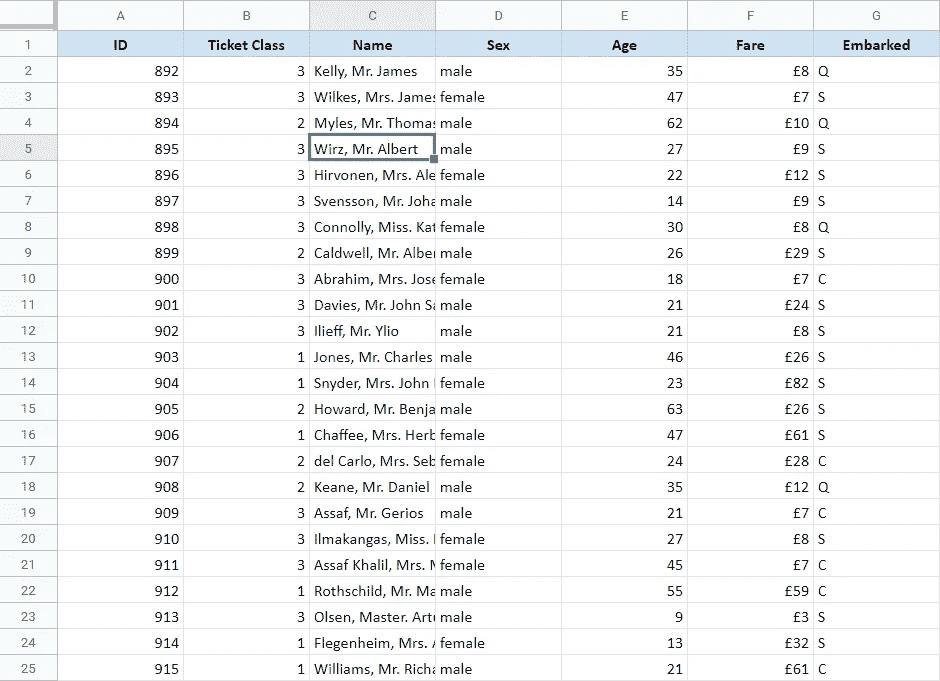
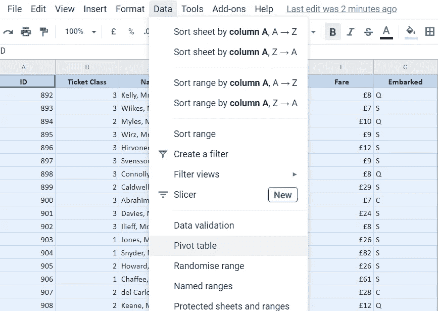
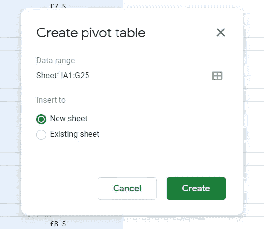
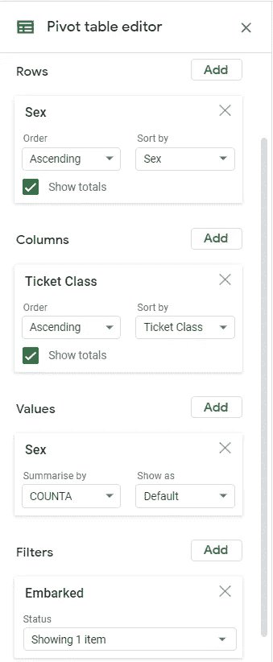
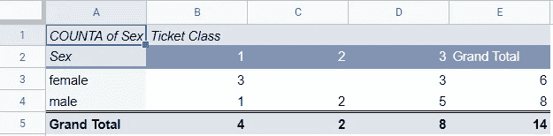
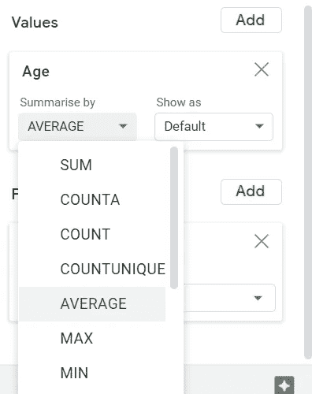
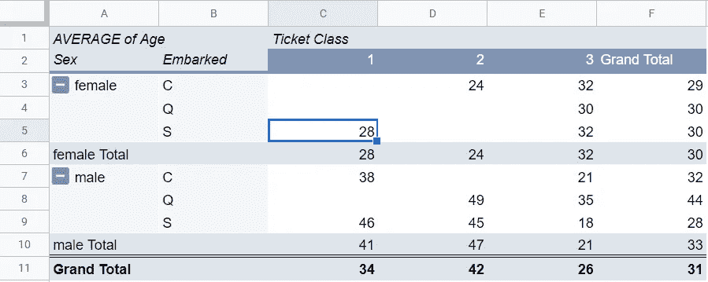

# 在 Google Sheets 中利用数据透视表的力量

> 原文：<https://medium.com/analytics-vidhya/harnessing-the-power-of-pivot-tables-in-google-sheets-eea6e0b9bbee?source=collection_archive---------8----------------------->

## 电子表格/数据透视表

## 了解如何使用数据透视表以及它们为什么如此重要

在 [Unsplash](https://unsplash.com?utm_source=medium&utm_medium=referral) 上由 [Carlos Muza](https://unsplash.com/@kmuza?utm_source=medium&utm_medium=referral) 拍摄的照片

分析任何数据的第一步是对其进行总结，并获得数据内容的基本概述。有许多方法可供选择，比如对列求和、找出唯一值、计算数据中不同实体的数量等等。有很多函数可以执行这些活动，但是上面所有的都可以通过 Google Sheets 的一个惊人的特性来完成。听起来很有趣，不是吗？谷歌工作表(和微软 Excel)中这种无所不知的功能被称为**数据透视表**。

## 什么是数据透视表？

数据透视表是 Google Sheets 中的一项功能，它允许您汇总数据并在某一列或数据点上进行数据透视。例如，考虑以下传奇人物泰坦尼克号乘客的数据快照。这些数据包括踏上臭名昭著的泰坦尼克号旅程的乘客，以及他们的某些属性，如年龄、性别、机票等级、登机站和票价。

想了解更多这个数据，可以去 [**Kaggle**](https://www.kaggle.com/c/titanic/overview) 。下面是我们将要处理的数据的快照。

泰坦尼克号乘客的数据快照

以上数据由乘客、其 id、机票等级、性别、年龄、票价和上车站(已上车)组成。现在假设我们想了解

*   有多少女性踏上了旅程？
*   从“S”站上车的人的平均票价是多少。
*   男性乘客的平均年龄是多少？

这些看似琐碎的问题，用 Google Sheets 的几个公式和小技巧就能解答。或者我们可以使用数据透视表来总结上述数据！

## 如何创建数据透视表？

要创建数据透视表，只需遵循以下步骤:

1.  通过将光标从 A1 拖动到 G25 来选择数据。
2.  点击工具栏中的“数据”，然后选择“数据透视表”。
3.  它将询问您是要在同一个选项卡上创建表格，还是要创建一个新的选项卡。为了简单起见，选择 new tab 选项并单击 create，您的数据透视表就可以使用了！

选择要汇总的全部数据后，查找数据透视表

选择“新建工作表”,在新工作表中创建数据透视表

## 如何使用数据透视表？

为了理解数据透视表如何工作，我们需要了解数据透视表允许的 4 个主要输入:

1.  **Rows** :顾名思义，它提供了用您希望的行重新创建表格的选项。例如，如果我们将“年龄”列作为数据透视表的行，我们将在数据透视表中得到两行，女性和男性。
2.  **列**:不用猜，列选项允许您指定数据透视表的列。例如，您希望查看不同客票类别中不同性别的数据。您可以选择“机票等级”列，它将创建 3 列，分别对应每个机票等级。
3.  **值**:值选项实际上允许你**在你刚刚创建的数据透视表中填充数据**。您希望根据性别找出不同机票等级的乘客数量。要填写数值、乘客人数，只需选择数值中的“姓名”栏，瞧！您将在表格中看到乘客人数。
4.  **过滤器**:一如既往，您对收到的结果不满意，想要进一步分析这些乘客是从哪里踏上旅程的。出路之一是改变数据透视表的完整结构，从头再来。一个更简单的方法是使用过滤器。
    过滤器允许你**根据数据中的所有其他列过滤你已经存在的数据透视表**。您可以在过滤器部分选择“已装船”列，并简单地过滤出您想要考虑的所有站点。这将允许您查看基于装载站点的数据透视表中的过滤数据。

数据透视表的参数选择

数据透视表的输出

从上述总结中，我们可以得出以下见解:

*   从' S '站开始旅程女性乘客，要么持头等票，要么持三等票。
*   大多数男性乘客都有一张三等票。
*   请注意数据透视表如何提供所有行和列的总计，这告诉我们总共有 14 名乘客从车站“S”开始他们的旅程，其中 6 名是女性乘客，8 名是男性乘客，大多数乘客都有三等票。

## 数据透视表中的附加功能

**数值的不同汇总**:除了提供出现的次数之外，数据透视表还是找出不同数值的强大工具，例如总和、平均值、最小值和最大值等等。在 values 参数中，我们有一个选项来选择我们希望如何汇总我们的表。

例如，我们想计算乘客的平均年龄。我们可以简单地选择“年龄”列，然后选择“平均”来汇总列。这将根据乘客的性别和机票等级提供他们的平均年龄。

提供不同类型的总结

**向表中添加更多的维度**:如果你想更深入地研究你的数据，数据透视表提供了一个将一行分解成另一组参数的选项。

例如，在上面的示例中，您希望再添加一个维度。您希望在表格中显示所有已登船站点，而不是基于“已登船”列过滤数据。只需在数据透视表的 rows 部分再添加一列即可。

这是您在执行上述步骤时将获得的结果类型。

为性别-门票-平均年龄关系增加了另一个维度

上表将根据乘客的性别、机票等级和登机车站提供乘客的平均年龄。

请注意，总计单元格将提供所选汇总参数的总计。例如，如果汇总参数是平均值，总计将提供整行或整列的平均值。

与上面的例子类似，更多的信息也可以添加到列中。

**从数据透视表创建图表**:与 Google Sheets 中的其他表格一样，您也可以使用数据透视表创建动态图表。你所要做的就是选择表格区域，点击工具栏上的插入，然后选择图表。一旦你创建了图表，你可以摆弄数据，你可以看到图表同时变化。

不过，需要记住的是，更改数据的行和列可能会导致表的结构发生变化，在这种情况下，图表可能会失真。当您想要直观地看到对数据使用不同过滤器的效果时，通常最好使用图表。

综上所述，我希望对数据透视表的简单解释能帮助你理解这个概念。总的来说，Pivot Table 是一个强大的 Google Sheets 功能，可以帮助您快速分析数据，并获得关于您将要深入研究的数据的更广泛的见解！