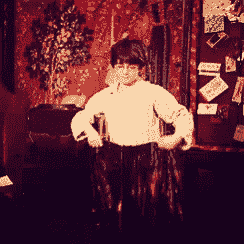
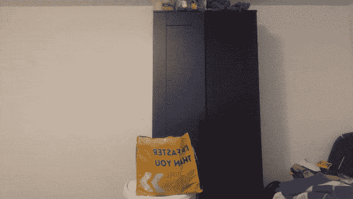
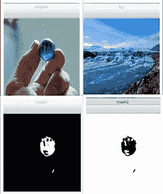
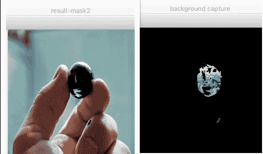
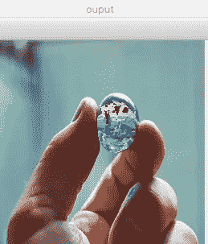

# 《哈利·波特》蟒蛇皮隐身衣

> 原文：<https://medium.com/analytics-vidhya/harry-potter-cloak-of-invisibility-with-python-9fdfa06b338?source=collection_archive---------15----------------------->

## 了解如何使用 Python 构建 HP 斗篷

隐身衣是一件神奇的神器，用来让穿戴者隐形。我敢肯定，你会看到或听说过哈利波特的斗篷，他穿的隐形。



几天前，当我看到这张 gif 时，我非常兴奋地使用计算机视觉来构建类似的东西。



这是我用几行代码生成的结果

> *兴奋到可以用 Python 制作自己的斗篷？开始吧！*

我们将使用 Python 中的 OpenCV 库来实现这一点。

**第一步:设置环境**

```
pip install opencv-python==4.1.2.30
import cv2
import numpy as np
```

**第二步:检查你将要使用的相机**

```
capture = cv2.VideoCapture(0)

while(True):
    ret, frame = capture.read()
    cv2.imshow('video', frame)
    if cv2.waitKey(1) == 27:
        break

capture.release()
cv2.destroyAllWindows()
```

这里 VideoCapture 中的“0”表示使用笔记本电脑摄像头，等待键的 *27* 表示按下“esc”停止视频，因为 *27* 是“esc”键。

**第三步:** **定义斗篷的颜色，并将其捕捉到帧中**

这里我们将使用蓝色，并将使用颜色的 HSV 值，而不是 RBG，因为 HSV 值对光照不太敏感。

要找到定义颜色的 HSV 值，我们可以使用这个技巧:

```
blue = np.uint8([[[255,0,0 ]]])
hsv_blue = cv2.cvtColor(blue,cv2.COLOR_BGR2HSV)
print (hsv_blue)
```

输出:[[120 255 255]]

我们先用一张图片试试

```
img = cv2.imread('blue-1-mini.jpg')
img2 = cv2.imread('iceland-mini.jpg')
cv2.imshow('original',img)
cv2.imshow('bg',img2)hsv = cv2.cvtColor(img, cv2.COLOR_BGR2HSV)# define range of blue color in HSV
lower_blue = np.array([110,50,50])
upper_blue = np.array([130,255,255])# Use the inrange function to get only blue colors
mask1 = cv2.inRange(hsv, lower_blue, upper_blue)
cv2.imshow('mask1',mask1)mask2 = cv2.bitwise_not(mask1)
cv2.imshow('mask2',mask2
```



正如你所看到的，它完美地检测到了“原始”图像中的蓝色，并正确地屏蔽了它。

**步骤 4:将蓝色部分从帧中分割出来**

```
## Segment the blue color part out of the frame using inverted mask
res1 = cv2.bitwise_and(img,img, mask= mask2)
cv2.imshow('result-mask2',res1)#Create image showing static background image only for the masked region
res2 = cv2.bitwise_and(img2, img2, mask = mask1)
cv2.imshow('background capture',res2)
```



**步骤 5:将两个输出合并到一个帧中**

最后一步是用先前保存的静态背景的像素值替换帧中检测到的蓝色区域的像素

```
finalOutput = cv2.addWeighted(res1,1,res2,1,0)
cv2.imshow('ouput ',finalOutput)
```



现在我们知道了在一幅图像中要采取什么步骤，我们可以对视频采取同样的步骤。

看起来你很喜欢这篇文章！

*   完整的代码，你可以在这里找到 Jupyter 笔记本[。](https://github.com/divensambhwani/HP-CLOAK/blob/master/HP%20CLOAK.ipynb)

编码快乐！

## 参考资料:

[1][https://docs.opencv.org/2.4/](https://docs.opencv.org/2.4/)