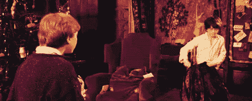
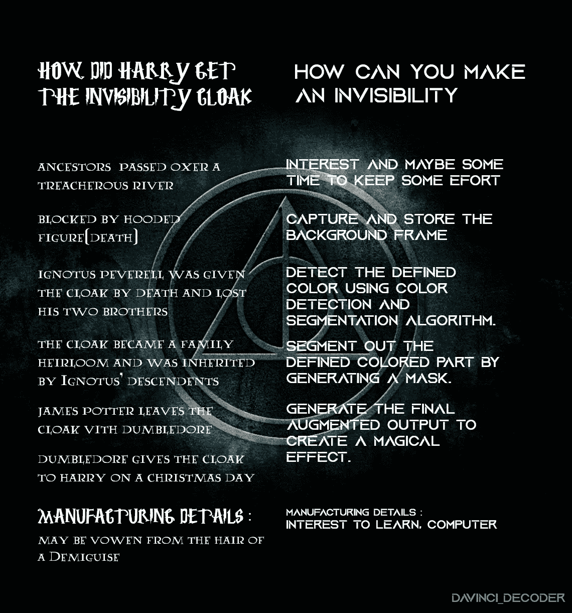
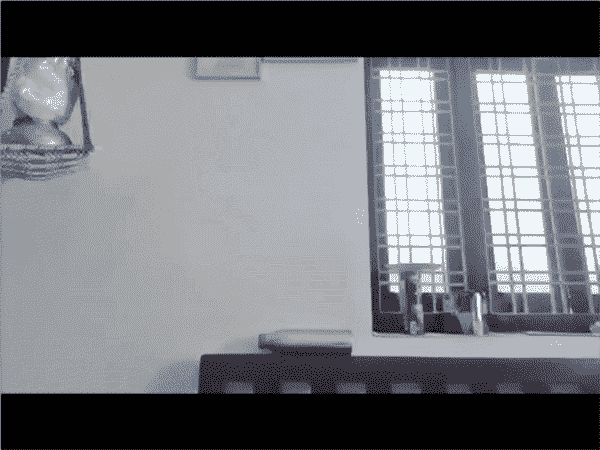

# 哈利·波特的隐身衣——使用 OpenCV、Python——计算机视觉

> 原文：<https://medium.com/analytics-vidhya/harry-potter-invisibility-cloak-using-opencv-python-4fa6796816f5?source=collection_archive---------14----------------------->

## 学习和执行 OpenCV、Python 的一个很棒的项目



哇哦。！

哈利从他父亲那里得到了他的隐形衣，而我们可以用 OpenCV 创造我们自己的隐形衣，并检查它穿在我们身上的样子。**是的！不需要去霍格沃茨，你需要的只是学习的兴趣和一台电脑。**



算法！

# 我们要怎么做？

我们都听说过**绿屏**，所有那些电影里的 **VFX 特效**。这里我们做的与绿色筛选相反(去除背景)，**是的，我们去除前景**



在行动！

这里我用了蓝色的布。我能用别的颜色吗！是的，红色、绿色也可以

## 让我们设置环境

我们需要安装 OpenCV(开源计算机视觉)库，它可以帮助我们执行与计算机视觉相关的任务。[我们需要对 OpenCV 库进行 pip 安装。](https://www.youtube.com/watch?v=d3AT9EGp4iw)

```
pip install opencv-python
```

## 打开 Spyder(安装-[https://www.youtube.com/watch?v=5mDYijMfSzs](https://www.youtube.com/watch?v=5mDYijMfSzs)

## 导入库

```
import cv2
import numpy as np
import time
```

## 捕捉视频

```
Video_capture = cv2.VideoCapture(0)
```

读取视频文件的第一步是创建一个 VideoCapture 对象。它的参数可以是设备索引。 *(0-集成网络摄像头，1-外置网络摄像头等等..)*

## 让系统摄像头预热！

```
time.sleep(3)
background = 0
```

Python 的时间睡眠功能是用来增加程序执行的延迟。当执行 time.sleep(t)语句时，下一行代码将在 t 秒后执行。

```
for i in range(45):
    ret, background = Video_capture.read()
background = np.flip(background, axis=1)
```

这里我们捕捉 45 度范围内的背景，并翻转(字面上)背景

# 颜色检测和分割

```
while (Video_capture.isOpened()):
    ret, frame = cap.read()
    if not ret:
        break
    frame= np.flip(frame, axis=1)
```

这里我们创建一个 while 循环来捕获帧并运行帧。 *capture.read()* 返回一个布尔值(真/假)。如果读框正确，则为真。*“ret”*将从获取相机帧中获取返回值，真或假。*“帧”*将获取相机中的下一帧(通过“捕捉”)。

*“若不 ret:
破”。如果帧没有被返回，这段代码就中断循环。*

```
#Converting the color space from BGR to HSV
   hsv = cv2.cvtColor(img, cv2.COLOR_BGR2HSV)
```

BGR — HSV 是 OpenCV 中可用的颜色空间转换方法之一。对于颜色转换，我们使用函数 cv2.cvtColor(input_image，flag ),其中 flag 确定转换的类型。对于 BGR -HSV，我们使用旗 *cv2。COLOR_BGR2HSV* 。" *Video_capture.read"* 它以 BGR(蓝-绿-红)颜色捕捉帧，而我们使用 HSV 格式进行遮罩。因此，我们翻转框架的颜色代码。

```
#*Creating masks with ranges of blue color to detect*
  lower_blue = np.array([94, 80, 2])
  upper_blue = np.array([126, 255, 255])
  mask_all = cv2.inRange(hsv,lower_blue,upper_blue)
```

我们正在为颜色(蓝色)创建一个范围，其中我们定义了蓝色最高部分的最低部分(HSV 的最低和最高值)。" *inRange"* 函数返回一个二进制掩码，其中白色像素(255)表示落在上限和下限范围内的像素，而黑色像素(0)则不在此范围内。我们生成一个遮罩来确定帧中与检测到的蓝色相对应的区域

## 选择你的颜色，创造隐形斗篷

只需替换代码片段

```
#Range of different colors **Red color**
low_red = np.array([161, 155, 84]) high_red = np.array([179, 255, 255])
**Blue color**
low_blue = np.array([94, 80, 2]) high_blue = np.array([126, 255, 255])
**Green color**
low_green = np.array([25, 52, 72]) high_green = np.array([102, 255, 255])
**Every color except white**
low = np.array([0, 42, 0]) high = np.array([179, 255, 255])
```

现在，我们必须完善这个面具，然后用它来分割出框架的布。

```
#Doing morphological operations
mask_all = cv2.morphologyEx(mask_all, cv2.MORPH_OPEN, np.ones((3,3),np.uint8))
mask_all = cv2.morphologyEx(mask_all, cv2.MORPH_DILATE, np.ones((3,3),np.uint8))
```

这里我们使用 cv2.morphologyEx 执行一些[形态变换](https://docs.opencv.org/trunk/d9/d61/tutorial_py_morphological_ops.html)(基于图像形状的操作)。它需要三个输入，一个是我们的原始图像，操作符和**内核**大小。“np.ones((3，3)，np.uint8)”是内核，其中(3，3)是大小，*“NP . unit 8”*是数据类型。

我们在这里使用的形态学算子是开和膨胀。膨胀增加了帧中的白色区域，或者前景对象的尺寸增加。打开只是腐蚀的另一个名字，然后是膨胀。它在消除噪音方面很有用。侵蚀(就像土壤侵蚀一样，侵蚀边界)消除了白噪声，但它也缩小了我们的对象。所以我们扩大它。既然噪音没了，他们就不会回来了，但是我们的对象面积增加了。它也有助于连接物体的断裂部分。

```
#Create an inverted mask to segment out the blue from the #frame(hiding the blue part)
mask1 = cv2.bitwise_not(mask_all)## Segment the blue color part out of the frame using bitwise and #with the inverted mask
streamA = cv2.bitwise_and(frame,frame,mask=mask1)# Creating an image showing static background frame pixels only for #the masked region
streamB = cv2.bitwise_and(background, background, mask = mask_all)
```

这里，我们用静态背景区域的相应像素值替换检测到的蓝色区域的像素值，这给了我们一个创建效果的增强输出，将我们的衣服转换成一件隐身衣。为此，我们使用[位与、位非运算。](https://www.youtube.com/watch?v=mc846qb0ngk)

```
#Generating the final output
output = cv2.addWeighted(streamA,1,streamB,1,0)
cv2.imshow("Thankyou_Dumbledore",output)
if cv2.waitKey(1) == 27:
     break
```

这里我们使用“*add weighted”*对象进行反锐化掩模。函数 **cv2.imshow()** 用于在窗口中显示图像。第一个参数是窗口名，它是一个字符串。第二个论点是我们的形象。

*"如果 cv2 . wait key(25)= = 27:"*wait key 函数显示指定毫秒的图像。否则，它不会显示图像。例如，waitKey(0)将无限显示窗口，直到任何按键。等待键(25)将显示一帧 25 毫秒，这里我们指定 1 毫秒后显示将自动关闭。因为我们把它放在一个循环中，所以它会逐帧显示视频

27 是“Esc”的键码。按“Esc”停止播放视频。 **break** 是 **python** 中的一个关键字，用于将程序控制带出循环。

```
Video_capture.release()
cv2.destroyAllWindows()
```

这将释放网络摄像头，然后关闭所有 imshow()窗口。

# 雅斯！！

## 最后，我们使用 OpenCV 库成功地用 Python 创建了我们自己的隐形斗篷代码。尝试使用我们在其他项目中使用的方法。

> 加油。！

全代码！

Github 知识库链接—[https://github.com/Davinci-Decoder/ML-AI](https://github.com/Davinci-Decoder/ML-AI)

参考资料:【https://www.learnopencv.com/】T2；【https://docs.opencv.org/2.4/index.html 