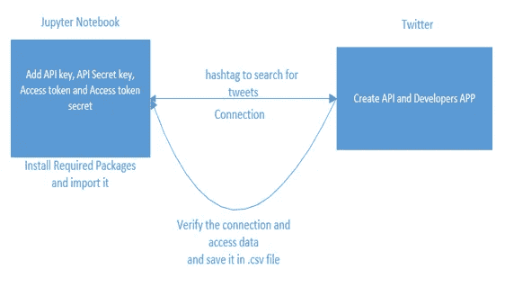
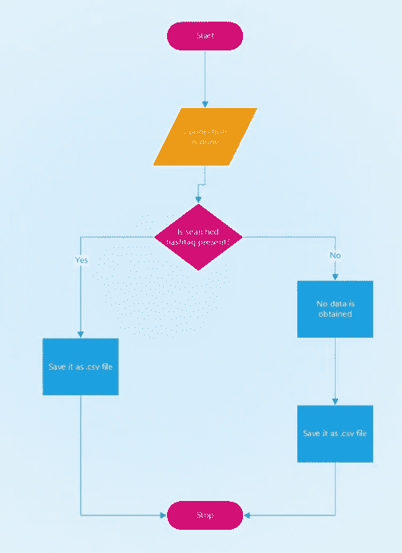
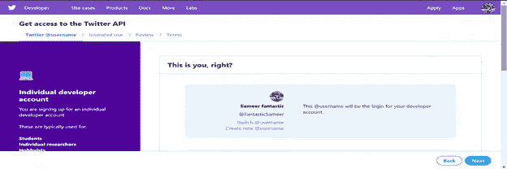
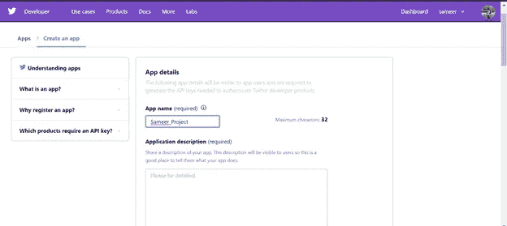
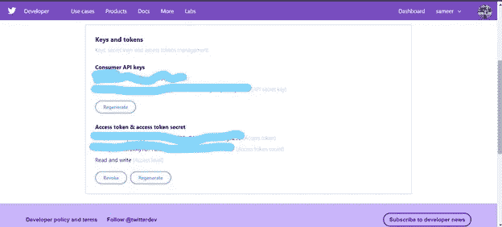
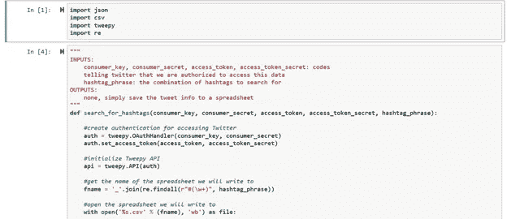
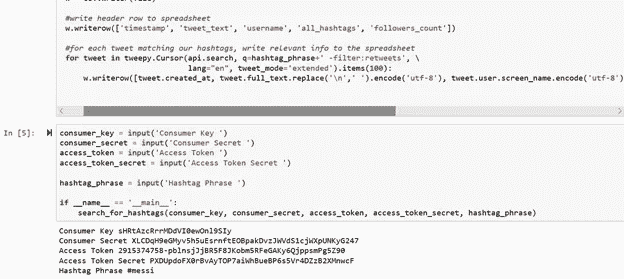

# 从 Twitter 收集数据并保存为。csv 文件

> 原文：<https://medium.com/analytics-vidhya/harvesting-data-from-twitter-and-save-it-as-csv-file-ae7626787203?source=collection_archive---------13----------------------->

**简介**

S 社交媒体已经成为人们生活中重要的一部分，人们无法不去关注它。在这种情况下，我们首先通过登录 www.twitter.com/signup 的创建一个 twitter 账户，然后，我们在 www.apps.twitter.com 的[创建一个开发者账户，并输入所需的所有细节。twitter 的开发者账户创建完成后，我们在开发者的账户上创建一个应用。该应用程序的名称可以是用户希望的任何名称。创建应用程序后，在开发者帐户中，我们只需选择令牌和密钥仪表板。在这里，我们得到签名密钥，如 API 密钥、API 秘密、访问令牌密钥和访问令牌秘密。我们使用这个签名密钥从 twitter 中删除数据，使用 hashtag 来搜索数据[1]。](http://www.apps.twitter.com)

**文献调查**

1.  从在线社交网络收集信息是许多数据科学领域的原始步骤，允许研究人员处理不同的和更详细的数据集[2]。尽管科学界有很大一部分人使用 Twitter 流 API 来收集数据，但当查询超过评级间隔和时间范围时，就会出现限制[2]。
2.  互联网和万维网的兴起和发展给了我们一个世界范围的系统来分享数据和一起工作去见某人。没有开放的汗水，它们在我们的生活中成倍增加，以至于客户可以在任何时间任何地点获取/共享数据。
3.  如今，在线网络主宰着展示进步的世界。这使得它成为任何领域任何广告发展的理想舞台。在线网络推广的一个最重要的部分是通信的两条路线的合理性。[4].
4.  今天，社交网络形成了一个重要的交流平台。地理位置不同的人们可以通过各种社交网络相互交流[5]。

**分析模型**

为了解释分析模型，显示 Jupyter notebook 和 Twitter 连接的设计图如下所示

在上面的设计图中，我们可以看到 Jupyter notebook 和 Twitter 之间的连接是如何实现的。
为了更精确地显示分析模型，流程图如下所示

这里显示了 jupyter notebook 与 Twitter 连接时保存数据的流程图。

为了在它们之间建立联系，首先在 jupyter 笔记本中导入名为 tweepy 的库，并编写必要的代码。连同它的各种签名密钥也被作为输入给出。

**实施**

为了实施这项工作，我们首先做了各种工作。该工程可列举如下

首先，创建一个 twitter 账户。

二。为 twitter 创建开发者帐户

三。在开发者帐户上创建应用程序

四。保存签名密钥，如 API 密钥、API 密钥、访问令牌和访问令牌密钥。

动词 （verb 的缩写）启动木星笔记本

不及物动词在 jupyter 笔记本中为 python 创建一个工作空间

七。导入所需的库。

八。编写所需的代码。

九。给出这些签名密钥作为输入

x.为废弃数据提供特定的标签。

为了更准确地解释它，下面可以显示一些截图

**创建开发者账号**

**来自推特的确认**

**在开发者账户上创建应用**

**所需签名密钥**

编码部分可以显示如下:-

**应用**

这项工作可以实现各种应用。其中一些列举如下

一、数据可以用于营销和金融。

二。为了学术目的。

三。找到与这些推文相关的情感。

四。用于研究目的。

**成果和结果**

我通过这些步骤得到的结果是巨大的。该数据已成功从 twitter 中删除。此外，我成功地制作了必填字段来显示数据，如推文文本、推文用户、使用的标签、转发次数等。该数据保存为. csv 文件，可用于各种目的。它可以用于市场营销、金融目的、研究、学术目的等。它还可以用来发现人们通过他们的推文到底在说什么，以及与这些推文相关的情绪。因此，简而言之，可以说这些从 twitter 上丢弃的数据可以用于各种目的，并且有一些很好的应用。

# 参考

[1]

Octoparse Jerry，《Twitte 刮痧，文本挖掘与情感分析》，[*https://hacker noon . com/Twitter-scraping-text-mining-and-sensition-analysis-using-python-b 95 e 792 a 4d 64，*](https://hackernoon.com/twitter-scraping-text-mining-and-sentiment-analysis-using-python-b95e792a4d64,) 第 10、24 4 页 2019。

[2]

A.Harnandez Suarez，g .桑切斯·佩雷斯，V. Sanchez，一种绕过 Twitter API 的网络抓取方法论，马德里:[https://arxiv.org/pdf/1803.09875.pdf,](https://arxiv.org/pdf/1803.09875.pdf,)2018。

[3]

米（meter 的缩写））B. Pooja Wadhwa，“社交网络分析:趋势、技术和未来前景”，IEEE，德里，2014 年。

[4]

R.M. Suresh M，“社交媒体作为营销推广工具的应用——综述”，哥印拜陀阿姆里塔商学院，2017 年。

[5]

K.K. K. P. Madhura Kaple，“智能城市的病毒营销:社交网络社区的影响者”，2017 年 IEEE 第三届大数据计算服务和应用国际会议，加利福尼亚州圣何塞，2017 年。