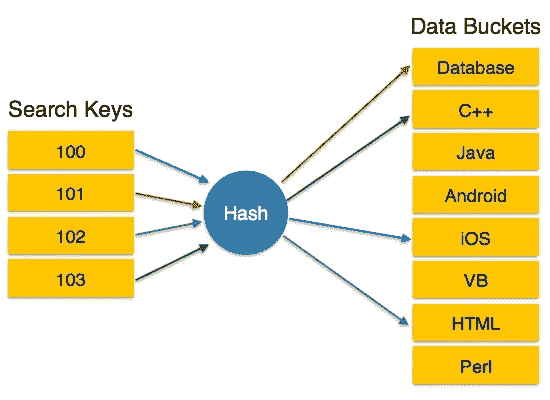

# 哈希:

> 原文：<https://medium.com/analytics-vidhya/hashing-9d6e439171ef?source=collection_archive---------32----------------------->

**惠！！**
我相信你一定见过各种各样的搜索技巧。顺序搜索，二分搜索法，其中搜索时间取决于元素的数量，并涉及许多关键比较。
您是否想要一种可以在恒定时间内、在不太关键的比较中为您做到这一点的东西？
**听起来不错！！让我们开始吧，**

> 假设我们必须存储某个班级的**【n】**名学生的数据，将他们的学号作为**键，**和他们的**名**作为值**。**我们可以获取大小为“n”的数组，并存储与学生编号相对应的学生姓名。由于我们已经将每个姓名唯一地映射到一个编号，因此我们可以直接访问该数据，因此我们可以在恒定时间内获得任何数据，无需进行关键字比较。这种寻址方法被称为**直接寻址。**这种类型的寻址仅适用于小数据，并且当可能的键值数量等于要存储的键数量时。

为了存储大量数据，同时节省时间和空间，我们使用**散列法修改了我们的寻址方法。**

> 从键值生成地址的过程称为**散列**，通过散列进行搜索和插入的数组称为**哈希表**。

**从键值生成地址:** 哈希函数一般是一种数学函数，用于映射键值及其地址。hash 函数将 key 作为输入，并返回该键的哈希值，该哈希值用作数组中存储该键的地址。密钥可以是任何类型，如整数、字符串等。但是散列值总是一个整数。

## **密钥— →哈希函数—→地址**

我们可以这样写-
***h(k)= a*
h**-哈希函数
**k**-key
**a**-地址

# **碰撞:**

当哈希函数为不同的键生成相同的地址时，就会发生冲突。映射到相同地址的关键字称为**同义词。** 理想情况下，哈希函数应该给所有键一个**唯一的地址**，但这**实际上是不可能的。**所以，我们应该尽量**选择一个最小化冲突的哈希函数。** 在制作使用哈希的算法时，我们必须主要关注两件事:-
**1。选择将密钥转换为地址的哈希函数。
2。解决冲突。**

# 哈希函数:

正如我们所知，哈希函数作为**键**和**哈希表之间的映射接口。**如果我们有一个大小为 **n，**的哈希表，那么我们需要一个哈希函数来生成范围为 **0 到 n-1 的地址。**基本上我们可以选择哈希函数是- **1。容易计算。
2。生成冲突最小的地址。**

# **(a)截断(或提取):**

这是从密钥计算地址的最简单的方法，这里我们**只选择密钥的一部分作为地址**，要么是最右边的数字，要么是最左边的数字。这种方法最简单，但是碰撞的机会更多。
例如- 设我们有 5 个数字键，54678，87976，98765，32662，表的大小是 100，我们决定取哈希表最右边的 2 个数字作为地址，所以地址分别是 78，76，65，62。

# **(b)中和法:**

在这种方法中，密钥是平方的，并且取某个中间值作为地址。选择多少位数作为地址取决于表格的大小。如果密钥值对于平方来说非常大，那么我们可以取密钥的一部分并执行中间平方方法。
**例如-** 说我们有密钥= 1337，1273，1391，1026，在平方上我们分别得到，1787569，1620529，1934881，1052676。并且我们有 1000 的表大小，所以我们可以取最多三位数的地址，所以地址将是 17 **875** 69，16 **205** 29，19 **348** 81，10 **526** 76，即 875、205、348 和 526 是对应的地址。

# **(c)折叠方法:**

**移位折叠:**在该方法中，密钥被分成不同的部分，其中每个部分的长度与所需地址的长度相同，除了可能是最后一部分。在这之后，被分解的部分被移位并以这样的方式排列，即最低有效数字被排成一行，然后将它们全部相加。
**例如-** key = 738239456527，哈希表的大小为 1000，所以拆分为三个一组，738、239、456、527，现在将它们全部相加-
**738+239+456+527 = 1960，**现在忽略最后一个进位，哈希地址变为= 960。

**边界折叠:**在这种方法中，假设密钥写在纸上，纸在密钥各部分的边界处折叠，所以所有偶数部分在相加前都是反的。
**例如-** key = 738239456527，哈希表的大小是 1000，所以折叠并拆分成三个一组，738、 **932** 、456、 **725** ，现在将它们全部相加-
**738 + 932+ 456 + 725= 2851，**现在忽略最后一个进位，哈希地址变成= 851

# 除法(模除法):

这里，密钥除以表的大小，取模数值作为地址。

**H(k) = k mod m

例如，假设表的大小为 100，关键字为 987，765，653，234
987% 100 = 87
765% 100 = 65
653% 100 = 53
234% 100 = 34
87，65，53，34 是对应的哈希地址。**

**谢谢你！！！！。**