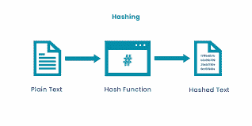
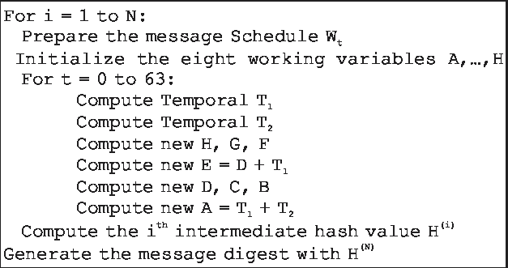
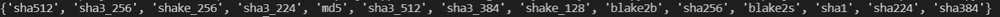
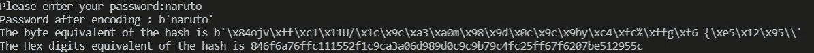

# Python 中的哈希

> 原文：<https://medium.com/analytics-vidhya/hashing-in-python-565abbaf194a?source=collection_archive---------15----------------------->


在 [Unsplash](https://unsplash.com?utm_source=medium&utm_medium=referral) 上 [NeONBRAND](https://unsplash.com/@neonbrand?utm_source=medium&utm_medium=referral) 拍摄的照片

嘿，希望你今天过得愉快！

让我们来讨论一个简单的案例

你和你的团队正在构建一个很酷的应用程序/网站，在某些情况下，你必须将用户密码存储在数据库中，现在每个可以访问数据库的人都可以看到纯文本格式的密码，如果我告诉你，一个黑客使用 SQL 注入攻击或其他一些强大的攻击入侵了你的数据库，不幸的是，你的应用程序刚刚发布，用户就用密码登录了。现在黑客只需检查已经被入侵的数据库，获取密码，修改用户数据或利用它们。简单地说，您的应用程序不太安全。

如何克服上述问题？

上述问题的最佳解决方案是使用哈希技术来安全地存储密码，这就是我们今天在这篇文章中讨论的内容。

哈希是什么？

哈希是将给定的键转换为另一个值的过程。哈希函数用于根据数学算法生成新值。哈希函数的结果被称为哈希值或简称为哈希。



来自 audienceplay.com 的图像

有不同的哈希算法，有些安全快速，有些则不然。我们将实现 sha256，它属于 shah-2 系列，目前是一种健壮的哈希算法。

Sha256 最初是由美国国家安全局在 2002 年春天开发的，成为 Sha-1 的强大继任者。Sha256 返回 256 位或 64 个十六进制数字的唯一哈希值，内部块大小为 32 位。它比 Sha-1 和 MD5 慢一点。



来自 researchgate.net 的图像

上图是 Sha256 的基本算法。如果你不明白，没关系，这只是一些数学计算，我们不要深究这个算法是如何工作的，我们只讨论实现。

如果你想检查当任何字符串被传递给 sha256 时，它的输出是什么，那么这里是[链接](https://www.movable-type.co.uk/scripts/sha256.html)。

我将使用 Python 3 来实现这个算法

为了简单起见，我们将使用一个名为“ **hashlib** ”的 python 库

让我们开始编码吧

```
import hashlib 
```

您不必为这个模块进行 pip 安装，因为这个库是 python 自带的默认模块。

```
print(hashlib.algorithms_available)
```

上面的代码块将列出 hashlib 中所有可用的散列算法



前一个代码块的输出

*   在 hashlib 中我们总共有 14 种散列算法
*   您可以尝试任何算法，并且大多数算法都是以相同的方式实现的

```
print(hashlib.algorithms_guaranteed)
```

上面的代码块将返回一个散列算法列表，该列表可用于您正在运行的 Python 解释器。

```
password=input("Please enter your password:")
```

我们将要求用户输入密码

```
encode_password=password.encode()
print('Password after encoding : {}'.format(encode_password))
```

encode()方法返回以字节为单位的密码的编码版本，以便我们可以将其传递给 shah256()

```
hash_password=hashlib.sha256(encode_password)
```

*   我们将把编码后的密码传递给 sha256()函数，该函数基于 Sha256 算法进行哈希运算，并返回一个哈希对象
*   如果你使用不同的算法，那么你需要以相同的方式调用不同的函数，函数名将与算法名相同
*   我们可以用字节和十六进制十进制两种不同的表示来查看这个对象

```
print('The byte equivalent of the hash is {}'.format(hash_password.digest()))print('The Hex digits equivalent of the hash is {}'.format(hash_password.hexdigest()))
```

这里我们使用了两个函数:

*   digest():以字节格式返回散列值
*   hexdigest():返回十六进制格式的散列值

因此，所有代码块连接在一起的全部输出将是



如果你想看看 sha256 的纯实现，那么看看这个[链接](https://github.com/delqn/py-sha256/blob/master/sha256.py)。

python 中还有另一个方法，它是一个内置函数。如果您不需要非常详细的信息，如块大小、摘要大小或算法的安全性，那么您可以使用 hash()

```
print(hash('naruto')
#output -4430924599072356031
```

我们学习了如何创建密码哈希。现在，接下来是什么？

我们可以在存储密码的小型或大型项目中使用它

*   当用户注册到您的网站或应用程序时，您将要求输入密码，该密码将被散列，我们称之为 register_hash_password，并保存在数据库中，而不是存储纯文本密码
*   下一次当用户登录时，他需要输入用户名和密码，我们将把这个密码传递给哈希函数
*   我们得到密码的哈希版本，我们称之为 login_hash_password。现在，我们将比较 register_hash_password 和 login_hash_password。如果两者都匹配，则身份认证成功

希望你今天从这篇文章中学到了新的东西。我试着让它简单、坦率、简短！

感谢您抽出几分钟时间

如果你有任何疑问，请在下面评论，我很乐意帮助你！

谢谢你，别忘了爱自己！

-马尼