# Windows 7 上的 Haskell

> 原文：<https://medium.com/analytics-vidhya/haskell-on-windows-7-8c9bb663711b?source=collection_archive---------14----------------------->

## 在 Windows 上安装 Haskell

这是我正在使用的惠普笔记本电脑:

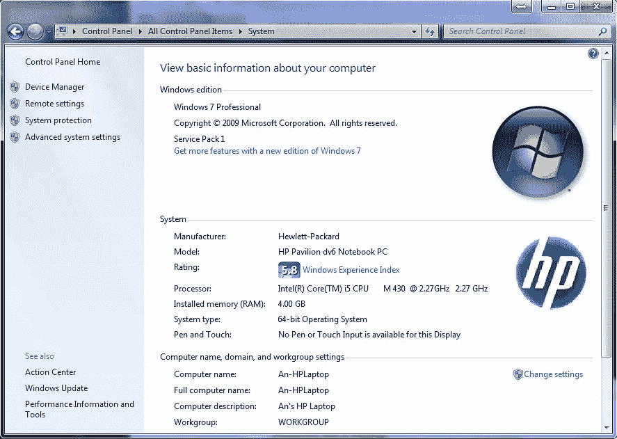

前往[https://www.haskell.org/platform/windows.html](https://www.haskell.org/platform/windows.html)

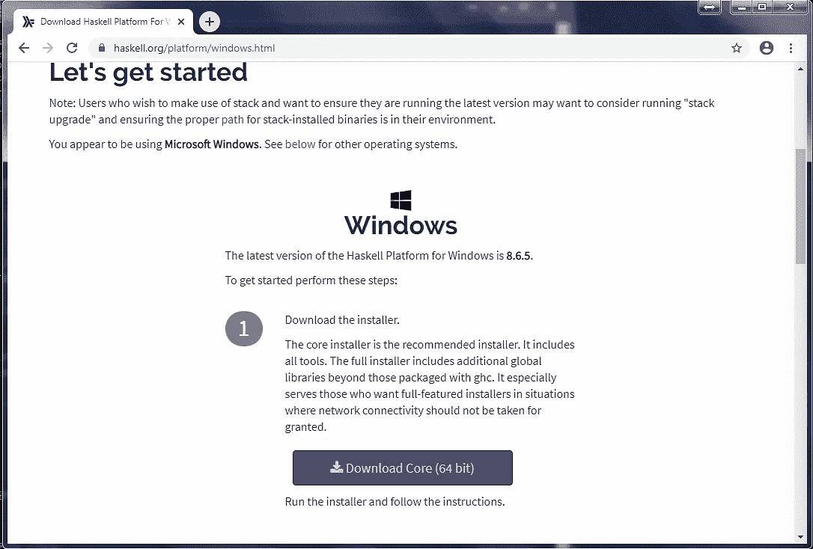

单击下载核心(64 位)继续。启动下载的文件。

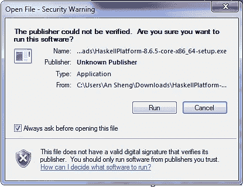

单击运行开始安装。

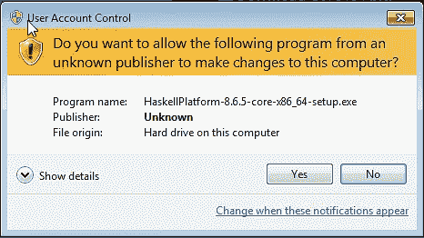

回答“是”,然后按照屏幕上的说明进行操作。

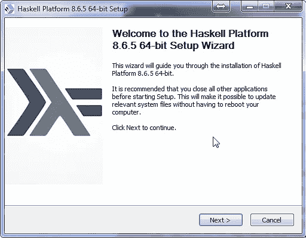

单击下一步继续。

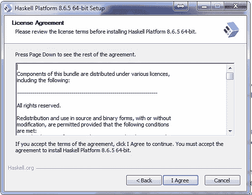

同意。

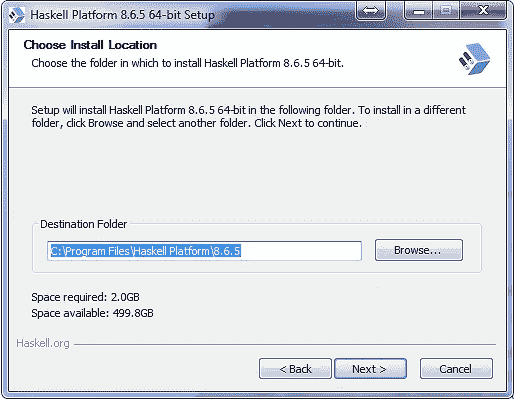

单击“下一步”接受默认安装位置。

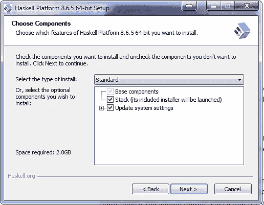

单击“下一步”接受要安装的默认组件。

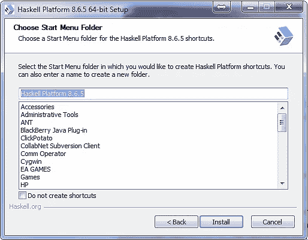

单击安装开始安装。

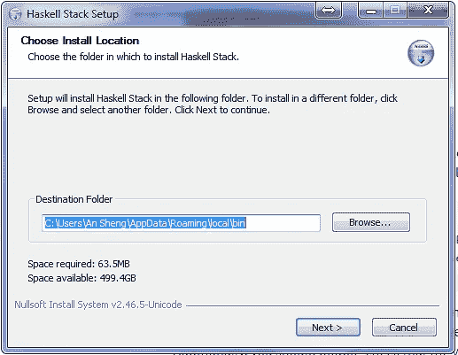

单击“下一步”接受 Haskell 堆栈的安装位置。

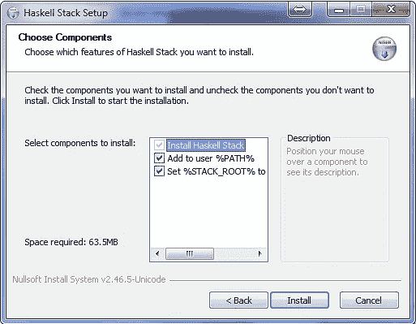

单击“安装”接受默认组件。

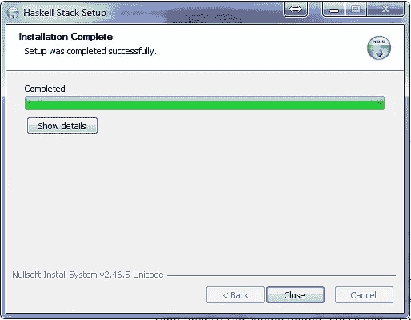

单击“关闭”继续。

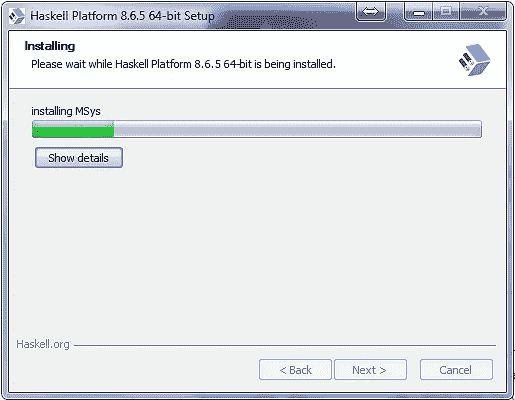

大约需要几分钟，然后我们有:

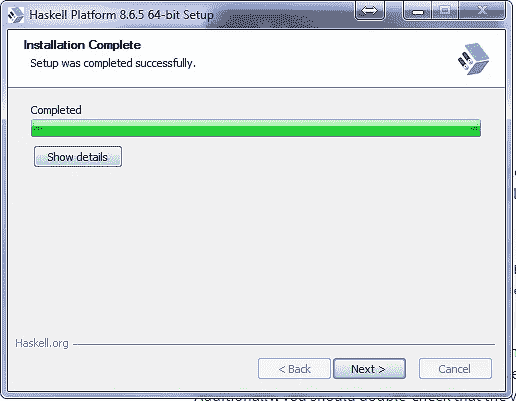

单击下一步继续。

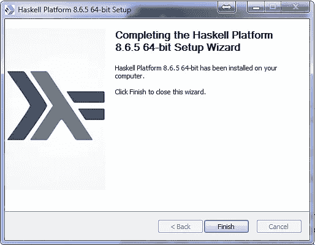

点击 Finish，我们就成功安装了 Haskell 8.6.5。:-D

要启动 GHCi，请选择开始>键入“WinGHCi”。

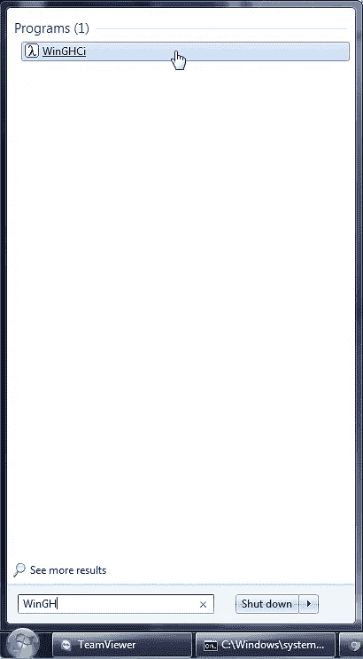

我们到了:

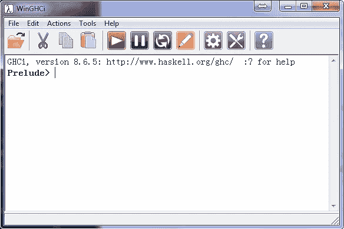

尝试一些 Haskell 函数:

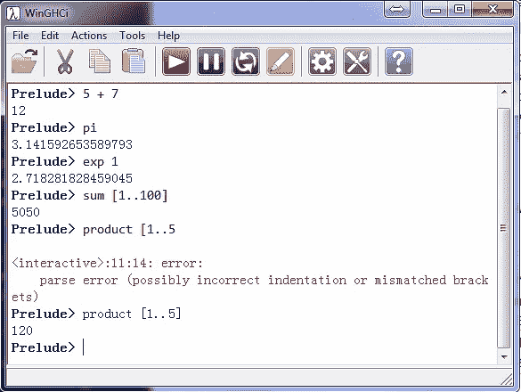

玩得开心点。