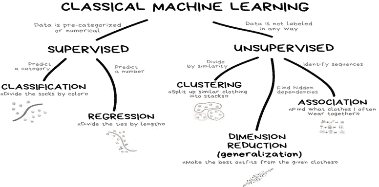
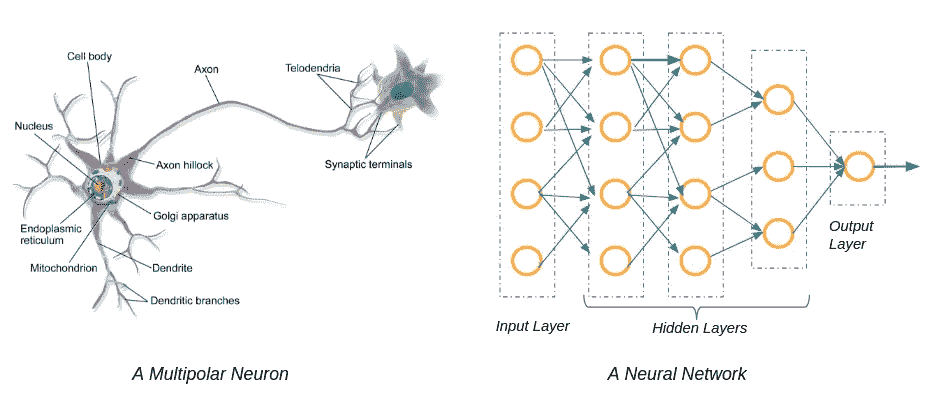

# 你听说过这个吗？机器学习 vs 深度学习！

> 原文：<https://medium.com/analytics-vidhya/have-you-heard-of-this-machine-learning-vs-deep-learning-cb7c5633d7d5?source=collection_archive---------18----------------------->

你应该追求什么技术！新手甚至中间用户都分不清 ML 和 DL！你知道吗？

安迪·凯利在 [Unsplash](https://unsplash.com?utm_source=medium&utm_medium=referral) 上的照片

## 简介:

你可能知道，人工智能的进步一直被炒作，即机器学习和深度学习。任何对这个领域感兴趣的人，不断地用这些术语冻结他们的头脑，不管他们是否理解这些术语。ML & DL 可能很吸引人，但对初学者来说一点也不容易。因此，在选择 ML & DL 的职业之前，只需要充分询问两者是如何工作的，以及需要什么样的技能。例如，对于外行人来说，机器学习(ML)和深度学习(DL)之间的区别可能有点混乱，但对于试图利用他们收集的大量数据的公司来说，这非常重要， [Taboola](https://www.taboola.com/) 首席执行官兼创始人亚当·辛戈尔达指出了这一点。

从这你明白了什么？很简单，完美的模型可能存在但不可能存在。Lol！

我希望你听过这句话，很多次了！这也很有趣-

嘿伙计，你是怎么做到的？他回答:机器学习。(听起来很容易吧？嗯没有)。不要在不了解事情的深度之前就下结论。好了，我们继续吧。

## 你如何定义机器学习:

嗯，你知道它是人工智能的一个子集，但是等等，ML 中涉及的过程呢？关键的洞察力在于算法、模型训练和概念，它们对你来说可能不像你想象的那么容易。“机器学习可以定义为一门科学，它使计算机像人类一样行动和学习，并通过以真实世界交互和观察的形式向它们提供信息和数据，随着时间的推移以独立的方式增强它们的学习能力。”

一个简单的例子是网飞，它使用一种算法来了解你的偏好，并为你提供你可能喜欢观看的选择。

来源:[vas3k.com](https://vas3k.com/blog/machine_learning/)(这个图还不够了解 ML 流量吗？我希望如此。)

在机器学习的情况下，需要通过向算法提供更多信息来告诉算法如何做出准确的预测，而在深度学习的情况下，算法可以通过自己的数据处理来学习。这类似于一个人如何识别某样东西，思考它，然后得出任何一种结论。

## 那么，深度学习呢:

深度学习是基于学习数据表示的机器学习的子集，DL 的灵感来自于被称为人工神经网络的大脑的功能和结构。深度学习通过学习将世界显示为固定的概念层次结构来获得巨大的灵活性和能力，这些概念层次结构是关于更简单的概念和基于不太抽象的概念计算的更抽象的委托而定义的。虽然深度学习这个术语已经说了很多年，但随着这些天的大肆宣传，它越来越受到关注。"**深度学习是大型神经网络."**

来源:https://mc.ai/deep-learning-explained/(深度学习是通过所谓的神经网络进行模式识别。)

神经网络是模仿人脑的一套算法。它们是传感器:机器感知的一种形式。深度学习(Deep learning)是由若干节点层组成的某种类型的堆叠神经网络的名称。从初始输入层开始，每层的输出同时也是后续层的输入。

深度学习网络与更普通的单隐层神经网络的区别在于它们的深度；也就是在模式识别的多步过程中传递数据的节点层数。三个以上包括输入输出就是深度学习。任何不足都只是机器学习。

## 最后，ML vs DL:

来源:Inteliment.com[(不知何故，深度学习有一个额外的优势。)](https://www.google.com/url?sa=i&source=images&cd=&cad=rja&uact=8&ved=0ahUKEwjq9M2U34DnAhUOVH0KHVWPBR4QMwhkKAAwAA&url=https%3A%2F%2Fwww.inteliment.com%2Fblog%2Four-thinking%2Flets-understand-the-difference-between-machine-learning-vs-deep-learning%2F&psig=AOvVaw1WzxzapMp1AFbjpPNxDuE2&ust=1579010642779328&ictx=3&uact=3)

你知道吗，机器学习几乎总是需要结构良好的数据进行处理，但深度学习依赖于多层人工神经网络(ANN)。

深度学习正在冲击应用程序，就目前而言，当谈到性能时，我们都主要依赖于 DL，较低的故障率是 DL 更受欢迎的原因，是的，它应该如此。难怪，如果你也想更深入地学习深度学习，我下次会补充，但作为初学者，如果你意识到这些趋势，恭喜你！你将遵循正确的方向。

## 机器学习和深度学习的最新趋势是什么？：

随着机器学习和深度学习齐头并进，下面是我们最有可能在短期内看到的一些趋势(或者看到更好的版本):

(1)迁移学习。(2)更好的网络安全方法。

(3)机器人过程自动化。(4)透明的决策。

(5)边缘智能。(6)量子计算。(7)云计算。

> 学习 AI，ML 或者 DL 从来都不会太容易。记住，只有你的奉献、练习和耐心才能决定你的潜力。有什么概念不懂也不要慌，随时可以讨论。

## 结论:

我们研究了深度学习和机器学习，也研究了两者之间的比较。为了更好的表现和理解，我们也观察了图像。现在，你知道无数细微的差别划分了机器学习和深度学习，尽管两者都与类似的人工智能原则有关。但关键是前者包括更复杂的代码，而后者导致更多增强的结果。

快乐学习家庭！