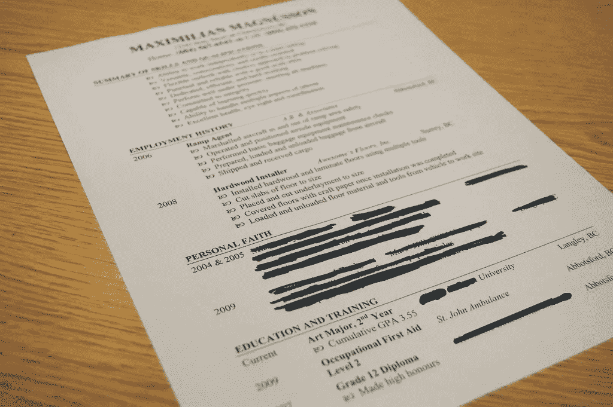

# 去参加数据科学面试？

> 原文：<https://medium.com/analytics-vidhya/heading-for-a-data-science-interview-95eeab94ba1d?source=collection_archive---------5----------------------->

## 面试前一天要做的 6 件事

# 介绍

你终于做到了！你获得了数据科学职位的[面试机会。现在，在你面试的前一天，你不确定要学什么。这一天就要到了，但是还有太多的事情要做！](https://courses.analyticsvidhya.com/courses/ace-data-science-interviews)

听起来熟悉吗？

面试可能会令人生畏——我完全理解。再加上数据科学，你就有了一杯令人伤脑筋的鸡尾酒。数据科学专业人员需要将他们的技术技能与软技能结合起来。这是一片艰难的风景。

获得面试机会是很棒的——但是如何成功呢？这就是事情变得*真正*有趣的地方。应该学什么？你应该忽略什么？有没有什么你可以应用的作弊代码，在面试的时候简单地插入并运行它？

如果你有类似的情况，那你来对地方了！

在本文中，除了对概念进行明显的修改之外，我将重点关注大数据科学面试前一天要做的 6 件关键事情，以确保您绝对抓住这个机会。我不会涵盖整个准备过程，这个过程最好在实际面试前几个月就开始。

*就我个人而言，我经常觉得自己对面试准备不足，因为我不知道能从面试中得到什么。如果你曾经有过类似的感受，那么'* [*王牌数据科学访谈*](https://courses.analyticsvidhya.com/courses/ace-data-science-interviews) *'课程可以有所帮助。本课程将完整的* [*面试过程分为 7 个步骤*](https://www.analyticsvidhya.com/blog/2019/02/7-step-process-ace-data-science-interviews/) *，考虑了参加数百次面试的经验，并指导如何在每一个步骤中脱颖而出。*

# 彻底检查你的数据科学简历

这是任何面试的绝对基础，尤其是数据科学面试。你应该能够解释你简历上列出的一切。任何你可能提到的东西，你都应该能够说出来。

例如，如果你列出了一个 NLP 项目，却无法解释细节——这对面试官来说是一个主要的危险信号。

利用面试的前一天来编辑和修改你的简历。删除不需要的细节，如果需要，添加新的细节。思考你列出的每个经历和项目——是否增加了一些相关的东西？

这意味着你作为非技术人员在营销公司的经历可能与数据科学职位不太相关。你应该考虑把这样的细节从简历中去掉。提及这一点只会让面试官觉得你不清楚自己想要从这份工作中得到什么。

此外，想想你将如何解释你的工作经历。你的叙述应该描述你的技能以及这些技能是如何带来进步的。考虑以下陈述:

*   "用 LSTM 的预测公司的股票价格."
*   “使用 LSTM 预测公司的股票价格，比历史平均水平高 40%。”

第二个陈述听起来不是比第一个更令人印象深刻吗？

**确保你的成就是可以衡量和量化的**。这会给你的数据科学面试官留下更好的印象。

*我推荐阅读我们的* [*构建有效数据科学简历指南*](https://www.analyticsvidhya.com/blog/2019/07/how-to-build-effective-data-science-resume-4-key-aspects/) *。它提到了决定数据科学应用成败的 4 个关键方面。*

# 研究你的数据科学项目

就像你简历上的其他细节一样，决定面试中谈论什么项目也是至关重要的。如果有任何项目与你申请的职位无关，以任何方式添加都不是一个好的做法。这只是向你的面试官表明你不能很好地分清主次。

*资料来源:数据优化*

列出 3 到 4 个展示你最好作品的项目，并准备好谈论它们。这些项目可能来自你当前的组织、实习、一些课程或者甚至是使用来自 Analytics Vidhya 或 Kaggle 的[数据集的独立项目。此外，请记住，这些项目应该与你的工作相关。](https://datahack.analyticsvidhya.com/contest/all/)

我不断重申这一点，因为它是如此重要。

我举个我自己的例子。我在简历上列出了两年前做的一个研究项目。事后看来，我应该把它删掉，因为它与我面试的实习职位——数据分析实习生——毫无关系。

当我继续解释我在这个项目中所做的事情时，我犯了一个错误，提到了术语“三次样条”。面试官马上要我详细说明三次样条，我意识到我已经把自己挖进了一个洞。不，我没有得到实习机会。

这给所有数据科学爱好者上了一课！*如果您正在寻找项目，请参考我们的* [*24 个终极数据科学项目列表，以提升您的知识和技能*](https://www.analyticsvidhya.com/blog/2018/05/24-ultimate-data-science-projects-to-boost-your-knowledge-and-skills/) *。*

# 练习解谜—一项关键的数据科学技能

谜题是一种相当流行的评估候选人思维敏捷和分析敏锐度的方式。你需要有逻辑、有创造力、擅长数字来解谜。

许多组织用谜题来测试候选人解决问题的能力。他们想知道你的思维过程和你如何处理问题。

我不能给你一个完整的指南来解决每一个难题，但是我有一些提示给你，让你继续解决难题:

*   慢慢接近问题，了解所有细节。如果没有明确提到，请询问任何假设
*   这些是为了展示你的思维过程。所以，在你思考的时候，一定要让面试官了解你的解决方案
*   不要坚持一种方法太久。从面试官那里得到暗示，并相应地调整你的方法
*   意识到如果你不能完全解决这个难题也没关系。不同的谜题有不同的难度，并不是所有的谜题都能一次解决

*尝试解决我们列出的* [*20 个硬数据科学面试难题中的难题，每个分析师都应该至少解决一次*](https://www.analyticsvidhya.com/blog/2016/07/20-challenging-job-interview-puzzles-which-every-analyst-solve-atleast/) 。

# 准备面对案例研究

组织使用案例研究作为评估候选人如何处理现实生活问题的手段。案例研究是最接近你以后在工作中会遇到的问题的。我见过大一新生在数据科学面试过程的这一部分最纠结。

案例研究的棘手之处在于，它可能与数据科学没有直接关系。例如，我有一个关于如何预测现在 NCR 德里的黑车数量的案例研究。这是一个棘手的问题——但是如果你有一个结构化的思维方式——你会把它打得落花流水！

进行案例研究似乎很难，因为没有固定的公式来解决它们。但是你可以用以下几点来指导你自己:

*   **问很多问题。无论你想到什么问题，尽管问吧！它将帮助您发现解决方案所需的许多细节**
*   **结构化问题。**这可能是将所有可用数据组织到一个表格中。结构化可能会揭示数据中的一些隐藏模式
*   **修炼**！尝试来自零售、医疗保健、商业等不同领域的案例研究。你练习得越多，新问题就越容易解决
*   请记住，重要的是**好的头脑风暴和精彩的讨论**。我们的目标不是达成一个固定的或预先定义的解决方案，而是找到一条通往它的道路，并展示你的思考过程

看看一些关于 Analytics Vidhya 的案例研究(实践每一个案例，你马上就能准备好接受采访):

*   [呼叫中心优化](https://www.analyticsvidhya.com/blog/2016/04/operational-analytics-case-study-freshers-call-center-optimization/?utm_source=blog&utm_medium=6-essential-tips-should-know-day-before-data-science-interview)
*   [出租车聚合商的黎明](https://www.analyticsvidhya.com/blog/2016/04/case-study-analytics-interviews-dawn-taxi-aggregators/?utm_source=blog&utm_medium=6-essential-tips-should-know-day-before-data-science-interview)
*   [为在线供应商优化产品价格](https://www.analyticsvidhya.com/blog/2016/07/solving-case-study-optimize-products-price-online-vendor-level-hard/?utm_source=blog&utm_medium=6-essential-tips-should-know-day-before-data-science-interview)

# 研究工作简介和组织

研究工作简介有明显的好处。你可以根据这个角色的要求来简化你的准备工作。

有时，雇主甚至会问应聘者一个问题或使用一个关键词来确保他们仔细阅读了职位描述:

*   “我们使用什么技术？”
*   “你对这个角色有什么期待？”
*   "你能告诉我们我们的数据科学团队开源的最新项目吗？"

如果你不了解这家公司和这个职位，这些问题会很可怕。

我强烈建议花些时间阅读一下公司的使命、愿景和核心价值观。了解他们的主要成就。尝试找到他们拥有的数据科学设置以及他们从事的项目类型。如果可能，了解组织的层级结构以及数据科学团队如何融入其中。

研究公司及其结构将有助于你向面试官提出更好的问题。这显示了你对公司的热情和好奇心，给面试官留下深刻印象。

# 复习易混淆的术语

之前有没有什么数据科学术语迷惑过你？我敢肯定有一些——即使是经验丰富的数据科学家也是如此。

我鼓励你在面试前一天阅读一些令人困惑的术语或概念:

*   第一类和第二类错误
*   精确度和召回率
*   假阳性率和真阴性率
*   业务指标与统计指标
*   模型部署

我经常需要查找这些术语之间的区别，我相信你们大多数人也一样。如果在面试中被问到，这些问题会难倒你。你知道答案，但你就是想不到细微的差别。

来源:AB Tasty

确保在面试前一天修改这些术语。参考我们的词汇表[常见的机器学习和数据科学术语](https://www.analyticsvidhya.com/glossary-of-common-statistics-and-machine-learning-terms/)，快速了解这些概念。

# 结束注释

这些只是一些最后的提示。整个数据科学面试准备是一个漫长的过程。你需要提前几个月开始建立你的档案。数据科学招聘流程也有多轮，包括:

1.  电话筛选
2.  分配
3.  现场面试，包括技术、案例分析、谜题、猜测等几个环节。

“ [Ace 数据科学面试](https://courses.analyticsvidhya.com/courses/ace-data-science-interviews)”课程详细涵盖了所有这些环节。该课程还收集了大量的面试问题，以及许多有用的提示和技巧。这可能会大大增加你在下一次数据科学面试中胜出的机会。所以一定要去看看！

*原载于 2019 年 7 月 10 日*[*https://www.analyticsvidhya.com*](https://www.analyticsvidhya.com/blog/2019/07/6-essential-tips-should-know-day-before-data-science-interview/)*。*