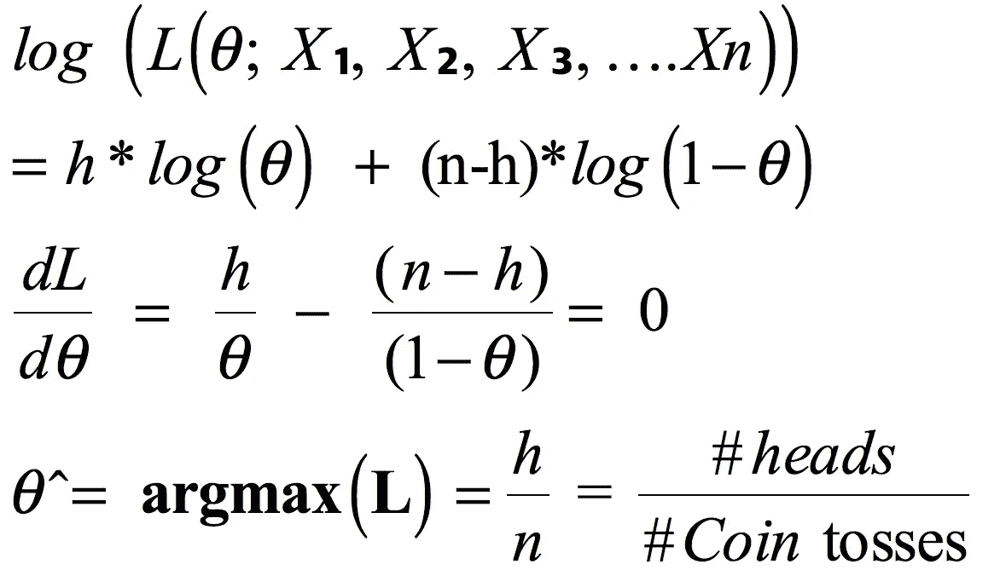

# 正面还是反面:板球投掷硬币的参数估计

> 原文：<https://medium.com/analytics-vidhya/heads-or-tails-parameter-estimation-for-coin-toss-in-cricket-2b846c4b3850?source=collection_archive---------12----------------------->


**Source — rediff.com:** 在印度(Virat Kohli)和南非(Faf du 普莱西)之间折腾

# 目标

这篇文章的目的是让读者了解一些流行的统计参数估计技术。帖子将依赖于板球比赛中发生的掷硬币作为实际应用，读者可以很容易地联系到这些案例。我以对话的形式写了这篇文章，并提到了中间的统计概念。人们可以根据兴趣选择跳过或阅读统计部分。

**情况**

到目前为止，南非板球队队长法夫·杜·普莱西已经连续 9 次掷硬币失败。他的下一场比赛是对印度，法夫·杜·普莱西正在计划他第 10 次投掷的策略。他不想再输了。以下是他脑海中出现的三个选项

*   他应该叫人头吗？
*   他应该叫反面吗？
*   既然他运气不好，他应该让别人来掷硬币吗？

关于他的困境，他咨询了 T4 的马克·鲍彻，他是球队的教练。

> **对话一:法夫·杜·普莱西和马克·鲍彻**

马克:我已经连续丢了 9 次球了。我不想失去第十个，成为被嘲笑的对象。请帮帮我？

马克:是的，我知道。处于这种状态很尴尬。顺便问一下，你在那 9 次投掷中叫什么？*【实际上玩家通常会根据自己的信仰选择正面或反面。】*

**Faf du 普莱西:**我是人头的信徒，每次都这么叫。

马克:那么在我看来，你应该在下一次掷硬币时坚持正面朝上。

T21:我很乐意，因为这是我的自然选择。但是你确定吗？

**标志:**其简单！！由“ ***平均律*** ”这么多尾后正面的几率更高。不过，让我检查一下我们团队的分析师，并听取他们的意见，但我建议头。

```
**Law of Averages**: the supposed principle that future events are likely to turn out so that they balance any past deviation from a presumed average.
```

> 对话二:马克·鲍彻和分析师之间的对话

现在假设你是团队中的分析师。马克向你寻求帮助，并告诉你他对下一次掷硬币时掷人头的看法。

你:马克，在连续九次掷骰子后，你认为下一次的结果可能是正面，这是统计学中我们称之为 ***赌徒谬误*** 的典型例子。因为掷硬币是独立的，所以第十次掷硬币是正面还是反面的概率不取决于前一次掷硬币的结果。对于一个无偏的硬币，它仍然是 1/2。**“平均法则”**是一个**神话**。一个比较恰当的规律叫做“[](/analytics-vidhya/law-of-large-numbers-vs-central-limit-theorem-7819f32c67b2)*”的大数定律。*

```
***Gambler's Fallacy**: It is the erroneous belief that if a particular event occurs more frequently than normal during the past it is less likely to happen in the future (or vice versa), when it has otherwise been established that the probability of such events does 
not depend on what has happened in the past.**Law of Large Numbers**: According to the law of large numbers, the average of the results obtained from a large number of trials should be close to the expected value and will tend to become closer to the expected value as more trials are performed.*
```

*马克:所以你是说 Faf 在第 10 次投掷中仍然有均等的机会得到正面或反面？这是什么垃圾？那他怎么可能连续九次都是反面呢？*

***你:**我理解你的关心马克。9 个连续的尾巴的概率(假设硬币是无偏的)是 1/2⁹ = 0.00195。这是一个非常非常小的数字，但仍然不为零。因此，在我看来，Faf 的运气真的很差。*

*马克:嗯，我尊重你的意见。不过，我告诉你一个秘密。我知道在之前的 9 场比赛中使用了相同的硬币。裁判在这场比赛中也可能会使用同样的硬币。有没有可能硬币是**装** ( **偏**)？*

***你:**有趣的观点标记。让我来回答你这个问题。*

# ***频率主义推断:仅基于观察数据的估计***

*你假设硬币装了未知概率的正面为θ ***。给定证据/过去的结果，我们的任务是提供关于θ的估计。****

*假设你掷硬币**【n】**次，得到正面**【h】**次。*

*现在的任务是在给定观测值的情况下找到最合适的θ值。一种方法叫做[最大似然估计](https://en.wikipedia.org/wiki/Maximum_likelihood_estimation) ( **MLE** )。*

*每次抛硬币都可以建模为参数为θ ***的伯努利分布。*** 观察我们观察到的结果的可能性表示为——*

**

*观测伯努利随机变量序列的似然性*

*我们需要找到使上述可能性最大化的参数θ̂ 。为了便于计算，我们可以将 log(L)最大化。我们可以这样做，因为对数是一个单调递增的函数。按照我们标准的微积分技巧，我们可以求导并使其等于零，以最大化对数似然。*

**

*真实但未知参数的 MLE 结果(在我们的例子中是正面的真实概率)。*

*因此，作为正面概率的真实参数(θ)可以被估计为在所有投掷硬币中观察到的正面的分数。这是一种直觉。尽管如此，我们还是用一种叫做 MLE 的流行技术证明了这一点。这就是通常所说的频繁点估计法。*

*θ̂极大似然点估计本身并不能给出太多关于θ的信息。特别是，没有额外的信息，我们不知道θ̂有多接近真实的θ。作为一名统计学家，我们能提供比点估计更多的信息吗？*

*我们实际上可以使用“[](/analytics-vidhya/law-of-large-numbers-vs-central-limit-theorem-7819f32c67b2)*”和θ̂一起提供一个置信区间(CI)估计。**

```
****Central Limit Theorem**: The Central Limit Theorem states that the sampling distribution of the sample means approaches a normal distribution as the sample size gets larger — *no matter what the shape of the population distribution*. This fact holds especially true for sample sizes over 30\.** 
```

**假设中心极限定理在我们的情况下是有效的，即使我们只有 9 个点，我们可以计算出 **95%** **置信区间**为—**

****

**伯努利参数的置信区间公式**

**在上面的公式中，我们假设未知的真实参数(θ)为 1/2，以便得到尽可能宽的置信区间。同样对于 95%的置信度，α的值= 0.05。我们可以参考正态分布表，将“Z”的值计算为 1.96。**

**在杜立石事件中，所有掷硬币的结果都是反面。因此，**

****

**正面的负概率在这里是没有意义的，因此我们将正面的概率报告为[0，0.327]**

> ****对话三:马克·鲍彻和分析师****

**你:马克，我做了一些计算，并考虑了你的假设，硬币可能是装的。我发现人头的真实**概率应该在 **0** 到 **32.7%** 之间。****

**马克:哇，看来我的猜测是对的。你确定吗？**

**没有什么可以用统计数据来确定，因为总是存在不确定性。但是，我可以有 95%的把握说，人头的概率在 0 到 32.7%之间。因此，有足够的证据相信你的假设，硬币是有偏见的。你应该向国际刑事法院提出这个问题。此外，Faf 应该在下一次掷硬币时叫**反面**，因为这种结果更有可能出现。**

```
****Hypothesis Testing and Confidence Interval**: One can perform hypothesis testing by computing the confidence interval of the unknown parameter. In this case - Null hypothesis (H0) = Coin is Unbiased (Probability of heads = 0.5)
Alternate hypothesis (H1) = Coin is biased (Probability of heads != 0.5)
Outcome = We reject the null hypothesis as p-value < 0.05**
```

****马克:**有意思，那么我会请 Faf 根据你的专家意见选择**尾巴**。我会考虑向 ICC 提出这个问题。但是，你必须绝对确定我会向 ICC 提出这个问题。因为这项指控，我们俩的工作都岌岌可危。**

****您:**请注意，针对人头的[0，32.7%]置信区间是仅考虑当前证据计算出来的。你能试着和我分享一下过去用同一枚硬币掷硬币的结果吗？如果你能给我提供一些历史资料，我可以加强我的信念。**

**马克:当然，我已经和团队核实过了。我只能得到通过同一枚硬币进行的 100 次投掷的结果。令我惊讶的是，这枚硬币的结果是 60 个正面和 40 个反面。**

****你:**伟大的马克，这改变了我们的一切。给我一点时间，我很快会带着我的最终判断回来。**

# ****使用贝叶斯推理更新信念****

**现在我们有了一些关于硬币的额外信息，可以提供一些关于未知参数θ的信息，这在统计术语中称为先验。在我们的例子中，先验的信念是正面的概率是 60/100 = 0.6。**

**我们需要以某种方式混合先验信息和可能性(这是在 9 次投掷硬币中观察到的结果)。可能性表示正面的概率为 0。**

**正如你可能已经猜到的，实际的答案可能介于先验和可能性之间，但是我们需要一个数学工具来计算它。**

*****贝叶斯定理*** 来拯救我们，因为它为我们提供了一种非常优雅的方式来结合先验和似然性。它用概率分布表示为:**

****

**其中 **f (θ|data)** 为参数θ的后验分布， **f(data|θ)** 为似然函数， **f(θ)** 为参数的先验分布， **f(data)** 为数据的边际概率。**

**出于实用目的，从上面取走的是`**posterior ∝ Likelihood * Prior.**`**

**在我们的例子中，我们可以将正面的真实概率建模为*分布，将可能性建模为二项式分布。β-二项式称为共轭对，它们可以一起很容易地模拟我们未知参数。这里的建模选择只是为了数学上的方便，但是也可以有其他的选择。***

```
*****Beta Distribution** -  The beta distribution is a family of continuous probability distributions defined on the interval [0, 1]. It is parametrized by two positive shape parameters denoted by *α* and *β.* It can be used to model an unknown parameter between 0 to 1\. Hence, it is colloquially known as distribution of distributions.***
```

****

**[贝塔-伯努利共轭对](https://en.wikipedia.org/wiki/Conjugate_prior)(SourcewWikipedia.com)的数学证明**

```
****Bayesian Model:****Prior** ∼ Beta(α, β);**Likelihood** ∼ Binomial(n, θ);
**Posterior** ∼ Beta(s+α, f+β)**Notation:**
s = # heads in the 9 tosses = 0.
f = # tails in the 9 tosses = 9.
α = #heads in prior information = 60
β = #tails in prior information = 40**
```

**在插入值后，我们的结果模型是:**

**`**Posterior** ∼ Beta(0+60, 9+40) ~ **Beta(60, 49)**`**

**在贝叶斯模型中，点估计可以通过计算分布的期望来计算。注意，在“*最大后验概率(MAP)】”的参数估计方式中，我们选择点估计作为分布的模式，因为它具有最高的概率密度。***

***可信集(CS)类似于频率主义框架中的置信区间(CI)。它们看起来相似，但解释不同。下面 snipped 为我们计算了点估计和区间估计—***

***用于查找可信集合并绘制后验概率的代码片段***

******

*****期望的**θ值或贝塔分布的平均值:***

*****E(θ)**= 60/(60+49)=**0.55*****

***该 beta 分布的 95 % **等尾可信集**以绿色阴影表示:***

*****CS 为θ~【0.4568，0.6423】*****

> *****对话四:马克·鲍彻和分析师*****

***你:嘿，马克，根据你提供给我的额外信息，正面的真实概率在 45.68%到 64.23 %之间，预期(平均)值为 55%。和往常一样，我对这些结果有 95%的把握。***

*****标记**:好的。所以正面的平均概率是 55%。你现在是不是颠倒了你的判断，说硬币是偏向正面的？到底是怎么回事？***

***根据你提供的额外数据，正面的真实概率应该在 45.68%到 64.23%之间。这个范围包括 50%的正面概率，这意味着硬币仍然可以是无偏的。本质上，没有足够的证据表明硬币偏向于任何结果，所以我们不能就此与国际刑事法院交涉。***

```
***Null hypothesis (H0) = Coin is Unbiased (Probability of heads = 0.5)
Alternate hypothesis (H1) = Coin is biased (Probability of heads != 0.5)We fail to reject the null hypothesis since our 95% credible set contains 0.5, in frequentist world this is equivalent of stating that the p-value > 0.05*** 
```

***马克:抱歉，大部分我都不懂。你最后的建议是什么？***

***你:既然我们无法证明硬币是有偏差的，我就说 Faf 到目前为止只是运气不好。因此，也许他应该让另一个玩家来叫掷硬币。那个玩家想叫什么就叫什么。两者的可能性都是一样的。***

*****马克:**好的确定。我会把这个传达给 Faf。谢谢您们。***

## ***摘要***

***在连续 9 个 ***尾*** 结果出来后，下面是与杜第 10 次掷球对阵维拉特·科利的选项？***

****

**团队分析师建议:代理队长**

**我希望你意识到以上所有的对话都是假设的。**

**然而，Faf du plessis 实际上带了一个代理队长(Temba Bavuma)和他一起进行第 10 次投掷，你猜怎么着——他还是输了。感兴趣的人可以看下面的折腾视频:**

**这只能说明，就算是杜倒霉也没别的事。*“这表明它不是命中注定的(用代理队长赢得掷币)”*杜在亚洲连续第 10 次掷币失败后说。**

**法夫·杜·普莱西加入了其他几个连续长时间输掉比赛的球员的行列。名单中包括格雷姆·史密斯和纳赛尔·侯赛因，他们分别输了 8 局和 10 局。**

****结论****

**板球的类比只是为了帮助你将上面的统计概念与真实的用例场景联系起来。这里涉及的技术适用于任何问题，只要我们有一些观测数据&一些先验的[可选的]，我们的任务是估计一个未知的参数。**

**最大似然估计是一种经常使用的技术，它只依赖于观测数据。贝叶斯估计考虑了先验，因此在我看来是一种更稳健的技术。请注意，虽然在 frequentist 框架中未知参数被视为固定常数，但在 bayesian 框架中它被视为随机变量。我们可以在上面的任何一个框架中执行点估计和区间估计，并将这些结果有效地解释给我们的业务人员。**