# 一小时内使用 PySpark 的健康推荐系统

> 原文：<https://medium.com/analytics-vidhya/health-recommender-system-aceb558ed487?source=collection_archive---------3----------------------->

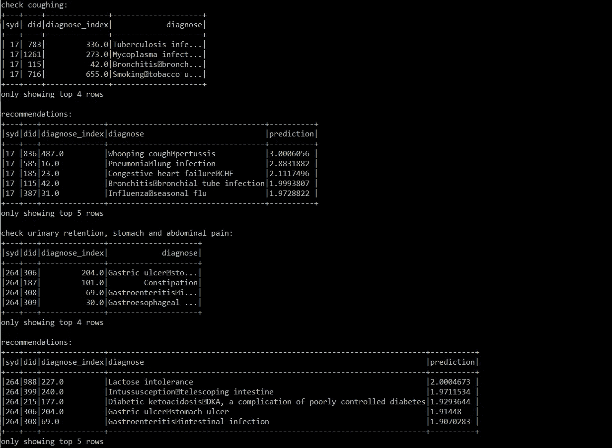

机器学习使组织能够利用现有数据来开发具有商业价值的模型，并做出更好的决策。机器学习中使用的技术之一是推荐系统。推荐系统是利用大量数据来利用数据的潜在模式和关系的强大方法。推荐系统的常见用例包括基于用户和其他类似用户过去的兴趣和偏好来确定向用户显示哪些广告、产品、电影、工作和项目。

有几种类型的推荐系统，即:

*   基于内容的遥感
*   基于流行度的 RS
*   基于粗糙集的关联规则挖掘
*   基于协同过滤的粗糙集
*   混合遥感

## 基于内容的遥感

基于内容的 RS 通过计算相似性分数，基于感兴趣项目与过去匹配用户简档的项目的相似性，基于感兴趣项目的相似性来进行推荐。这是通过为每个项目创建项目配置文件来实现的，最常见的是通过它们的属性。可以使用像欧几里德距离和余弦相似性这样的技术来确定相似性得分。

## 基于流行度的 RS

推荐系统最简单的入门方法之一，基于流行度的推荐系统根据每个项目的流行度进行推荐。因此，这意味着对所有用户的推荐是相同的。

## 基于粗糙集的关联规则挖掘

这些 RS 分析数据，以得出关联规则，并据此提出他们的建议。

## 基于协同过滤的粗糙集

协同过滤通过检查用户与项目的交互来实现。这可以是用户喜欢/观看/购买/观看的电影、产品和歌曲等。关键是基于物品交互确定最像当前用户的用户，并对最相似用户感兴趣的那些东西进行推荐。用户及其交互存储在用户项目矩阵中。

用户项目矩阵是稀疏的，因为大多数用户不会与项目交互，矩阵中的值通常表示反馈值。这些反馈值可以被明确地确定(例如通过让用户对电影、歌曲等进行评级)。)或隐含地(例如，基于用户观看和/或购买的项目来确定推荐哪些产品)。

两种类型的协同过滤是最近邻协同过滤和潜在因素协同过滤。最近邻协同过滤试图找到 k 个与当前用户最相似的用户，并通过预测用户喜欢推荐的可能性来进行推荐。推荐可以是基于项目的，也可以是基于用户的，在基于项目的推荐中，我们寻找 k 个最近的项目，在基于用户的推荐中，我们寻找 k 个最近的用户。

潜在因素协同过滤使用矩阵分解来分解用户项目矩阵，以创建两个较小的潜在因素矩阵。潜在因素的确定是通过 ALS(交替最小二乘法)等优化技术实现的。

## 混合遥感

混合推荐系统结合了各种 RS 技术来提出它们的预测。

# 健康诊断推荐系统

正在开发的系统将通过 RESTful API 公开协作过滤 RS。机器学习模型将利用潜在因素协同过滤，并使用 PySpark 使用 ALS 来实现。开发将包括多个步骤，即数据加载、特征工程、数据可视化、模型创建、模型测试和模型评估。

## 数据加载

数据由三个文件组成:一个包含症状并存储它们的 Id (syd)和名称(症状)。另一个包含诊断并存储它们的 Id (did)和它们的名称(diagnose ),而第三个包含症状-诊断稀疏矩阵，该矩阵包含症状 id (syd)、疾病 id (did)和症状-疾病权重(wei)。这三个文件都是 CSV 格式的。

首先，创建一个 spark 会话，然后加载每个文件中的数据。各种文件的前几个内容用下面的代码显示:

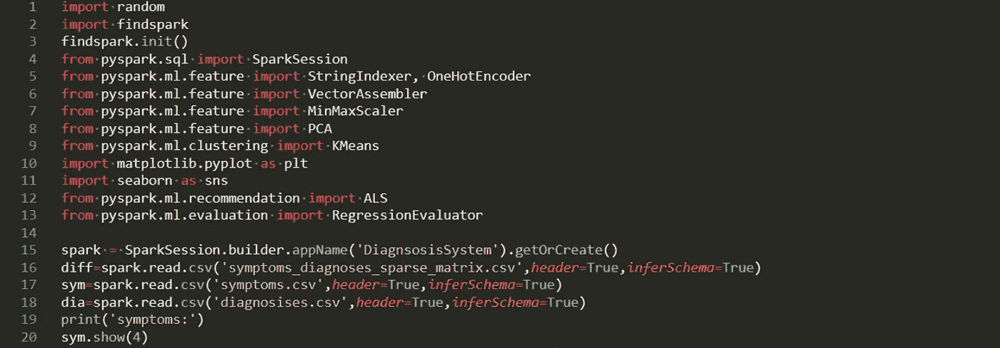

这会产生以下输出:

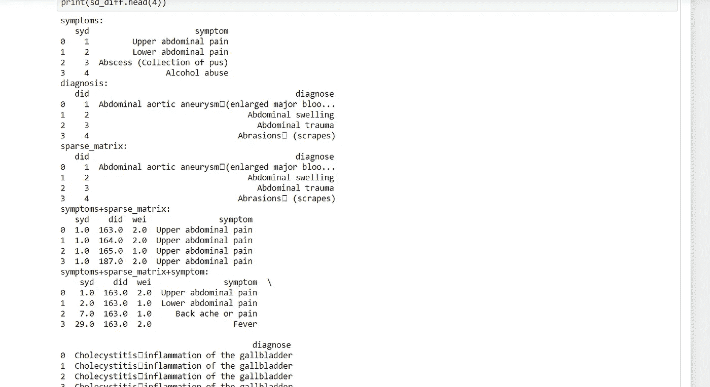

## 特征工程

特征工程关注的是特征提取和特征简化。特征提取我们关心将非数字数据转换成连续值。从数据中，我们需要转换症状和疾病名称。

首先，我们创建一个症状索引，对其进行编码并创建一个向量。疾病名称也是如此。这是通过如下方式实现的:

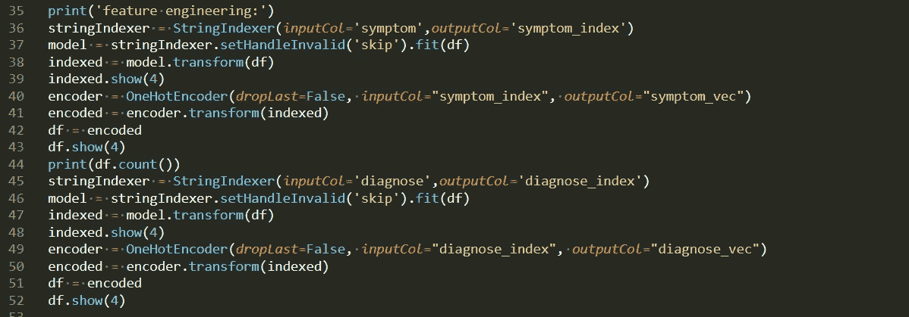

产生以下输出:

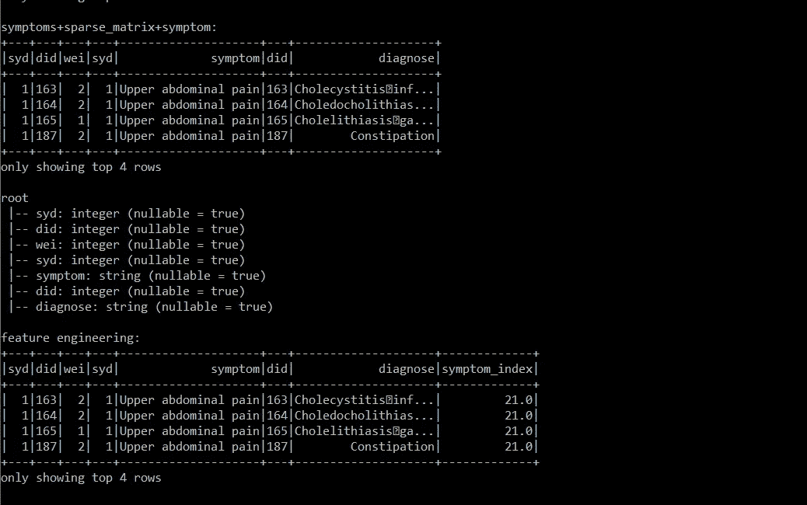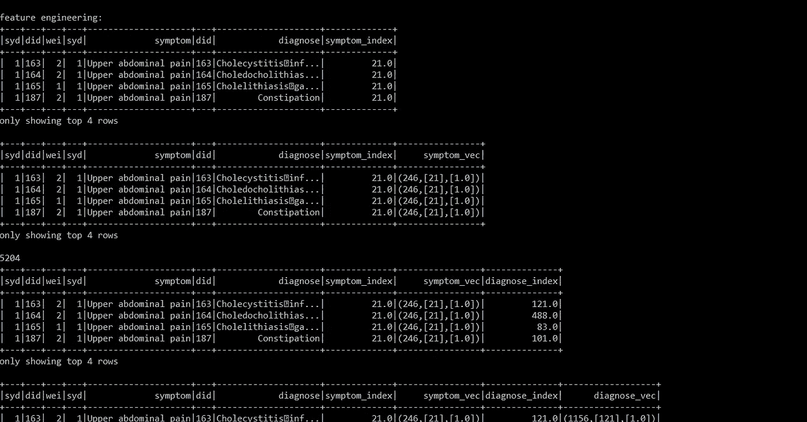

获得矢量后，通过缩放将它们标准化，并组合成如下所示的特征矢量:

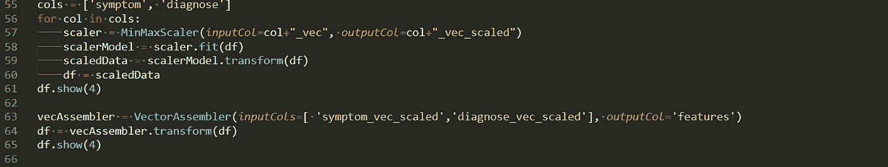

这会产生以下输出:

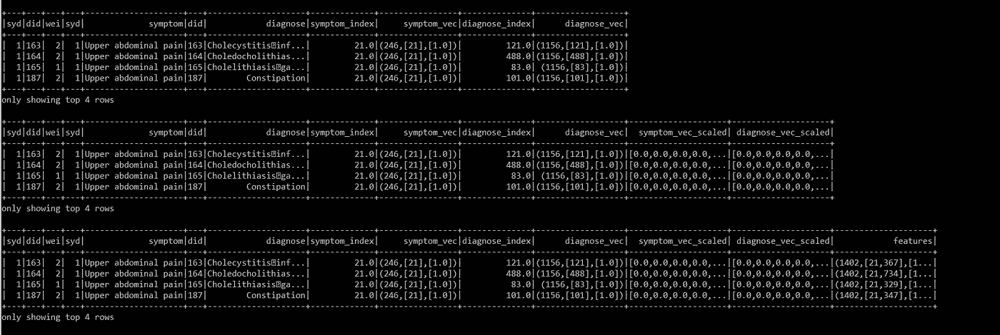

聚类是按顺序应用的，导致添加了一个预测列，如下所示:

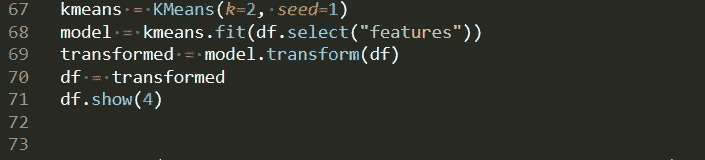

这会产生以下输出:

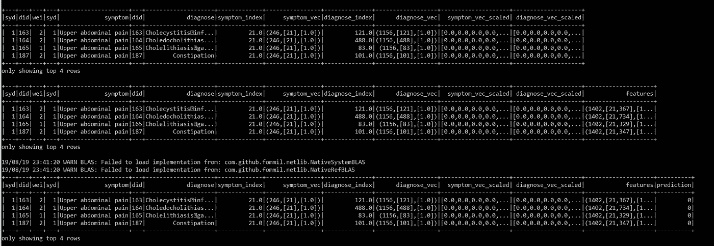

然后，使用主成分分析(PCA)对特征进行特征约简，以使数据更容易可视化。

## 数据可视化

然后可以将数据可视化为探索性数据分析(EDA)的一部分。特征约简使人们能够在 2D 上表示高度复杂的数据，这有助于确定数据中包含的模式和趋势。这可以通过如下方式实现:

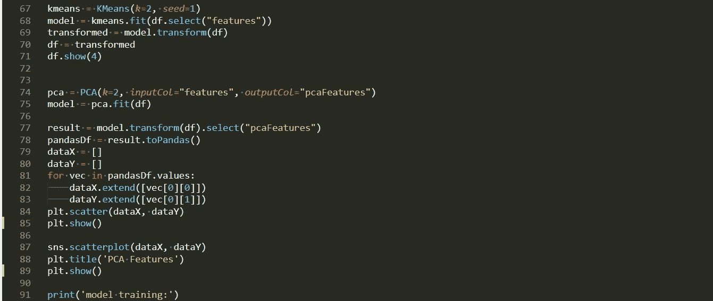

它会产生以下输出:

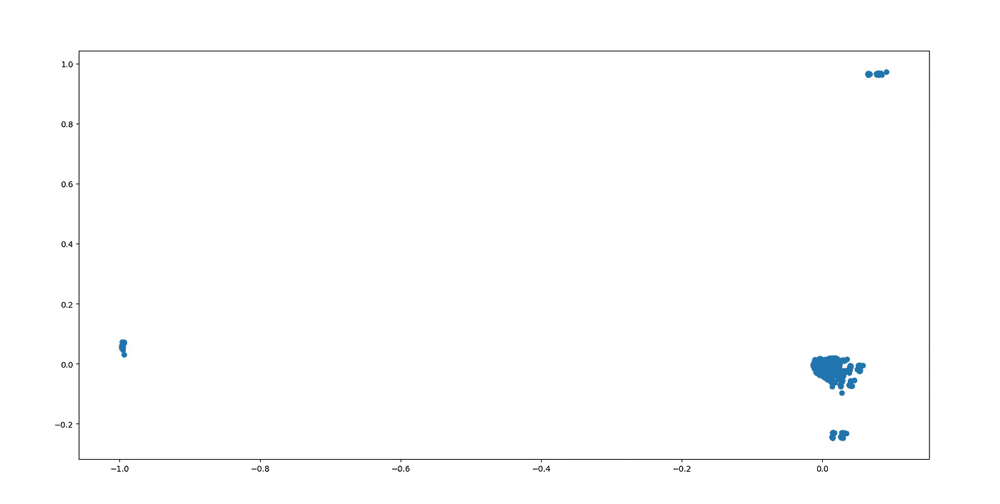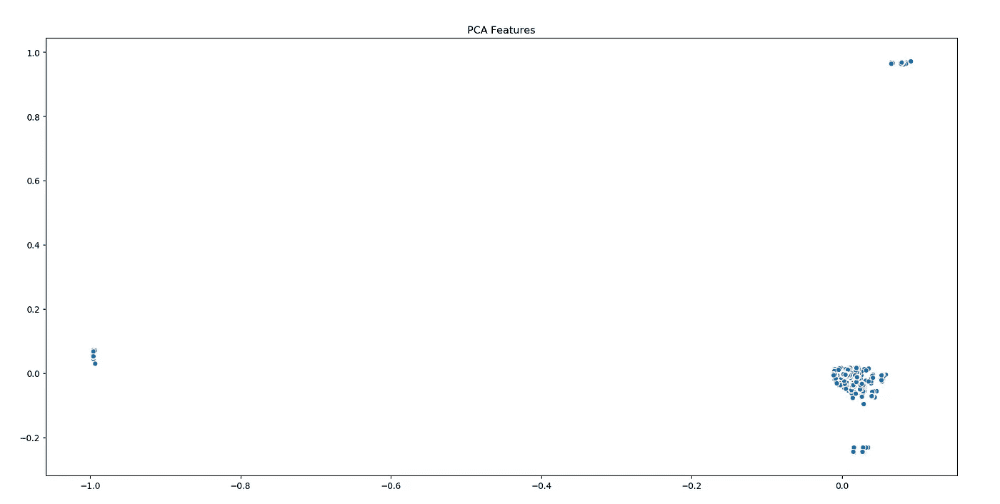

可视化清楚地显示了不同的集群，这是在疾病的不同性质、受影响的生理系统和表现出的症状的情况下所期望的。

## 模型创建

对于模型创建，分类后添加的预测列被删除，数据集被拆分为定型数据集和测试数据集。利用 ALS 的推荐器用于创建模型，然后在训练数据集上训练该模型，如下所示:

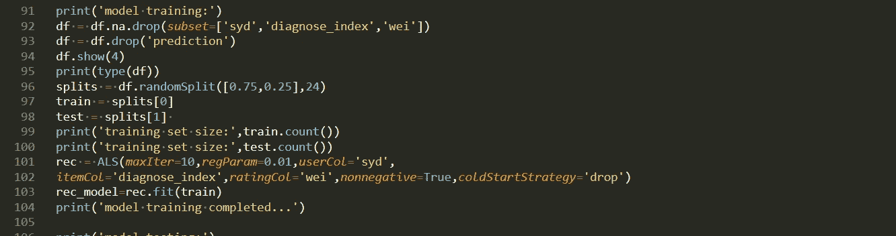

## 模型测试和评估

使用测试数据对模型进行测试，并使用均方根误差(RMSE)对模型做出的预测进行评估，如下所示:

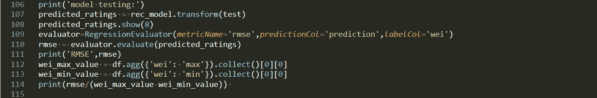

RMSE 为 0.81886，模型训练和测试的输出如下所示:

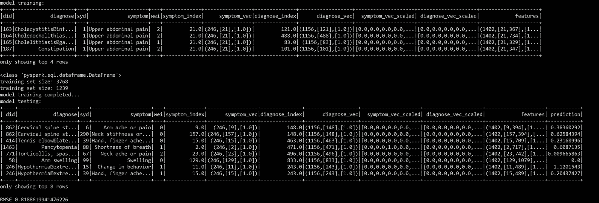

## 获得建议

在这种情况下，建议将是给定症状的疾病诊断。健康护理人员可以使用这些建议缩小可能性，或者使用这些建议进一步通知决策制定。这是通过提供症状 id 和检查推荐的疾病来实现的。该模型的应用示例如下所示:

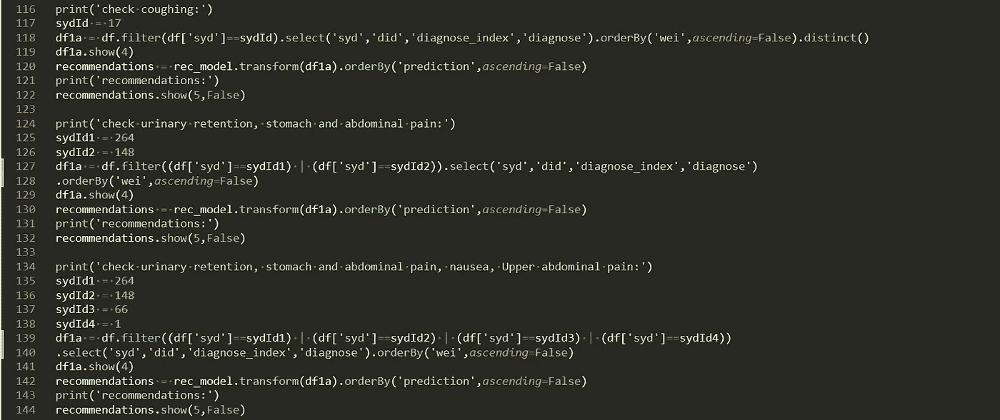

这会产生以下输出:

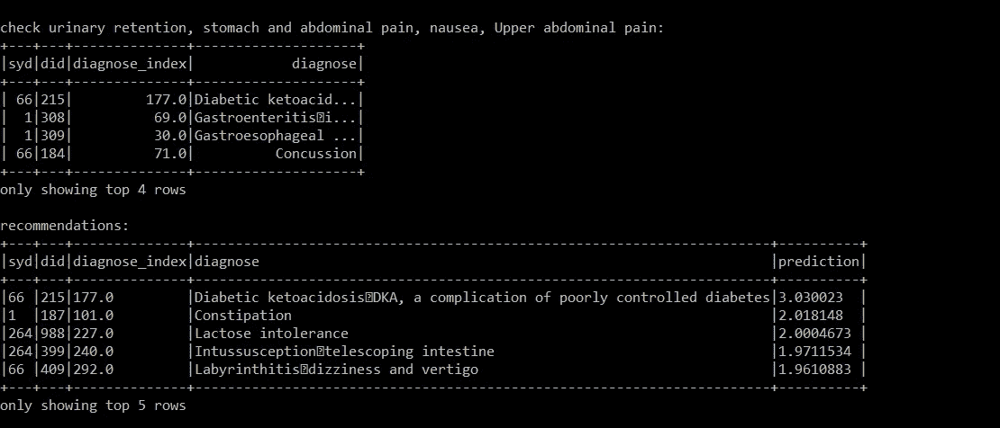

下一步是创建一个 RESTful API，通过 API 调用访问模型。

感谢您的参与，敬请关注。