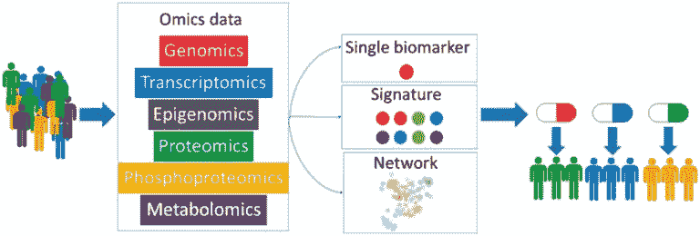
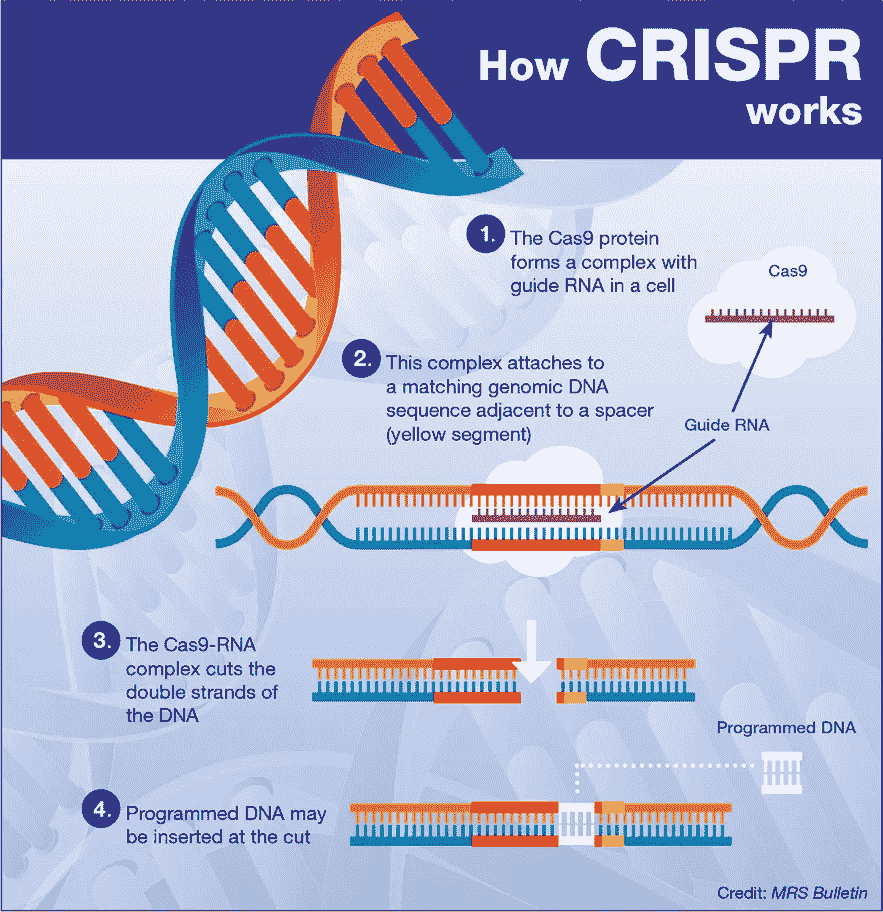

# 面向个人的医疗保健人工智能

> 原文：<https://medium.com/analytics-vidhya/healthcare-ai-for-individuals-b83080ace621?source=collection_archive---------31----------------------->

> “所以我们需要两件事:第一，我们需要在疾病威胁生命之前预测和检测疾病的方法；其次，我们需要对你和你独特的身体有效的药物。”
> 
> ― **彼得·柯利斯，** [**个性化医疗革命:如何诊断和治疗疾病将永远改变**](https://www.goodreads.com/work/quotes/40096692)

研究一个特定生物体的所有基因组或成套基因被称为基因组学。比方说，你决定做一道新菜，并阅读了使用说明书。指导手册就像我们的遗传密码，指导细胞以特定的方式运作。对说明书的研究被称为基因组学。作为一个可以读取细胞工作方式的领域，可以帮助解决人体面临的巨大问题。预计到 2025 年，全球基因组市场规模将达到 276.1 亿美元。预计在预测期内，CAGR 将以 8.6%的速度增长。由于基因组学和个性化医学的同步发展，过去几十年目睹了疾病管理过程中的重大变化。基因组研究在临床实践中的使用逐渐增加，这反映在靶向治疗的增长趋势上。

基因组学作为一个领域产生了大量用于研究和开发的数据。人工智能(AI)在这个研究领域非常有价值，因为它加快了从信息到洞察力的时间。有了正确的实现技术和数据目标，机器学习模型可以帮助创造重大突破。基因组学作为一个领域对技术来说并不陌生，并且已经利用这项技术取得了突飞猛进的进展。

# 精确医学

人工智能已经大大降低了测序的成本，并且必将进一步降低成本。随着我们向前发展，人工智能的使用有助于促进每个人都能获得精准医疗。根据精准医疗倡议，精准医疗可以定义为“一种考虑到每个人的基因、环境和生活方式的个体差异的疾病治疗和预防的新兴方法。”

[https://amitray . com/人工智能-精密-医学/](https://amitray.com/artificial-intelligence-precision-medicine/)

随着数据集数量的增加，医疗保健行业可以利用我们基于人工智能的系统中的快速计算技术。代替治疗一般症状，人工智能可以帮助医学转向预防，个性化，并最终实现精确医学。这将有助于个体的药物治疗，并有可能在全球范围内平均延长一年的寿命。随着数字化的到来，该行业邀请医疗保健专家和数据科学专家来创建新颖的解决方案。

例如， [CRISPR](https://singularityhub.com/2018/01/09/gene-therapy-had-a-breakthrough-2017-2018-may-be-even-better/#sm.0001xjg89izyzd6bx8f1d051qn0ai) 是一种基因编辑技术，用于精确定位 DNA 序列。有了这个，医学专家可以故意激活或抑制人类的某些基因。这表明，有一个强大的能力，针对一个人的独特的分子和基因概况，从而开辟了个性化医疗的新机会。

[https://www . Cambridge . org/core/journals/Mrs-bulletin/news/crispr-implications-for-materials-science](https://www.cambridge.org/core/journals/mrs-bulletin/news/crispr-implications-for-materials-science)

我想用一个简短的观察来结束我的发言，精准医疗不会是医疗保健人性化的最后一站。一个与人的生命打交道的行业总是需要人的干预。精准医疗将降低药品成本，为全人类提供更好的生活服务。接下来的几篇博客将关注在基因组学和精确医学中实现人工智能的多个使用领域和技术。