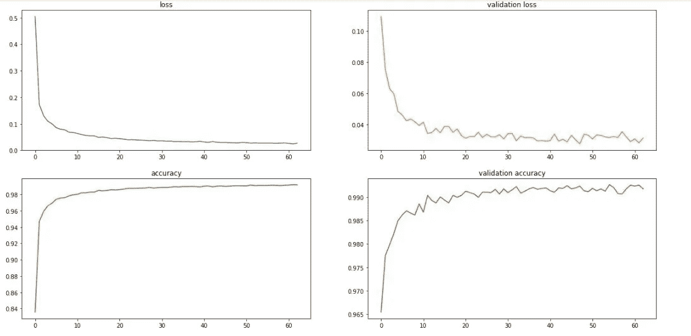

# 听听你模特的训练

> 原文：<https://medium.com/analytics-vidhya/hear-your-model-train-30bcde8287c9?source=collection_archive---------32----------------------->

听听你的模特想对你说什么..哈哈！


这个星球上每个对数据科学感兴趣的人都会用 python 中的一个图形来可视化模型训练，如下所示



MNIST 模型的训练图

但今天早上我有一个荒谬的想法，“为什么不听听你的模型训练，看看它是否过度训练了”。所以这篇文章引导你去理解我的荒谬想法:用很少的步骤就能听到你训练过的模型。它实际上是我计划制作的第一个 python 库的第一个模块。希望这能引起你的兴趣

这是一个验证损失和准确性与训练损失和准确性的例子

验证准确性

验证损失

准确(性)

失败

步骤 1:训练模型:


模特培训

例如，在这里，我正在为 MNIST 数据集训练一个简单的模型，并使用 Tensorflow 中 build 中的回调函数将数据[损失+准确性数据]记录到 CSV 文件中

第二步:倾听你的模型

如果你需要更多关于如何训练模特的细节，请参考我之前的帖子:

[](/analytics-vidhya/visualizing-convolution-neural-network-the-hidden-truth-c825d69f1832) [## 可视化卷积神经网络[隐藏的真相]

### 对计算机视觉、深度学习感兴趣的人，这可能很有见地

medium.com](/analytics-vidhya/visualizing-convolution-neural-network-the-hidden-truth-c825d69f1832) 

现在，您已经准备好将模型历史记录转换成 CSV 文件，让我们为听力构建代码

```
import pandas as pd
import numpy as np
from scipy.interpolate import interp1d
import sounddevice as sd
from math import pi
from scipy.io import wavfile
```

1.  熊猫用于读取包含训练信息的日志文件
2.  用于为音频生成余弦值的数字
3.  Interp1d 用于将数据映射到频率范围
4.  听余弦值的声音装置
5.  使用圆周率值的圆周率[3.14……]
6.  Wavfile 用于以 wave 格式保存音频

```
MAX_DURATION=0.15
MIN_VAL,MAX_VAL = 1000,3000
SAMPLING_RATE = 22050
```

我们设置音频文件的采样率，我们想要听到的最小和最大频率范围，以及听到特定频率的最大持续时间

```
df = pd.read_csv('model_log.csv')
l=df['loss'].values
```

我们现在读取 CSV 文件，为了举例，我们读取模型训练的每个时期的损失值

```
m = interp1d([min(l),max(l)],[MIN_VAL,MAX_VAL])
list_of_f = [m(x) for x in l]
x=[]
t=np.arange(0,MAX_DURATION,1./SAMPLING_RATE)
```

其中 m 是 interp1d 类的对象，用于将我们的损耗值映射到前面提到的频率范围。list comprehension 用于使用对象 m 映射所有值。初始化一个空数组以附加音频文件的每个频率的结果。t 是时间为 0.15 秒的每个频率的平均间隔值的 nd 数组

```
for f in list_of_f:
    cos_wav=10000*np.cos(2*pi*f*t) #generated signals
    x=np.hstack((x,cos_wav))

wavfile.write('loss.wav',SAMPLING_RATE,x.astype(np.dtype('i2')))
```

现在，我们为特定时间范围内的每个频率生成 cos 波，并添加或堆叠到列表中，最后保存音频文件。你可能在想什么是 np.dtype('i2 ')，它实际上是将 int64 值转换成波形文件可以理解的 i2 格式，否则你可能会出错

请参考此 StackOverflow 帖子，了解可能发生的错误:

[](https://stackoverflow.com/questions/10558377/wav-file-doesnt-play-any-sounds) [## 。wav 文件不播放任何声音

### 感谢贡献一个堆栈溢出的答案！请务必回答问题。提供详细信息并分享…

stackoverflow.com](https://stackoverflow.com/questions/10558377/wav-file-doesnt-play-any-sounds) 

```
import IPython.display as ipd
ipd.Audio('loss.wav')
```

这是你在 Jupyter 笔记本上播放文件的方法。

现在对日志文件中的所有参数重复这些步骤

我希望你喜欢这篇文章。如果你觉得很有见地，请分享

