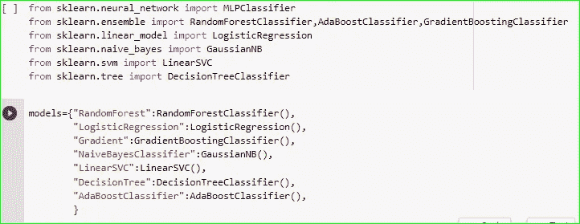
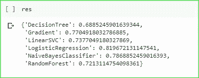
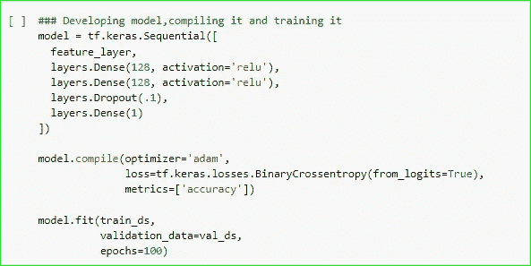
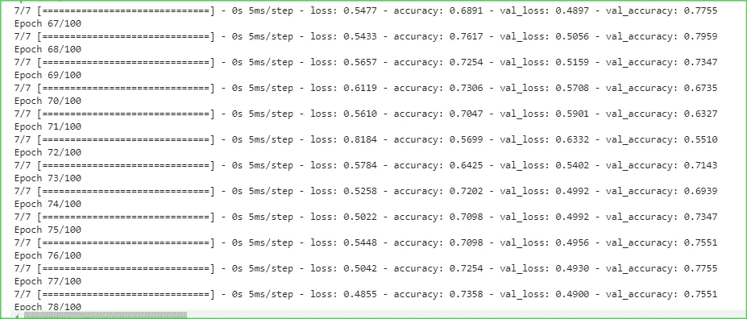

# 心脏病分类(经典算法与神经网络)

> 原文：<https://medium.com/analytics-vidhya/heart-disease-classification-classical-algorithms-vs-neural-networks-43b8f1a6902?source=collection_archive---------26----------------------->

好吧，好吧，伙计们..使用结构化数据的心脏病分类。

对于我使用的“经典算法和神经网络”这个主题，听起来可能有些难以理解，但实际上并没有你想象的那么难。

这篇文章是关于使用经典算法和神经网络进行心脏病分类的比较。

> 经典方法是使用来自 sklearn(分类算法)和神经网络的算法来建立深度学习模型。

所以，伙计们，让我们开始吧。

# **古典方法**

首先，让我们从经典算法开始，你们可能很熟悉。

首先，我试验了 7 种机器学习算法:

我来自 googlecolab 的代码

伙计们，我实际上没有在这里深入提到数据集和预处理部分，但我想承认数据集来自 kaggle。

 [## 心脏病 UCI

### https://archive.ics.uci.edu/ml/datasets/Heart+Disease

www.kaggle.com](https://www.kaggle.com/ronitf/heart-disease-uci) 

关于我的整个笔记本，你可以在本文末尾查看，我在那里放了我的 github 资源库的链接，你也可以在你自己的本地 PC 上运行它。

所以，回到我们的经典算法，我得到的结果是:

**使用的指标是 model.score()。**

在这里，你可以看到结果，这是很好的，因为它比只是猜测，对不对？顺便说一下，这篇文章是关于比较经典算法和艺术状态(神经网络)的，所以，现在让我们看看当我使用深度学习方法时实际发生了什么。

# **神经网络方法**

预处理和模型构建是一种不同的方法，您可以在下面的代码中看到。

如果你不能理解代码，你可以一行一行地运行，自己破译。而且我还会链接 tensorflow 教程帮助你理解代码。

好了，朋友们，我刚刚在文章中添加了培训和模型构建片段，因为在这篇文章中放入所有代码对你们来说太多了。在这篇文章中，我们只是对同一问题的经典算法和神经网络方法进行比较。所以，如果你想看完整的代码，可以去我放了 github 库链接的文章末尾的链接。

# 比较:

因此，在比较了这两种模型之后，我得出的结论是，对于结构化数据，使用神经网络不一定会带来更高的准确性或更好的指标。对于结构化数据，我认为 sklearn 的经典算法是最好的方法，因为深度学习中的预处理既复杂又耗时。只是因为深度学习被炒作的这么厉害，并不一定在机器学习的每一个环节都带来正面效应。你可以在上面看到这两种方法的准确性。

是的，正如我所说的，去这个链接看看我的 github 上的全部代码。

 [## anjan pa/分类-项目-心脏病-分类

### permalink dissolve GitHub 是超过 5000 万开发人员的家园，他们一起工作来托管和审查代码，管理…

github.com](https://github.com/anjanpa/CLASSIFICATION-PROJECT-Heart-Disease-Classification/blob/master/Heart_disease_classification_using_neural_network.ipynb) 

如果你仍然对理解代码感到困惑，请阅读 tensorflow 的教程。

 [## 使用特征列对结构化数据进行分类| TensorFlow 核心

### 本教程演示了如何对结构化数据进行分类(例如 CSV 中的表格数据)。我们将使用 Keras 来定义…

www.tensorflow.org](https://www.tensorflow.org/tutorials/structured_data/feature_columns) 

谢谢各位对我的包容。感谢您阅读这篇文章。

是的，我希望看到你尽快建立一个伟大的 ML 模型。

哦…是的，提前感谢你为我的文章鼓掌并关注我😂😂😂。