# 心脏病分类器

> 原文：<https://medium.com/analytics-vidhya/heart-disease-classifier-922495b8cf7b?source=collection_archive---------10----------------------->

心脏病是健康领域的常见疾病，它影响着一个人的生活，在这篇文章中，我们希望预测患者是否患有心脏病。

在我们开始这个项目的步骤之前，我们需要确定我们有什么问题。我们的问题是一个二元分类，我们需要对心脏病患者和非心脏病患者进行分类，这种情况非常严重。所以，基于我们的问题特点，我选择了两个机器学习模型(Logistic 回归和 LinearSVC)进行分类。我决定用三个指标来评估这些模型的性能，它们是精确度、召回率和混淆矩阵。

我们有五个步骤来构建这个项目，如下所示:

1.数据收集和加载

2.数据探索

3.数据清理和预处理

4.构建 ML 模型

5.结果

# 1.数据收集和加载

我使用了来自 Kaggle 的心脏病数据集，你可以通过这个[链接](https://www.kaggle.com/ronitf/heart-disease-uci)来访问它。

该数据集有 14 列，如年龄、性别、胸痛类型、目标患者是否患有心脏病等。

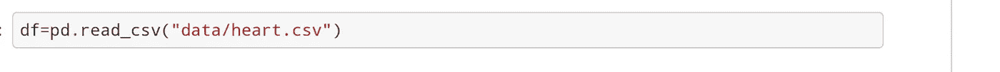

图 1:加载数据集

# 2.数据探索

在这一步中，我发现了数据集并获得了关于它的更多信息。

发现对我们分类病人很重要的目标变量。

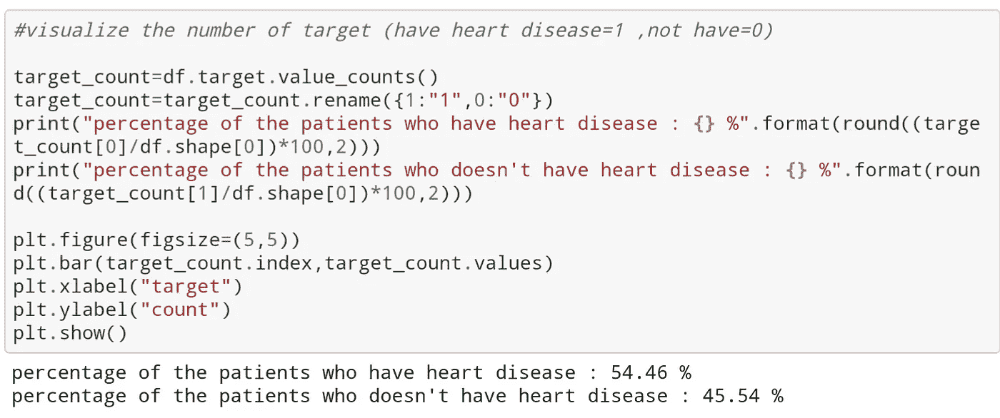

图 2:每类患者的百分比

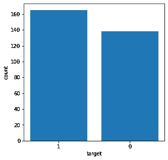

图 3:每个班级的病人数量

如上所示，我们有不平衡的数据，我们有 54%的输入(患者)有心脏病，45%的输入没有。

# 3.数据清理和预处理

在这一步，我检查数据是否有缺失值，是否有重复值，找出变量之间的相关性，在这一过程的最后一步，我将分类变量转换为虚拟变量。

**3.1。检查我们是否有丢失的值**

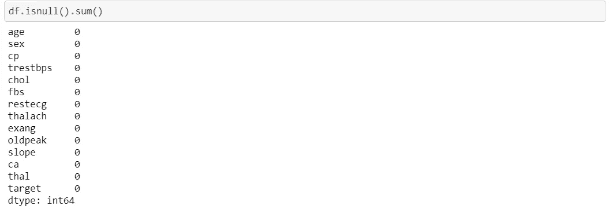

图 4:显示每一列缺失值的数量

如上所示，我们没有任何缺失值，因此我们将进入下一步。

**3.2。检查我们是否有重复的值**

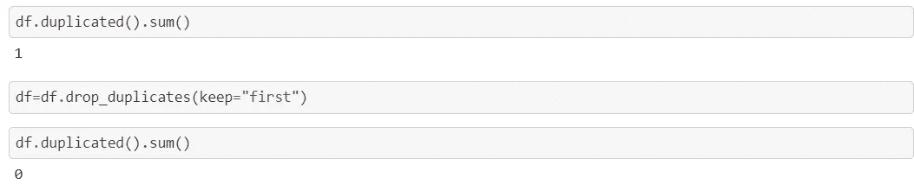

图 5:显示重复值的数量并删除它

我们有一行重复，我决定删除它。

3.3 .可视化变量之间的相关性

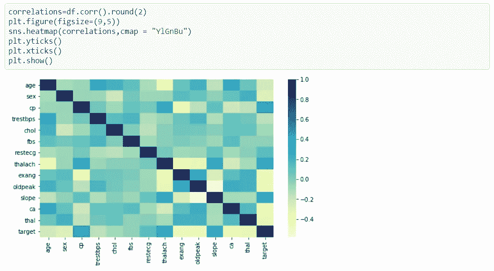

图 6:特性热图

我们关心的重要列是目标列，根据热图，目标列与 slop、thalach 和 cp 呈强正相关，与 ca、exang、thal 和 oldpeak 呈强负相关。因此，我将选择这些变量来构建我们的模型。

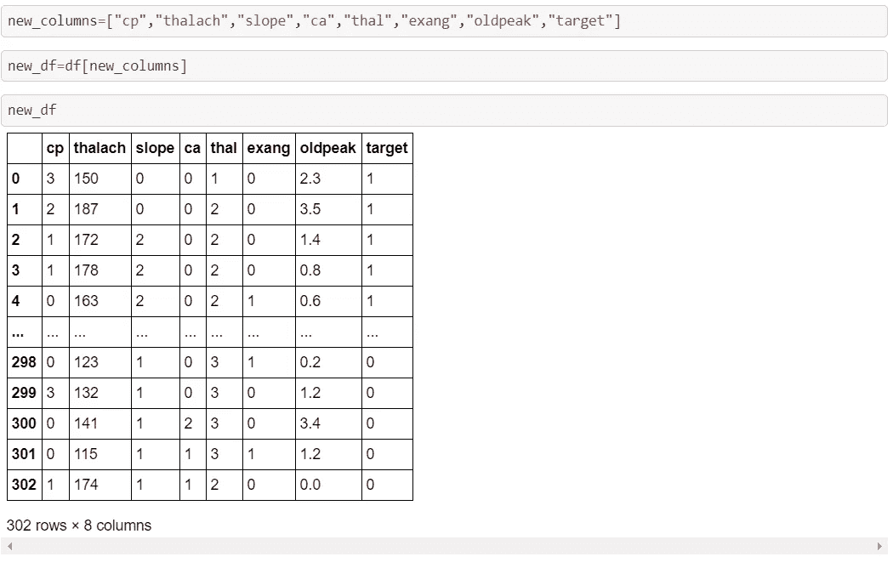

图 7:特性选择

## 3.4 .将分类变量转换为虚拟变量

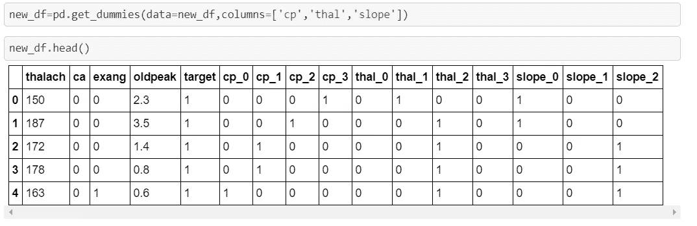

图 8:将分类变量转换成虚拟变量

我们有三个分类变量，我们需要在建立模型之前转换它，我们注意到我们有一系列变化很大的值，我们需要缩放它。

# **4。构建 ML 模型**

在这一步中，我决定使用网格搜索技术运行两个模型(LogisticRegression 和 LinearSVC)来优化超参数。

在每个管道中，我们需要使用 StandardScaler 来缩放功能，我决定采用两个参数，我们需要使用网格搜索技术来调整模型。

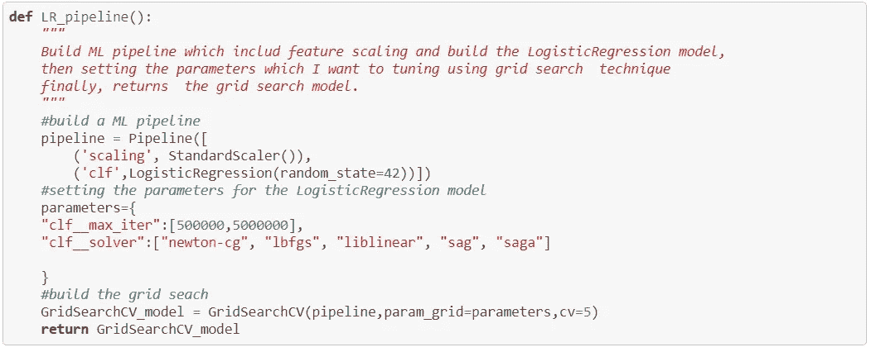

图 9:物流回收管道

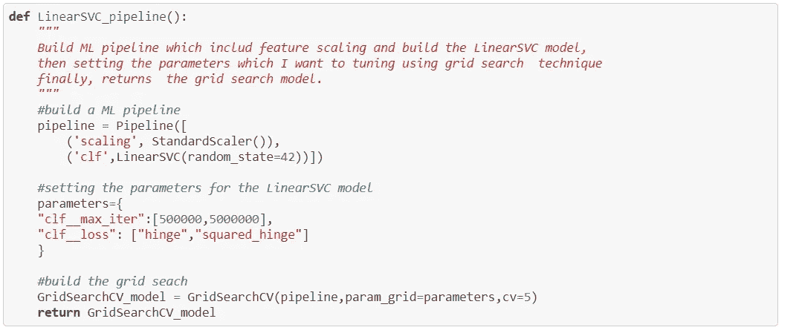

图 10: LinearSVC 管道

在我们建立了两条管道之后，我们就可以训练模型了。

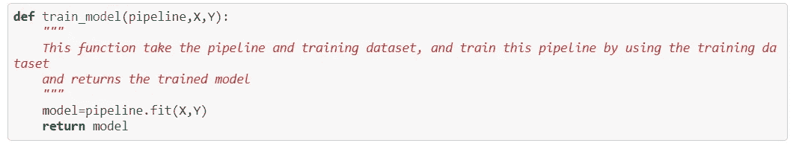

图 11:训练模型

现在，使用精度和召回来评估模型

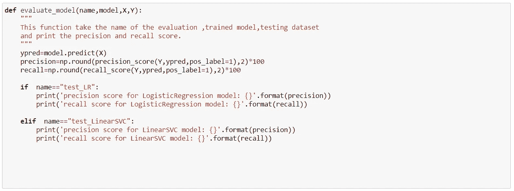

图 12:评估模型

最后，运行管道并返回训练好的模型。

在这一步中，我将新数据集分为训练集和测试集，然后训练模型，评估它，并返回训练好的模型。

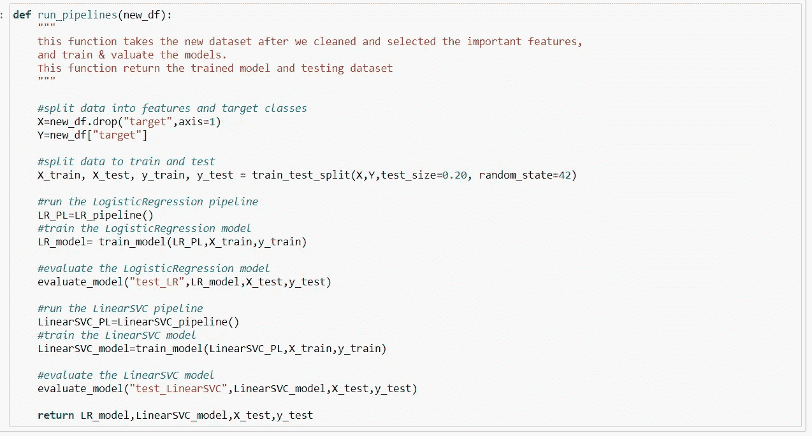

图 13:运行管道

# 5.结果

在此步骤中，运行管道并显示每个模型的精度和召回分数，然后返回带有测试数据集的已训练模型。最后，绘制每个模型的混淆矩阵。

**5.1** 精度和召回分数

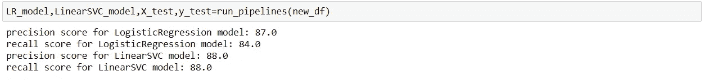

图 14:使用精确度和召回分数评估两个模型

我们注意到 LinearSVC 模型中最高的精确度和召回分数。

**5.2 .混淆矩阵**

**5.2.1 .逻辑回归模型的混淆矩阵**

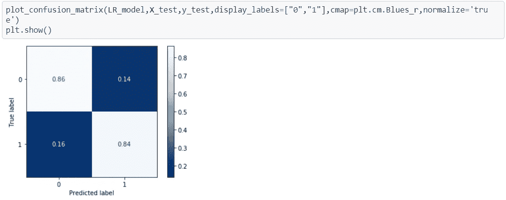

图 15:逻辑回归模型的混淆矩阵

**5.2.2 .线性 SVC 模型的混淆矩阵**

图 16:线性 SVC 模型的混淆矩阵

我们注意到，LinearSVC 模型的真阳性率约为 88%，相比之下，逻辑回归的真阳性率为 84%，而 LinearSVC 的假阴性率约为 12%，相比之下，逻辑回归的假阴性率为 16%。

**5.3 选择最佳型号和参数**

我决定选择 LinearSVC 模型，因为我们获得了最佳的精确度和回忆分数，特别是对于这个问题(心脏病)，我们专注于患有疾病的患者，而分类器将其分类为没有患病。我们注意到，LinearSVC 的混淆矩阵有 12%的假负值，而 LogisticRegression 的假负值是 16%。因此，我们可以使用 LinearSVC 作为这个问题的分类器。

现在，我们可以显示具有最佳参数的最佳模型。

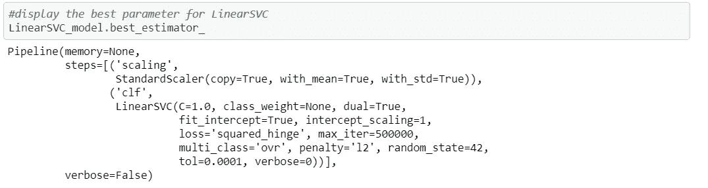

图 17:显示最佳模型

# 结论

在这篇文章中，我们建立了一个心脏病分类器。我们经历了数据科学过程的几个步骤，我们使用了来自 Kaggle 的心脏病数据集，包括我们需要它进行分类的 14 列，我们探索了数据集、数据清洗和预处理，以准备我们的数据集来训练模型，然后我们使用两个 ML 模型并用适当的指标对其进行评估，并基于它选择最佳模型。

处理小数据集非常具有挑战性，因为它会影响模型的性能，我试图选择相关的特征以避免过度拟合，从而获得最佳性能。

最后，我有一些建议来提高这个模型的性能，例如检测异常值，使用技术来处理不平衡的数据集，如过采样技术。