# 心脏病预测

> 原文：<https://medium.com/analytics-vidhya/heart-disease-prediction-e5e7da2325e7?source=collection_archive---------10----------------------->


在过去的几十年里，心脏病是全世界发达国家、不发达国家和发展中国家最常见的死亡原因。心脏病的早期发现和临床医生的持续监督可以降低死亡率。然而，在所有情况下精确检测心脏病和医生 24 小时咨询病人是不可行的，因为这需要更多的智慧、时间和专业知识。

医疗保健行业也不例外。机器学习可以在预测心脏病的存在/不存在等方面发挥重要作用。如果提前预测，这些信息可以为医生提供重要的见解，然后医生可以针对每个患者调整他们的诊断和治疗。

在这篇文章中，我将讨论一个项目，在这个项目中，我使用机器学习算法来预测人们的心脏病。通过考虑年龄、性别、疼痛部位、疼痛程度、血压、身体质量指数等..

在这篇文章中，我将讨论一个项目，在这个项目中，我使用机器学习算法来预测人们潜在的心脏病。这些算法包括`K Neighbors Classifier`、`Naive Bayes Classifier`、`Support Vector Classifier`、`Decision Tree Classifier`和`Random Forest Classifier`。数据集取自 [**Kaggle**](https://www.kaggle.com/harikajds/disease-prediction) 。我的完整项目可在 [**心脏病预测**获得。](https://github.com/EpuriHarika/Heart-disease-prediction)

让我们深入研究一下这个预测..

首先，导入库，然后，我导入所有必要的机器学习算法。

## 导入库

导入数据集，在进行任何分析之前，我只想看一看数据。所以，我用了`info()`的方法。

在这里，对于 **X** 特征，我考虑了数据集中的列参数(即年龄、性别、疼痛部位、疼痛锻炼者、再休息、静息血压、吸烟、家庭 his 和最大心率)。因 **Y** 特征心脏病。

根据给定数据集中的心脏病计数绘制柱状图和相关图。

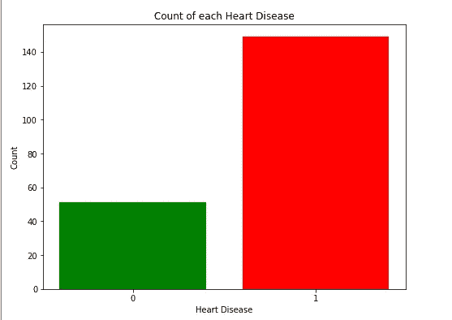

比较**心脏病**比值的柱状图

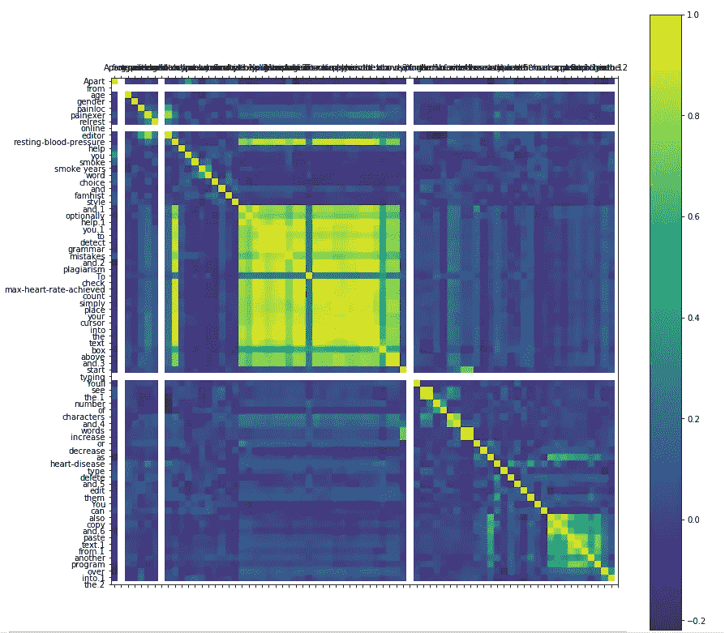

关联 Matshow 与给定数据集输出的颜色条

```
histogram = dataset.hist()
print("histogram")
```

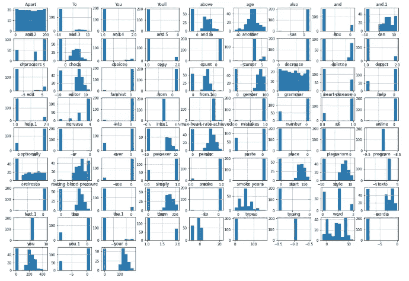

计算直方图

通过考虑 **X** 和 **Y** 的特征，对它们进行训练并拆分为 X_train、y_train、X_test 和 y_test。

**数据预处理**

这里我们需要**通过 **r** 对训练集进行采样来处理不平衡数据**..在将特征分成训练和测试数据，并使用 StandardScaler 进行一些特征缩放之后。

现在我们使用**机器学习算法**来预测车列数据

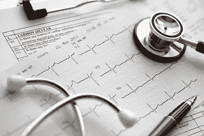

## 决策树算法

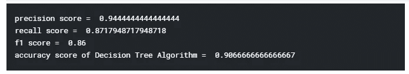

决策树算法的准确性

## KNN 算法

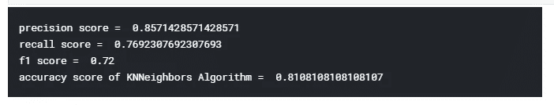

KNN 算法的精度

## SVM 算法

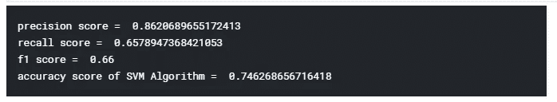

SVM 算法的精度

## 朴素贝叶斯算法

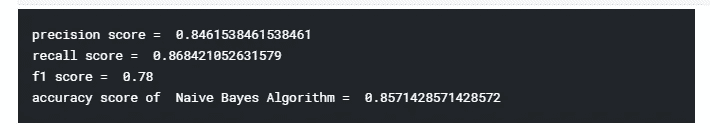

朴素贝叶斯算法的准确性

## 随机森林算法

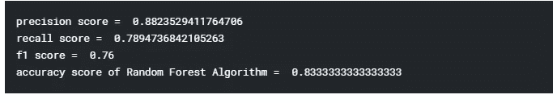

随机森林算法的准确性

# 精确度比较

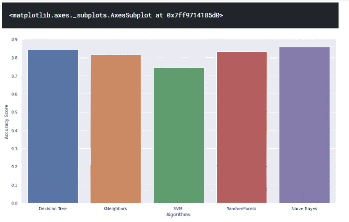

算法准确度分数比较

**主成分分析** ( **PCA** ) —是一种无监督、非参数统计技术，主要用于**机器学习**中的条件性减少。

我们需要做 **PCA** 用来过滤有噪声的数据集，比如图像压缩。第一个主成分表达了最大的方差。在这里，我编码过滤任何不平衡的数据。

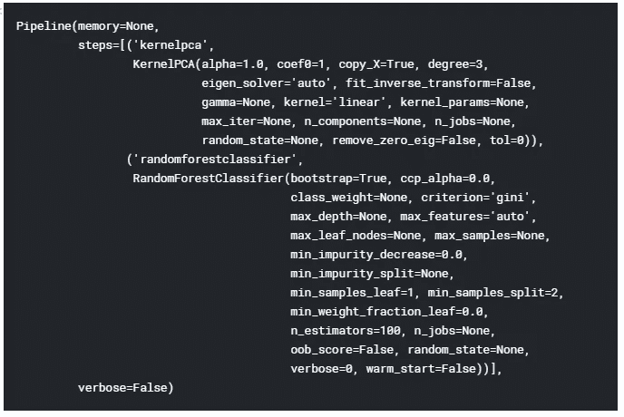

基于用户的输入列名(在代码中提到之前)相应地输入值。基于由训练数据集执行的预测，显示为结果输出。

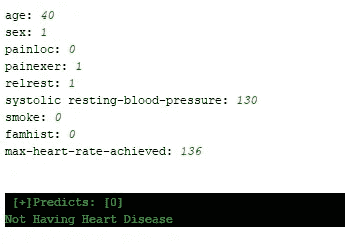

**无心脏病**显示用户输入值

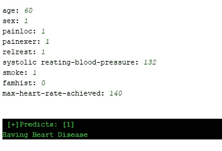

**心脏病**显示用户输入的数值

因此，预测是通过数据集的训练值和首选算法完成的。

这里是本文的[**Github**](https://github.com/EpuriHarika/Heart-disease-prediction)**Repo 链接，也可以在 Github 上查看我的其他[**NLP-concepts**](https://github.com/EpuriHarika/NLP-Concepts)**Repo**。******

******查看我上一篇关于文本分类的文章 [**这里**](/@harikajds/spam-detection-nlp-text-classification-637c2a706ba0)******

****这是我的 [**Kaggle**](https://www.kaggle.com/harikajds) 个人资料，可能对你们有所帮助。请务必在 [**【领英】**](https://www.linkedin.com/in/harika-epuri-121b7412b/)[**脸书**](https://www.facebook.com/harika.jds)[**insta gram**](https://www.instagram.com/epuriharika/)和**T**[**umb lr**](https://www.tumblr.com/blog/harikaepuri)**上与我联系。******

****希望你喜欢这篇文章。我欢迎您的评论和反馈。如果你喜欢这篇文章请鼓掌，快乐学习:)****