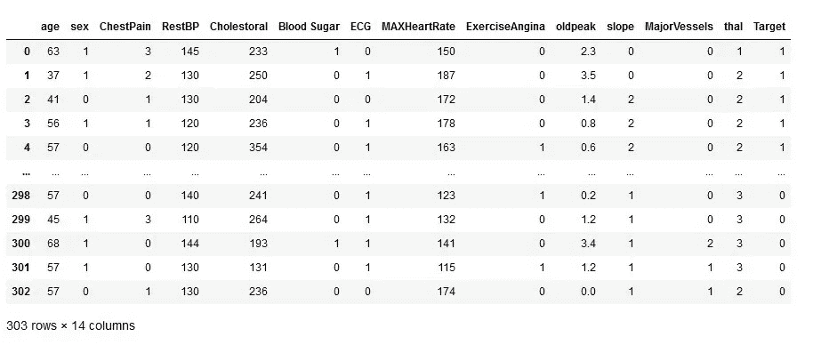
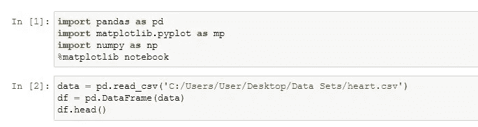
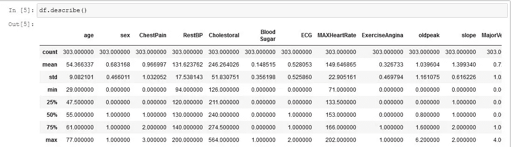
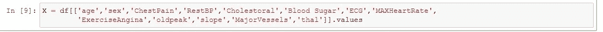
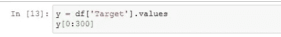
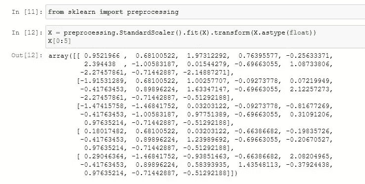
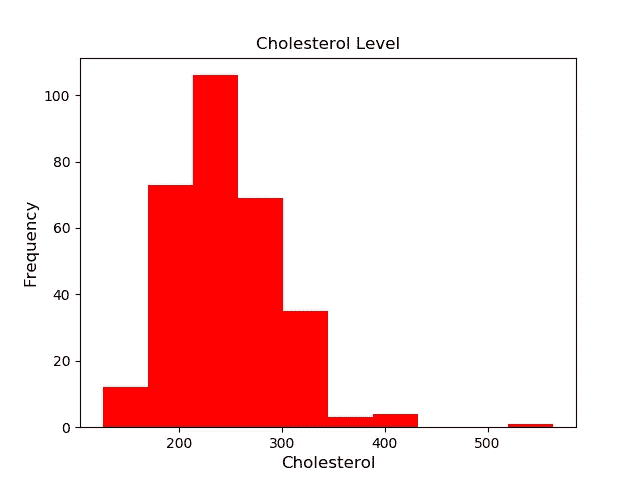
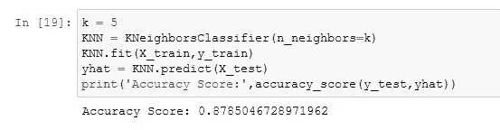
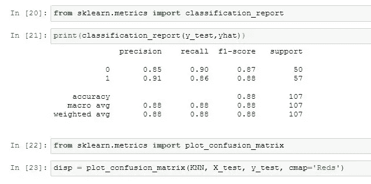
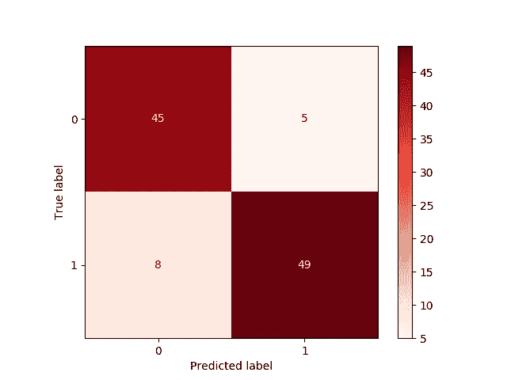

# 基于 KNN 算法的心血管疾病预测

> 原文：<https://medium.com/analytics-vidhya/heart-disease-prediction-using-knn-algorithm-be78f800e2a9?source=collection_archive---------12----------------------->

心脏病是一个涵盖任何心脏疾病的术语。与心血管疾病不同，心血管疾病描述的是血管和循环系统以及心脏的问题。心脏病是指心脏本身的问题和畸形。心血管疾病通常是指血管狭窄或阻塞，可能导致心脏病发作、胸痛(心绞痛)或中风。其他心脏疾病，如影响心脏肌肉、瓣膜或心律的疾病，也被视为心脏病的形式。

心血管疾病的预测被认为是临床数据分析部分中最重要的课题之一。我将应用一种机器学习算法，该算法被证明可以有效地对一个人是否患有心血管疾病进行分类，使用的是 UCI 知识库中最常用的**克里夫兰心脏病数据集之一。**

## **数据**

我获取的数据集由 303 个与心脏病相关的个人数据组成。这个数据集由 13 个不同的特征/属性组成，我将使用它们来预测个人是否患有心脏病。

**来自 UCI 知识库的克里夫兰心脏病数据集。**

***数据集特征:***

*1。***:显示个人的年龄。**

**2。* ***性别*** *:使用以下格式显示个体的性别:
1 =男性
0 =女性**

**3。* ***胸痛类型*** *:使用以下格式显示个人经历的胸痛类型:
1 =典型心绞痛
2 =非典型心绞痛
3 =非心绞痛疼痛
4 =渐进**

**4。***:显示个人的静息血压值，单位为 mmHg(单位)***

***5。* ***血清胆固醇*** *:以 mg/dl(单位)显示血清胆固醇***

***6。* ***空腹血糖*** *:将个体的空腹血糖值与 120mg/dl 进行比较。
如果空腹血糖> 120mg/dl 那么:1(真)
否则:0(假)***

***7。* ***静息心电图*** *:显示静息心电图结果
0 =正常
1 = ST-T 波异常
2 =左心室肥大***

***8。* ***达到的最高心率:*** *显示个人达到的最高心率。***

***9。* ***运动诱发心绞痛*** *:
1 =是
0 =否***

***10。***:显示整数或浮点数。****

**11。 ***峰值运动 ST 段*** *:
1 =向上倾斜
2 =平坦
3 =向下倾斜***

***12。* ***透视着色的主要血管数(0-3)****:显示整数或浮点数。***

***13。* ***地中海贫血*** *:显示地中海贫血:
3 =正常
6 =固定缺陷
7 =可逆缺陷***

> ****有一个“目标”变量，显示个人是否患有该疾病:(0 =不存在，1 =存在)****

## ****编程语言描述****

****Python** 是数据科学家和软件开发人员用于数据科学任务的最流行的高级语言之一。它可用于预测结果、自动化任务、简化流程以及提供商业智能见解。有相当多的开源库使得 Python 数据任务变得更加容易。**

**Python 库和简化的流程使数据分析和机器学习达到了一个全新的水平。python 中有许多不同的库，可以帮助用户提高工作效率。Python 库也被称为“模块”。**

**为了开发心血管疾病预测模型，我使用了 **Pandas、NumPy、Matplotlib 和 Scikit-learn 模块。****

*   **Pandas 是一个开源库，专门为数据科学和分析而开发。它建立在 Numpy(以表格形式处理数字数据)包的基础上，内置了数据结构来简化数据管理/争论的过程，也就是数据操作。**
*   ****NumPy，**代表数值 Python，是一个由多维数组对象和处理这些数组的例程集合组成的库。使用 NumPy，可以对数组执行数学和逻辑运算。**
*   **Matplotlib 是一个非常棒的 Python 可视化库，用于数组的 2D 绘图。Matplotlib 是一个基于 NumPy 数组的多平台数据可视化库。**
*   ****Scikit-learn** 可能是 Python 中对机器学习最有用的库。sklearn 库包含了很多用于机器学习和统计建模的高效工具，包括分类、回归、聚类和降维。**

## ****数据分析****

**我用 **Jupyter 笔记本** 做分析，开发 ML 模型。Jupyter Notebook 是一个开源的 web 应用程序，允许您创建和共享包含实时代码、公式、可视化和叙述性文本的文档。在开始分析部分之前，我们需要将必要的库导入到笔记本中。我们需要对数据**(数据预处理)**进行处理，使其更有效地用于开发机器学习模型。数据预处理是数据挖掘过程中的重要步骤。**“垃圾进，垃圾出”**这句话特别适用于数据挖掘和机器学习项目。**

****

**Pandas 库对于数据操作过程更有效。使用 **dropna()函数**，我们可以删除/丢弃数据集中存在的缺失值。使用 **describe()函数**我们可以看到数据集的统计信息。**

****

****因变量和自变量**是机器学习建模中的变量。自变量是受控输入，是用‘X’表示的。因变量代表改变这些输入产生的输出或结果，用“y”表示。**

> ****自变量(X)-数据集中除“目标”列之外的所有特征都是我的自变量。这些特征将被用作 ML 算法的输入。****
> 
> ****因变量(y)—‘目标’将是输出变量。****

****

****自变量(X)****

****

****因变量(y)****

**导入了 **Scikit-learn** 模块以标准化自变量数据。**数据规范化**是通过一系列所谓的范式来结构化关系数据，以减少数据冗余，提高数据完整性的过程。**

****

**为了执行**数据可视化**，我使用了 **Matplotlib** 库来绘制直方图并可视化个体的胆固醇水平。**

****

## ****算法(K-最近邻)****

**k-最近邻(KNN)算法是一种简单、易于实现的监督机器学习算法，可用于解决分类和回归问题。有监督的机器学习算法(与无监督的机器学习算法相反)依赖于标记的输入数据来学习一个函数，该函数在给定新的未标记数据时产生适当的输出。**

**分类问题的输出是一个离散值。这里，因变量“目标”是输出。KNN 算法假设附近存在类似的东西。换句话说，相似的事物彼此靠近。为了找到距离，我们使用**欧几里德距离**公式来计算相似性/距离。**

**这里，k-最近邻中的“k”是我们的模型在预测结果时考虑的邻居数量。**

****

****列车试运行****

**使用 train_test_split 函数，将数据集拆分为定型集和测试集。训练集将用于训练 ML 模型，而测试集将用于检查我们的模型在“看不见的数据”中的表现如何，这些数据也称为真实世界的数据。**

****

****KNN 算法****

*   **初始化 K 个邻居，我们的模型需要考虑这些邻居来预测结果。**
*   **当模型获得一个输入(真实世界的数据)作为查询时，它将通过计算这个新的看不见的数据与我们的模型训练的所有其他记录之间的距离来预测个人是否患有心脏病。**
*   **计算距离/相似性后，根据距离从最短到最长(升序)对示例进行排序。**
*   **从已排序的集合中挑选前 K 个条目，并获取所选 K 个条目的标签。**
*   **对于回归，算法返回“平均值”,如果是分类，算法返回 K 个标签的“模式”。**
*   **计算模型准确性分数，以检查模型在现实世界中的表现。**

****

****KNN 算法****

## ****模型评估****

**模型评估是模型开发过程不可或缺的一部分。它有助于找到代表我们的数据的最佳模型，以及所选模型在未来的工作情况。KNN 算法以 87.85 的**准确度成功预测了分类问题。**为了进一步评估模型，我使用混淆矩阵执行了模型评估流程，并计算了 F1 分数。**

**混淆矩阵是任何分类算法的最优选的模型评估度量。混淆矩阵将显示真阳性、真阴性、假阳性和假阴性。它对于测量**召回率、精确度和 F1 分数也非常有用。****

*   ****真阳性(TP):** 你预测阳性，是真的。**
*   ****真阴性(TN):** 你预测阴性，是真的。**
*   ****假阳性(1 型错误):**你预测阳性，结果是假的。**
*   ****假阴性(第二类错误):**你预测阴性，这是假的。**

********

****混淆矩阵(TP，TN，FP，FN)****

## ****结论****

**根据风险因素手动确定心血管疾病的几率可能很难。使用机器学习技术，我们可以在现有数据的帮助下预测结果。但是，我们不能总是相信机器。从这个预测中可以看出，我们得到了一定比例的“假阳性和假阴性”。预防心血管疾病的唯一方法是保持健康。**

***数据集来自* [*UCI 机器学习知识库。*](https://archive.ics.uci.edu/ml/datasets/Heart+Disease)**