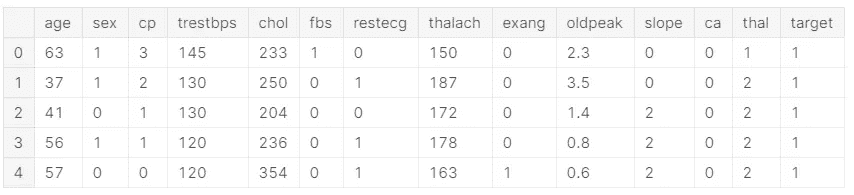
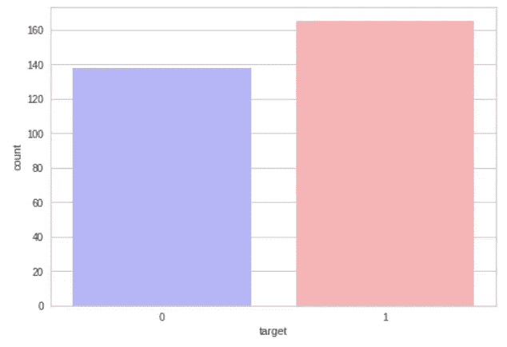

# 利用 Auto ML(pycaret)预测心脏病

> 原文：<https://medium.com/analytics-vidhya/heart-disease-prediction-with-auto-ml-pycaret-f30ab8b5e4a8?source=collection_archive---------17----------------------->


> 你可以在这里找到完整的代码和数据集。

# 1.介绍

这与你将看到的通常的 Kaggle 作品有些不同，其中大多数都是使用原始方法或可以说是传统方法来建立模型。这种方法的主要问题是在数据预处理、特征选择、模型选择、超参数调整等方面浪费了大量时间。但是现在有许多自动 Ml 可以很容易地安装，并可以有效地使用。许多耗时的工作可以用几行代码轻松完成。在大多数情况下，模型精度会高于传统方法制作的模型。

**关于我们正在使用的数据集。**

该数据库包含 76 个属性，但所有发表的实验都提到使用其中 14 个属性的子集。特别是，克利夫兰数据库是迄今为止唯一被 ML 研究人员使用的数据库。“目标”字段是指患者是否存在心脏病。它是从 0(不存在)到 4 的整数值。

**一般来说，该数据集给出了许多变量以及是否患有心脏病的目标条件**

> ***这是为那些需要高度精确、完美模型的人准备的，不太令人头疼。***
> 
> 这并不适合那些试图研究模型、深入研究每种机器学习算法的人。

# 2.安装必要的软件包

在我们进入编码部分之前，首先导入必要的包。

```
!pip install pycaretimport numpy as np *# linear algebra*
import pandas as pd *# data processing, CSV file I/O (e.g. pd.read_csv)*
import matplotlib.pyplot as plt *#Data visualization* 
import seaborn as sns *#Data visualization*
```

**pycaret** : *我们这里使用的 AutoML 是 pycaret*

**numpy** :用于线性代数的库

**pandas** :用于*数据处理的库，CSV 文件 I/O(如 pd.read_csv*

matplotlib :用于数据可视化的库。

**seaborn** :用于数据可视化的库。

# 3.获取数据

我们可以使用熊猫图书馆获得数据集。

```
*# Getting the datasets to "datasets" variable*
dataset = pd.read_csv("../input/heart-disease-uci/heart.csv")*# Showing first 5 rows.*
dataset.head()
```



数据集的前 5 行

# 4.属性信息

这是一组清晰易懂的数据。然而，一些列标题的含义并不明显。他们的意思是，

**年龄:**以年为单位的人的年龄

**性别:**人的性别(1 =男性，0 =女性)

**cp:** 所经历的胸痛(值 1:典型心绞痛，值 2:非典型心绞痛，值 3:非心绞痛性疼痛，值 4:无症状)

**trestbps** :患者的静息血压(入院时为毫米汞柱)

**胆固醇:**人的胆固醇测量值，单位为毫克/分升

**fbs:** 人的空腹血糖(> 120 mg/dl，1 =真；0 =假)

**静息心电图:**静息心电图测量(0 =正常，1 = ST-T 波异常，2 =根据 Estes 标准显示可能或明确的左心室肥大)

**thalach:** 人的最大心率达到

**exang:** 运动诱发心绞痛(1 =是；0 =否)

**oldpeak:** 运动相对于休息诱发的 ST 段压低(‘ST’与心电图图上的位置有关。点击此处查看更多)

**斜率:**峰值运动 ST 段的斜率(值 1:向上倾斜，值 2:平坦，值 3:向下倾斜)

**ca:** 主要血管数量(0-3)

**地中海贫血:**一种叫做地中海贫血的血液疾病(3 =正常；6 =修复缺陷；7 =可逆缺陷)

**目标:**心脏病(0 =否，1 =是)

# 检查数据是否平衡

## 正如我们所看到的，45%和 54%是一个平衡的数据。

这是最重要的一步，但大多数初学者都忘记了。如果我们拥有的数据集是不平衡的，我们就不能使用准确度分数作为决定 ML 模型质量的最终因素。

```
countNoDisease = len(dataset[dataset.target == 0])
countHaveDisease = len(dataset[dataset.target == 1])
print("Percentage of Patients Haven't Heart Disease: **{:.2f}**%".format((countNoDisease / (len(dataset.target))*100)))
print("Percentage of Patients Have Heart Disease: **{:.2f}**%".format((countHaveDisease / (len(dataset.target))*100)))Percentage of Patients Haven't Heart Disease: 45.54%
Percentage of Patients Have Heart Disease: 54.46%
```

# 5.可视化数据集(这样我们可以更好地了解数据集)

```
sns.countplot(x="target", data=dataset, palette="bwr")
plt.show()
```



心脏病患者和非心脏病患者的比较。

```
sns.countplot(x='sex', data=dataset, palette="mako_r")
plt.xlabel("Sex (0 = female, 1= male)")
plt.show() 
```

这张图表显示了我们数据集中男性和女性的数量。


```
*countFemale* = len(dataset[dataset.sex == 0])
countMale = len(dataset[dataset.sex == 1])
print("Percentage of Female Patients: **{:.2f}**%".format((countFemale / (len(dataset.sex))*100)))
print("Percentage of Male Patients: **{:.2f}**%".format((countMale / (len(dataset.sex))*100)))Percentage of Female Patients: 31.68%
Percentage of Male Patients: 68.32%
```

只是检查男性和女性患者的比例

```
pd.crosstab(dataset.age,dataset.target).plot(kind="bar",figsize=(30,15))
plt.title('Heart Disease Frequency for Ages')
plt.xlabel('Age')
plt.ylabel('Frequency')
plt.savefig('heartDiseaseAndAges.png')
plt.show()
```

这张图表向我们展示了心脏病随年龄增长的频率。


```
pd.crosstab(dataset.sex,dataset.target).plot(kind="bar",figsize=(15,6),color=['#1CA53B','#AA1111' ])
plt.title('Heart Disease Frequency for Sex')
plt.xlabel('Sex (0 = Female, 1 = Male)')
plt.xticks(rotation=0)
plt.legend(["Haven't Disease", "Have Disease"])
plt.ylabel('Frequency')
plt.show()
```

男女对比，有无心脏问题。


```
plt.scatter(x=dataset.age[dataset.target==1], y=dataset.thalach[(dataset.target==1)], c="red")
plt.scatter(x=dataset.age[dataset.target==0], y=dataset.thalach[(dataset.target==0)])
plt.legend(["Disease", "Not Disease"])
plt.xlabel("Age")
plt.ylabel("Maximum Heart Rate")
plt.show()
```

显示不同年龄组的人患病和未患病的散点图。


```
pd.crosstab(dataset.slope,dataset.target).plot(kind="bar",figsize=(15,6),color=['#DAF7A6','#FF5733' ])
plt.title('Heart Disease Frequency for Slope')
plt.xlabel('The Slope of The Peak Exercise ST Segment ')
plt.xticks(rotation = 0)
plt.ylabel('Frequency')
plt.show()
```

与运动 ST 段峰值斜率的比较。


```
pd.crosstab(dataset.fbs,dataset.target).plot(kind="bar",figsize=(15,6),color=['#FFC300','#581845' ])
plt.title('Heart Disease Frequency According To FBS')
plt.xlabel('FBS - (Fasting Blood Sugar > 120 mg/dl) (1 = true; 0 = false)')
plt.xticks(rotation = 0)
plt.legend(["Haven't Disease", "Have Disease"])
plt.ylabel('Frequency of Disease or Not')
plt.show()
```

与‘FBS—(空腹血糖> 120 mg/dl)的比较(1 =真；0 =假)


```
pd.crosstab(dataset.cp,dataset.target).plot(kind="bar",figsize=(15,6),color=['#11A5AA','#AA1190' ])
plt.title('Heart Disease Frequency According To Chest Pain Type')
plt.xlabel('Chest Pain Type')
plt.xticks(rotation = 0)
plt.ylabel('Frequency of Disease or Not')
plt.show()
```

与胸痛类型的比较


# 6.为模型选择准备数据

在这一步中，我们将数据集一分为二。第一部分包含用于训练和测试的 95%的数据。剩余的 5%被存储起来，并用于测试我们部署的最终模型(该数据被命名为 unseen data)。

```
data = dataset.sample(frac=0.95, random_state=786).reset_index(drop=True)
data_unseen = dataset.drop(data.index).reset_index(drop=True)

print('Data for Modeling: ' + str(data.shape))
print('Unseen Data For Predictions ' + str(data_unseen.shape))Data for Modeling: (288, 14)
Unseen Data For Predictions (15, 14)
```

# 7.导入 pycaret 分类方法

我们在这里使用的自动 Ml 是 pycaret。它的工作非常简单，因为我们想给数据集作为数据，我们的目标列作为目标。我们还可以设置一些其他功能，如下所示。

```
*# Importing pycaret classification method*
from pycaret.classification import *

*# This is the first step of model selection*
*# Here the data is our datasets, target is the labeled column(dependent variable), section is is random number for future identification.*
exp = setup(data = data, target = 'target', session_id=1,
                  normalize = True, 
                  transformation = True, 
                  ignore_low_variance = True,
                  remove_multicollinearity = True, multicollinearity_threshold = 0.95 ) 
```

> *在这之后，我们将得到一个列及其类型的列表，只需确认它们是相同的。然后按回车键。*

# 8.比较模型

在确认了列类型之后，现在我们可以用两个 ML 算法来运行数据集，并且我们可以比较性能。如下图。

```
*#This command is used to compare different models with our datasets.*
*#The accuracy,F1 etc of each model is listed in a table.*
*#Choose which model you want*
compare_models()
```


在上表中，我们可以看到许多具有良好精确度的模型。

> 接下来，我们应该决定使用哪种算法，并复制它的代码。

**不同型号的代码如下。**

逻辑回归**‘lr’**

k 最近邻**‘KNN’**

天真的贝叶斯**‘nb’**

决策树**‘dt’**

SVM(线性)**‘支持向量机’**

SVM(径向基函数)**‘径向基函数支持向量机’**

高斯过程**‘GPC’**

多级感知器**‘MLP’**

山脊分类器**‘山脊’**

随机森林**‘RF’**

二次圆盘。分析**‘qda’**

阿达布**‘阿达’**

梯度推进分类器 **'gbc'**

线性圆盘。分析**‘LDA’**

额外的树分类器**等**

极端梯度推进 **'xgboost'**

光梯度增强**‘light GBM’**

催化增强分类器**‘催化增强’**

# 9.创建模型

现在我们可以创建模型了。

```
*# With this command we are creating a* Linear Disc. Analysis *model*

*# fold is the number of fold you want*
lda_model = create_model('lda', fold = 10)
```


该表显示了所有 10 次折叠的精度和其他读数。

现在我们正在调整超参数。

> 调整超级参数对于提高精确度和其他功能非常有用。

## 对于不平衡的数据集，我们主要看 F1 分数，因为我们的数据集是平衡的，我们可以使用精确度。

# 10.调整超参数

```
tuned_lda = tune_model('lda', optimize='F1')
```


# 11.绘制 ROC 曲线

随着雕刻向 x、y 轴移动，性能会提高。

```
plot_model(tuned_lda, plot = 'auc')
```


# 12.混淆矩阵

随着真阳性的数量增加，模型的性能也增加。

```
plot_model(tuned_lda, plot = 'confusion_matrix')
```


# 13.使用测试数据集预测准确性

我们得到 0.8506 的准确度和 0.8632 的 F1 分数

```
predict_model(tuned_lda);
```


# 14.用看不见的数据检查

最初，我们将一部分数据集分离为看不见的数据集，用于检查最终部署的模型。下面我们正在检查这个。结果是具有标签和分数(最后两列)数据框。其中标签是预测的标签，分数是机器认为该人患有心脏病的百分比。

```
new_prediction = predict_model(tuned_lda, data=data_unseen)
```


# 15.摘要

正如我们在上面看到的，我们得到了一个 86%精度的高精度模型，没有过度拟合。Auto Ml 更受欢迎，因为它节省了大量时间，并提供了非常好的结果。对于缺乏经验的人来说，超参数调整并不容易，但是超参数调整对模型的性能产生了巨大的影响。

没有十全十美的，如果有人发现任何错误或建议，请在下面不吝赐教。