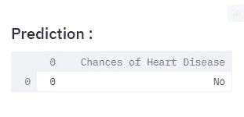
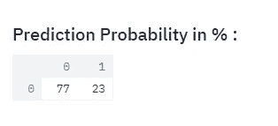
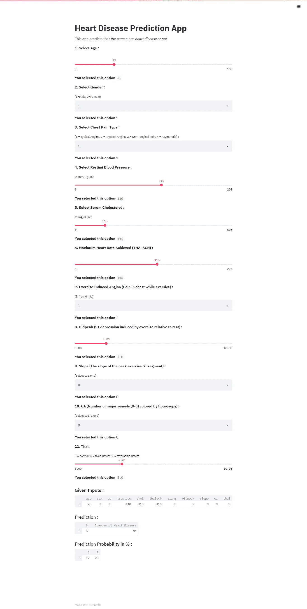

# 基于机器学习的心脏病预测

> 原文：<https://medium.com/analytics-vidhya/heart-disease-prediction-with-machine-learning-d22bc924d8ab?source=collection_archive---------12----------------------->

*(使用 Streamlit 的开源应用框架)*

## **什么是机器学习？**

机器学习是让计算机像人类一样学习和行动的科学，并通过以观察和现实世界交互的形式向它们提供数据和信息，以自主的方式随着时间的推移改善它们的学习。


## **什么是 Streamlit？**

Streamlit 让你用看似简单的 Python 脚本为你的机器学习项目创建应用。它支持热重新加载，因此当您编辑和保存文件时，您的应用程序会实时更新。不需要弄乱 HTTP 请求、HTML、JavaScript 等。


## 心脏病预测应用概述

这是一个简单的基于机器学习的网络应用程序，可以预测这个人是否患有心脏病。

这里的数据集取自互联网，根据其中的特征将其分为心脏病患者和非心脏病患者。这些数据将用于创建一个模型，该模型将尝试预测患者是否患有心脏病。

这将需要使用三个 Python 库，即`streamlit`、`pandas`和`scikit-learn`。

## 【Streamlit 的安装步骤:

打开命令提示符或终端，键入以下命令:

```
pip install streamlit 
```

## **安装其他需要的库:**

**pandas :** pandas 是一个快速、强大、灵活且易于使用的开源数据分析和操作工具，构建于 Python 编程语言之上。

```
pip install pandas
```

**sci kit-learn**:sci kit-learn(以前叫 scikit.learn，也叫 sklearn)是一个 Python 编程语言的免费软件机器学习库。它具有各种分类、回归和聚类算法，包括支持向量机、随机森林、梯度增强、 *k* -means 和 DBSCAN，旨在与 Python 数值和科学库 NumPy 和 SciPy 互操作。

```
pip install -U scikit-learn
```

## **分类算法:** [**随机森林分类器**](https://scikit-learn.org/stable/modules/generated/sklearn.ensemble.RandomForestClassifier.html)

分类是一种将数据分类到给定数量的类别中的技术。分类的主要目的是识别新数据所属的类别/类。

随机森林是一种元估计器，它在数据集的各个子样本上拟合多个决策树分类器，并使用平均来提高预测精度和控制过拟合。

## 让我们从开始

**第一步:**

分别导入别名为`st`和`pd`的`streamlit`和`pandas`库。

```
import streamlit as st
import pandas as pd
from sklearn.ensemble import RandomForestClassifier
```

**第二步:**

在前端，定义一个方法`def user_input_features()`,该方法将接受与患者的年龄、性别、胸痛类型、静息血压、胆固醇、thalach 和其他所需特征相关的输入参数。这些特征将被传递到后端，在后端，经过训练的模型将根据输入参数来预测分类标签。预测结果送回前端显示。

```
 st.write("""**1\. Select Age :**""")
    age = st.slider('', 0, 100, 25)
    st.write("""**You selected this option **""",age)

    st.write("""**2\. Select Gender :**""")
    sex = st.selectbox("(1=Male, 0=Female)",["1","0"])
    st.write("""**You selected this option **""",sex)
```

这里`st.slider()`和`st.selectbox()` streamlit 方法用于获取输入，而`st.wrire()`用于同时打印输入。

**第三步:**

数据帧形式的综合用户输入参数信息将被分配给`df`变量。

```
df = user_input_features()
```

**第四步:**

这一步包含实际的模型构建阶段。这将从保存所有文件的同一路径加载患者数据集，并将其分配给`heart`变量。

`X`变量包含数据集中提供的所有患者特征，而`Y`变量具有对患者进行分类的输出列目标。

```
heart = pd.read_csv("heart1.csv")
X = heart.iloc[:,0:11].values
Y = heart.iloc[:,[11]].values
```

**第五步:**

在该步骤中，特别是将`RandomForestClassifier()`函数分配给`model`变量，并通过使用`X`和`Y`变量作为输入参数，经由`model.fit()`函数训练模型。这意味着将通过使用患者的特征(`X`)和输出列(`Y`)训练分类模型来建立分类模型。

```
model = RandomForestClassifier()
model.fit(X, Y)
```

**第六步:**

在该步骤中，变量`prediction`将通过从数据帧`df`中获取用户输入来存储模型预测的值。

```
prediction = model.predict(df)
```

预测将以表格的形式出现。

```
st.subheader('Prediction :')
df1=pd.DataFrame(prediction,columns=['0'])
df1.loc[df1['0'] == 0, 'Chances of Heart Disease'] = 'No'
df1.loc[df1['0'] == 1, 'Chances of Heart Disease'] = 'Yes'
st.write(df1)
```



预言；预测；预告

**第七步:**

下面的代码将打印模型的预测概率。

```
prediction_proba = model.predict_proba(df)
st.subheader('Prediction Probability in % :')
st.write(prediction_proba * 100)
```



推算概率

## **这个 app 怎么运行？**

按照给定的步骤，用`.py`扩展名保存代码。打开命令提示符或终端，使用以下命令执行此`.py`扩展文件:

```
streamlit run file_name.py
```

该命令将执行代码，执行后您的浏览器将弹出并带您进入 web 应用程序。



## 结论

随机森林算法是一种强大而简单的算法，在对不同特征进行分类时特别有用。为了更好地理解随机森林算法，这个[指南](https://scikit-learn.org/stable/modules/generated/sklearn.ensemble.RandomForestClassifier.html)可能会很有帮助。