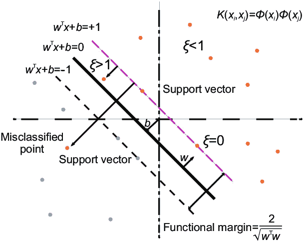
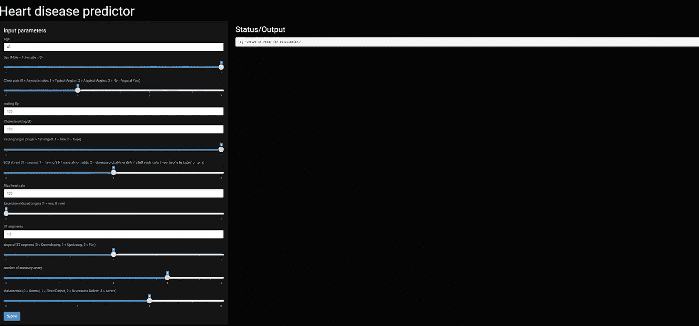

# 心脏病预测应用程序-一个机器学习应用程序

> 原文：<https://medium.com/analytics-vidhya/heart-disease-predictor-an-machine-learning-application-965974b50407?source=collection_archive---------7----------------------->

**这篇文章有助于理解机器学习算法是如何被用来从几个输入中以一定的概率预测心脏病的。**

## 贡献者

姬叔·戴伊，哈西木丁。

照片来自研究门户网站

# 动机

根据最近的调查，医生说我们不健康的生活方式是心脏病背后的主要原因。我们甚至无法知道人们什么时候可能会有致命的心脏病发作。我们需要警告来避免心脏病发作或心力衰竭的致命性。每年的心脏病学报告称，大多数 60 岁或以上的老年人患有心脏病，其中许多人因急性心肌梗塞而过早死亡。每年有 655，000 名美国人死于 T2 心脏病，在印度有超过 300 万人。

所以我们需要预防措施来防止心脏病导致的过早死亡。我们做这个应用是为了给有一定概率可能有心脏病的人报警。我们也可以建议他们是否应该见一个顾问。

## 造诣

我们把工作分成两部分

1.  我们建立了一个有能力的机器学习模型
2.  我们通过 Rshiny 和 heroku 将它部署到这个应用程序中。

## 程序

这里我们使用了来自这个链接的数据集

 [## 心脏病 UCI

### https://archive.ics.uci.edu/ml/datasets/Heart+Disease

www.kaggle.com](https://www.kaggle.com/ronitf/heart-disease-uci) 

该数据库包含 76 个属性，但所有发表的实验都提到使用其中 14 个属性的子集。特别是，克利夫兰数据库是迄今为止唯一被 ML 研究人员使用的数据库。“目标”字段是指患者是否存在心脏病。它是从 0(不存在)到 4 的整数值。

1.  年龄:显示个人的年龄。
2.  性别:使用以下格式显示个人的性别:1 =男性 0 =女性。
3.  胸痛类型:显示个人经历的胸痛类型。
4.  静息血压:以 mmHg(单位)显示个人的静息血压值。
5.  胆固醇:以毫克/分升(单位)显示血清胆固醇。
6.  空腹血糖:将个体的空腹血糖值与 120mg/dl 进行比较。如果空腹血糖> 120mg/dl，则:1(真)否则:0(假)。
7.  静息心电图:0 =正常 1 =有 ST-T 波异常 2 =左心室机能亢进。
8.  最大心率:显示个人达到的最大心率。
9.  运动诱发的心绞痛:1 =是 0 =否。
10.  Oldpeak:运动相对于休息诱发的 ST 段压低。显示整数或浮点值。
11.  斜率:运动 ST 段峰值的斜率。
12.  荧光染色的主要血管数目。
13.  地中海贫血:显示地中海贫血。
14.  心脏病诊断:显示个人是否患有心脏病。

## 使用机器学习算法

我们通过监督学习来训练我们的预测模型，因为我们已经有了目标变量。我们使用线性支持向量机对模型进行训练并得到预测。

这张图片来自研究之门

## *理解算法和我们的问题*

我们有两节课。其中一个是肯定的，另一个是否定的。支持向量机帮助我们找到两类的差距。如果粉色线代表否，支持向量机会显示粉色线下区域有多少个“是”(蓝点)。这也同样适用于代表“是”的空白的黑色线条，以及在黑色线条下的区域有多少个“否”(藏红花点)。

## 用过的 R 包

1.  脱字号
2.  职业抽样
3.  数据表
4.  发光的
5.  Shinytheme
6.  caTools

## 机器学习模型的代码

这里使用混淆矩阵来评估我们的模型。使用 SVM 我们得到了 86%的准确率。灵敏度为 82.05%，特异度为 95.45 %。

## 使用闪亮的 R 包创建应用程序

## Web 应用程序链接

 [## 心脏病预测器

heart-disease-predictos.herokuapp.com](https://heart-disease-predictos.herokuapp.com/) 

看一下应用程序

## 参考

我们非常感谢

 [## Kaggle:你的机器学习和数据科学社区

### Kaggle 是世界上最大的数据科学社区，拥有强大的工具和资源来帮助您实现您的数据…

www.kaggle.com](https://www.kaggle.com/)  [## 学习机器学习，人工智能，商业分析，数据…

### 分析 Vidhya 为您带来由数据从业者、思想领袖和企业组成的社区的力量…

www.analyticsvidhya.com](https://www.analyticsvidhya.com/)  [## 发光的

### 使构建交互式 web 应用程序变得非常容易

www.rdocumentation.org](https://www.rdocumentation.org/packages/shiny/versions/1.5.0)  [## 证明文件

### 描述 Heroku 平台的技术文档。

devcenter.heroku.com](https://devcenter.heroku.com/categories/reference) 

我们还使用几个 GitHub 存储库来完成我们的应用程序。