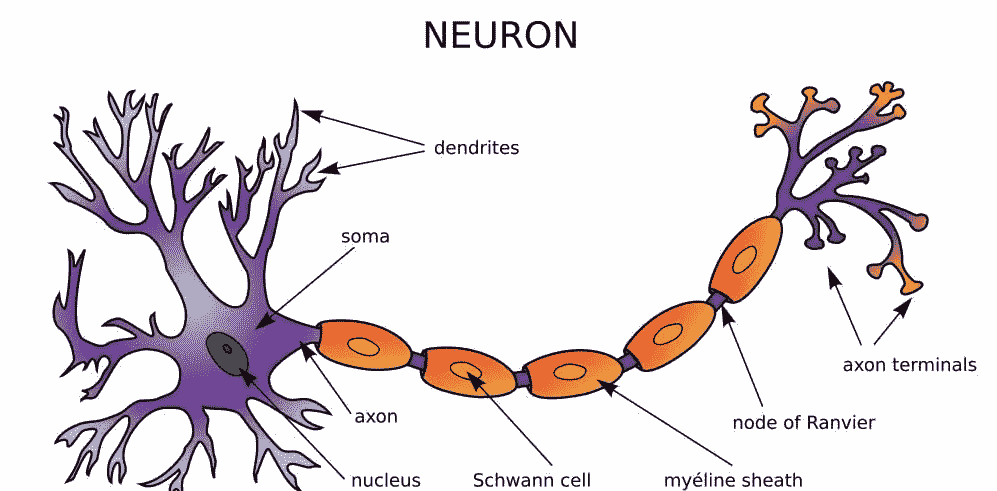
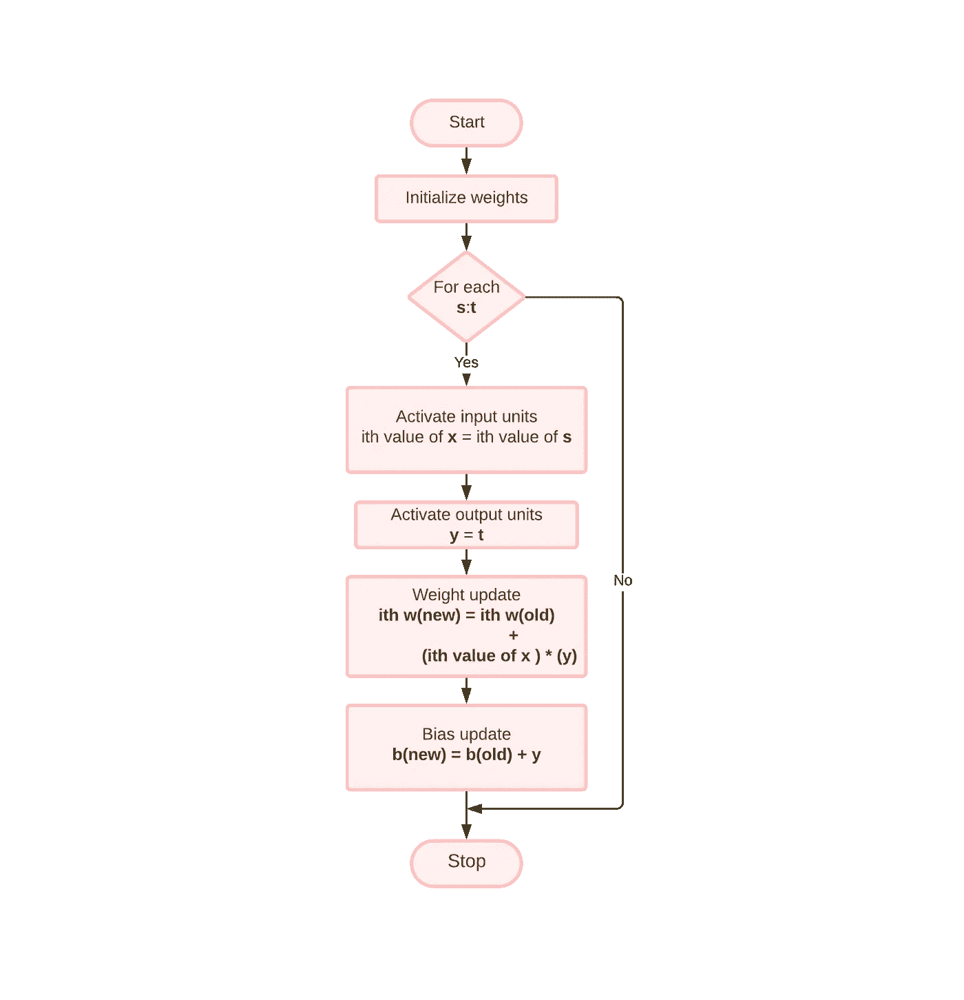
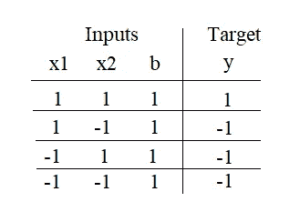
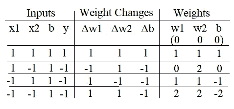
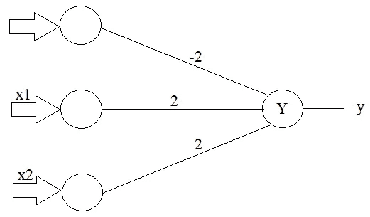

# Hebb 网络

> 原文：<https://medium.com/analytics-vidhya/hebb-network-c38596e1a7a1?source=collection_archive---------0----------------------->

Hebb 或 Hebbian 学习规则属于**人工神经网络** (ANN)，这是一种由大量称为神经元的互联元素组成的架构。这些神经元处理接收到的输入，给出想要的输出。节点或神经元通过**输入** (x1，x2，x3…xn)、**连接权重** (w1，w2，w3…wn)和**激活函数**(定义节点输出的函数)链接。

> 通俗地说，一个神经网络用已知的例子训练自己，解决各种未知的或者人类难以解决的问题！！

**图一。神经元**

现在，来看 Hebb 网络的解释，“当**细胞 A** 的轴突足够靠近以激发**细胞 B** 并重复或永久地激发它时，在一个或两个细胞中发生一些生长过程或代谢变化，使得 A 作为激发 B 的细胞之一的效率增加。”

> 基本上，上述解释源自大脑使用的工作方式，其中通过 [**突触间隙**](https://medical-dictionary.thefreedictionary.com/synaptic+gap) 的变化来执行学习

在这种情况下，如果两个相互连接的神经元同时处于**和**状态，那么与这些神经元相关的权重可以通过修改它们的突触间隙(强度)来增加。Hebb 规则中的权重更新由下式给出:

***w 的第 I 个值(新)= w 的第 I 个值(旧)+(x * y 的第 I 个值)***

**图二。Hebb 训练算法流程图**

**步骤 1** :将权重和偏置初始化为**‘0’**，即 w1=0，w2=0，.…，wn=0。

**必须对每个输入训练向量和目标输出对**执行步骤 2:2–4**，即 s:t**(s =训练输入向量，t =训练输出向量)

**步骤 3:** 输入单元激活被设置，并且在大多数情况下是输入层的标识功能(激活功能的类型之一)；

**对于 i=1 到 n，x 的第 I 个值= s 的第 I 个值**

> **恒等函数**:它是一个线性函数，定义为 ***f(x)=x 对于所有的 x***

**步骤 4:** 输出单元激活设置为 y:t

**步骤 5:** 进行权重调整和偏差调整；

1.  ***w 的第 I 个值(新)= w 的第 I 个值(旧)+(x * y 的第 I 个值)***

2. ***新偏差(值)=旧偏差(值)+ y***

最后，晦涩或者准确地说，有点难以理解的部分结束了，但是一旦你理解了下面解决的例子，你一定会理解上面的流程图 XD！！

# 设计 Hebb 网络以实施和运行:

**图 3。培训数据表**

并且功能非常简单，大多数人都知道，如果两个输入都是**1/设置/开，则输出是**1/设置/开**。**但在上述示例中，我们使用了**'-1’**而非**' 0’**这是因为 Hebb 网络使用双极性数据而非二进制数据，因为上述等式中的乘积项会给出输出为 **0** ，从而导致错误计算。

> **从 setp1 开始，set P1 将权重和偏差初始化为‘0’，因此我们得到 w1=w2=b=0**

**A)** 先输入**【x1，x2，b】=【1，1，1】**，**目标/y = 1** 。现在使用初始权重作为旧权重，并应用 Hebb 规则(w(新)的第 I 个值= w(旧)的第 I 个值+(x * y 的第 I 个值))如下:

**w1(新)= w1(旧)+ (x1*y) = 0+1 * 1 = 1**

**w2(新)= w2(旧)+ (x2*y) = 0+1 * 1 = 1**

**b(新)= b(旧)+ y = 0+1 =1**

现在，当呈现第二输入模式时，上述最终权重充当初始权重。记住这里的重量变化是。

***w 的δith 值= x 的 ith 值* y***

因此，与第一个输入相关的权重变化为:

***δw1 = x1y = 1 * 1 = 1***

***δw2 = x2y = 1 * 1 = 1***

***δb = y = 1***

> 我们得到了第一个输出，现在我们从表中的第二个输入开始(第 2 行)

**B)** 第二输入**【x1，x2，B】=【1，-1，1】**和**目标/y = -1** 。

**注意:**这里，初始或旧权重是通过执行第一输入模式**获得的最终(新)权重，即[w1，w2，b] = [1，1，1]**

这里的重量变化是。

***δw1 = x1 * y = 1 *-1 =-1***

***δw2 = x2 * y =-1 *-1 = 1***

***δb = y =-1***

这里的新权重是:

**w1(新)= w1(旧)+*δw1*= 1–1 = 0**

**w2(新)= w2(旧)+*δw2*= 1+1 = 2**

**b(新)= b(旧)+*δb*= 1–1 = 0**

类似地，对第三和第四行使用相同的过程，我们得到如下的新表；

**图 4。最终输出表**

这里我们得到的最终权重是 w1=2，w2=2，b=-2

* **图 5。Hebb 网络与功能**

谢谢你读完这篇文章，我希望你完全理解了这个概念。