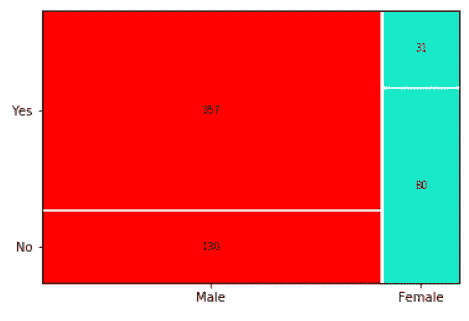

# Python 中的镶嵌图

> 原文：<https://medium.com/analytics-vidhya/hello-everyone-4f9400e008dc?source=collection_archive---------3----------------------->

## Python 中的数据可视化工具:-镶嵌图


图片提供:-互联网

大家好，

在本文中，我们将了解镶嵌图，交叉表和镶嵌图的区别，如何在 Python 中绘制镶嵌图，镶嵌图的使用。

先决条件:- Python 基本编码知识

假设我们有一个数据集，其中有一列“性别”,另一个特征是“教育”,包含“研究生”和“非研究生”作为一个因素。


男性毕业生:-2 人(50%)，女性毕业生:-3 人(75%)

我们需要在这两个特征之间找到一些洞察力，也就是说，我们必须找到哪一个“性别”的班级有更多的毕业生，哪一个班级有更少的“毕业生”。那么我们该怎么做呢？

一种方式是熊猫的库的 crosstab 函数。但它只是给出数字。如何使之图形化，有效可视化？

这里马赛克图可以帮助我们。

**目录:-**

1.  马赛克有哪些剧情和用途？
2.  交叉表和镶嵌图的区别
3.  用 Python 绘制镶嵌图的一个例子

嗯，

1.  **什么是马赛克剧情:-**

镶嵌图是一种将两个或多个定性数据可视化的图形方法。它也被称为*交叉表*或*双向*表，用于总结几个分类变量之间的关系。镶嵌图基于条件概率。

2.**交叉表和镶嵌图的区别:** -

Mosaic Plot(也称为 Marimekko diagram)不过是 python 中(pd.crosstab())函数的进一步版本。Crosstab 函数只是给了我们一个数字表，而 Mosaic Plot 给出了我们可以在数据分析报告中使用的图形。

3.**如何用 Python 绘制镶嵌图:-**

为了绘制马赛克图，我们将获取一个信用风险数据集。你可以从[这里](https://github.com/Dnp1995/Datasets/blob/main/credit_risk_train_data.csv)下载

首先，我们将导入所有必需的库。

```
import pandas as pd
import numpy as np
import matplotlib.pyplot as plt
from statsmodels.graphics.mosaicplot import mosaic
from itertools import product
```

然后，我们将加载上面讨论过的数据集。

让我们使用交叉表函数来看看“性别”和“教育程度”之间的计数关系。

```
crosstable=pd.crosstab(df['Gender'],df['Education'])
crosstable
```


交叉表

在这里，我们可以看到，在总共 489 名男性毕业生中，男性毕业生人数为 376 人，在总共 112 名女性毕业生中，女性毕业生人数为 92 人。因此，男性毕业生比例为 76%，女性毕业生比例为 82%，高于男性毕业生比例。

现在，我们将借助镶嵌图来可视化这些数据。

我们已经从 statsmodels 库中导入了马赛克。mosaic 是一个用于绘制镶嵌图的功能。

它包含四个参数

(数据、特性、标签、属性)如下所示

**属性**参数用于固定颜色

**labelizer** 参数用于给绘图中的标签和计数

```
props={}
props[('Male','Yes')]={'facecolor':'red', 'edgecolor':'white'}
props[('Male','No')]={'facecolor':'red', 'edgecolor':'white'}props[('Female','Yes')]={'facecolor':'xkcd:aqua','edgecolor':'white'}props[('Female','No')]=        {'facecolor':'xkcd:aqua','edgecolor':'white'}labelizer=lambda k:{('Male','Yes'):357,('Female','Yes'):31,('Male','No'):130,('Female','No'):80}[k]mosaic(df,['Gender','married'],labelizer=labelizer,properties=props)
```

运行此代码后，我们将得到以下马赛克图



我们也可以用百分比替换计数，并添加到我们的分析报告中，这将是非常好的可视化。

谢谢大家！

如果你有任何疑问或者想要更多的见解，请通过 [LinkedIn](https://www.linkedin.com/in/dhiraj-patil-analyst) 联系我

# 如果你喜欢这篇文章，请鼓掌！