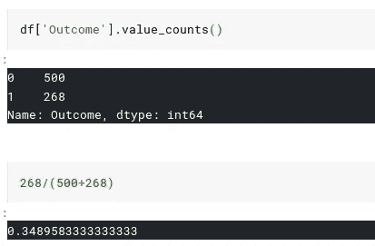

# K 近邻介绍

> 原文：<https://medium.com/analytics-vidhya/hello-f4a9317ad?source=collection_archive---------3----------------------->

k-最近邻是简单的算法。这种算法的优点在于它的简单性。尽管它有各种缺点，如高维数据的高计算时间，但它仍然广泛应用于生物信息学和计算机视觉任务领域。

[链接本文使 K-NN 成为十大机器学习算法之一](http://www.cs.umd.edu/~samir/498/10Algorithms-08.pdf)。

当你阅读 K-NN 时，你会遇到一些术语，如**监督学习、超参数调整、非参数、距离测量、分类、回归、懒惰学习者**。

> **监督学习**——学习给定输出标签的任务。
> 
> **分类** -这是一项监督学习任务，其中标签是离散值或标签，例如，如果您根据肿瘤检查患者是否患有癌症，您将获得恶性和良性肿瘤标签。这可以扩展到不止一个二进制类，但标签是离散值。

**回归** - *这是一项受监督的学习任务，我们在给定实值数据的情况下预测结果。属于这一类的预测问题是用给定时间数据预测股票市场价格、房地产价格。*

## 这里最好的部分是我们可以使用 K-NN 来完成监督学习任务。

*   **懒惰的学习者**——把这当成一个考试前一天学习的学生。你可能会看到他们在考试中表现很好，这些考试不需要太多的概念理解，或者通过这些考试所需的概念严谨性很低。来自印度工程学院的学生读了这篇文章可能会更好地理解这个概念。
*   *这是它在高维数据上失败的主要原因。这里的失败意味着两方面* :-

1.  *如果您有一家互联网公司，其业务需求要求低延迟，即您需要快速的查询输出。K-NN 可能要花很长时间。*
2.  *由于数据分布的原因，您可能无法在 K-NN 上获得最佳性能指标分数。K-NN 通常倾向于高偏差模型，即基于距离度量做出决策*。

*   **距离测量**


来源谷歌图片

还有很多测量距离的方法，这里有一些最突出的。

*   **超参数** -这就像你对模型的调节，在这种情况下，K 是决定你选择的邻居数量的超参数。

我们已经讨论了一些典型的机器学习术语，现在让我们从直观的角度来看 K-NN。

# KNN 的直觉-明智地选择你的朋友！


想象一下，你想要一些建议，你有两组朋友，你想从他们那里得到建议。让我们把蓝色的点称为你的学校朋友，红色的点称为你的大学朋友。你是微笑的人，如果你应该去看动作片或爱情片，你想听听他们的建议。基于一些衡量标准，你会做出决定，最有可能的是，当你在你的大学朋友身边时，你会受到他们的影响，做出与他们相似的决定，如果你在你的学校朋友身边，你会做你的学校朋友会做的事情。

这里的距离决定了你的决定，就像在图像中一样，如果你离蓝点越近，你可能会变成蓝点，否则会变成红色。

# KNN 的失败案例

这个简单的例子只是为了让你对 K-NN 如何工作有一个高层次的认识，但是即使在这个例子中，事情也可能不会像人们进化时那样工作，社交网络是非常动态的，并且不断变化，某些人(影响你的人也可能是一个离群点！)比一个团体更能影响你。

# 带代码的真实单词示例

我们将使用皮马印第安人糖尿病数据库中的 KNN 来预测患者是否患有糖尿病。我们将介绍列车测试分割、超参数调整的概念，并通过使用 sklearn 功能解释这些概念。

```
import numpy as np # linear algebra
import pandas as pd # data processing, CSV file I/O (e.g. pd.read_csv)
from sklearn.model_selection import train_test_split #to split into train and test
from sklearn.model_selection import GridSearchCV #for hyperparam tuning
from sklearn.neighbors import KNeighborsClassifier #KNN Classifier
```

导入所需的库后，我们将加载数据集。我使用过 Kaggle 内核，它是一个类似 jupyter 笔记本的界面，你可以在那里导入 kaggle 数据集，而不需要下载到本地机器上。

```
df=pd.read_csv("../input/diabetes.csv")
df.head() #print's the top 5 rows in the dataframe
```


PIMA 数据集

我们可以看到，该数据集有 768 行和 9 列，结果是指示糖尿病存在与否的预测值标签。

```
y=df['Outcome'] 
X=df.drop('Outcome',axis=1)
```



类别分布计数

> 我们找到了这个比率，以便进行相应的列车测试。考虑训练测试分割的概念，即准备一个测试，你学习一些问题，在测试中你得到新的问题。提出新问题的整体想法是看学生对概念的掌握程度。所以把训练和测试分开总是一个好的做法。如果测试看到的是训练数据，那么它会导致数据泄漏，我们可能会得到一个非常好的模型分数，但它并不服务于模型建立的目的。测试的整个想法是检查一个模型在看不见的数据上做得有多好。

**交叉验证**

现在，在进入超参数调整的细节之前，让我们理解交叉验证的概念。

训练模型的性能取决于数据的拆分方式。它可能不代表模型的概括能力。

解决方法是交叉验证。

交叉验证是一种评估预测模型的技术，方法是将原始样本划分为训练模型的训练集和评估模型的测试集。

在 k 重交叉验证中，原始样本被随机分成 k 个大小相等的子样本。在 k 个子样本中，保留一个子样本作为测试模型的验证数据，剩余的 k-1 个子样本用作训练数据。然后，交叉验证过程重复 k 次(折叠)，k 个子样本中的每一个正好用作验证数据一次。来自折叠的 k 个结果然后可以被平均(或以其他方式组合)以产生单个估计。这种方法的优点是，所有的观察值都用于训练和验证，并且每个观察值只用于验证一次。

我们可以输入 K 值作为邻居的数量，并检查模型性能。相反，我们将进行超参数调整，即我们取一组 K 值，对其执行 KNN，并选择一个在测试数据上给出最佳模型分数的值，因为存在过拟合和欠拟合的机会。当模型在训练中学习得很好而在训练中表现很差时，就会发生过拟合。当它在训练中学习很差，并且在测试数据上的表现也很低时，就会发生欠适应。


来源:谷歌图片

```
model=KNeighborsClassifier() # KNN Classifier
param_grid = {'n_neighbors':np.arange(1,50)} # taking K[1:50]knn= GridSearchCV(model,param_grid,cv=5,scoring='roc_auc',n_jobs=-1,pre_dispatch='2*n_jobs') #Grid Search for Hyperam Tuning
knn.fit(X_tr,y_tr) #fit the KNN model on the train data
```

# ROC-AUC 度量

如您所见，数据集不平衡，比例为 65:35。想象一下，如果我编写一个单行模型，表示 print(1 ),我将在该模型上获得 65%的准确性。因此，在大多数情况下，必须避免准确性，因为真实世界的数据永远不会平衡。

[这篇](https://towardsdatascience.com/understanding-auc-roc-curve-68b2303cc9c5)博客很好地解释了 ROC-AUC 指标。当数据不平衡时，ROC-AUC 指标是一个很好的指标。AUC 表明，给定正类点数和负类点数，点数被正确分类的概率为 78%。

```
knn.best_params_    #{'n_neighbors': 10}
knn.best_score_     #0.783873305758252
```