# 你好，米兰达！

> 原文：<https://medium.com/analytics-vidhya/hello-miranda-21a8ac273c81?source=collection_archive---------17----------------------->


## 在 Catalina 之前的 mac 上尝试 FP Miranda

Miranda 是一种懒惰的纯函数式编程语言，由 David Turner 设计。

我对 Miranda 的兴趣是由 Anurag Mendhekar 对[Miranda 是一种过时的编程语言吗？](https://www.quora.com/Is-Miranda-an-obsolete-programming-language)另一个原因是那本书*实现函数式语言:教程*使用了 Miranda。

以下是我的一台老款 mac，配的是 Calalina macOS 之前的。Miranda MacOS X 版本 2.044(英特尔)的最新二进制发行版可以处理它

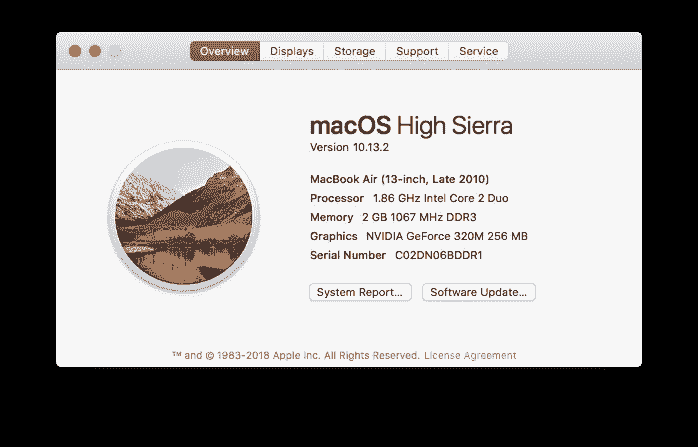

但在我每天使用的 macOS Catalina 上无法运行。

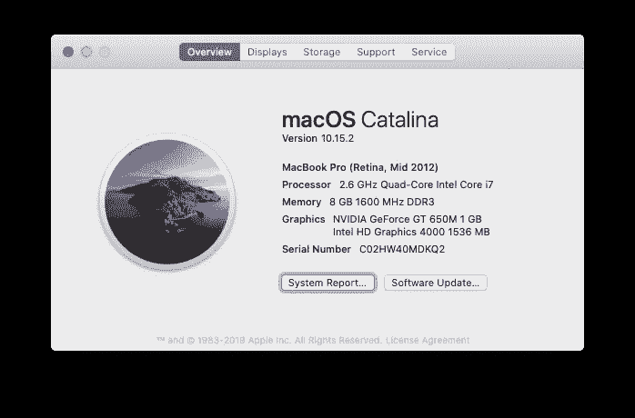

进入[米兰达下载页面](https://www.cs.kent.ac.uk/people/staff/dat/miranda/downloads/)。

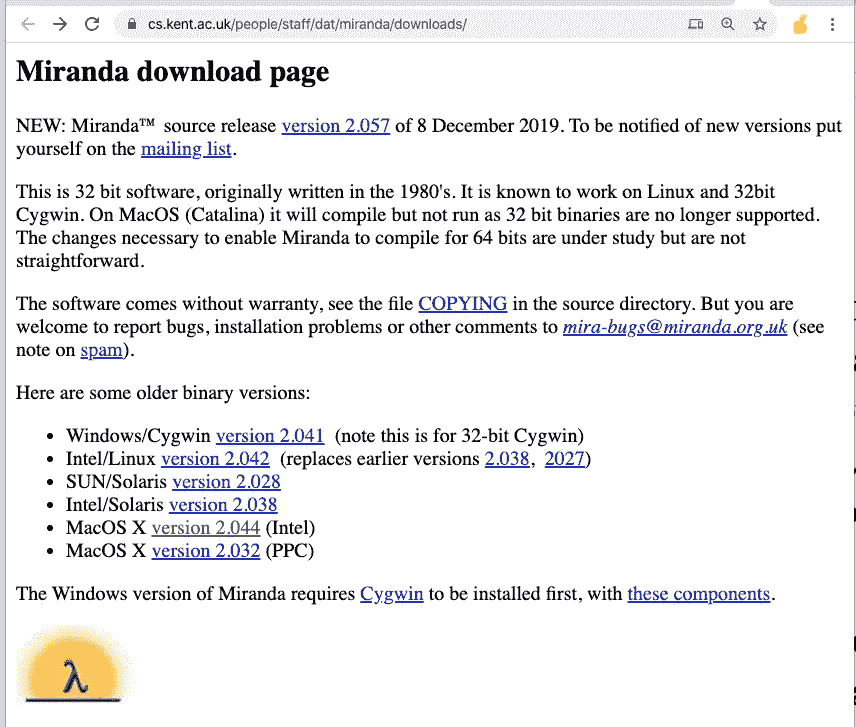

请不要忽略“在 MacOS (Catalina)上，它可以编译但不能运行，因为不再支持 32 位二进制文件。使 Miranda 能够编译 64 位的必要更改正在研究中，但并不简单”，就像我所做的那样。

选择 MacOS X 版本 2.044(英特尔)。

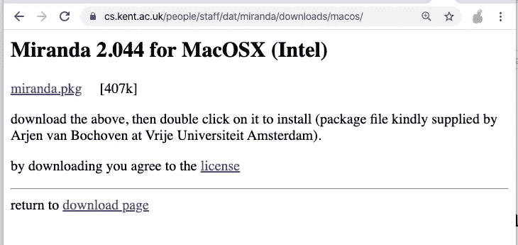

点击上面的第一个链接 miranda.pkg，你会在你的下载文件夹中得到 miranda.pkg 文件。

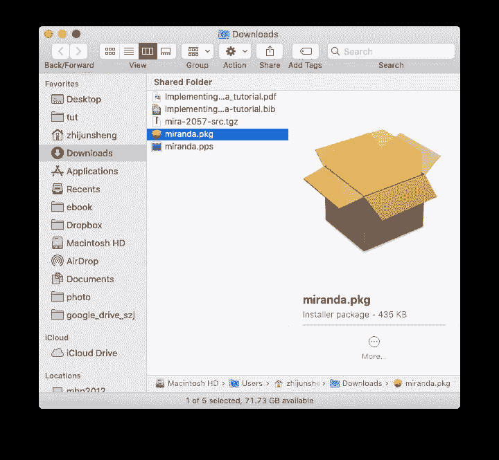

如果你双击它，你不能去任何地方。

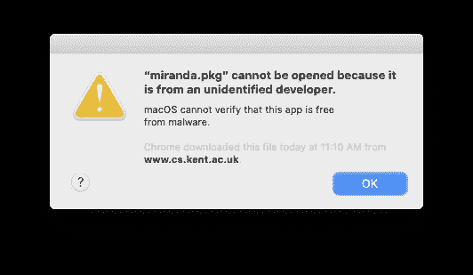

但是如果右键单击并选择打开

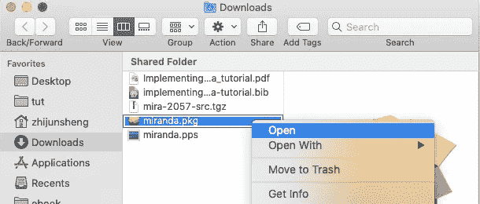

你得到了

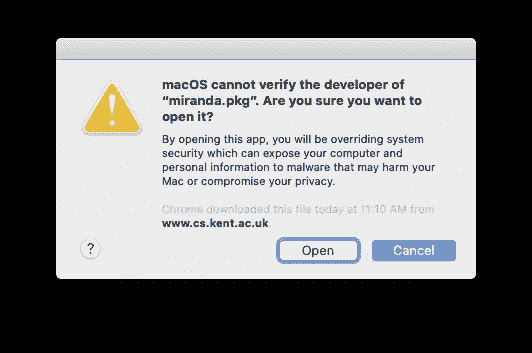

然后点击按钮打开，你会看到熟悉的安装对话框。

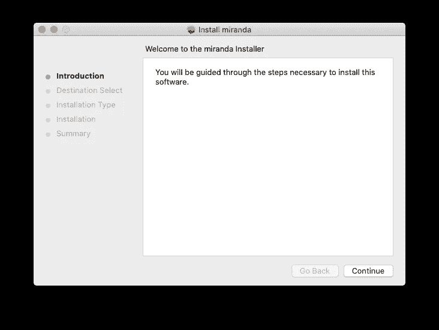

只需遵循说明并接受默认设置。

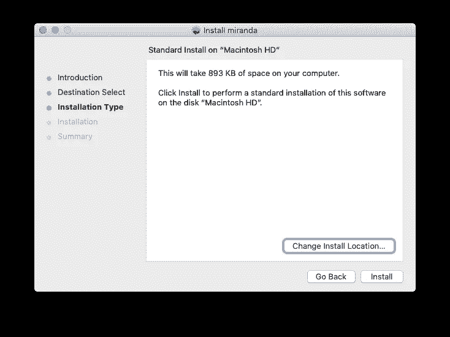

您可能需要输入您的 mac 管理员密码。

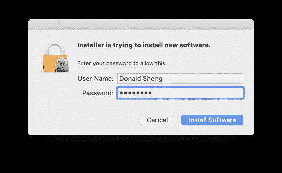

给您完成了。

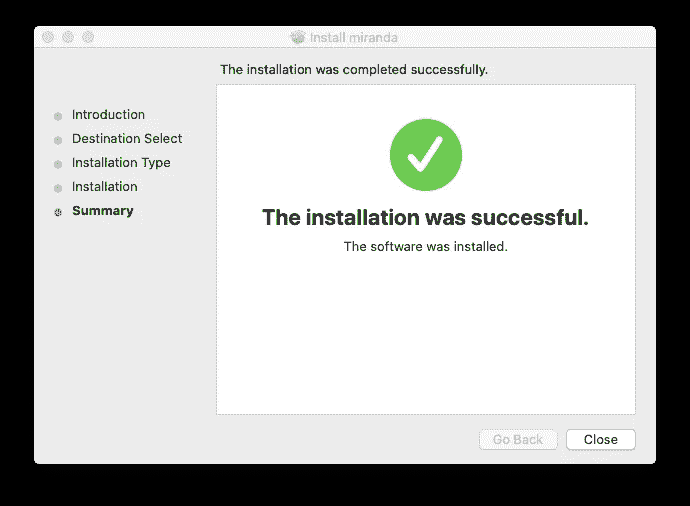

如果你愿意，你可以删除下载的文件。

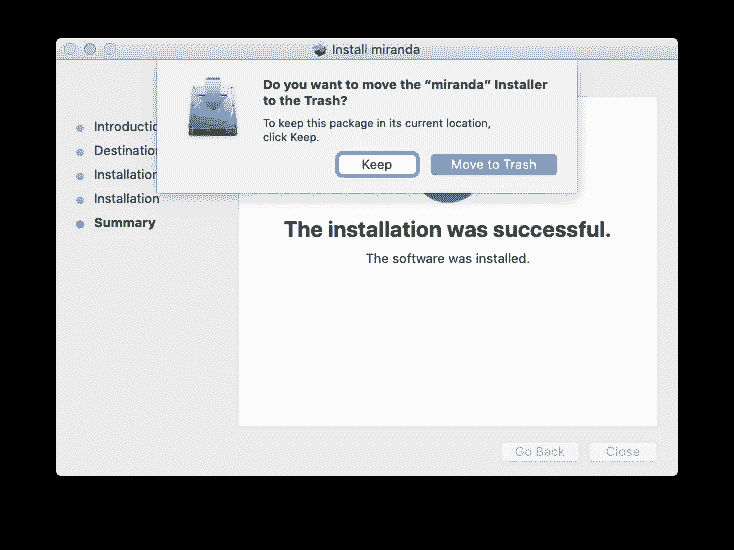

点击按钮移至垃圾桶。

当我尝试在 MacBook Pro 上运行 mira 时，我失败了，并显示错误消息“可执行文件中的 CPU 类型错误:mira”。

```
zhijunsheng@mbp2012 ~ % sw_vers
ProductName: Mac OS X
ProductVersion: 10.15.2
BuildVersion: 19C57
zhijunsheng@mbp2012 ~ % mira
zsh: bad CPU type in executable: mira
```

当我在 MacBook Air 上用 High Sierra 再次尝试时，我很幸运。

```
an-macair:~ donaldsheng$ sw_vers
ProductName: Mac OS X
ProductVersion: 10.13.2
BuildVersion: 17C205
an-macair:~ donaldsheng$ mira
```

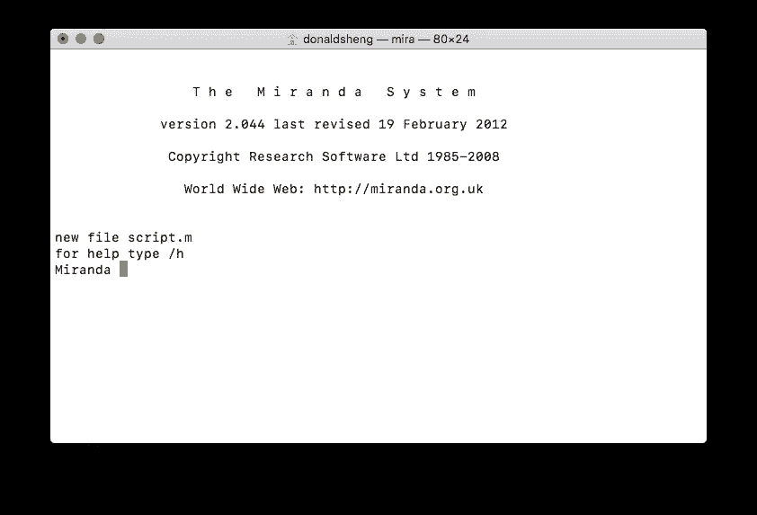

酷米兰达 2.044 现已准备就绪。是的，它非常类似于 Haskell。

```
Miranda 3 + 2
5
Miranda [1,2,3,4] ++ [7,7,7]
[1,2,3,4,7,7,7]
Miranda sin (pi/6)      
0.5
Miranda sum [1..100]
5050
Miranda product [1..5]
120
```

然而，要定义一个函数，你必须使用一个文件。

hello.m 文件包含一行:

```
double x = x + xan-macair:~ donaldsheng$ export PS1="👍 "
👍 vim hello.m
👍 mira hello.m

Miranda double 7
14
```

[函数式编程语言的一些历史—David Turner(Lambda Days 2017)](https://youtu.be/QVwm9jlBTik)

[CSE 341 —编程语言—2006 年秋季
米兰达](https://courses.cs.washington.edu/courses/cse341/06au/miranda/miranda-basics.html)