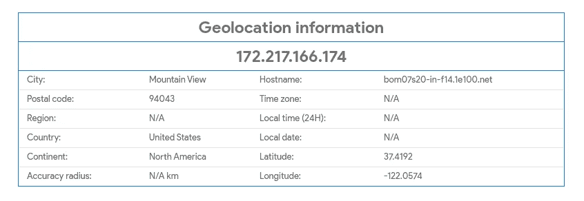
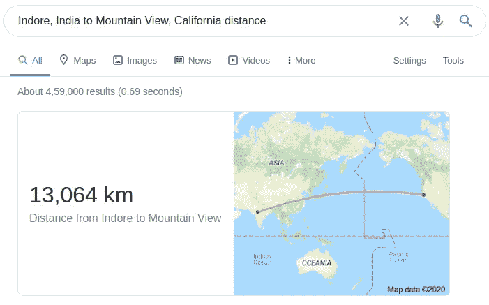

# 喂，你是谁？anycast IP 技术的魔力&为什么有些应用感觉比其他应用快得多

> 原文：<https://medium.com/analytics-vidhya/hello-who-is-this-the-magic-of-anycast-ip-technology-why-some-apps-feel-much-faster-than-others-acaa08b127b5?source=collection_archive---------17----------------------->

互联网是双向的。一种让我们的计算机与他人的计算机对话的通信协议。但是在这个拥有数十亿设备的庞大世界里，我们到底在和谁说话呢？

要回答这个，我们再问一个问题。YouTube 在哪里？你已经知道，当你打开 YouTube 的应用程序或网站时，你会连接到 YouTube 的服务器。但那究竟是在哪里呢？让我们使用名为“host”的命令来找出答案

```
aayush@aayush-System-Product-Name:~$ host youtube.com
youtube.com has address 172.217.166.174
youtube.com has IPv6 address 2404:6800:4007:80e::200e
...
```

好吧！YouTube 希望我在以下地址与它对话:172.217.166.174(或 2404:6800:4007:80e::200e。[为什么有两个 IP 地址？](https://en.wikipedia.org/wiki/IPv4_address_exhaustion))。IP 地址是根据地理位置分配的。因此，很容易查找特定 IP 地址被“路由”到哪里。让我们找出这个 IP 地址的去向



与 https://gsuite.tools/ip-location 的[一起生成](https://gsuite.tools/ip-location)

所以这个 IP 地址注册在美国加州山景城。这意味着当我向 YouTube 的服务器发送消息时，它应该会在美国加利福尼亚州的山景城结束。

现在让我们尝试使用“ping”命令 ping 这个 IP 地址

```
aayush@aayush-System-Product-Name:~$ ping 172.217.166.174
PING 172.217.166.174 (172.217.166.174) 56(84) bytes of data.
64 bytes from 172.217.166.174: icmp_seq=1 ttl=118 time=30.3 ms
```

所以一条信息从我的电脑到这个 ip 地址来回需要 30.3 毫秒。或者单程大约 15.15 毫秒。加州到底有多远？我现在在印度的印多尔。



那大约是 13064 公里。出于好奇，让我们来计算一下这条信息传播的速度。既然是往返，那我们就把那 13064 公里翻倍到 26128 公里。

```
26128 divided by 0.0303 = 862310.231023 kilometers per second862310 kilometers per second = 862310000 meters per second862310000 can also be written as 8.6231 * 10^8
```

互联网确实非常快！如果你在高中时关注过物理，你现在会咯咯地笑，因为上面的计算也是不可能的。光速只有每秒 3 * 10⁸米。那我们怎么会得到几乎 3 倍光速的响应呢？人类已经发现了超光速技术吗？

很抱歉让你失望了，但真正的答案并不令人兴奋:traceroute 是一个谎言。我们被骗了。我们从未与 IP 地址为 172.217.166.174 的服务器联系过。我们的连接被劫持，重新路由到一个完全不同的 IP 地址，我们的互联网服务提供商刚刚骗了我们。它告诉我们的电脑回复来自 172.217.166.174，但实际上回复来自其他地方。

这是因为 172.217.166.174 是一个特殊的“任意播”地址。您的互联网服务提供商有一个像这样的特殊 IP 地址的数据库。当您连接到互联网上的这些特殊地址之一时，您的互联网服务提供商将简单地对您撒谎。它会告诉你，你正在与这个 IP 地址交谈，但事实上，实际发生的是，根据数据库，你实际上连接到一个不同的地址。而且这个数据库全世界都不一样。

例如，印度互联网服务提供商 Airtel 可能有一个数据库，显示所有发往 172.217.166.174 的邮件都被欺骗到位于印度钦奈的某个 IP 地址 X.Y.Z.A。但是英国 ISP 的数据库可能会告诉它将同一个 IP 地址伪造成位于英国伦敦的 X.Y.Z.B。因此，事实上，取决于你从哪里连接，你将与两台完全不同的计算机对话。

这甚至可能比这更细粒度。印度诺伊达的用户可能被重定向到新德里的服务器，而印度浦那的用户可能被重定向到印度孟买的服务器(以下是谷歌拥有的所有位置:[https://cloud.google.com/vpc/docs/edge-locations](https://cloud.google.com/vpc/docs/edge-locations)

事实上，您可能根本不会被重定向到另一个数据中心！有新的云技术试图将数据中心直接放入你的互联网服务提供商的数据中心(【https://aws.amazon.com/edge/】T2)。谷歌甚至正在研究 5G 技术，将服务器直接放在 5G 塔内！([https://www . Forbes . com/sites/janakiramsv/2020/03/09/a-closer-look-at-Google-5g-mobile-edge-cloud-strategy/# 50 a2 c 0923 fa 4](https://www.forbes.com/sites/janakirammsv/2020/03/09/a-closer-look-at-googles-5g-mobile-edge-cloud-strategy/#50a2c0923fa4))

边缘计算技术将服务器尽可能靠近用户，以实现个位数甚至亚毫秒级的延迟。这就是为什么当你打开像 YouTube 这样的应用程序时，你正在连接到最近的位置。这反过来导致更高的速度和更低的延迟。

许多专家对这种亚毫秒级边缘计算技术抱有很高的期望。随着谷歌 Stadia 的出现，这些期望已经成为现实，谷歌 Stadia 可以让你从云中播放视频游戏！在未来，预计这项技术将有助于把人工智能带到你身边。因此，当你的 5G 谷歌像素 8 拍照时，它可能不是在你的设备上处理，而是在附近的 5G 塔上处理！多酷啊。

点击此处了解更多信息:

1.  [边缘的 AWS](https://aws.amazon.com/edge/#:~:text=AWS%20edge%20computing%20services%20provide,onto%20customer%2Downed%20devices%20themselves.)
2.  [近距离观察谷歌的 5G 移动边缘云战略](https://www.forbes.com/sites/janakirammsv/2020/03/09/a-closer-look-at-googles-5g-mobile-edge-cloud-strategy/#662dc0f3fa40)
3.  [Cloudflare 工人站点](https://workers.cloudflare.com/sites)

敬请关注后续的高级文章，我们将讨论负载平衡、自动故障转移和扩展、内容交付以及使用 Anycast IPs 主干的更多内容

也可以看看我以前的文章:[部署&用 gunicorn 优化你的 Django 部署(为什么我不能直接用 manage.py runserver？)](/@aayushagra101/deploying-optimizing-your-django-deployment-with-gunicorn-why-cant-i-just-use-manage-py-3ecb72cd6882)

要与我联系:

[https://twitter.com/AgentAayush](https://twitter.com/AgentAayush)

[](https://www.linkedin.com/in/aayushagrawal101/) [## Aayush Agrawal - Python 开发者-proton shub Technologies | LinkedIn

### 查看 Aayush Agrawal 在全球最大的职业社区 LinkedIn 上的个人资料。Aayush 有 2 份工作列在…

www.linkedin.com](https://www.linkedin.com/in/aayushagrawal101/)