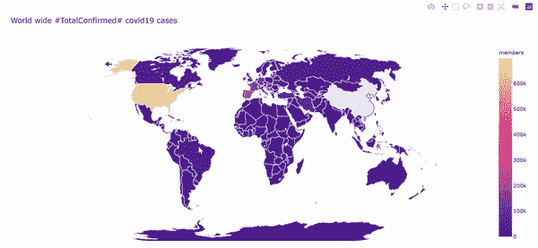
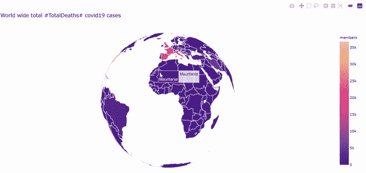
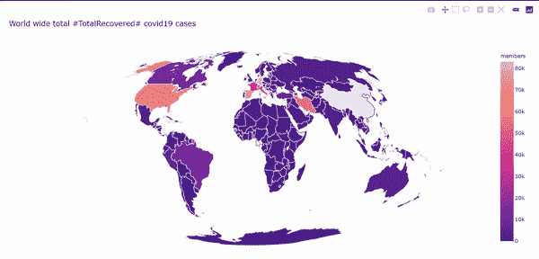
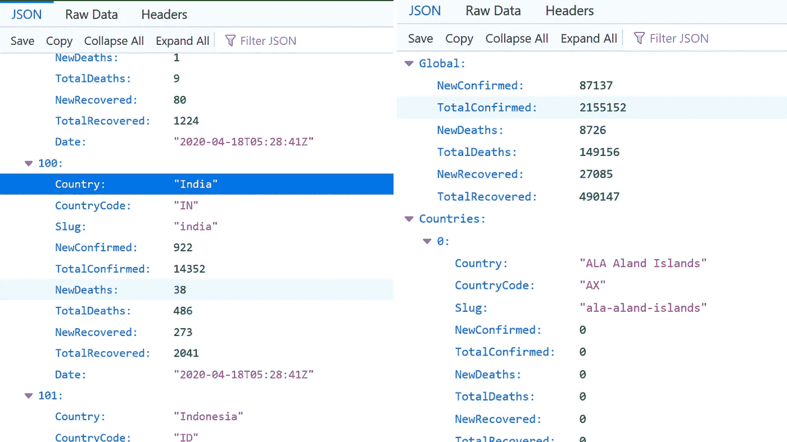
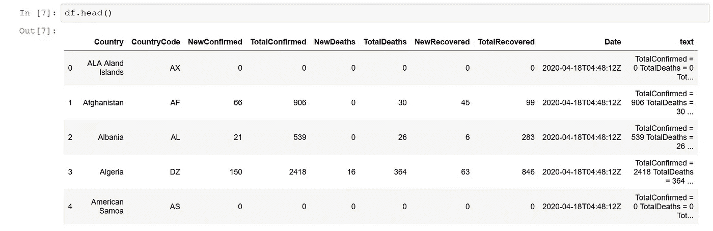
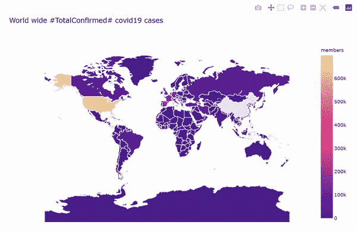

# 使用 COVID19 API 的 Hello World 新冠肺炎直播可视化和使用 Plotly 的 Python 地理 Choropleth 地图

> 原文：<https://medium.com/analytics-vidhya/hello-world-covid19-visualization-eb6736e1dec?source=collection_archive---------12----------------------->

## 想象新冠肺炎的爆发



**新冠肺炎确诊病例总数**



**新冠肺炎死亡总数**



**新冠肺炎完全康复**

## **简介:**

我是一名数据科学和机器学习爱好者。希望我没有在这里写意大利面条代码…！

这里我们可以通过 plotly 交互式地可视化新冠肺炎疫情。只有通过数据可视化，才能更好地吸收信息。因此，可视化在数据表示中是最重要的。

让我们进入主题…..

## 进口:

我们将从导入创建可视化所需的所有模块开始。

此处，数据收集通过 API 完成，因此' *urllib3，请求'*'被导入，对于绘图' plotly '导入是必需的，对于数据存储和访问' csv '和' pandas '被导入。

```
import urllib3
import csv
import requests
import plotly as py
import plotly.graph_objs as go
from plotly.offline import download_plotlyjs,init_notebook_mode, plot, iplot
init_notebook_mode(connected=True)
import pandas as pd
```


你不必重新发明轮子。

获取数据的方式有很多，我们可以通过 **web 抓取、**[**ka ggle**](https://www.kaggle.com/)**、API 的**来获取。但是这里我们通过一个 API ( [这里](https://api.covid19api.com/summary))。首先，我通过 kaggle 数据集构建了这个，而不是我朋友建议的 API。为什么呢..自己去发现😜…为什么？因为如果我们使用数据集，我们不必重新发明轮子，我们需要每次都更新数据集，而不是我们可以使用 API，通过 API 我们可以获得实时更新的数据。

## 要从 API 获取数据:

用**请求**发出请求， **r** 是我们的响应对象。我们可以从这个物体中得到我们需要的所有信息。

```
href = "[https://api.covid19api.com/summary](https://api.covid19api.com/summary)"
r = requests.get(href)
json_data = r.json()
```

JSON 数据看起来像



通过 API 的 JSON 数据

这里我们将 json 复制到 csv 文件，因为它易于操作和使用。writerow 模块用于写入行，我们迭代通过***JSON _ data[' Countries ']***来获取 *Country，CountryCode，NewConfirmed，TotalConfirmed，NewDeaths，TotalDeaths，NewRecovered，TotalRecovered，Date。*

```
fname = "output.csv"with open(fname,"w") as file:
    csv_file = csv.writer(file)
    csv_file.writerow(["Country","CountryCode","NewConfirmed","TotalConfirmed"
                       ,"NewDeaths","TotalDeaths","NewRecovered","TotalRecovered","Date"])
    for item in json_data['Countries']:
        csv_file.writerow([item['Country'],item['CountryCode'],                           
                           item['NewConfirmed'],item['TotalConfirmed'],
                           item['NewDeaths'],item['TotalDeaths'],item['NewRecovered'],
                   item['TotalRecovered'],item['Date']])df= pd.read_csv("outputbyJSON.csv",encoding='ISO-8859-1')
```



资料组

# **地理绘图**

地图是使用我们导入的 Plotly 的 graph_objs 模块绘制的。它需要两个必须作为参数传递的重要参数，即数据和布局。这些参数中的每一个都包含一个参数和自变量的字典。

## 初始化数据变量。

```
 data = dict(type = 'choropleth',
           locations = df['Country'],
            locationmode = 'country names',
            z = df['TotalConfirmed'],
            text = df['Country'],
            colorscale= 'agsunset',
            reversescale = False,
            marker = dict(line = dict(color='white',width=1)),

            colorbar = {'title':'members'}
           )
```

> 类型:“choropleth”指定我们正在绘制 choropleth 地图。
> 
> 位置:我们要绘制的国家的名称。
> 
> locationmode:它指定绘图级别是国家级的。该值可以是以下三个值之一:“ISO-3”、“美国-州”、“国家名称”。
> 
> colorscale:用于绘制地图的颜色集。可用的色标有“灰色”、“YlGnBu”、“绿色”、“YlOrRd”、“蓝色”、“RdBu”、“红色”、“蓝色”、“野餐”、“彩虹”、“波特兰”、“喷气机”、“热”、“黑体”、“地球”、“电”、“绿色”、“公民”
> 
> text:悬停时需要为每个国家显示的文本信息。
> 
> z:用于区分国家/地区的值或因子。色标使用这些值。
> 
> colorbar:用于定制 colorbar 显示的参数和自变量的字典。用于控制颜色条的属性，如长度、标题、轴等。

## 初始化布局变量。

```
layout = dict(title = 'World wide #TotalConfirmed# covid19 cases',
             geo = dict(showframe = False,
                       projection = {'type':"miller"})
             )
```

> geo:该参数设置地图布局的属性。scope 参数设置地图的范围。范围可以有 7 个值中的任何一个-"世界" | "美国" | "欧洲" | "亚洲" | "非洲" | "北美" | "南美"。
> 
> **使用的投影类型:**
> 
> 完全确认— →“自然地球”
> 
> 总死亡数— →“正投影”
> 
> 对于完全恢复—→“moll weide”

## 通过将数据和布局作为参数传递来初始化 Figure 对象。

```
choromap = go.Figure(data=[data],layout=layout)
```

## 绘制地图。

```
#to plot inline
iplot(choromap) #to generate a output file
plot(choromap,validate=False,filename='TotalConfirmed.html')
```



新冠肺炎确诊病例总数

我们需要更改数据对象中的“ **Z** ”因子，以获得总死亡数和总恢复数，图表显示在顶部。

# 您可以从以下网址获得来源

GitHub—→[https://GitHub . com/Mogileeswaran/covid 19-Visualization-Using-Geographic-Choropleth-Maps-in-Python-Using-plotly . git](https://github.com/Mogileeswaran/COVID19-Visualization-using-Geographic-Choropleth-Maps-in-Python-Using-Plotly.git)

# 联系人:

insta gram—→[https://www.instagram.com/mogileeswar_rockzz/](https://www.instagram.com/mogileeswaran_m/)

GitHub—→[https://github.com/Mogileeswaran](https://github.com/Mogileeswaran)

推特—→[https://twitter.com/mogileeswaran_m](https://twitter.com/mogileeswaran_m)

https://www.facebook.com/MOGILEESWARAN.M 的脸书— →

# 参考资料:

[](https://plotly.com/python/choropleth-maps/) [## Choropleth 地图

### 如何用 Plotly 在 Python 中制作 choropleth 地图？

plotly.com](https://plotly.com/python/choropleth-maps/) [](https://analyticsindiamag.com/beginners_guide_geographical_plotting_with_plotly/) [## Plotly 地理绘图初学者指南

### 数据科学最酷和最有创意的事情之一是可视化。这是我们运用专业技能的地方…

analyticsindiamag.com](https://analyticsindiamag.com/beginners_guide_geographical_plotting_with_plotly/) [](https://covid19api.com/) [## 冠状病毒 COVID19 API

### 通过简单的 API 免费访问 COVID19 上的数据。构建仪表板、移动应用程序或集成到其他…

covid19api.com](https://covid19api.com/)  [## 如何将 json 数据从远程 url 获取到 Python 脚本中

### 要从远程或本地网站获取 json 输出数据，方法 1 从 URL 获取数据，然后调用 json.loads，例如…

www.powercms.in](https://www.powercms.in/blog/how-get-json-data-remote-url-python-script)