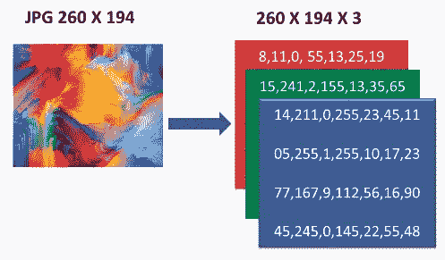
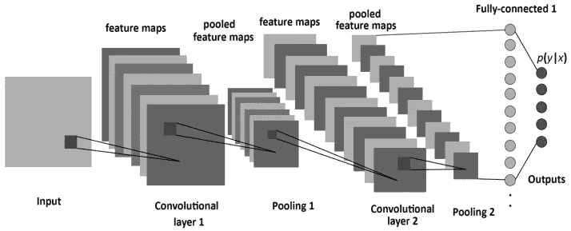
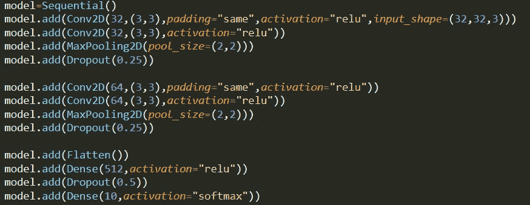

# 图像识别中的“Hello World”

> 原文：<https://medium.com/analytics-vidhya/hello-world-in-image-recognition-136eba581464?source=collection_archive---------8----------------------->

随着人工智能和人工智能新时代的到来，在图像识别、自动化、自然语言处理和物体检测领域进行了大量的研究和项目。

物体检测(图像识别的外推)

人工智能的应用是无限的。它们可以用来自动化不同的密切相关的活动，给人类带来更多的舒适。图像识别是人工智能的关键要素之一。有没有注意到脸书是如何立即认出你朋友的脸，并问你是否想在照片中给他做标记的？从控制无人驾驶汽车到为生物识别访问进行人脸检测，图像识别有助于根据训练好的算法对对象进行处理和分类。那么，让我们创建一个图像识别分类器，来简单介绍一下这个领域。

# 先决条件

1.  python-基本语法

# **工具和技术**

1.  **巨蟒**
2.  **文字编辑**(Sublime)-[https://www . Sublime Text . com/Sublime % 20 Text % 201.4% 20 setup . exe](https://www.sublimetext.com/Sublime%20Text%201.4%20Setup.exe)
3.  **Keras** - pip 安装 Keras
4.  **张量流**-[https://www.tensorflow.org/install/install_windows](https://www.tensorflow.org/install/install_windows)
5.  **卷积神经网络-**[https://adeshpande 3 . github . io/A-初学者% 27s-理解指南-卷积神经网络/](https://adeshpande3.github.io/A-Beginner%27s-Guide-To-Understanding-Convolutional-Neural-Networks/)

# **准备…稳定…开始…**

我们将使用 CIFAR-10 数据集开发一个图像识别系统。该过程主要由两个步骤组成

1.  创建和保存训练模型
2.  加载训练好的模型进行分类

# 如何着手去做？

1.  导入库
2.  加载数据集并将其拆分
3.  正常化
4.  设计神经网络架构
5.  编译模型
6.  训练模型
7.  保存神经网络模型和权重
8.  加载保存的模型和权重
9.  测试

# 导入库

我们将使用由 **keras** 提供的不同模块，因此我们需要首先导入它们。每个导入模块的使用将在相应模块的实现部分中得到理解。

# **加载数据集**

Keras 由库中的一些数据集组成。我们将使用其中一个名为 **CIFAR-10** 的。CIFAR-10 数据集由 **60000** 张**32×32 像素大小**的彩色图像组成 **10 类**，每类 6000 张图像。Keras 具有 load_data()函数，该函数以 **5:1 的比率**将 CIFAR 图像作为训练和测试分割数据返回。

**偷窥图像-**

图像基本上是三个通道的组合，即红色、蓝色和绿色。这些通道中的每一个的不同量一起构成适当的颜色。它可以用数值矩阵的形式来表示。

# **正常化**

我们现在将数值转换成'**浮点型**'类型。下一步是标准化数据，即从**【0，255】转换到【0，1】**。由于自变量在向量(整数)中，我们将其转换为二进制类矩阵。

# **设计神经网络架构**

我们选择模型为**顺序**，即一层的输出到下一层。还有其他模型，其中的连接是非顺序的。

卷积神经网络的基本构造块是卷积块。卷积块包括:-

1.  **卷积层(基本使用-平移不变性)**

平移不变性-它是当 ML 模型能够识别一个对象而不管它是否在图像中移动(放置)时的属性。

网络的顶层识别简单模式(线、边),底层识别密集模式。

“粗略的想法是，我们不断用每个卷积层压缩图像，同时从中捕捉最重要的信息。”

注意——但这并不意味着增加层数就能提高精度。这是一个反复试验的过程。

对于图像类型的数据，我们使用 **Conv2D** 层。如果我们处理的数据是一维的，比如声波，那么我们使用 Conv1D。这里我们使用 Conv2D 层，在这里我们分别定义了**数量的滤镜**、**窗口平铺尺寸**、**填充**、**激活函数、**和**输入形状**。由于我们使用的图像尺寸为 32×32，有 3 个通道，因此我们相应地定义了第一层的输入形状。

为什么我们基本都用**填充**？-可能发生图像的长度不能被窗口小块的尺寸整除的情况(这里我们使用 **(3，3)** 窗口，图像的长度是 **32** 像素)，在这种情况下，我们的一些边缘可能会保持未使用，这是一个问题，因为我们的对象可能在整个图像的任何地方。

**激活函数** -它定义了前一层的哪个节点的输出对于下一层的输入是重要的。**Relu**’(校正线性单位)是最常用于图像的激活功能。在神经网络结构的最后一层，我们使用 max 的**激活函数，因为它确保最后一层的所有输出加 1。**

**展平层-** 是 Conv2D 和密集层之间的过渡。它主要描述了我们正在从 2 D 数据过渡到 1 D 数据的事实。

**密集层-** (又名全连通层)是一个向量矩阵相乘的例子。我们还提到了这一层中需要的输出节点的数量。这里我们提到密集层中的 **10 个节点**，因为有 **10 个类**。

**2。最大汇集层(基本使用-下采样数据)**

**下采样数据**——顾名思义，它基本上只从所有值中选择最大值，从而减少了工作量(计算量和时间)。这里我们使用的池大小为 **(2，2)** ，因此我们从每个(2，2)池中选择最大值进行训练。

**3。辍学层(基本用途-稳健学习)**

**鲁棒学习**——它随机地丢弃神经网络的一些连接节点。这导致神经网络更努力地学习，并且不依赖于单个连接。**【25%-50%】**之间的一个漏接效果很好。

# **编译模型**

在编译过程中，有 3 个基本参数；-

1.  **损失函数**——检验神经网络正确性的函数。损失函数有很多种。这里我们将使用'**分类交叉熵**，它用于分类因变量。二元因变量还有'**二元交叉熵**'。
2.  **优化器** -优化算法帮助我们**最小化(或最大化)**一个**目标**函数，它只是模型中使用的**因变量(Y)** 和**自变量(X)** 之间的数学关系。如果想要快速收敛并训练深度神经网络模型或高度复杂的神经网络，则应使用 **Adam 或任何其他自适应学习速率技术**，因为它们优于所有其他优化算法。
3.  **指标**——就这么简单，这些是我们的神经网络测试的参数。这里我们使用**精确度**作为衡量标准。

# **训练模型**

如果我们需要检查我们的模型实际上是什么样子，它有什么特征，那么我们使用**摘要**来了解这个模型。它描述了我们的模型已经识别的**可训练参数**。我们还可以知道每个卷积层后的**输出形状**。

最后，我们使用**拟合**方法来拟合我们的模型，并开始训练它。这些参数包括**训练数据** (x_train 和 y _ train)**测试数据** (x_test 和 y_test)以及其他不同的参数。

**批次大小**表示在一个批次中要拍摄多少幅图像用于学习。通常批量大小从 **32** 到 **128** 不等。

我们需要多次重复训练以提高精确度，这是通过使用**时期**来完成的。大多数情况下，观察到数据集越大，历元越少(但不总是如此)。

为了确保我们避免由于训练数据的顺序而在训练中出现任何类型的重合，我们使用**打乱**默认的训练数据集。

**注意-训练时，损耗应减少，准确度应增加。如果不是这样，那么尝试使用不同的数据集、不同的神经网络结构或调整您的参数。**

# **保存神经网络模型和权重**

在最后一步，我们保存模型，即神经网络**结构**以及**权重**。该结构保存在**中。json** 格式，而权重以 **hdf5** (.h5)格式存储。hdf5 格式用于存储大型二进制文件。

# **加载保存的模型和重量**

在代码的下一部分，我们导入所有在测试部分使用的模块。代码中的**类标签**以**的特定顺序**出现。

我们需要指定。json 和. h5 文件放在它们各自的路径中。装载步骤包括**装载结构**以及**重物**。

# **测试**

这是我们实际上正在等待的代码部分。首先，我们加载测试图像，并使用**目标尺寸**将其转换为与训练模型图像的尺寸相匹配。因此，我们将图像标准化，并将其转换成一个 **NumPy 数组**进行测试。

我们使用扩展维度函数，因为预测函数接受 **4 D** 输入。4 D 基本上是**图像列表**的**第一个**维度，其他 **3** 代表**图像**。

预测函数分别给出所有**类**及其**可能性**的集合。使用 **argmax** 函数，我们选择具有最大可能性的类。

# **结论**

我们已经创建了一个简单的图像识别分类器。我们可以用同样的方法来训练我们选择的数据和网络。图像识别用于执行大量基于机器的视觉任务，例如图像标记、内容搜索和引导自主机器人、自动驾驶汽车和事故避免系统。

# **最有趣的部分**

GitHub Link-[https://github.com/sidvsukhi/Image-Recognition-CIFAR-10](https://github.com/sidvsukhi/Image-Recognition-CIFAR-10)