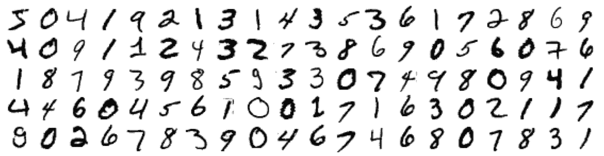
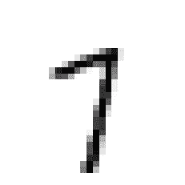

# 你好，计算机视觉世界:MNIST 手写数字分类

> 原文：<https://medium.com/analytics-vidhya/hello-world-of-computer-vision-mnist-handwritten-digit-classification-a5c28f6276e1?source=collection_archive---------17----------------------->


照片由[波普&斑马](https://unsplash.com/@popnzebra?utm_source=unsplash&utm_medium=referral&utm_content=creditCopyText)在[挡泥板](https://unsplash.com/s/photos/handwritten?utm_source=unsplash&utm_medium=referral&utm_content=creditCopyText)上拍摄

在这个故事中，我们将处理传说中的 MNIST 数据集。这个数据集在机器学习初学者中相当受欢迎。事实上，这个数据集如此受欢迎，以至于它经常被称为机器学习或计算机视觉的**“Hello World】**。

这个故事也将给出一个关于机器学习中分类问题的思路。最后，你将能够回答一些关于如何处理多类分类的常见问题？应该使用什么性能指标？如何提高性能？。

**目录**

1.  引言。
2.  导入库。
3.  正在加载数据集。
4.  探索数据集。
5.  将数据集分成训练集和测试集。
6.  二元分类。
7.  多类分类。
8.  分析。

# **1。简介**

修改后的国家标准与技术研究所(MNIST)数据集是一个由 70，000 幅手写数字图像组成的大型数据集。该数据集是通过修改原始 NIST 数据集创建的。最初的 NIST 数据集包含美国人口普查局员工用于训练的手写数字，而测试集包含高中生写的数字，这使得数据集不适合机器学习。因此，数据集被修改，以便训练和测试集包含人口普查局员工和高中生写的数字。

我们的工作是建立一个能够识别这些手写数字的分类器。所以让我们开始吧。

# 2.导入库

首先，我们需要导入所需的库，对于我们的任务，我们将主要使用 *NumPy* 、 *pandas、scikit-learn* 和 *matplotlib* 库。

```
*# for handling arrays and dataframe*
**import** **numpy** **as** **np** 
**import** **pandas** **as** **pd***# for ploting***import** **matplotlib** **as** **mpl**
**import** **matplotlib.pyplot** **as** **plt***# to load data*
**from** **sklearn.datasets** **import** fetch_openml*# to standardize data*
**from** **sklearn.preprocessing** **import** StandardScaler*# for Cross validation and Grid Searching* **from** **sklearn.model_selection** **import** cross_val_score, cross_val_predict, GridSearchCV*# classifiers* **from** **sklearn.linear_model** **import** LogisticRegression
**from** **sklearn.multiclass** **import** OneVsOneClassifier
**from** **sklearn.ensemble** **import** RandomForestClassifier
**import** **xgboost**
**from** **xgboost** **import** XGBClassifier
**from sklearn.neighbors import** KNeighborsClassifier*# metrics to evaluate models* **from** **sklearn.metrics** **import** precision_score, recall_score, f1_score, confusion_matrix
```

# 3.正在加载数据集

我们可以从多个来源下载数据，也可以使用 Scikit-Learn 库。现在，我们将使用后一个选项，因为它非常简单。人们可以使用 Scikit-Learn 提供的帮助函数下载许多流行的数据集。代码如下:

```
***#from sklearn.datasets import fetch_openml***mnist = fetch_openml('mnist_784')
mnist.keys() ***#to get keys***
```

Out[1]:

```
dict_keys(['data', 'target', 'frame', 'feature_names', 'target_names', 'DESCR', 'details', 'categories', 'url'])
```

# **4。探索数据。**

让我们将数据分解成独立和相关(目标)变量。

```
X,y= mnist["data"],mnist["target"]
print(X.shape,y.shape)
```

Out[2]:

```
(70000, 784) (70000,)
```

因此，我们的数据有 784 个特征，这意味着每张图像有 784 (28x28)个像素。这意味着图像非常小。并且由于图像是黑白的，每个特征将具有 0 到 255 之间的值。

现在让我们看看这些图像。

```
**def** showDigits(instances, images_per_row=20):
    images_per_row = min(len(instances), images_per_row)
    images = [instance.reshape(28,28) **for** instance **in** instances]
    n_rows = (len(instances) - 1) // images_per_row + 1
    row_images = []
    n_empty = n_rows * images_per_row - len(instances)
    images.append(np.zeros((28, 28 * n_empty)))
    **for** row **in** range(n_rows):
        rimages = images[row * images_per_row : (row + 1) * images_per_row]
        row_images.append(np.concatenate(rimages, axis=1))
    image = np.concatenate(row_images, axis=0)
    plt.imshow(image, cmap = mpl.cm.binary)
    plt.axis("off")

plt.figure(figsize=(20,10))
example_images = X[:100]
showDigits(example_images)
plt.show()
```

Out[3]:



在继续之前，让我们仔细看看。

```
randDigit = X[27]
randDigitImage = randDigit.reshape(28,28)
plt.imshow(randDigitImage, cmap=mpl.cm.binary, interpolation = "nearest")
plt.axis("off")
plt.show()
```


这个很清楚，我们可以说它是一个“3”。但并非每个数字都是如此。

```
y[27]
```

Out[4 ]:

```
'3'
```

正如我们所料，它被标记为 3。让我们看另一个图像。

```
randDigit = X[27]
randDigits=np.array([randDigit,randDigit2])"""***lookout for this in later code"""***randDigitImage = randDigit.reshape(28,28)
plt.imshow(randDigitImage, cmap=mpl.cm.binary, interpolation = "nearest")
plt.axis("off")
plt.show()
```



现在，这个看起来有点混乱，不管它是 1 还是 7。嗯，看起来更像是 7。我们去看看。

```
y[42]
```

Out[ 5]:

```
'7'
```

嗯，我们猜对了，但电脑可能不会。

还有，这里有一点要注意，我们的标签是字符串值，让我们把它们转换成整数值。

```
y=y.astype(np.uint8)
```

# 5.将数据集分成训练集和测试集。

MNIST 数据集已经分为训练集和测试集。前 60，000 个值用于训练，其余 10，000 个值用于测试。集合已经为我们洗牌，这意味着所有交叉验证折叠将包含每个数字的实例。

```
XTrain, XTest, yTrain, yTest = X[:60000],   X[60000:],y[0:60000],y[60000:]
```

# 6.二元分类。

在构建多类分类器之前，让我们尝试为数字 3 构建一个二元分类器。这个分类器将预测一个给定的数字是否是“3”。

```
yTrain_3, tTest_3 = (yTrain==3), (yTest==3)
```

这将创建该任务所需的目标向量。

让我们挑选一个分类器并训练它。我们可以用逻辑回归。因此，让我们创建一个逻辑回归器，并对整个训练数据进行训练。

```
lr_clf = LogisticRegression(random_state=42)
lr_clf.fit(XTrain, yTrain_3)lr_clf.predict(randDigits)
```

Out[ ]:

```
array([ True, False])
```

我们的模型预测 3 为真，7 为假。很好，不是吗！让我们用交叉验证分数来了解更多。

```
cross_val_score(lr_clf, XTrain, yTrain_3, cv=3, scoring="accuracy")
```

Out[ ]:

```
array([0.9714 , 0.97265, 0.9716 ])
```

看起来好得难以置信。准确率达到 97%以上是相当惊人的。等等，让我们看看混乱矩阵。

```
yPred_3 = cross_val_predict(lr_clf, XTrain, yTrain_3, cv=3)
confusion_matrix(yTrain_3, yPred_3)
```

Out[ ]:

```
array([[53201,   668],
       [ 1019,  5112]])
```

现在不太好了。让我们也检查一下 f1 的分数。

```
f1_score(yTrain_3, yPred_3)
```

Out[ ]:

```
0.8583662161027621
```

事实是，我们的模型有超过 95%的准确率，因为只有大约 10%的图像是数字“3”。这就是为什么我们不喜欢将准确度作为分类器的性能度量。

我们总是可以通过使用更复杂的算法或调整一些超参数来增加我们的分数。现在让我们转到多类分类器。

# 7.多类分类。

我们的工作是对一个给定的数字进行分类，也就是说我们需要区分 10 个类别。我们可以通过使用能够直接处理多个类的分类器来实现这一点，或者我们可以使用带有二元分类器的*一对一(OvA)* 策略。

让我们先试试 OvA。

```
ovr_clf= OneVsRestClassifier(LogisticRegression(random_state=42))
ovr_clf.fit(XTrain,yTrain)
ovr_clf.predict(randDigits)
```

Out[ ]:

```
array([3, 7], dtype=uint8)
```

我们的新模型正确预测了数字“3”和“7”。让我们检查它的交叉验证分数。

```
cross_val_score(ovr_clf,XTrain, yTrain,cv=3, scoring="accuracy")
```

Out[ ]:

```
array([0.90935, 0.9073 , 0.91305])
```

它在所有折叠上都达到了 90%以上的准确率，还不错。但是我们可以通过缩放数据来做得更好。

让我们试试 *KNN 分类器*。

```
knn = KNeighborsClassifier()
knn.fit(XTrain, yTrain)
cross_val_score(knn, XTrain, yTrain, cv=3, scoring="accuracy")
```

Out[ ]:

```
array([0.9676 , 0.9671 , 0.96755])
```

不错！我们的分类器表现良好。我们得到了 96%以上的平均准确率。

我们还将尝试*随机森林分类器*。

```
forest_clf = RandomForestClassifier(random_state=42)
forest_clf.fit(XTrain,yTrain)
```

Out[ ]:

```
array([0.9646 , 0.96255, 0.9666 ])
```

太好了，我们所有折叠的准确率都超过了 96%。

让我们也来看看 *xgboost* :

```
xgboost = XGBClassifier(random_state=42)
cross_val_score(xgboost, XTrain, yTrain, cv=3, scoring="accuracy")
```

Out[ ]:

```
array([0.9315, 0.9301, 0.9335])
```

我们得到了 93%以上的准确率，这比随机森林分类器要低，但仍然是不错的。

我们可以通过*标准化*我们的数据并使用 *GridSearchCV* 方法调整超参数来提高我们模型的性能。

***标准化:***

```
scaler = StandardScaler()
XTrainScaled = scaler.fit_transform(XTrain.astype(np.float64))
cross_val_score(ovr_clf, XTrainScaled, yTrain, cv=3, scoring="accuracy")
```

Out[ ]:

```
array([0.90795, 0.9101 , 0.9126 ])
```

您可以注意到 *ovr_clf* 在标准化数据方面表现稍好。这可能不是一个非常大的改进，但仍然值得一试。

***GridSearchCV :***

让我们在 *KNN 分类器*上尝试 *GridSearchCV* 方法。

```
kRange = list(range(3,8))
weights = ["uniform", "distance"]
param_grid = dict(n_neighbors = kRange, weights = weights)
grid = GridSearchCV(knn, param_grid, cv = 5, verbose=3,scoring = 'accuracy')
grid.fit(XTrainScaled,yTrain)
print(grid.best_params_)
```

Out[ ]:

```
{'n_neighbors': 4, 'weights': 'distance'}
```

让我们看看 best_score_

```
grid.best_score_
```

Out[ ]:

```
0.9782833526566011
```

几乎 98%都很好。

您还应该为其他算法尝试 GridSearchCV 方法。

# 8.分析

我们主要使用了四种分类算法，其中 KNN 表现最好。让我们来分析我们最终的 KNN 模型。

我们来看看*混淆矩阵:*

```
knn_final = KNeighborsClassifier(weights=’distance’, n_neighbors=4)
knn_final.fit(XTrain,yTrain)
yPred = knn_final.predict(XTest)
conf_mx = confusion_matrix(yTest, yPred)
conf_mx
```

Out[ ]:

```
array([[ 973,    1,    1,    0,    0,    1,    3,    1,    0,    0],        [   0, 1132,    2,    0,    0,    0,    1,    0,    0,    0],        [  10,    5,  995,    2,    1,    0,    0,   16,    3,    0],        [   0,    1,    3,  974,    1,   14,    1,    7,    4,    5],        [   1,    5,    0,    0,  950,    0,    4,    3,    0,   19],        [   4,    0,    0,    9,    2,  862,    7,    1,    3,    4],        [   4,    2,    0,    0,    3,    3,  946,    0,    0,    0],        [   0,   17,    4,    0,    3,    0,    0,  994,    0,   10],        [   5,    2,    4,   14,    5,   11,    4,    4,  920,    5],        [   3,    4,    2,    7,    9,    4,    1,   10,    1,  968]])
```

这看起来不错，因为大多数非对角线元素的值为零或很小。此外，这里需要注意的一点是，大多数错误都与以下一对数字有关:

> (1，7)、(2，7)和(4，9)

让我们看看*精度*值

```
precision_score(yTest, yPred, average=None)
```

Out[ ]:

```
array([0.973, 0.96834902, 0.98417409, 0.96819085, 0.97535934,        0.96312849, 0.97828335, 0.95945946, 0.98818475, 0.95746785])
```

我们可以看到，我们的模型在预测时大约有 97%是正确的。

和*召回值*

```
recall_score(yTest, yPred, average=None)
```

Out[ ]:

```
array([0.99285714, 0.99735683, 0.96414729, 0.96435644, 0.96741344,        0.96636771, 0.9874739 , 0.96692607, 0.94455852, 0.95936571])
```

此外，我们的模型能够在大约 97%的时间内检测到这些数字。

那都是我这边的。玩数据永远是一个好习惯。我建议你尝试不同的算法，调整我们在这里使用的模型的参数。这里有很大的改进空间，比如管道的使用、特性选择等等。此外，2017 年发布了一个类似于 MNIST 的扩展数据集，名为 EMNIST。所以你自己试试这个吧。

另外，给你一个专业建议

> 在分类器之前应用 *PCA* 将减少内存消耗和执行时间。

此外，我会喜欢任何建议！这个故事到此为止。

