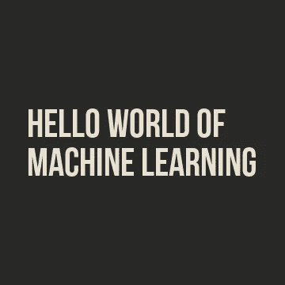
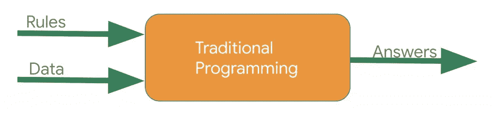
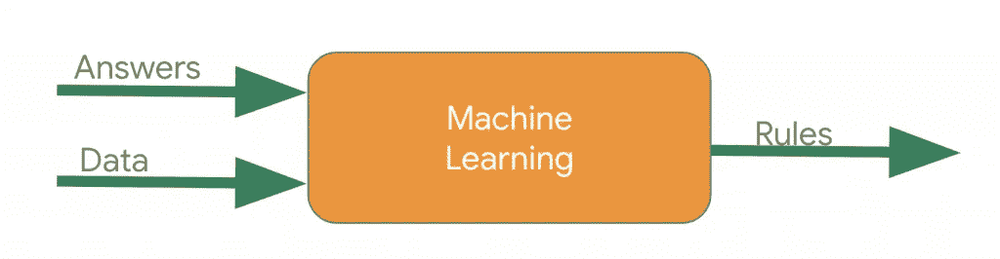
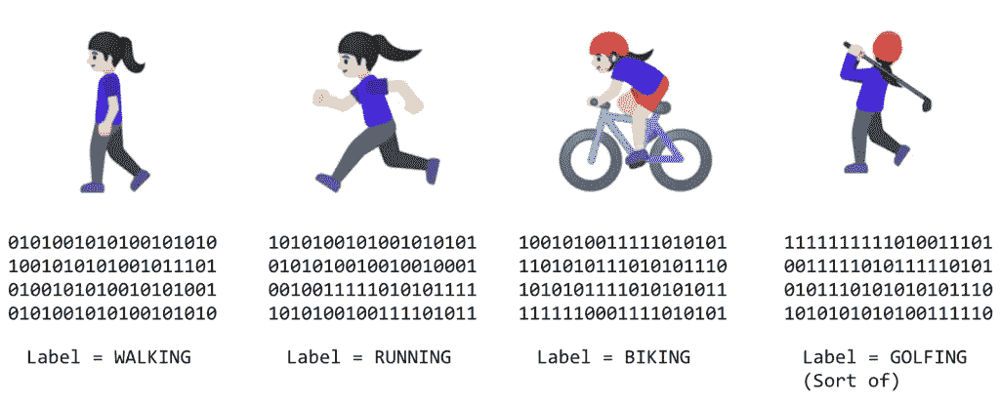
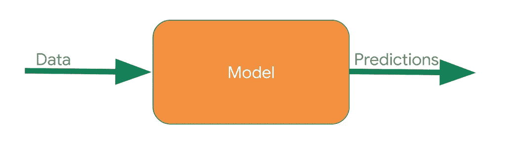
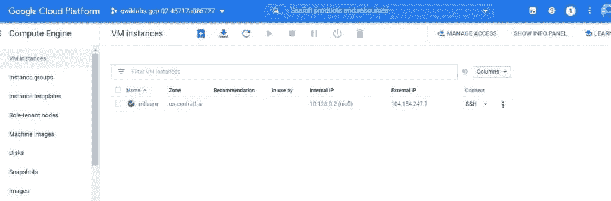
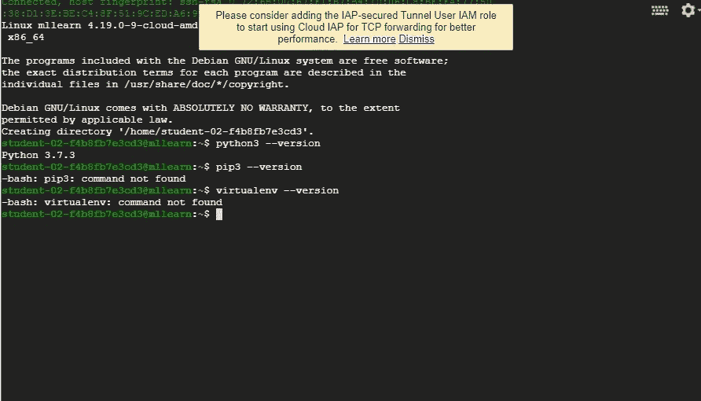
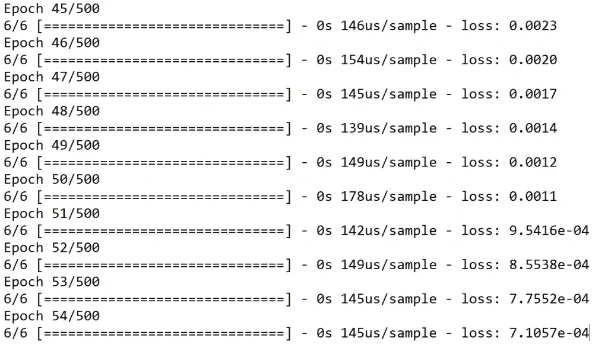
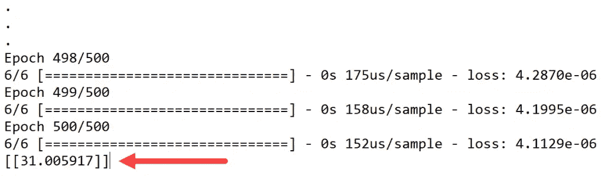

# 使用张量流的机器学习的 Hello World

> 原文：<https://medium.com/analytics-vidhya/hello-world-of-machine-learning-using-tensorflow-fee1318776fe?source=collection_archive---------24----------------------->

让我们学习机器学习中最基本的‘Hello World’。我们将使用 **TensorFlow** ，一个部署在谷歌云平台上的端到端开源机器学习平台。



**机器学习的基础观点**。

考虑以传统方式构建应用程序，如下图所示:



你用编程语言表达**规则**。这些作用于**数据**，你的程序提供**答案**。在活动检测的情况下，规则(您编写的定义活动类型的代码)对数据(人的移动速度)进行操作，以便找到答案——从用于确定用户活动状态(他们是步行、跑步、骑自行车等)的函数返回的值。).通过机器学习检测这种活动状态的过程非常相似，只是轴不同:



不是试图定义规则并用编程语言表达它们，而是提供答案(通常称为标签)和数据，然后机器推断出确定答案和数据之间关系的规则。例如，在机器学习环境中，活动检测场景可能如下所示:



你收集了大量的数据，并给它们贴上标签，有效地说明“这就是走路的样子”，“这就是跑步的样子”等等。然后，计算机可以从数据中推断出决定表示特定活动的不同模式的规则。

除了作为编程这种场景的替代方法，这还使您能够开辟新的场景，例如在基于规则的传统编程方法下可能无法实现的高尔夫场景。

在传统编程中，你的代码被编译成一个二进制文件，这个二进制文件通常被称为**程序**。在机器学习中，你从数据和标签中创建的项目被称为**模型**。

将此结果视为一个模型，它在运行时的用法如下:



您向模型传递一些数据，模型使用它从训练中推断出的规则来做出预测，即“这些数据看起来像走路”、“这些数据看起来像骑自行车”等。

让我们建立一个非常简单的“Hello World”模型，它具有可以在任何机器学习场景中使用的大多数构件。我们将执行以下操作。

*   在 google 云平台上创建虚拟机，设置 Python 开发环境
*   为机器学习模型创建脚本
*   训练你的神经网络
*   测试您的模型

转到谷歌云平台控制台

设置虚拟机以执行实验任务。

1.  选择**导航菜单** > **计算引擎**，然后点击**虚拟机实例**。
2.  在**创建名为 **mllearn** 的实例**对话框中，在右窗格中，将*机床类型*设置为 **n1-standard1** 。将所有其他字段保留为默认值。
3.  点击**创建**。

您的新虚拟机列在虚拟机实例列表中，您会看到一个绿色复选标记，表示您的虚拟机已成功创建。



单击新虚拟机实例右侧的 **SSH** ，通过 SSH 连接到虚拟机的控制台。

# 在系统上安装 Python 开发环境

```
python3 --version pip3 --version virtualenv --version
```



输出显示 Python 3.5.3 已经在环境中，但是没有 [pip 包管理器](https://pip.pypa.io/en/stable/installing/)和 [Virtualenv](https://virtualenv.pypa.io/en/stable/) 。

2.安装 pip 软件包管理器和 Virtualenv:

```
sudo apt updatesudo apt install python3-pip -ysudo pip3 install -U virtualenv # system-wide install
```

3.确认安装了 pip 软件包管理器和 Virtualenv:

**创建虚拟环境**

```
virtualenv --system-site-packages -p python3 ./venv
```

2.激活虚拟环境:

```
source ./venv/bin/activate (venv) student-02-f4b8fb7e3cd3@mllearn:~$
```

3.升级`pip`以在虚拟环境中安装软件包，而不影响主机系统设置。

```
pip install --upgrade pip
```

4.查看虚拟环境中安装的包

**安装 TensorFlow pip 包**

```
pip install --upgrade tensorflow
```

2.验证安装

```
python -c "import warnings;warnings.simplefilter(action='ignore', category=FutureWarning);import tensorflow as tf;print(tf.reduce_sum(tf.random.normal([1000, 1000])))"
```

我们最后会看到这样的东西。

```
Tensor("Sum:0", shape=(), dtype=float32)
```

现在 TensorFlow 现已安装！

**创建你的第一个机器学习模型**

考虑以下几组数字。你能看出他们之间的关系吗？

当我们观察它们时，我们可能会注意到，当你从左向右阅读时，X 值增加 1，相应的 Y 值增加 3。所以你可能会认为 Y=3X 正负什么的。然后我们可能会看到 X 上的 0，看到 Y = 1，我们得出关系 Y=3X+1。

这几乎正是我们如何使用代码来训练一个模型，称为 ***神经网络*，**来发现这些数据项之间的模式！

看看用来做这件事的代码，我们用数据来训练神经网络！通过输入一组 x 和一组 y，它应该能够找出它们之间的关系。

一步一步地创建脚本。

创建并打开文件`model.py`。

```
nano model.py
```

将以下代码添加到导入中:

*   TensorFlow，为了使用方便称之为`tf`
*   一个名为`numpy`的库，它帮助将数据表示为列表
*   `keras`，将神经网络定义为一组连续层的框架
*   添加代码以抑制不推荐使用的警告，从而使输出更容易理解。

```
import warnings warnings.simplefilter(action='ignore', category=FutureWarning) import tensorflow as tf import numpy as np from tensorflow import keras from tensorflow.python.util import deprecation deprecation._PRINT_DEPRECATION_WARNINGS = False
```

在 nano 中保持`model.py`打开，以进行下一部分。

**定义并编译神经网络**

接下来，创建尽可能简单的神经网络。它有 1 层，那层有 1 个神经元，输入形状是 1 个值。

```
model = tf.keras.Sequential([keras.layers.Dense(units=1, input_shape=[1])])
```

接下来，编写代码来编译您的神经网络。当我们这样做时，我们必须指定两个函数，一个`loss`和一个`optimizer`。

如果我们已经看到了很多机器学习的数学，这里是我们通常会使用它的地方，但在这种情况下，它被很好地封装在函数中。逐步介绍正在发生的事情:

*   我们知道，在函数中，数字之间的关系是`y=3x+1`。
*   当计算机试图“学习”时，它会做出猜测…也许是`y=10x+10`。`loss`功能将猜测的答案与已知的正确答案进行对比，并衡量其表现的好坏。
*   接下来，该模型使用优化器函数进行另一次猜测。基于损失函数的结果，它将尝试最小化损失。在这一点上，也许它会拿出类似`y=5x+5`的东西。虽然这仍然很糟糕，但它更接近正确的结果(即损失更低)。
*   对于您指定的时期数，模型会重复此操作。
*   但是首先，我们向`model.py`添加代码，告诉它使用`mean squared error`来处理丢失，使用`stochastic gradient descent` (sgd)来处理优化器。我们还不需要理解这些的数学，但是我们可以看到它们是有效的

随着时间的推移，我们将了解不同的和适当的损失和优化功能的不同情况。

2.将以下代码添加到`model.py`:

```
model.compile(optimizer='sgd', loss='mean_squared_error')
```

在 nano 中保持`model.py`打开，以进行下一部分。

**提供数据**

如你所见，它们之间的关系是 Y=3X+1，所以 X = -1，Y=-2 等等。等等。

一个名为`numpy`的 python 库提供了大量数组类型的数据结构，这是一种事实上的标准数据输入方式。要使用这些，使用`np.array\[\]`在 numpy 中将值指定为数组。将以下代码添加到`model.py`:

```
xs = np.array([-1.0, 0.0, 1.0, 2.0, 3.0, 4.0], dtype=float) ys = np.array([-2.0, 1.0, 4.0, 7.0, 10.0, 13.0], dtype=float)
```

`model.py`，包含定义神经网络所需的所有代码。现在，让我们添加代码来训练神经网络，以推断这些数字之间的模式，并使用它们来创建一个模型。

**训练神经网络**

为了训练神经网络“学习”Xs 和 Ys 之间的关系，我们让它通过一个循环:进行猜测，测量它有多好或多坏(也称为损失)，使用优化器进行另一次猜测，等等。它会按照您指定的次数(比如 500 次)来执行。

```
model.fit(xs, ys, epochs=500)
```

最终的 model.py 应该是这样的

```
import warnings 
warnings.simplefilter(action='ignore', category=FutureWarning)
import tensorflow as tf 
import numpy as np from tensorflow 
import keras from tensorflow.python.util 
import deprecation 
deprecation._PRINT_DEPRECATION_WARNINGS = False model = tf.keras.Sequential([keras.layers.Dense(units=1, input_shape=[1])]) 
model.compile(optimizer='sgd', loss='mean_squared_error') xs = np.array([-1.0, 0.0, 1.0, 2.0, 3.0, 4.0], dtype=float) 
ys = np.array([-2.0, 1.0, 4.0, 7.0, 10.0, 13.0], dtype=float) model.fit(xs, ys, epochs=500)
```

按 **Ctrl+x** 关闭 nano，然后按 **Y** 保存`model.py`脚本，然后**输入**确认脚本名称。

**运行您的脚本**

```
python model.py
```

看输出，可能略有不同。请注意，该脚本打印出了每个时期的损失。滚动历元，损失值在前几个历元相当大，但每一步都变小。例如:



训练完成时，损失非常小，表明我们的模型在推断数字之间的关系方面做得非常好:

**使用模型**

我们现在有一个经过训练的模型来学习 X 和 Y 之间的关系。我们可以使用`model.predict`方法来计算出以前未知的 X 的 Y。例如，如果 X = 10，你认为 Y 会是什么？

```
nano model.py
```

2.将以下代码添加到脚本的末尾:

```
print(model.predict([10.0]))
```

3.按下 **Ctrl+x** ， **Y** ，然后**回车**保存并关闭`model.py`。

4.猜测 Y 值，然后运行您的脚本:

```
python model.py
```

Y 值列在历元之后。



我们可能认为 Y=31，对吗？但是在上面的示例输出中，它最终稍微超过了(31.005917)。为什么？

神经网络处理*概率*，所以给定我们输入的数据，神经网络计算出 X 和 Y 之间的关系是 Y=3X+1 的概率非常高，但是只有 6 个数据点我们无法确定。因此，10 的结果非常接近 31，但不一定是 31。

当你使用神经网络时，我们会看到这种模式重复出现。你几乎总是要处理概率，而不是确定性，并且会做一点编码来计算基于概率的结果，特别是在分类的时候。

**你好，机器学习世界**的会议到此结束。

*原载于 2020 年 7 月 30 日*[*https://prajwol-kc.com.np*](https://prajwol-kc.com.np/2020/07/30/hello-world-of-machine-learning-using-tensorflow)*。*