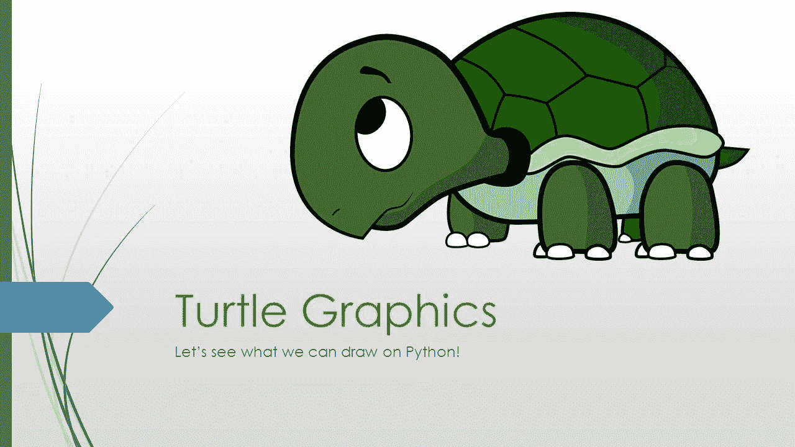

# Python 语言的海龟图案“HelloWorld”

> 原文：<https://medium.com/analytics-vidhya/helloworld-with-turtle-graphics-in-python-cd34503c8875?source=collection_archive---------9----------------------->

Turtle 是一个类似画板的功能，你可以给 turtle 下达命令，让它画出你想要的东西。



当使用海龟方法时，有如下四个步骤:

1.  导入海龟模块。
2.  创建一只乌龟来控制。
3.  用海龟的方法画一圈。
4.  运行 turtle.done()

# **步骤 01:导入海龟模块。**

```
import turtle  #This will allows us to use the turtles library
```

# 第二步:创建一只海龟来控制。

导入后，我们需要创建一个新的画板/窗口和一只乌龟。在创建图形窗口时，我们可以给窗口一个标题和颜色。

```
win = turtle.Screen()      #creates a graphics window as win
win.title("Hello World")   #giving the title as 'Hello World'
win.bgcolor("light blue")  #Assign the light blue colour to window
```

现在窗口准备好了，我们需要创建一只乌龟来控制。我们可以给海龟分配颜色、笔的大小和速度。

```
turta = turtle.Turtle()   #I gave the name turta for my turtle
turta.color("black")      # make turta black (default color)
turta.pensize(4)          # set the width of turta as 4
turta.speed(10)           # The speed is set to 10
```

现在我们的乌龟准备出发了。你可以看到下面的窗口。


# 第三步:用海龟方法画一圈。

最重要的一步来了。在开始绘画之前，我们需要了解一下我们可以使用的常见的海龟方法。

**01.forward(单位)-** 将乌龟向前移动一定数量的单位。

**02 .向后(单位)-** 将乌龟向后移动一定数量的单位

**03 .右(角度)-** 顺时针转动乌龟。

**04 .向左(角度)-** 逆时针转动乌龟。

05.penup() / up()- 拿起笔。

06.pendown() / down() - 放下笔

**07.goto(x，y) -** 将乌龟从起点移动到位置 x，y。

# 让我们从画字母 H 开始

```
turta.left(90)    # turn anti clockwise by 90 degrees
turta.forward(70) # go up by 70 units
turta.penup()     # take the pen up
turta.goto(0, 35) # go to the place of (0,35) from the beginning
turta.down()      # put the pen down to start drawing
turta.right(90)   # turn clockwise by 90 degrees
turta.forward(30) # go to rightside by 30 units
turta.penup()     # take the pen up
turta.goto(30, 70)# go to the place of (30,70) from the beginning
turta.pendown()   # put the pen down to start drawing
turta.right(90)   # turn clockwise by 90 degrees
turta.forward(70) # go down and you can see letter 'H'
```


通过如上所述一个字母一个字母的绘制，你可以绘制“Hello World”并得到如下输出。


完整的代码如下。

```
import turtle

win = turtle.Screen()
win.title("Hello World")
win.bgcolor("light blue")

turta = turtle.Turtle()  # I gave the name turta for my turtle
turta.color("black")  # make turta black (default color)
turta.pensize(4)  # set the width of turta as 4
turta.speed(20)

# Print the letter H
turta.penup()
turta.goto(-320, 0)
turta.pendown()
turta.left(90)
turta.forward(70)
turta.penup()
turta.goto(-320, 35)
turta.down()
turta.right(90)
turta.forward(50)
turta.penup()
turta.goto(-270, 70)
turta.pendown()
turta.right(90)
turta.forward(70)

# printing letter E
turta.penup()
turta.goto(-260, 0)
turta.pendown()
turta.right(180)
turta.forward(70)
turta.right(90)
turta.forward(35)
turta.penup()
turta.goto(-260, 35)
turta.pendown()
turta.forward(35)
turta.penup()
turta.goto(-260, 0)
turta.pendown()
turta.forward(35)

# printing letter L
turta.penup()
turta.goto(-210, 70)
turta.pendown()
turta.right(90)
turta.forward(70)
turta.left(90)
turta.forward(35)

# printing letter L
turta.penup()
turta.goto(-165, 70)
turta.pendown()
turta.right(90)
turta.forward(70)
turta.left(90)
turta.forward(35)

# printing letter O
turta.penup()
turta.goto(-90, 70)
turta.pendown()

for i in range(25):
    turta.right(15)
    turta.forward(10)

# printing  letter w
turta.penup()
turta.goto(-10, 70)
turta.pendown()
turta.right(55)
turta.forward(70)
turta.left(150)
turta.forward(70)
turta.right(155)
turta.forward(70)
turta.left(150)
turta.forward(70)

# printing letter O
turta.penup()
turta.goto(70, 55)
turta.pendown()

for i in range(25):
    turta.right(15)
    turta.forward(10)

# printing letter R
turta.penup()
turta.goto(160, 70)
turta.pendown()
turta.right(150)
turta.forward(70)
turta.goto(160, 70)
turta.right(200)
for i in range(20):
    turta.right(15)
    turta.forward(6)
turta.left(180)
turta.forward(60)

# printing letter L
turta.penup()
turta.goto(220, 70)
turta.pendown()
turta.right(40)
turta.forward(70)
turta.left(90)
turta.forward(35)

# printing letter L
turta.penup()
turta.goto(290, 70)
turta.pendown()
turta.right(90)
turta.forward(70)
turta.penup()
turta.goto(270, 70)
turta.pendown()
turta.left(120)

for i in range(15):
    turta.right(15)
    turta.forward(10)

turtle.done()
```

# 步骤 04:运行 turtle.done()

现在我们用 turtle.done()函数完成程序，我们就完成了！