# 以下是关于编码分类数据(使用 Python 代码)您需要知道的全部内容

> 原文：<https://medium.com/analytics-vidhya/heres-all-you-need-to-know-about-encoding-categorical-data-with-python-code-53e367a79b5c?source=collection_archive---------7----------------------->

## 在这里，您将看到一些非常有趣的数据编码技术，用于您的机器学习项目的分类特征。

# 概观

*   理解什么是分类数据编码
*   了解不同的编码技术以及何时使用它们

# 介绍

机器学习模型的性能不仅取决于模型和超参数，还取决于我们如何处理和向模型提供不同类型的变量。由于大多数机器学习模型只接受数字变量，预处理分类变量成为一个必要的步骤。我们需要将这些分类变量转换成数字，以便模型能够理解和提取有价值的信息。


典型的数据科学家花费 70–80%的时间清理和准备数据。转换分类数据是不可避免的活动。它不仅提高了模型质量，而且有助于更好地进行特征工程。现在的问题是，我们如何进行？我们应该使用哪种分类数据编码方法？

在本文中，我将解释各种类型的分类数据编码方法，以及在 Python 中的实现。

*如果你想学习视频格式的数据科学概念，请查看我们的课程-* [*数据科学介绍*](https://courses.analyticsvidhya.com/courses/introduction-to-data-science-2?utm_source=blog&utm_medium=Categorical_data_encoding)

# 目录

*   什么是分类数据？
*   标签编码或顺序编码
*   一个热编码
*   虚拟编码
*   效果编码
*   二进制编码
*   BaseN 编码
*   哈希编码
*   目标编码

# 什么是分类数据？

因为我们将在本文中研究分类变量，所以这里用几个例子快速复习一下。分类变量通常表示为“字符串”或“类别”,并且数量有限。这里有几个例子:

1.  一个人居住的城市:德里、孟买、艾哈迈达巴德、班加罗尔等。
2.  一个人工作的部门:财务、人力资源、IT、生产。
3.  一个人拥有的最高学历:高中、文凭、学士、硕士、博士。
4.  学生的成绩:A+，A，B+，B，B-等。

在上面的例子中，变量只有确定的可能值。此外，我们可以看到有两种分类数据-

*   **序数数据:**类别有一个固有的顺序
*   **名义数据:**类别没有固有的顺序

在有序数据中，在编码时，应该保留关于提供类别的顺序的信息。就像上面的例子一样，一个人拥有的最高学位提供了关于他的资格的重要信息。学历是决定一个人是否适合某个岗位的重要特征。

在对名义数据进行编码时，我们必须考虑某个特征的存在与否。在这种情况下，没有秩序的概念。比如一个人生活的城市。对于数据来说，保留一个人住在哪里很重要。在这里，我们没有任何顺序或次序。如果一个人住在德里或班加罗尔，这是平等的。

对于分类数据的编码，我们有一个 python 包 category_encoders。以下代码有助于您轻松安装。

```
pip install category_encoders
```

# 标签编码或顺序编码

当分类特征是有序的时，我们使用这种分类数据编码技术。在这种情况下，保留订单很重要。因此，编码应该反映顺序。

在标签编码中，每个标签都被转换为整数值。我们将创建一个变量，它包含代表一个人的教育资格的类别。

```
import category_encoders as ce 
import pandas as pd 
train_df=pd.DataFrame({'Degree':['High school','Masters','Diploma','Bachelors','Bachelors','Masters','Phd','High school','High school']})
 # create object of Ordinalencoding 
encoder= ce.OrdinalEncoder(cols=['Degree'],return_df=True, mapping=[{'col':'Degree', 'mapping':{'None':0,'High school':1,'Diploma':2,'Bachelors':3,'Masters':4,'phd':5}}]) #Original data 
train_df
```

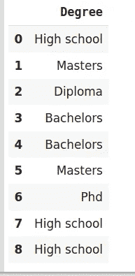

```
#fit and transform train data 
df_train_transformed = encoder.fit_transform(train_df)
df_train_transformed
```

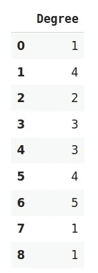

# 一个热编码

当特征是名义上的(没有任何顺序)时，我们使用这种分类数据编码技术。在一个热编码中，对于分类特征的每个级别，我们创建一个新变量。每个类别都映射有一个包含 0 或 1 的二进制变量。这里，0 表示不存在，1 表示该类别存在。

这些新创建的二进制特征被称为**虚拟变量。**虚拟变量的数量取决于分类变量的级别。这听起来可能很复杂。让我们举个例子来更好地理解这一点。假设我们有一个动物类别的数据集，有不同的动物，如狗、猫、羊、牛、狮子。现在我们必须对这些数据进行一次性编码。

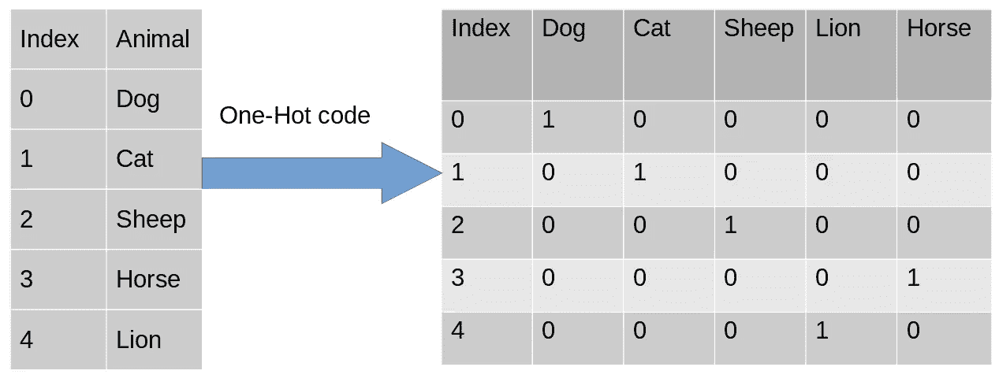

编码后，在第二个表中，我们有虚拟变量，每个虚拟变量代表特征动物中的一个类别。现在，对于存在的每个类别，我们在该类别的列中有 1，在其他类别中有 0。让我们看看如何用 python 实现一键编码。

```
import category_encoders as ce 
import pandas as pd 
data=pd.DataFrame({'City':[ 'Delhi','Mumbai','Hydrabad','Chennai','Bangalore','Delhi','Hydrabad','Bangalore','Delhi' ]}) 
#Create object for one-hot encoding encoder=ce.OneHotEncoder(cols='City',handle_unknown='return_nan',return_df=True,use_cat_names=True) 
#Original Data
 data
```


```
#Fit and transform Data
 data_encoded = encoder.fit_transform(data)
 data_encoded
```

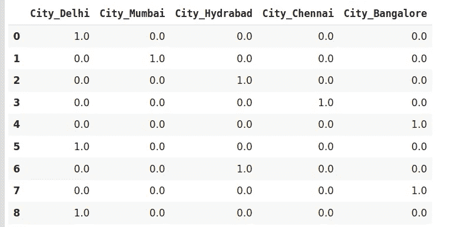

现在让我们转到另一个非常有趣且广泛使用的编码技术，即虚拟编码。

# 虚拟编码

伪编码方案类似于独热编码。这种分类数据编码方法将分类变量转换成一组二进制变量(也称为哑变量)。在一键编码的情况下，对于一个变量中的 N 个类别，它使用 N 个二进制变量。伪编码是对一位热编码的一个小小的改进。虚拟编码使用 N-1 个特征来表示 N 个标签/类别。

为了更好地理解这一点，让我们看看下图。这里，我们使用一位热编码和虚拟编码技术对相同的数据进行编码。而 one-hot 使用 3 个变量来表示数据，而 dummy 编码使用 2 个变量来编码 3 个类别。

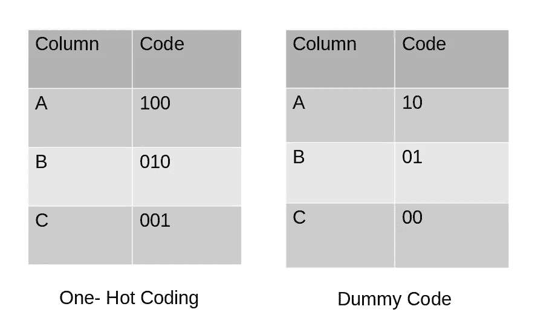

让我们用 python 来实现它。

```
import category_encoders as ce
import pandas as pd
data=pd.DataFrame({'City':['Delhi','Mumbai','Hyderabad','Chennai','Bangalore','Delhi,'Hyderabad']}) 
#Original Data
data
```


```
#encode the data data_encoded=pd.get_dummies(data=data,drop_first=True)
data_encoded
```

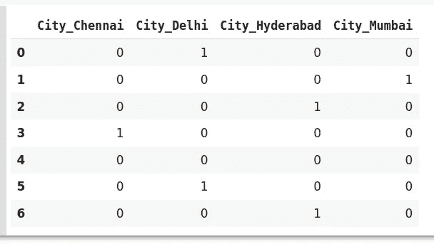

这里使用 *drop_first* 参数，我们用 0 表示第一个标签 Bangalore。

# 一位热编码和虚拟编码的缺点

One hot 编码器和 dummy 编码器是两种强大而有效的编码方案。它们在数据科学家中也很受欢迎，但在以下情况下可能不太有效

1.  数据中存在大量级别。在这种情况下，如果一个特征变量中有多个类别，我们需要相似数量的虚拟变量来编码数据。例如，有 30 个不同值的列将需要 30 个新变量进行编码。
2.  如果我们在数据集中有多个分类特征，类似的情况也会发生，我们将再次得到几个二元特征，每个二元特征代表一个分类特征及其多个类别，例如，一个数据集有 10 个或更多分类列。

在上述两种情况下，这两种编码方案在数据集中引入了稀疏性，即几列为 0，几列为 1。换句话说，它会在数据集中创建多个虚拟要素，而不会添加太多信息。

此外，它们可能会导致虚拟变量陷阱。这是一种特征高度相关的现象。这意味着使用其他变量，我们可以很容易地预测一个变量的值。

由于数据集中的大量增加，编码减慢了模型的学习，同时降低了整体性能，最终使得模型的计算成本很高。此外，当使用基于树的模型时，这些编码不是最佳选择。

# 效果编码:

这种编码技术也被称为**偏差编码**或**和编码。**效果编码和哑编码差不多，有一点区别。在虚拟编码中，我们使用 0 和 1 来表示数据，但在实际编码中，我们使用三个值，即 1、0 和-1。

在虚拟编码中只包含 0 的行在有效编码中被编码为-1。在虚拟编码示例中，索引为 4 的城市班加罗尔被编码为 0000。而在实际编码中，它被表示为-1–1–1–1。

让我们看看如何用 python 实现它

```
import category_encoders as ce 
import pandas as pd 
data=pd.DataFrame({'City':['Delhi','Mumbai','Hyderabad','Chennai','Bangalore','Delhi,'Hyderabad']}) 
encoder=ce.sum_coding.SumEncoder(cols='City',verbose=False,) #Original Data 
data
```


```
encoder.fit_transform(data)
```

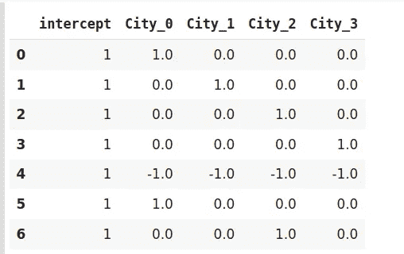

效果编码是一种先进的技术。如果你有兴趣了解更多关于效果编码的知识，请参考[这篇](https://www.researchgate.net/publication/256349393_Categorical_Variables_in_Regression_Analysis_A_Comparison_of_Dummy_and_Effect_Coding)有趣的论文。

# 哈希编码器

为了理解散列编码，有必要了解散列。哈希是以固定大小值的形式对任意大小的输入进行转换。我们使用哈希算法来执行哈希运算，即生成输入的哈希值。此外，散列是单向过程，换句话说，不能从散列表示生成原始输入。

散列有几个应用，如数据检索，检查数据损坏，以及在数据加密。我们有多种散列函数可用，例如消息摘要(MD、MD2、MD5)、安全散列函数(SHA0、SHA1、SHA2)等等。

就像一次性编码一样，哈希编码器使用新的维度来表示分类特征。在这里，用户可以使用****n _ component***参数来固定变换后的维数。我的意思是，一个具有 5 个类别的特征可以用 N 个新特征来表示。同样，一个具有 100 个类别的特征也可以用 N 个新特征来转换。这听起来是不是很神奇？*

*默认情况下，哈希编码器使用 md5 哈希算法，但是用户可以通过他选择的任何算法。如果想探究 md5 算法，我建议[这篇](https://ieeexplore.ieee.org/document/5474379)论文。*

```
*import category_encoders as ce 
import pandas as pd 
#Create the dataframe 
data=pd.DataFrame({'Month':['January','April','March','April','Februay','June','July','June','September']}) 
#Create object for hash encoder encoder=ce.HashingEncoder(cols='Month',n_components=6)*
```

*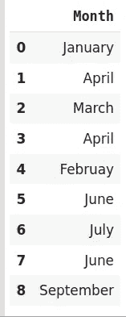*

```
*#Fit and Transform Data
encoder.fit_transform(data)*
```

*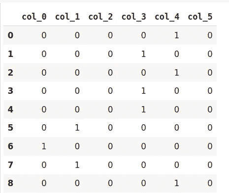*

*由于哈希变换的数据维数较小，因此可能会导致信息丢失。哈希编码器面临的另一个问题是**冲突。**由于在这里，大量的特征被描绘成较小的维度，因此多个值可以由相同的散列值来表示，这被称为冲突。*

*此外，哈希编码器在一些 Kaggle 比赛中非常成功。如果数据集具有高基数特性，那么尝试一下是很棒的。*

# *二进制编码*

*二进制编码是哈希编码和一键编码的组合。在这种编码方案中，首先使用顺序编码器将分类特征转换成数字。然后这些数字被转换成二进制数。之后，二进制值被分成不同的列。*

*当有大量类别时，二进制编码非常有效。例如，一个公司供应其产品的国家的城市。*

```
*#Import the libraries 
import category_encoders as ce
import pandas as pd 
#Create the Dataframe 
data=pd.DataFrame({'City':['Delhi','Mumbai','Hyderabad','Chennai','Bangalore','Delhi','Hyderabad','Mumbai','Agra']}) 
#Create object for binary encoding 
encoder= ce.BinaryEncoder(cols=['city'],return_df=True) 
#Original Data 
data*
```

**

```
*#Fit and Transform Data 
data_encoded=encoder.fit_transform(data) 
data_encoded*
```

*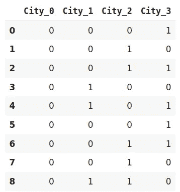*

*二进制编码是一种节省内存的编码方案，因为它使用的功能比一位热码编码少。此外，它减少了高基数数据的**维数灾难**。*

# *基数 N 编码*

*在深入 BaseN 编码之前，让我们先试着理解这里的 Base 是什么？*

*在数字系统中，基数是用来表示数字的位数或数字和字母的组合。我们在生活中最常用的基数是 10 或十进制，这里我们用 10 个唯一的数字，即 0 到 9 来代表所有的数字。另一种广泛使用的系统是二进制，即基数是 2。它使用 0 和 1，即 2 位数来表示所有的数字。*

*对于二进制编码，基数是 2，这意味着它将类别的数值转换为相应的二进制形式。如果你想改变编码方案的基数，你可以使用基数 N 编码器。在类别较多且二进制编码无法处理维度的情况下，我们可以使用更大的基数，如 4 或 8。*

```
*#Import the libraries import category_encoders as ce import pandas as pd #Create the dataframe data=pd.DataFrame({'City':['Delhi','Mumbai','Hyderabad','Chennai','Bangalore','Delhi','Hyderabad','Mumbai','Agra']}) #Create an object for Base N Encoding encoder= ce.BaseNEncoder(cols=['city'],return_df=True,base=5) #Original Data data*
```

**

```
*#Fit and Transform Data data_encoded=encoder.fit_transform(data) data_encoded*
```

*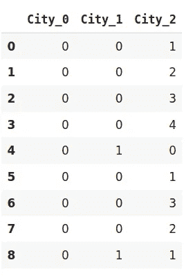*

*在上面的例子中，我使用了基数为 5 的五进制。它类似于二进制编码的例子。二进制编码通过 4 个新特征表示相同的数据，而 BaseN 编码仅使用 3 个新变量。*

*因此，BaseN 编码技术进一步减少了有效表示数据所需的特征数量，并提高了内存使用率。基数 N 的默认基数是 2，相当于二进制编码。*

# *目标编码*

*目标编码是一种贝叶斯编码技术。*

> **贝叶斯编码器使用来自从属/目标变量的信息对分类数据进行编码。**

*在目标编码中，我们计算每个类别的目标变量的平均值，并用平均值替换类别变量。在分类目标变量的情况下，目标的后验概率代替每个类别..*

```
*#import the libraries 
import pandas as pd 
import category_encoders as ce 
#Create the Dataframe 
data=pd.DataFrame({'class':['A,','B','C','B','C','A','A','A'],'Marks':[50,30,70,80,45,97,80,68]}) 
#Create target encoding object encoder=ce.TargetEncoder(cols='class') 
#Original Data 
Data*
```

*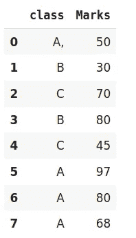*

```
*#Fit and Transform Train Data encoder.fit_transform(data['class'],data['Marks'])*
```

*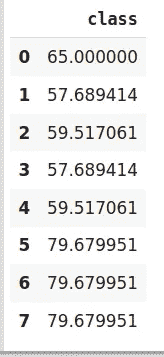*

*我们仅对训练数据执行目标编码，并使用从训练数据集获得的结果对测试数据进行编码。虽然，一个非常高效的编码系统，它有以下问题造成模型性能恶化——*

1.  *它会导致目标泄漏或过度拟合。为了解决过度拟合，我们可以使用不同的技术。*

*A.在留一编码中，当前目标值从目标的总平均值中减少，以避免泄漏。*

*B.在另一种方法中，我们可以在目标统计中引入一些高斯噪声。该噪声的值是模型的超参数。*

*2.我们可能面临的第二个问题是训练和测试数据中类别的不适当分布。在这种情况下，类别可能会采用极端值。因此，该类别的目标平均值与目标的边际平均值相混合。*

# *尾注*

*总之，对分类数据进行编码是特征工程不可避免的一部分。更重要的是知道我们应该使用什么编码方案。考虑到我们正在处理的数据集和我们将要使用的模型。在本文中，我们看到了各种编码技术及其问题和合适的用例。*

*如果你有任何意见，请在下面的评论中联系我。*

**原载于 2020 年 8 月 13 日 https://www.analyticsvidhya.com*[](https://www.analyticsvidhya.com/blog/2020/08/types-of-categorical-data-encoding/)**。***