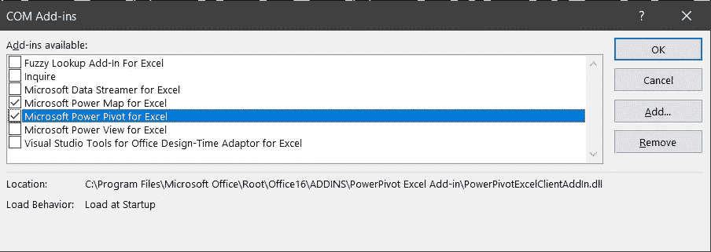
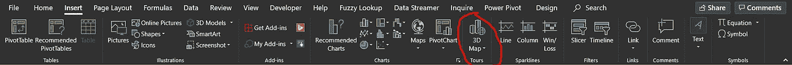

# 以下是创建 3D 地图的方法…

> 原文：<https://medium.com/analytics-vidhya/heres-how-to-create-a-3d-map-20fae9d2e2ca?source=collection_archive---------18----------------------->

没有花哨的工具，只有可靠的微软 Excel

最近，我试图创建一个 3D 地图来可视化数据(处理关于美国各州的数据)。最初，我的注意力转向了画面。虽然生成地图很容易(Tableau 会自动识别状态)，但生成多变量地图对我来说并不太直观。即使使用叠加和双轴选项，也很难将变量之间的联系概念化。最重要的是，我不认为我们可以在 Tableau 上生成一个 [3D 地图。](https://community.tableau.com/thread/125180)

我猜 3D 可视化可能不是最好的表现形式，尤其是考虑到我们的屏幕和显示器都是二维的。3D 可能不是对每个人都那么直观，也不是捕捉和翻译大多数数据的理想方式，但我仍然觉得如果谨慎使用并用于正确的上下文，它可能是有用的。

就在那时，我决定探索 Excel。我已经知道 Excel 有一个映射功能，在进一步的探索中，我发现了 3D 映射功能。这就是这篇文章的目的。大多数人不知道这个相当晦涩的工具。所以我想把这个工具介绍给更多的人，下面是一个有用的指南，告诉你如何设置这个 3D 地图工具，让任何人都可以更详细地探索这个功能。不幸的是，在撰写本文时，这个功能还没有在 macOS 上[推出。](https://answers.microsoft.com/en-us/msoffice/forum/all/3d-maps-in-excel-2016-for-mac-users/3ea7d4d1-8b15-4149-bc44-dc783d3a4afc)

**第一步:启用开发者页签**

默认情况下，Excel 上的“开发人员”选项卡不可见。你所要做的就是 ***文件>选项>自定义功能区*** 。在 ***主选项卡*** 下，勾选 ***开发者*** 框。

您应该会在功能区上看到“开发人员”选项卡。

**第二步:启用动力图和动力枢轴**

接下来，在开发人员选项卡下的加载项部分，单击 COM 加载项(你可以在上面的图像中看到它)。勾选 ***动力中枢*** 和 ***动力地图*** 框如下图所示。您现在应该会在您的功能区上看到一个 Power Pivot 选项卡！

**第三步:将数据格式化为表格**

如果您的数据还没有格式化为表格，请不要担心！这一步应该很容易，首页下的 ***格式为表*** 就大功告成了！

**第四步:添加到数据模型**

选择您的数据并在**下*动力支点>添加到数据模型*下**

第五步:创建你的 3D 地图！

你终于等到了这一刻！在插入选项卡下，选择 ***3D 贴图*** 如下图所示！现在，一个新的窗口应该会打开。瞧啊。你完了！

由于我使用的是美国各州，Excel 会自动将其识别为州。但在任何情况下，它没有，在图层窗格下，只需确保您的州或任何其他地理位置是正确分类的下拉菜单，如下图所示！

屏幕右侧图层窗格上的下拉菜单

这是一个非常有趣的工具，尽管上图显示了多变量数据集的 2D 表示，但实际上您可以非常容易地将其转换为 3D 可视化(参考上图，在图层窗格的位置字段上方，您将看到数据-单击堆叠的列或第一个图标)。

现在，虽然不是在所有情况下都理想，但它是手头上一个有趣的工具，你可能永远不会知道——知道如何利用它可能有一天会派上用场！因此，只要走出去，探索 Excel 上的 3D 地图所提供的所有功能！