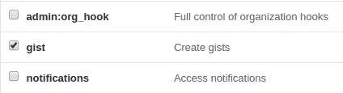

# 以下是存储命令并在以后需要时使用它们的最佳方式。

> 原文：<https://medium.com/analytics-vidhya/heres-the-best-way-to-store-all-commands-and-use-them-later-when-needed-eb1ed5d94b57?source=collection_archive---------12----------------------->

我喜欢使用命令行。在命令行上做事情比在 GUI 上做同样的事情更让我着迷。

我做了一个谷歌搜索“如何在终端/cmd 中做 X？”在向下滚动一些文章后，我得到了完美的魔法命令。问题解决了，对吧？

快进几个星期，我需要再次做同样的 X。我不记得同样的命令，现在怎么办？

再把搜索引擎拉出来？不，我不想再次滚动那些散装文章。

幸运的是，我没有清除浏览器历史。

我在浏览器历史中快速搜索，得到了 25 个匹配结果。妈的！

我可以保存我的命令并在以后需要时使用它们吗？如果我能在终端上保存和使用它们，那将是锦上添花。

是的，现在我能做到了。我给大家介绍一个开源项目，叫做 [**Keep**](https://github.com/OrkoHunter/keep) 。


Keep 是个人指挥经理。它允许您存储和交互式运行您的命令。它还可以在 Github Gist 上在线备份您存储的命令，并在设备之间同步它们。

# 装置

安装 Python 是先决条件。确保您的系统中安装了 [Python 3.6 或更高版本](https://www.python.org/)。

使用 pip 安装:

```
pip3 install keep
```

初始化保持:


# 让我们探索一下用法/特性

## 添加新命令


## 列出所有命令


## 搜索命令

语法如下:

```
keep grep "pattern(regex)"
```


## 运行命令

要简单地从所有命令列表中进行选择，请使用以下语法。它返回所有保存的命令和运行任何一个命令的选项。


这个命令列表可以获得更长的久而久之，因此 Keep 还提供了一个选项，可以在执行之前搜索命令，就像 grep 命令一样。


## 在 GitHub Gist 上备份命令

在将所有本地保存的命令推送到 Github Gist 之前，您需要生成一个个人访问令牌，并将其交给 Keep，以便它可以推和拉命令。

要生成一个这样的令牌，进行到这个 [***链接***](https://github.com/settings/tokens) 。请确保您授予该令牌创建 gists 的权限。勾选类似下图的复选框并继续。



复制生成的令牌。现在运行下面的命令，在出现提示时粘贴令牌并按 Enter 键。


现在 keep 已经创建了一个新的 Github Gist 来存储你所有的命令。这个链接可以直接访问，同样的要点可以，即使你需要重新安装 Keep 或安装在其他设备上。

现在推你所有的提交。


目前就是这样，更多的功能将很快添加。

感谢滚动到这里。❤

点击了解更多项目[。](https://github.com/OrkoHunter/keep)

## 觉得这篇文章有帮助？分享给更多的人。

附注:我是这个项目的开源贡献者，而不是所有者。如果你想给这个项目增加一个功能，欢迎你。