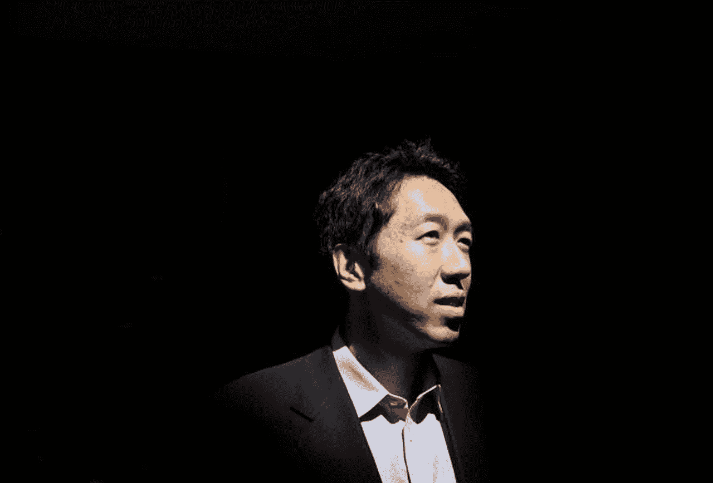

# 深度学习的英雄:吴恩达访谈系列中有抱负的数据科学家的首要收获

> 原文：<https://medium.com/analytics-vidhya/heroes-of-deep-learning-top-takeaways-for-aspiring-data-scientists-from-andrew-ngs-interview-c2c5547e181c?source=collection_archive---------2----------------------->

吴恩达是现代深度学习领域最知名的人物。他的机器学习课程被认为是任何希望理解算法背后的数学的人的起点。但是，即使是伟大的吴恩达也向其他专家看齐并从中汲取灵感。

在这个令人惊叹的深度视频系列中，他采访了深度学习领域的一些最杰出的人物(准确地说是八位英雄)。面试涵盖深度学习的长度和宽度，包括像反向传播、GANs、迁移学习等主题。甚至人工智能也会在对话中出现。但是，如果这些术语听起来让人不知所措，请不要担心，我们已经为您列出了每次采访的要点。

*来源:福布斯*

吴恩达采访过的“英雄”有:

*   杰弗里·辛顿
*   伊恩·古德费勒
*   [约舒亚·本吉奥](https://medium.com/u/98adb4b86b01?source=post_page-----c2c5547e181c--------------------------------)
*   彼得·阿贝耳
*   林元庆
*   安德烈·卡帕西
*   鲁斯兰·萨拉胡季诺夫

多么出色的专家阵容啊！现在是时候深入了解并看看每个视频的要点了。

# 杰弗里·辛顿

Geoffrey Hinton 因其在人工神经网络(ann)方面的工作而闻名。他在深度学习领域的贡献是该领域成功背后的主要原因，他经常被称为“深度学习教父”(有充分的理由)。他对反向传播算法的研究给深度学习模型的性能带来了巨大的变化。

## 视频中的关键要点

*   阅读深度学习算法背后的文献，但不要迷失在其中。专注于理解和实现事情，而不是把大部分时间花在理论上会帮助你更清楚地掌握概念
*   坚持练习编程，这会帮助你以更快的速度找到解决方案
*   Hinton 先生还提到了任何深度学习爱好者都应该关注的一些关键主题:
*   了解胶囊网络
*   无监督学习算法和方法

# 伊恩·古德菲勒

Ian Goodfellow 是深度学习领域的摇滚明星，目前在谷歌大脑担任研究科学家。他最著名的发明是生成对抗网络(GANs)。他关于“[深度学习](https://www.deeplearningbook.org/)”的书涵盖了广泛的主题，如数学和概念背景以及行业中使用的深度学习技术，这对任何深度学习爱好者来说都是一个很好的起点。我们强烈推荐读那本书，它是免费的！

## 视频中的关键要点

*   如果数据科学家想成为该领域的专家，线性代数和概率是他/她必须掌握的重要科目
*   做你感兴趣的项目，并且总是在 GitHub 上开源你的代码
*   写博客/论文，谈谈你在这个领域学到了什么。这将有助于巩固你的理解，甚至可能帮助其他人
*   阅读书籍，同时在一些项目中实现你的解释

# [约舒亚·本吉奥](https://www.linkedin.com/in/yoshuabengio/?originalSubdomain=in)

[Yoshua Bengio](https://medium.com/u/98adb4b86b01?source=post_page-----c2c5547e181c--------------------------------) 是一名计算机科学家，因其在人工神经网络和深度学习方面的工作而闻名。他是 Element AI 的联合创始人，这是一家总部位于蒙特利尔的企业孵化器，旨在将人工智能研究转化为现实世界的商业应用。

## 视频中的关键要点

*   在人类智能和计算机之间建立联系的想法一直吸引着 Yoshua Bengio。因此，他全神贯注于书籍和研究论文，这帮助他在这个领域建立了极其坚实的基础
*   早在 1985 年，当本吉奥先生对深度学习还处于萌芽状态时，重点更多的是进行实验和建立直觉，而理论是后来才出现的(我们现在称之为应用学习)
*   他的建议是——大量阅读，尽可能多地练习。这两件事是掌握像深度学习这样的主题的关键。简单地使用一个软件而不了解它是如何工作的，这不是真的。诀窍是将编程与数学概念相结合

# [彼得·阿贝耳](https://twitter.com/pabbee)

彼得·阿贝耳是加州大学伯克利分校机器人学习实验室的主任。他在强化学习方面的工作经常被学者们认为是当代最好的。他之前曾在 OpenAI 担任高级职位。

## 视频中的关键要点

*   阿贝耳教授一直对理解事物的工作原理和尝试创造新事物感兴趣。只是在他职业生涯的后期，他才对理解机器如何思考产生了浓厚的兴趣。
*   对于人们来说，这是进入人工智能的最佳时机。据 Abbeel 先生说，在这个领域起步并不困难，因为有许多可用的资源，其中大部分是免费的
*   自学和参加在线课程是一个不错的开始方式。除此之外，试着实施你的学习，因为仅仅阅读文章和观看视频只能带你走这么远

# [林元奎](https://twitter.com/yuanqinglin?lang=en)

林元庆是百度深度学习研究所的主任。他有数学和物理背景，拥有机器学习博士学位。提醒一句——视频中的英语可能有点难以理解，因为它不是元庆先生的第一语言。

## 视频中的关键要点

*   从零开始构建算法并每天学习新的东西是每个数据科学家都应该渴望的
*   目前，有一个非常好的研究人员社区，许多开源框架和公开可用的基准。对于新手，他建议从开源深度学习框架和资源中学习

# [安德烈·卡帕西](https://twitter.com/karpathy)

[安德烈·卡帕西](https://medium.com/u/ac9d9a35533e?source=post_page-----c2c5547e181c--------------------------------)是特斯拉人工智能和自动驾驶视觉总监。和 Pieter Abbeel 一样，Andrej 以前在 OpenAI 工作，但只是一名研究科学家。他被广泛认为是计算机视觉领域，尤其是图像识别领域的领先专家(尽管他当然是相当多深度学习领域的专家)。

这是系列中最有趣的视频之一！

## 视频中的关键要点

*   Andrej 讨论了他为什么为 ImageNet 计算机视觉挑战建立人类基准或基线。他觉得有必要看看机器学习算法在这种计算机视觉任务中如何对抗人类。这里，关键的要点是，对于我们试图使用机器学习或深度学习解决的任何任务，都应该有一个人类基准
*   他特别自豪的是他的课程 CS231n(该课程深入研究了深度学习架构的细节)，他旨在通过该课程与新兴和有抱负的数据科学家分享他的深度学习知识(特别是计算机视觉)
*   Andrej 对预训练网络的出现及其在各种领域的应用感到兴奋
*   他认为，人工智能领域最终将分裂为两个类别——应用人工智能和人工通用智能(AGI)

# 鲁斯兰·萨拉赫丁诺夫

Ruslan Salakhutdinov 是苹果公司的 AI 研究主任，被称为贝叶斯程序学习的开发者。他的专业领域很多，但被列为概率图形模型、大规模优化，当然还有深度学习。这里有一个有趣的事实——他的博士生导师？不是别人，正是杰弗里·辛顿！

## 访谈的主要收获

*   玻尔兹曼机器和深层玻尔兹曼机器有很多未开发的潜力。此外，我们还没有真正弄清楚如何让无监督、生成式无监督和半监督建模正常工作
*   不要害怕尝试深度学习领域的新事物
*   人们应该从头开始编写每个概念的代码，以便真正理解和学习它
*   他还处理了博士和加入公司的问题。他更倾向于博士学位，或者学术界的研究，因为这给了他更多的自由去解决各种各样的问题(这是工业界倾向于抑制的)

# [Yann LeCun](https://twitter.com/ylecun?lang=en)

[Yann LeCun](https://medium.com/u/586743efc8fb?source=post_page-----c2c5547e181c--------------------------------) 是卷积网的创始人。他目前是脸书的首席人工智能科学家和副总裁。他是一名教授、研究员和研发经理，在人工智能、机器学习、深度学习、计算机视觉、智能数据分析、数据挖掘、数据压缩、数字图书馆系统和机器人领域拥有丰富的学术和行业经验。这仅仅是这位专家能力的皮毛。

## 视频中的关键要点

*   自 20 世纪 80 年代以来，使用神经网络的场景已经完全改变了。当时没有的资源现在很丰富
*   他还谈到了公司研究这个有趣的话题。应该给在企业部门工作的研究人员更多自由，所有数据科学/深度学习从业者都应该花时间做研究，并回馈社区
*   鉴于像 Tensorflow、Pytorch 和 Keras 这样的开源工具很容易获得，人们应该开始工作并尝试深度学习，而不是陷入理论概念的泥潭

# 结束注释

这无疑是 YouTube 上关于深度学习的最有趣的采访系列。从这七位英雄身上可以学到很多东西。如果你以前没有看过这些视频，我们很高兴你能来，因为这感觉就像中了大奖。

吴恩达是一个出色的采访者，他与其他专家交谈感觉像一场梦。拿起你的笔和笔记本，因为有一大堆东西需要你去学习。

*原载于 2018 年 9 月 13 日*[*【www.analyticsvidhya.com】*](https://www.analyticsvidhya.com/blog/2018/09/heroes-deep-learning-top-takeaways-andrew-ng-interview-series/)*。*