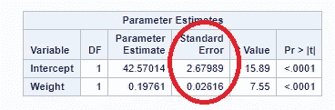
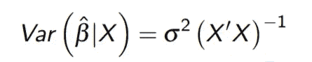
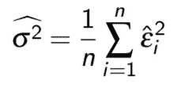
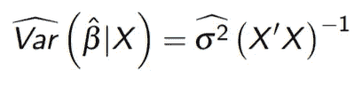
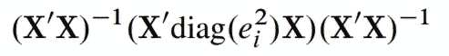
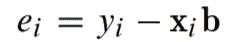
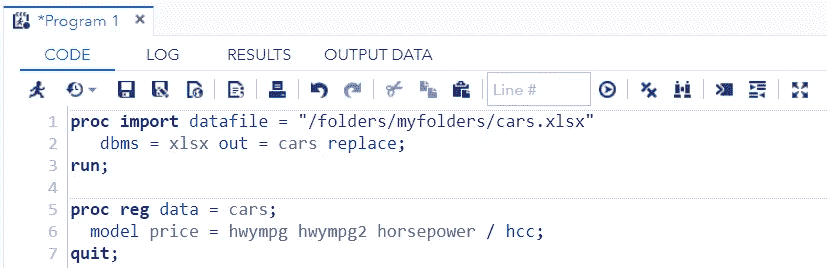
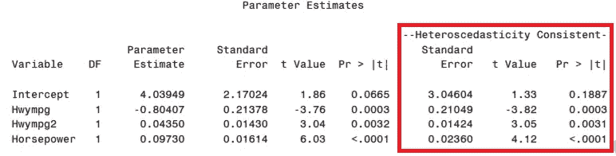

# 异方差一致性标准误差

> 原文：<https://medium.com/analytics-vidhya/heteroscedasticity-consistent-standard-errors-185a32d26faf?source=collection_archive---------17----------------------->

大家好，

在这篇文章中，我试图展示我对违反 OLS 假设(尤其是方差齐性)时可用选项的理解。

**免责声明**:本文旨在分享我对异方差一致性标准误差的认识。这不包括任何与项目相关的数据、代码等。本文中使用的 SAS/Python 代码完全基于公开可用的数据集，与任何公司项目无关。本文的读者必须具备统计学、SAS 和 Python 方面的背景知识

好的。开始吧！！！

众所周知，OLS *(普通最小二乘)回归是不存在的。* OLS 方法找到减少/优化误差平方和的参数估计。使用 OLS 获得的参数估计为 ***蓝色(最佳线性无偏估计)*** 。我来扩展一下蓝色的含义，来理解这篇文章的核心。

**最佳** —与所有其他迭代/方法相比，通过使用 OLS 获得的参数估计具有最小方差。

**线性** —使用 OLS 获得的参数估计在参数上是线性的(所有参数/β都是 1 的幂次幂)。)

**无偏** —指无偏估计。

仅当满足以下假设时，上述属性才有效。

1.  残差的正态性，
2.  预测值范围内的恒定方差，以及
3.  残差的独立性(意味着没有误差项提供关于任何其他误差项的任何信息)。

现在，让我们来理解违反这些假设会有什么影响。

1.  **残差的正态性:**它不影响参数估计，这意味着即使违反了正态性，OLS 参数估计仍然是蓝色的。但它会影响 t 检验、f 检验、卡方检验等检验结果，以及需要正态假设的参数估计的置信区间。
2.  **方差的同标准差:**同样，它不影响参数估计，但它影响参数估计的标准差，因此，它影响作为标准差的测试结果。错误被用于 CL、t-检验、F-检验等等。该模型将遭受基于标准误差的低估或高估的类型 1 或类型 2 误差。获得的参数估计不再是最佳的。
3.  **独立残差:**参数估计不受影响，但标准差不受影响。错误被妥协了。再次类型 1 或类型 2 错误。

大多数情况下，这并不简单，需要不同类型的转换(Box-Cox、Log、Sqrt、Inverse、叉积等)。我们还可以使用 WLS(加权最小二乘模型)和广义线性模型(泊松、负二项式、伽玛回归)等不需要上述假设的模型。

如果我们尝试上述变换的替代方案，我们必须用一些调整因子以原始比例对模型进行反向变换，这确实增加了复杂性。甚至，GLM 模型需要特定统计数据及其复杂性的知识。WLS 还要求正确估计重量。

现在，请看下面的示例输出:

第二个和第三个假设影响上面强调的参数估计的标准误差。这意味着，如果我们校正/调整参数估计的标准误差，那么我们永远不需要转换或任何其他建模技术。

如何修正/调整参数估计的标准误？

OLS 估计量的标准误差计算如下

我们可以使用以下公式估算 sigma 平方

因此，OLS 估计量的标准误差为

White (1980)将协方差矩阵调整如下，这样标准误差将不再受到影响。

让我们用一些数据来实现它。我使用多项式回归模型来模拟基于公路里程和马力(最大马力)的汽车价格

HC 标准。误差不同于通常的标准偏差。来自 OLS 的错误。在存在异方差的情况下，使用 HC 标准误差和基于此的测试结果。你也可以根据这个 HC 标准误差选择变量/特征，并根据这个标准误差选择测试结果。

使用这种方法校正异方差不需要任何反向变换或任何调整因子。这种方法广泛应用于时间序列分析和计量经济学。

如果 OLS 假设不成立，我希望它能为转换或不同的模型提供一个很好的替代方案。

谢谢，

乌尔维什·沙阿