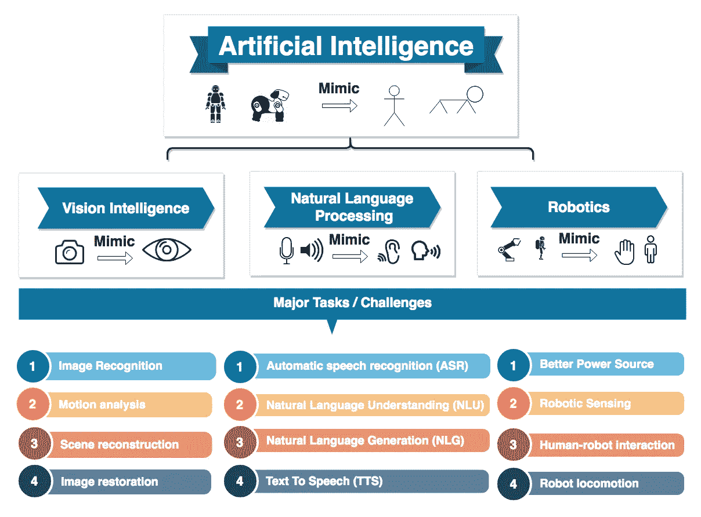
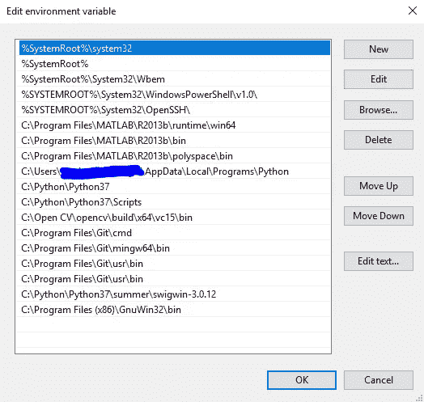
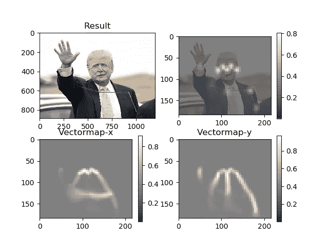
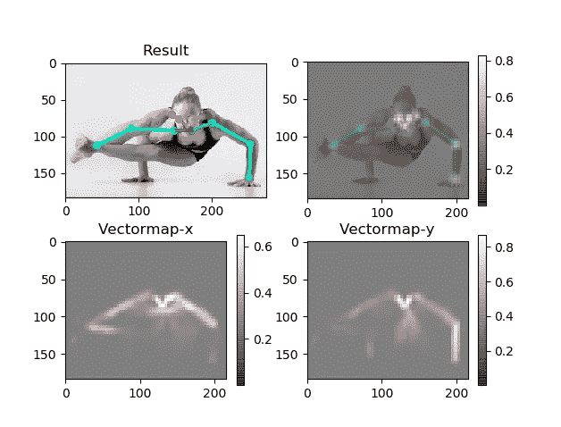

# HAR 启发法:一种不同的方法(上)

> 原文：<https://medium.com/analytics-vidhya/heuristics-for-har-a-divergent-approach-part-i-36292f0bf85e?source=collection_archive---------16----------------------->


# 这一切为什么开始？

去年夏天，我和我的朋友计划潜入人工智能。我们计划不惜一切手段来完成这件事。这就是我们遇到的情况:



人工智能应用简表(各种形式)

我们已经在为一个更大的项目实现人类活动识别(HAR)了。正如运动分析所做的那样，我们的结论是找到了通往人工智能的楼梯。

# 目标:

作为这个领域的新手，我们用通俗的语言定义了我们的目标。这是他们的样子

*   以某种方式，让计算机理解身体的不同部分，或者至少是它的基本骨架。
*   得到骨架最大部分的坐标。
*   启发式地推导出这些部分(由坐标表示)与人类活动之间的关系。
*   尝试用同样的方法进行轻微的优化，以评估姿势和移动性等其他事情。
*   以结构化的形式获得结果，以便于将来应用程序的部署。
*   使用最少的计算机资源(没有 GPU)，这样即使是 Raspberry Pi 模型也可以处理它。

为了解决这些检查点，我们花了一些时间收集资源并研究该主题，并提出了以下要求:

# 要求:

*   一个预先训练好的模型，可以估计人的骨骼，并给出各部分(或关键点)的坐标。最终，我们用[one by*Ildoo Kim*](https://github.com/ildoonet/tf-pose-estimation)*。*(his 存储库的简化安装已在下一节中提到)
*   Python 3.7(编写任何东西的编程语言)
*   打开 CV 4.x(计算机视觉开源库)
*   以上所有内容的依赖关系
*   Windows 操作系统(最好是 Windows 10)

这就是我们如何克服所有的装置:—

# 设置(几乎)一切:

*   从微软官方网站安装 Visual Studio(c++ 14 版)。
*   安装 Python 3.7 **(仅限 64 位！)**并将其路径添加到环境变量中。
*   安装 OpenCV(从[源](https://cv-tricks.com/how-to/installation-of-opencv-4-1-0-in-windows-10-from-source/)或使用 [Anaconda](https://www.learnopencv.com/install-opencv3-on-windows/) )。我用源代码做的。

通过在 CMD 上使用以下命令，确保以上两者都已安装:

```
python
>>> import cv2
>>>
```

如果没有错误，恭喜你。确保环境变量是正确的。我的看起来是这样的:*(注意第 10、11 和 12 行)*



Variable.png 环境部

*   安装 git (pip 安装 gitpython)

```
pip install gitpython
```

*   从[这里](https://www.tensorflow.org/install/pip)安装张量流。*安装 TensorFlow 有什么困难，参考这个* [*链接*](https://stackoverflow.com/questions/38896424/tensorflow-not-found-using-pip) *:*
*   如果使用 python3.7，protobuf，python3-tk 将已经安装。要验证安装，请执行以下操作:

```
>>> import tkinter
```

*   安装*滑动窗*

```
pip3 install slidingwindow
```

*   为 python 安装 git*(跟随* [*这个*](https://hackernoon.com/install-git-on-windows-9acf2a1944f0) ***但是只有*** *直到“常见问题”。)添加路径“C:\ Program Files \ Git \ usr \ bin”*
*   从 [GitHub](https://github.com/ildoonet/tf-pose-estimation) 中克隆并下载储存库 **tf-pose-estimation** 。把它保存在一个特定的位置(比如 L)
*   打开 CMD，将目录切换到位置 l。

```
cd path_to_L
```

这是我的位置看起来的样子:

```
cd C:\Python\Python37\summer\PoseEstimation
```

*   安装 *Cython*

```
pip install Cython
```

*   从 **tf-pose-estimation** 文件夹中打开“Requirements.txt”并删除 **pycocotools** ，因为此安装不适用于 windows。相反，使用以下命令安装 pycocotools:

```
pip3 install “git+[https://github.com/philferriere/cocoapi.git#egg=pycocotools&subdirectory=PythonAPI](https://github.com/philferriere/cocoapi.git#egg=pycocotools&subdirectory=PythonAPI)"
```

*   安装要求

```
pip3 install -r requirements.txt
```

*   在 c 盘*(或者你的主目录)里面下载 *swig* 。作为参考，浏览一下上面的环境 Variable.png 文件)*来自 [Sourceforge](https://sourceforge.net/projects/swig/files/swigwin/swigwin-4.0.0/swigwin-4.0.0.zip/download?use_mirror=nchc) 并遵循[这些](https://simpletutorials.com/c/2135/Installing+SWIG+on+Windows)指令。**(当心！Swig 应用程序文件将在没有任何窗口弹出的情况下执行。也就是说，只要你下载 swig 并点击应用程序文件，屏幕就会闪烁并消失。这意味着它已经完成了它的工作。)其余的步骤应该按照链接执行。**
*   将目录切换到**位置估算**内的 *pafprocess* 文件夹

```
cd C:\Python\Python37\summer\PoseEstimation\tf_pose 
```

并运行命令

```
swig -python -c++ pafprocess.i && python setup.py build_ext — inplace
```

*   从[处](https://www.addictivetips.com/windows-tips/install-and-use-wget-in-windows-10/)安装 *wget* 。但是在环境变量步骤中，不要按照他的步骤在**系统变量而不是用户变量中添加 path！**要显示更改，请重新打开 CMD。

基本安装已经完成，我们终于可以开始分析图像和视频帧了。上面的安装会给你提供框架的骨架。对于图像类型输入:

*   我将待分析的图像移动到位置 L(run . py 所在的位置)。即在**位置估计**文件夹中)。然后运行:

```
python run.py — model=mobilenet_thin — resize=432x368 — image=p1.jpg 
```

虽然直方图最初是不可见的，但是由于 *matplotlib* 库的一些后端问题。这里可以解决:[对于 LINUX 用户](https://www.pyimagesearch.com/2015/08/24/resolved-matplotlib-figures-not-showing-up-or-displaying/)和[对于 WINDOWS 用户](https://stackoverflow.com/a/56422557/9625777)。解析之后，输出应该是:



所有的情节，令人满意的结果。

然而，对于复杂的输入，结果可能会出错:



估计不正确，因为只检测到躯干。

*   要分析实时网络摄像头:

```
python run_webcam.py — model=mobilenet_thin — resize=432x368 — camera=0 
```

# 结果:

*   成功地导出了进一步使用的骨架或关键点。
*   解锁了获得关键点坐标的可能性。
*   获取图像输入和视频输入的骨架。

# 结语:

以上几节已经设法帮助你完成了作者 *Ildoo Kim* 想要的。即简单地获得关键点和骨架。但是，这仅仅是开始。这是许多不同应用程序的通用路径。我们仍然没有估计用户在画面中的姿势或活动(我们打算试探性地这样做)。

请留意后续的帖子。