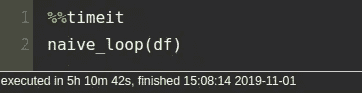
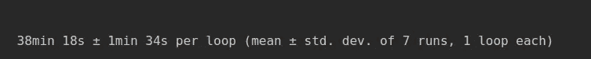
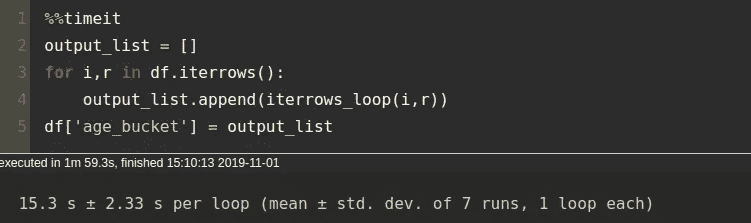
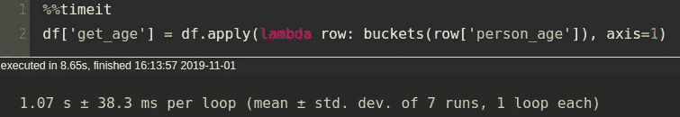
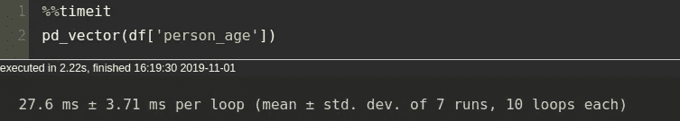
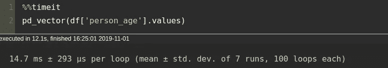
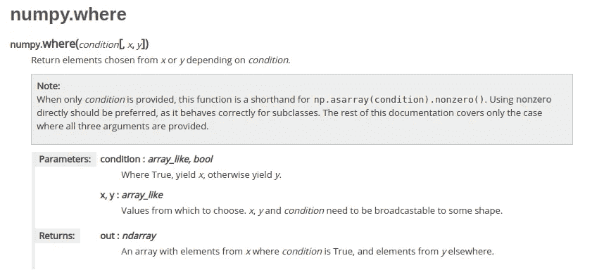
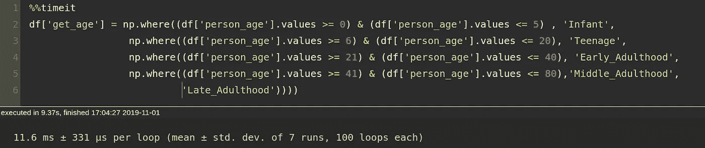

# 嘿熊猫，你为什么不快速循环？！？

> 原文：<https://medium.com/analytics-vidhya/hey-pandas-why-you-no-fast-loop-e7226ed97322?source=collection_archive---------1----------------------->

将你的循环速度提高 X 倍。

快速循环 DataFrame 对象的初学者指南。

一名日常数据科学家以一杯咖啡和两种强制性代码开始他的一天:

```
import pandas as pd
import numpy as np
```

虽然我们可能太熟悉**熊猫**的数据帧结构，但我们有时会忽略它提供的许多关键功能，以及引人注目但功能强大的**熊猫。**这篇文章是一个小小的尝试，帮助你熟悉熊猫和 numpy 的一些能力(*显然仅限于循环*)

让我们从一个简单的基于列值的分组例子开始。

该死。没有数据。让我们继续为这种情况创建一些虚拟数据和虚拟条件，生成整数作为一个人的年龄，我们将在一个新列中存储，比如“age_bucket”

10 万会员的虚拟数据，完成！

好一点了。现在，让我们假设在我们的数据集中有一些跨越人们年龄的支配规则如下:

> “年龄范围”->“桶标签”
> 
> 0–5-->“婴儿”
> 
> 6–20->“青少年”
> 
> 21–40-->“成年早期”
> 
> 41–80->“成年中期”
> 
> ≥81-->“成年后期”

好了，现在我们有我们的条件，让我们循环它！

# **朴素循环**

如果我们使用一种非常简单的循环方式，

数据帧上的简单循环

并计算到 bucket 的总计算时间( [%%timeit](https://ipython.readthedocs.io/en/stable/interactive/magics.html) )，我们得到如下结果:



朴素循环的计算时间

*(如果你的机器很小，请确保不要运行这段代码，因为计算运行时间需要 5 个小时。如果您想测试计算时间，我建议您将初始数据帧中的全部记录更改为 1000 或更小)*

因此，对于仅仅 10 万年龄组来说不是很好，**因为 10 万实际上是为良好的机器学习模型构建考虑的最小数据**(大多数情况下为*)。Pandas 中的简单循环没有利用任何内置的优化(我们将在下面看到)，这使得它非常慢。让我们继续，看看熊猫的一个内置功能。*

# ***利用 pd.df.iterrows()***

*`[**pd.df.itterows()**](https://pandas.pydata.org/pandas-docs/stable/reference/api/pandas.DataFrame.iterrows.html)`作为一对索引和与该索引相关联的对象的值，在 DataFrame 对象上迭代。例如，如果我们使用`itterows()`来检查一个对象，我们会得到以下输出:*

*使用 itterows()检查对象*

```
*person_age    40
buckets         
Name: 0, dtype: object*
```

*使用`itterows()`循环遍历我们的数据帧来标记桶，*

*使用 itterows()在 DataFrame 上循环*

*并计时，我们得到以下结果:*

**

*使用 iterows 在 DataFrame 上循环时的结果*

*与普通循环相比，我们刚刚增加了我们的循环 **~149 倍**。让我们看看是否可以进一步减少计算时间！*

# *使用 **apply()** 进行循环*

*`[apply()](https://pandas.pydata.org/pandas-docs/stable/reference/api/pandas.DataFrame.apply.html)`函数在特定轴的数据帧上循环，也就是说，它既可以在列(轴=1)上循环，也可以在行(轴=0)上循环。`apply()`比`iterrows()`好，因为它在 Cython 中使用了 Python 的 C 扩展。*

*我们可以使用 apply 和`[lambda](https://www.geeksforgeeks.org/python-lambda-anonymous-functions-filter-map-reduce/)`函数以及`axis`参数，*

*apply()的自定义存储桶函数*

*然后如下应用它，给我们以下结果:*

**

*带有 lambda 函数的 df.apply()的结果*

*我们现在以微秒为单位，在时间上使循环快了 **~1900 倍**。到目前为止，我们已经使用 pandas **矢量化在改进代码的计算时间方面取得了很大的进步。***

# *熊猫矢量化*

*事实上这很简单。矢量化会立即对整个数据帧进行操作，而不是对单个行进行操作。本质上，矢量化是对整个阵列执行操作的过程。在 pandas 的例子中，矢量化应用于完整的列，作为一个序列传递给函数。以下是我们在熊猫案例中的矢量化部分:*

*熊猫矢量化，其中输入是来自数据帧的一系列数据*

*在函数`pd_vector`中，年龄是数据帧( *df* )中的一个序列。在传递一个序列作为输入时，pandas 使用了许多可用于矢量化函数的内置优化，同时对整个序列执行操作**。***

***计算该版本的矢量化形式的计算时间，我们得到以下结果:***

******

***熊猫矢量化的结果***

***我们可以看到，使用熊猫的矢量化，我们从我们的`apply()`方法中获得了大约**到 39 倍**的循环速度，并且比我们的标准循环快了**到 82608 倍*****

***让我们看看我们是否能把它系得更紧！***

# ***Numpy 矢量化***

***虽然 pandas 使用 series 对象进行矢量化，但我们可以简单地将 series 对象从 series 调整到 array，这样速度会更快。通过去除所有额外的开销，如索引、数据类型、数据格式等，它变得更快。但是，应该小心使用 numpy 矢量化，也就是说，如果系列索引不是最重要的，那么我们肯定可以继续使用 numpy 矢量化来进一步减少计算时间！***

***如果您喜欢将序列对象转换为数组，那么将序列对象转换为数组是非常简单的，如果完成了，我们将看到以下结果:***

******

***Numpy 矢量化循环***

***因此，现在从我们最初对数据帧的简单循环开始，仅仅 10 万次条件循环总共花费了 **~38 分钟**，我们现在处于 **14.7 毫秒**，速度提高了大约 **~155102 倍**。***

## ***我们当然可以到此为止，但是如果速度是你真正想要的，那么我们仍然可以使用" **numpy"** 更进一步***

# ***削减中间人***

***到目前为止，我们所有的循环都是通过将我们的 pandas 行或系列转换成某种形式来构建和实现的，然后使用内置的优化。现在，我们准备砍掉我们的中间人(熊猫，而不是人🙊).这就是我们完全依赖从一开始就导入的一个模块的地方。***

***但是要在循环中使用`numpy`,你必须弄脏你的手(同样，只是弄脏代码😅).下面是我曾经读过的一段话，我希望这段话也能激励你去写这样的代码:***

> ***不要害怕写复杂的代码，因为有时候写得最好的代码也没有优化得太好！***

***也就是说，我们的`numpy`代码看起来会很可怕，但是相信我，失去所有的美感是值得的。***

## ***使用 np.where()进行循环***

***`np.where()`有时是大小写特定的，但是如果你有一个 if-else 循环，它几乎总是可以作为更快代码的最佳选择。下面是 np.where() [文档](https://docs.scipy.org/doc/numpy/reference/generated/numpy.where.html)的一个片段，解释了它是如何工作的:***

******

***np.where doc***

***所以基本上，它只是根据我们提供的条件从“x”或“y”返回元素。让我们继续，看看我们的代码将如何使用仅仅`np.where()`函数，作为一个循环使用:***

***使用 np.where 的 Numpy 循环***

***测试这个 np.where 循环的计算时间，我们得到以下结果:***

******

***所以，我们现在在 **11.6 ms** ，从 **38 分钟开始，**通过 **~196551** 提高代码速度。***

***即便如此，这还不是结束。你仍然可以使用 [**Cython**](https://cython.org/) 自定义函数、[**NP . digitize()**](https://docs.scipy.org/doc/numpy/reference/generated/numpy.digitize.html)**、**等多种优化来获得微秒级的运行时！***

***因此，总的来说，循环遍历数据帧的一般首选顺序(至少我是这样认为的)如下:***

1.  *****矢量化** {numpy}***
2.  *****矢量化**{熊猫}***
3.  *****PD . df . apply()**{使用 lambda 函数}***
4.  *****pd.df.iterrows()*****
5.  *****基本循环**{基本从不}***

***如果你在某一天可能遇到的测试用例中使用上述循环方法，我会非常高兴！😸***

# ***来源:***

***[https://docs.scipy.org/doc/numpy/reference/](https://docs.scipy.org/doc/numpy/reference/)***

***[https://pandas.pydata.org/pandas-docs/stable/](https://pandas.pydata.org/pandas-docs/stable/)***

***[https://stack overflow . com/questions/1422149/什么是矢量化](https://stackoverflow.com/questions/1422149/what-is-vectorization)***

***[https://en.wikipedia.org/wiki/Array_programming](https://en.wikipedia.org/wiki/Array_programming)***

***此外，如果你觉得帖子中有任何错误，我将非常乐意纠正它们。否则，如果你喜欢这篇文章，并从这篇文章中学到了一些好的优化方法，那么我在这里的工作就完成了！***