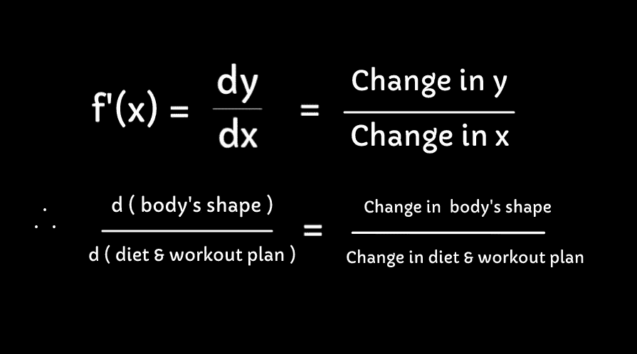
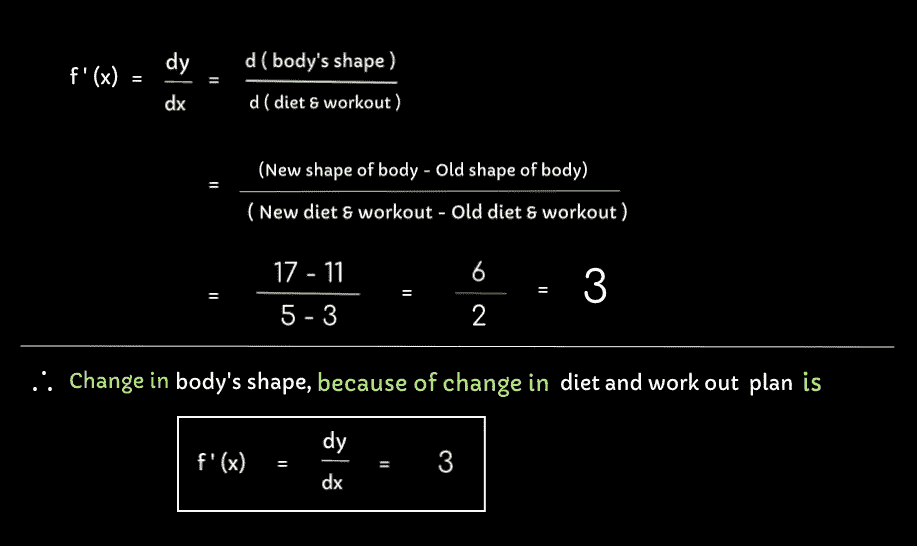

# 嗨，我是微分。

> 原文：<https://medium.com/analytics-vidhya/hi-im-differentiation-ce3ff7d8f38b?source=collection_archive---------18----------------------->

复杂？我吗？一点也不。我比你想象的要简单。

超级英雄宠臣(我是差异化)

大家好…欢迎来到我的展示区。

我一直很奇怪，为什么每当人们听到我的名字“****【differentiation❕】**时，他们会感到复杂。如果你继续和我在一起，你会发现我很有趣。 (疾病)开始..我们来讨论一下。**

## ****简介****

**我是我父母**微积分**的一部分。是的，它结合了我的许多兄弟姐妹，包括我。我们所有人都是由许多头脑风暴的人介绍到这个世界的，你们称他们为“数学家”。向所有努力将我们介绍给这个世界的人致以诚挚的谢意。**

## **我该怎么办？**

**就像你们所有人一样，我工作很努力。我日以继夜、日以继夜地工作，只是为了量化(计算)**由于“某事物”发生变化而导致的“某事物”的变化率。为了更加正式和数学化，我致力于找出给定函数 f(x)的导数。****

> ****什么！某物变化的速度。还有别的吗？****

**等等，让我用一个简单的例子来澄清你的困惑。**

**比方说，你有一个健身房怪胎朋友**(为什么是健身房怪胎？因为，我有一个)**。你可能已经观察过他，通过良好的饮食和不同类型的锻炼来保持完美的身材。如果他停止节食和锻炼呢？他会逐渐失去他的形状。但是，如何逐渐？几天后？由于饮食和锻炼的改变，他的体型变化率是多少？这些是我一直试图回答的问题。**

**上面这个只是一个例子。我真的不能说，随着他的饮食和锻炼计划，他身体的变化率是多少？**因为我唯一知道的语言是“数学”**，所以我需要把“**改成****表示为数学函数。**就像下面这样……**

> **自然界中发生的一切，总是可以用数学函数来表达。**

## **将变化表达为一个函数:**

**比方说，我们能够计算出饮食计划并算出。**

*   ****饮食计划和健身计划= x****
*   ****身体的形状= y****

**现在，让一个函数 **f (x)** 取我们的输入 **x** ，经过与 **x** 的一些计算产生 **y.** 因此， **y= f ( x )** 是函数，我们可以形成。现在我们说， **f ( x ) = 3x + 2，**也就是说 **y = f(x) = 3x + 2** 。**

**所以，如果**

*   ****x = 3，**那么 **y = f( 3 ) = ( 3 * 3 ) + 2 = 11，因此(x1，y1) = ( 3，11 )****
*   ****x = 5** ，那么 **y = f( 5 ) = (3 * 5) + 2 = 17，因此(x2，y2) = ( 5，17)****

**是这个吗？这是我做的吗？为什么我们将函数 f(x)应用于两个值，即 **3** 和 **5** ？**我们采用两个值，因为当我们谈论变化时，我们至少需要两个值来进行比较。不，我们还没有完成。我工作中最重要的部分来了，这就是我被认可的方式。是时候了，我们把我应用到给定的函数 f(x)上。****

**当我被录用时**

*   **一个函数**f(x)【x 的 f】**，函数看起来像**f '(x)【x 的 f 破折号】****
*   **一个表达式，其中 y 基于 x 中发生的变化而变化，那么该表达式看起来像 **d y / d x****

**让我们用我们的函数 f(x) = 3x + 2 值来应用我。现在，这个函数看起来像**

****

**图一。应用微分后表示函数 f(x)。**

**这是零钱功能。既然我们已经从上面的图像中看到，我如何能找出变化，让我们看看什么是身体形状的变化，因为饮食和健身计划中发生的变化。**

**根据计算:**

*   **(**旧饮食&锻炼，旧体型** ) = ( x1，y1 ) = **( 3，11)****
*   **(**新饮食&锻炼，新体形** ) = ( x2，y2 ) = **( 5，17 )****

****

**图 2:计算给定两点的变化。**

**因此，**对于给定的函数 f(x ),由于饮食和锻炼计划的变化，身体形状的变化率为，3。**这意味着，身体的形状在不断变化，相对于饮食&锻炼，其变化速度为 3 个单位。**

**另一个经典的例子可以是，**速度**，这是距离随时间变化的**变化率**。**

**仅此而已。最后，这就是我。**谓分化**。现在我希望，当你听到我的时候，你不会害怕/感到复杂。这就是我一直努力去做的。**

**到目前为止，你们已经明白了我是如何用给定的两个函数点来计算变化率的。有些情况下，我实际上并没有得到分数，而只是表达本身。在这些情况下，我如何实际计算变化率？这些将在下一篇文章中讨论。**

**谢谢你花时间陪我。我希望你玩得开心。正在注销…**

## **你的…
***辨析。*****

**在下面的链接中找到这篇关于神经网络的有趣文章。**

** [## 从零开始的神经网络——感知器方法

### 一个温柔的尝试让你自己建造。

medium.com](/analytics-vidhya/neural-networks-from-scratch-perceptron-approach-i-a7059ff276ac)**