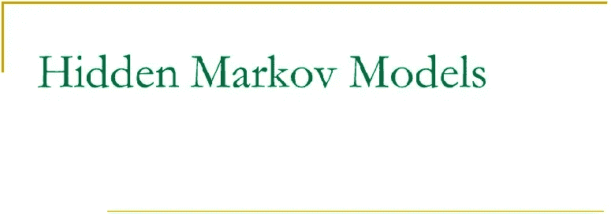

# 隐马尔可夫模型

> 原文：<https://medium.com/analytics-vidhya/hidden-markov-model-8bab3a48c672?source=collection_archive---------26----------------------->

隐马尔可夫模型(HMMs)是随机模型，最初于 1957 年在统计学文献中提出，并在 20 世纪 60 年代末和 70 年代初得到研究。HMMs 可以看作是序列或时间序列中的一般统计建模。在开始讨论 hmm 之前，首先要理解两个术语。

> **隐藏状态**
> 
> 目标/隐藏的可能或可用状态…