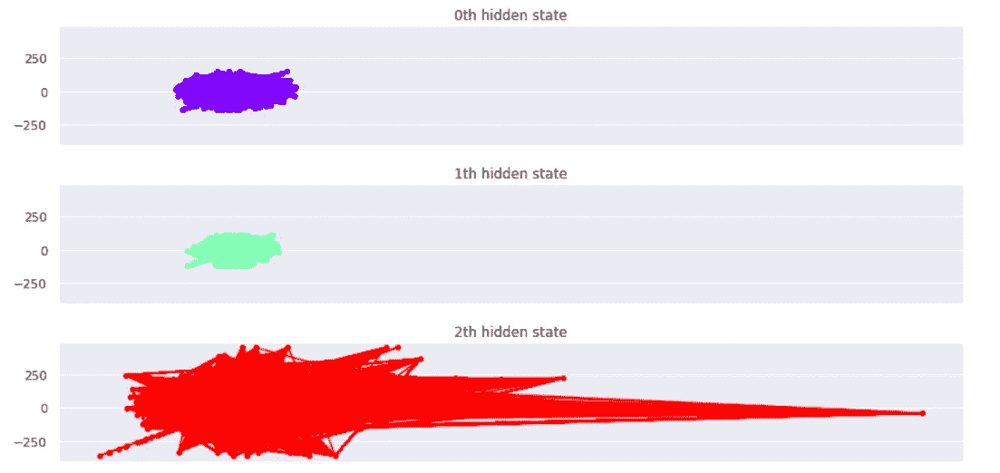

# 隐马尔可夫模型——量化金融中的状态空间概率预测方法

> 原文：<https://medium.com/analytics-vidhya/hidden-markov-model-a-statespace-probabilistic-forecasting-approach-in-quantitative-finance-df308e259856?source=collection_archive---------1----------------------->

## 带有技术分析的概率价格预测指南

## 高斯混合模型在利用历史纳斯达克指数时间序列数据进行状态检测中的应用

作者图片