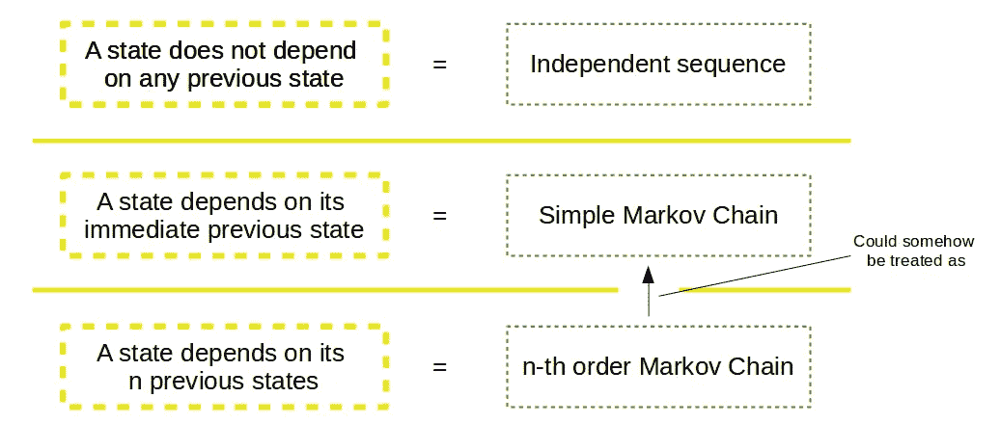
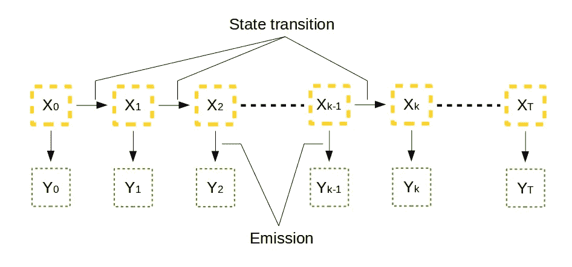
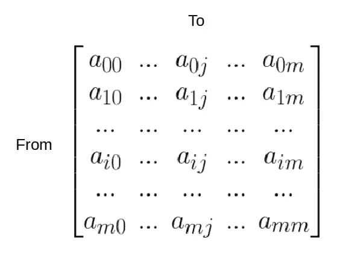
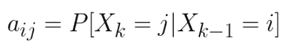
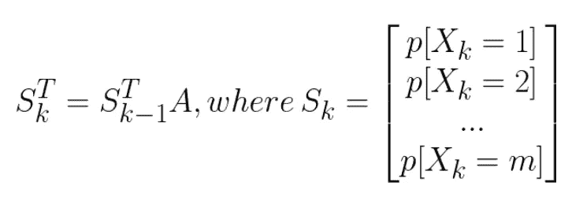
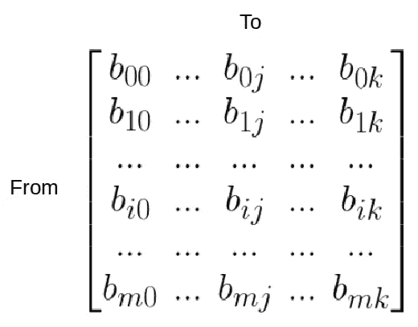
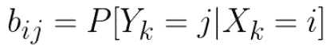
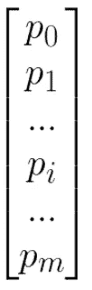
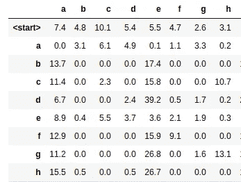
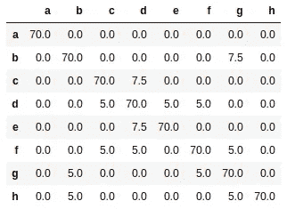

# 隐马尔可夫模型 HMM 系列的第一部分

> 原文：<https://medium.com/analytics-vidhya/hidden-markov-model-part-1-of-the-hmm-series-3f7fea28a08?source=collection_archive---------2----------------------->

*它是如何构成的，如何处理？*

*注意:在这一系列的文章中，我将讲述我在过去几天中对 HMM 的了解。我试图让文章简单易懂。虽然这不是一本教科书能提供给你的系统方法，但我希望我的文章能帮助你克服旅途中的一些瓶颈。祝你好运！*

第一部分:[隐马尔可夫模型的体系结构](/@rmwkwok/hidden-markov-model-part-1-of-the-hmm-series-3f7fea28a08)
第二部分:[训练 HMM 的算法:Baum-Welch 算法](/@rmwkwok/baum-welch-algorithm-for-training-a-hidden-markov-model-part-2-of-the-hmm-series-d0e393b4fb86)
第三部分:[用训练好的 HMM 进行预测的算法:Viterbi 算法](/@rmwkwok/viterbi-algorithm-for-prediction-with-hmm-part-3-of-the-hmm-series-6466ce2f5dc6)

## 隐马尔可夫模型简介

简单来说，HMM 是一种概率模型，用于从观察到的数据中推断出未观察到的信息。以手机的屏幕键盘为例，你有时可能会打错你想输入的字符。在这里，你输入错误的字符是观察到的数据，而你打算在头脑中输入的是未观察到的数据。作为另一个例子，由于一些随机噪声源，您的 GPS 读数(观察到的)可能会在您的实际位置(未观察到的)附近跳动。

有意思？在许多情况下，观察到的并不是真相，而隐马尔可夫模型是一种可以把隐藏的真相还给我们的方法。然而，它不是万能的，要使用它，它必须满足一些假设，HMM 就是建立在这些假设上的。我在这里的方法是用文字讨论 HMM，并辅以一些数学，如果这次不是你喜欢的，可以跳过。开始吧！

# 状态序列和可观察值

在我上面的两个例子中，我们实际上都在处理数据序列。例如，我们可能会将“杂项”误打成“杂项” ***m*** eous,“杂项”实际上都是字符序列。在 GPS 示例中，如果我们在该位置(22.3525 N 113.8475 E)静止不动，那么如果我们连续五秒钟每秒记录一次读数，则应该重复五次。然而，随着读数的跳跃，我们可能会看到(22.3535 N 113.8455 E)，(22.3585 N 113.8325 E)，(22.3123 N 113.8600 E)，(22.3212 N 113.8397 E)，(22.3421 N 113.7989 E)。

在这里，对于每个观察到的数据，我们有一个相关的隐藏真相。在正式的 HMM 讨论中，人们把每个“隐藏真相”称为“状态变量”，把每个“观察数据”称为“观察变量”。

嗯。上述橙色方框相互“链接”形成一个马尔可夫链。链条中的每个状态都“链接”到一个观察到的变量。

# HMM 结构中的状态和可观察值

我们来看上图。在这个 HMM 架构中，我们有一系列相互“链接”的状态(隐藏的事实)。箭头在这里有*依赖*的意思。例如，时间= 1 时的状态取决于时间= 0 时的状态。这是马尔可夫模型中非常重要的假设，使得它如此简单——*任何状态仅仅依赖于它的一些先前状态*。我在 state 后面加了一个(s ),因为它是可选的。如果一个状态依赖于它的第一个先前状态，我们称之为简单马尔可夫链，而如果一个状态依赖于它的第一个 *n 个*先前状态，我们称之为 n 阶马尔可夫链。

考虑国家之间的依赖性是很自然的，因为我们认为它们之间有某种联系。例如，一个单词中字符的组合不是随机的，它必须按照正确的顺序才能被正确理解。而最简单的依赖就是一个状态只依赖于一个之前的状态，这也是讨论将要重点讨论的。

# 状态转换、发射和初始状态

嗯。橙色方框代表状态，绿色方框代表可观察状态

现在，我们已经将状态、观察到的变量以及它们的依赖关系放入 HMM 架构中。我们将进一步量化相关性，从状态转换开始，即从时间 *k-1* 到时间 *k* 的状态转换，或者从一个橙色框到下一个橙色框的变化。

假设有 *M* 种可能的状态可供选择，即状态可以是{1，2，3，…， *m* 中的任意一种。我们可以将从状态 *i* 到状态 *j* 的转移概率量化为 *aᵢⱼ.*由于从 *M* 种可能状态中的任何一种状态到 *M* 种可能状态中的另一种状态的转换都可能发生，所以总共有 *M* × *M* 种可能性。我们可以将它们排列成下面的矩阵表示，称为状态转移矩阵*。*

**

**状态转移矩阵 A. aᵢⱼ表示从状态 I 转移到状态 j 的概率**

*因为所有的 *aᵢⱼ* 都是概率值，都被有界在 0 和 1 之间，每一行都要求和为 1。一般来说，对于每个时间步 *t* ，我们可以有一个这样的矩阵*。然而，我们将考虑一个*平稳马尔可夫链*，意味着矩阵 ***A*** 在时间上是常数。**

****

***aᵢⱼ表示给定状态 I 时状态 j 的概率***

****

**具有转移的先前状态的矩阵乘法**

**类似地，我们可以构建发射矩阵 ***B*** 来存储状态 *i* 的概率，从而得到观察值 *j* 。这里，假设可观测值有 *K* 个可能值，这意味着它可以取{1，2，…, *k* 中的任何一个。这里也假设了平稳性，因此我们有一个恒定的发射矩阵。**

****

***发射矩阵 B. bᵢⱼ代表状态 I 发射可观测 j 的概率***

****

***bᵢⱼ代表观察 j 给定状态 I 的概率***

****

**状态和发射的矩阵乘法**

**我们已经接近全图，现在有了架构，状态转移矩阵 ***A*** ，发射矩阵 ***B*** *。我们需要的最后一件事是，初始状态的概率分布，π₀，₀.我们需要它来开始第一个状态，所以马尔可夫链中即将到来的状态可以通过状态转移矩阵来估计。***

****

**初始状态分布π₀.**

**为了给你一些实际的数字，让我们看看下面这个关于单词的例子。我从牛津高级学习词典中取出了 [3000 个单词列表，并列出一个字符作为起始字符的概率，以及一个字符出现在另一个字符之后的概率。](https://www.oxfordlearnersdictionaries.com/wordlist/english/oxford3000/)**

****

**此处仅显示了部分表格，所有值均为百分比。第一行是初始状态分布，表示有一个字符(状态)作为起始字符的概率，比如有 10.1%的几率看到以‘c’开头的单词。所有剩余的行形成状态转移矩阵。例如，在一个单词中，有 39.2%的几率‘d’后面跟着‘e’。**

**表格的第一行给出了初始状态分布 **π₀** ，其余的组成了状态转移矩阵*。对于发射矩阵**例如，如果我们打算键入“G”(状态)，那么有 70%我们正确地键入“G”(观察到的)，有 30%得到{'T '，' Y '，' F '，' H '，' C '，' V '，' B'}中的任何一个，或者每个的大约 4.2%。通过这个论证，我们可以构造发射矩阵。*****

******

***键盘示例***

******

***此处仅显示了部分表格，所有值均为百分比。该表构成了排放矩阵。例如，有 5%的机会，故意键入' d '(状态)将导致' c '(观察)。***

# ***摘要***

***让我们在这里休息一下。到目前为止，我们已经看到，HMM 模型是由状态变量和相关联的观察变量构成的，并且对于每个状态，它依赖于多少个先前的状态。然后通过状态转移矩阵 ***A*** ，发射矩阵 ***B*** ，初始状态分布 **π₀** 对模型进行参数化。请注意，我们一直在谈论的 HMM 是一个平稳、简单的隐马尔可夫模型，它采用离散的状态变量、离散的观察变量，并且这些变量在时间上是离散的，因此，它是 HMM 家族中的一个特例。***

**最后，虽然我用了单词列表来做计数，并且用一些实际的数字来表示矩阵，但是我们实际上并没有这样做，我们也不能总是通过证明来构造发射矩阵。在接下来的文章中，我们将讨论用于训练(或调整参数矩阵)的 Baum-Welch 算法，以及用于从观察数据推断整个隐藏状态序列的 Viterbi 算法。**