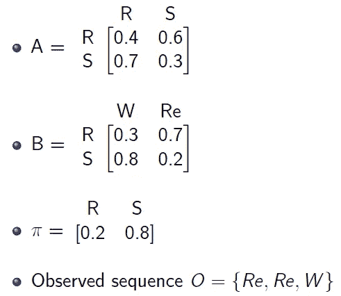

# 假人的隐马尔可夫模型 I

> 原文：<https://medium.com/analytics-vidhya/hidden-markov-models-for-dummies-i-4e22df428759?source=collection_archive---------3----------------------->

## 适用于初学者的 HMM 介绍

idden Markov 模型或 hmm 构成了当今使用的几种深度学习算法的基础。让我们试着用基本的非数学术语来理解这个概念。现在让我们定义一个 HMM。

> 隐马尔可夫模型是一个双变量离散时间随机过程{X ₖ，Y ₖ}k≥0，其中{X ₖ}是一个平稳的马尔可夫链，并且，以{X ₖ}为条件，{Y ₖ}是一个独立的随机变量序列，使得 Y ₖ的条件分布只取决于 X ₖ.

唷，那可太难消化了！！我们会让这篇文章远离如此复杂的术语。我将分四个部分向您介绍这个概念。

# **举例**

首先，让我们从一个例子开始。萨姆和安妮是室友。作为一种爱好，萨姆记录她所在城市的每日天气情况。她把天气分为晴天或雨天。作为一个有着奇怪爱好的人，山姆也记录了她的室友如何度过她的夜晚。她将安妮的活动分类为阅读(Re)或散步(W)。不幸的是，山姆生病了，三天都无法查看天气。但她确实知道她的室友晚上是去散步还是看书。作为一名统计学家，她决定使用 HMMs 来预测那几天的天气情况。

# HMM 的组成部分

HMMs 中一个非常重要的假设是它的马尔可夫性。这意味着今天*观察到的天气*仅*依赖于昨天*观察到的天气*。这将取决于之前的天气情况。因此，这三天的活动顺序至关重要。*

我们将所有可能的天气条件集合称为 ***过渡态*** 或 ***隐藏态*** (因为我们无法直接观察到它们)。我们将所有可能活动的集合称为 ***发射态*** 或 ***可观测态*** 。因此我们用 S = {晴天，雨天}和 V = {阅读，散步}来表示它。

这三天观察到的晚间活动顺序是{读书、读书、散步}。这意味着安妮前两天在看书，第三天去散步了。我们将这个序列表示为 *O = {阅读阅读行走}。*

因为 Sam 有天气状况的每日记录，所以她可以以一定的概率预测任何一天的天气。我们将此称为 ***初始概率*** ，记为 **π** 。

她有足够的信息来构建一个表，根据今天的天气情况，利用这个表她可以以一定的概率预测明天的天气情况。我们将把这个表称为 ***转移矩阵*** (因为它给出了*从一个隐藏状态转移到另一个隐藏状态的概率)。我们将用 a 来表示这个转移矩阵。*

因为 Sam 也有 Anne 每天晚上活动的记录，所以她有足够的信息来构建一个表，使用该表她可以预测今天*、*(给定*今天*的天气)的活动，具有一定的概率。我们将该表称为 ***发射矩阵*** (因为它给出了发射状态的概率)。我们将用 b 来表示。

# 示例(续)

上面给出的是我们例子中 HMM 的组成部分。现在我们将尝试解释这些组件。使用的符号是 R =雨天，S =晴天，Re =读书，W =散步。

# 任何给定的 HMM 问题都由隐藏的转换状态(晴天/雨天)和可观察的发射状态序列(行走/阅读)组成。

我们的目标是识别隐藏状态(RRS / SRS 等)的最可能序列。).

矩阵 A(转移矩阵)给出隐藏状态的 ***转移概率*** 。例如，0.7 表示明天*有雨的天气条件的概率，*假定今天*是晴天*。因此，从逻辑上讲，每行的总概率是 1(因为明天的天气要么是晴天，要么是雨天)。

矩阵 B(发射矩阵)给出发射状态的 ***发射概率*** 。例如，0.8 表示安妮今天去散步的概率*，*假定今天*天气晴朗*。同样，从逻辑上讲，每行的总概率是 1(因为今天的活动将是阅读或散步)。

矩阵 **π** 给出了隐藏状态开始的初始概率。例如，0.2 表示天气在任何给定的一天下雨的概率(与昨天或任何一天的天气无关)。同样，从逻辑上讲，行总数应该等于 1。

*O* 是三天的发射/观察状态序列。第一天的活动是阅读，然后是阅读和散步，就是这个顺序。

矩阵 A、B 和 **π** 的集合一起构成了任何 HMM 问题的组成部分。我们用λ = {A，B， **π** }来表示这些。

# HMM 中的基本问题

现在，我们将根据上面讨论的符号重新构建我们的示例。我们还将确定可以使用 hmm 解决的问题类型。

> 三个基本问题如下:
> 
> 给定λ = {A，B，**π**}**和观测序列*O = {读读走}，*求观测序列*出现的概率(似然性)。我们的目标是找到观察序列的概率，假设我们知道跃迁、发射和初始概率。***
> 
> 给定λ = {A，B， **π** } 和观测序列*O = {阅读阅读行走}* 确定那三天天气状况最可能的序列。
> 
> 给定观测序列*O = {读读走}，*初始概率**π** 和隐藏状态集 S = {雨天，晴天}，确定转移概率矩阵 A 和发射矩阵 b。

恭喜你！从我们的例子中，我们已经成功地描述了隐马尔可夫模型的问题！我们将在接下来的三篇文章中详细讨论上述三个问题及其算法。干杯！

[1]安 Y，胡 Y，Hopkins J，Shum M .隐马尔可夫模型的可辨识性与推断.技术报告；2013.

[2]马丁·JH·茹拉夫斯基。语音和语言处理:语音识别、计算语言学和自然语言处理导论。新泽西州上马鞍河:普伦蒂斯霍尔。2008.