# R studio 中时间序列的隐马尔可夫模型[股票市场数据]

> 原文：<https://medium.com/analytics-vidhya/hidden-markov-models-for-time-series-in-r-studio-5ae2b9fb0701?source=collection_archive---------3----------------------->

在这篇博客中，你可以期待得到一个关于隐马尔可夫模型及其在时间序列数据上的应用的直观想法。此外，我还提到了隐马尔可夫模型的 R 包和 R 代码，以供参考。

这个工作是我在 Praxis 商学院(学生时代)期间做的。现在，让我们开始吧…

隐马尔可夫模型是由数学家 L. E .鲍姆和他的同事开发的。隐马尔可夫模型是建模时间序列数据的普遍工具。它们被用于几乎所有当前的语音识别系统以及人工智能和模式识别的其他领域。

隐马尔可夫模型是一种表示一系列观察值的概率分布的工具。它假设在时间 *t* 的观察是由一些进程产生的，这些进程的状态对观察者是隐藏的。

让我们举一个例子:

假设有两个叫爱丽丝和鲍勃的朋友。所以鲍勃的情绪会随着天气的变化而变化，所以如果是晴天，那么鲍勃最开心，现在他在电话里告诉爱丽丝他很开心(*观察*)，所以她从这些信息中推断出是晴天(*隐藏状态*，如果是雨天(*隐藏状态*，那么鲍勃最暴躁(*观察*)。注意，这里 Bob 家的天气对 Alice( *观察者*)来说是隐藏的，她所拥有的唯一信息来自 Bob *(即开心或暴躁)*。假设我们观察到，如果是晴天，那么第二天是晴天的概率是 0.8，第二天是雨天的概率是 0.2。如果今天下雨，那么第二天下雨的概率是 0.6，所以第二天是晴天的概率是 0.4。这些概率称为转移概率。

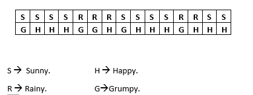

给定 15 天期间观察到的数据

在上面的数据集中，我们可以看到，在阳光明媚的日子里，快乐的概率是 0.8，在阳光明媚的日子里，脾气暴躁的概率是 0.2。同样，鲍勃在下雨天脾气暴躁的概率是 0.6，在下雨天快乐的概率是 0.4。这些概率被称为排放概率。

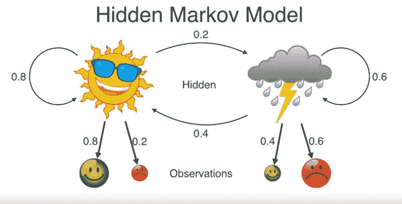

显示转移概率和排放概率的图片

我们计算先验概率。P(S)=0.67，P(R)=0.33。

现在，让我们假设三天来鲍勃是快乐的，暴躁的，快乐的，那么这三天的天气是怎样的，换句话说，这三天的天气顺序是怎样的。我们知道每天我们有两个可能的场景(*晴天和雨天*)，所以三天，比如说周三、周四、周五，我们总共有 8 个可能的序列(2*2*2=8)。我们将选择其中的每一个，计算在给定的天气条件下(隐藏状态的*序列*)鲍勃开心、暴躁、开心的概率是多少，然后选择给我们最高概率的一个。这被称为最大后验估计。

为了简单起见(演示)，让我们用两天时间(*星期三，星期四*)。HMM 模型将看起来像下面的图片。我们有先验概率 P(S)=0.67，转移概率 0.2，假设天气晴朗，鲍勃快乐的概率 P(H|S)=0.8，假设天气下雨，鲍勃脾气暴躁的概率 P(G|R)=0.2。注意这里观察到的顺序是快乐→暴躁，隐藏状态的四个可能顺序之一是晴天→雨天。观察序列的概率是所有这些概率的乘积，因为根据马尔可夫性质，在时间 *t* 给出一个状态，在时间 *t* 的观察独立于所有其他时间索引的状态和观察。

P( *hidden_state_sequence(晴→雨)，observed_sequence(开心→暴躁))* =P( *prior(晴)*)* Transition _ probability(*晴→雨* )*P(开心|晴)*P(暴躁|雨)= 0.67*0.2*0.8*0.6=0.064

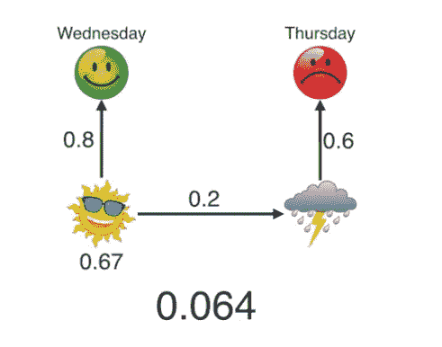

对于隐藏状态序列(晴天→雨天)

如果对所有 4 种可能的情况都这样计算，会发现对于隐藏态序列 Sunny →Sunny，联合概率最大。所以，这个模型使得快乐→暴躁最有可能发生在阳光→阳光的序列上。

使用 HMM 可以解决 3 种类型的问题:

1.  **评估** →找出给定 HMM 模型的观察序列的概率。(*向前/向后算法*)
2.  **解码** →找到最有可能生成观察序列的隐藏状态序列。(*正如我们在上面的例子*中所做的)。(*维特比算法*)
3.  **学习** →给定一个观察序列，生成一个隐马尔可夫模型。(*伯奇-韦尔奇估计*)

现在，让我们看看如何使用样本数据实现 R 中的隐马尔可夫模型。

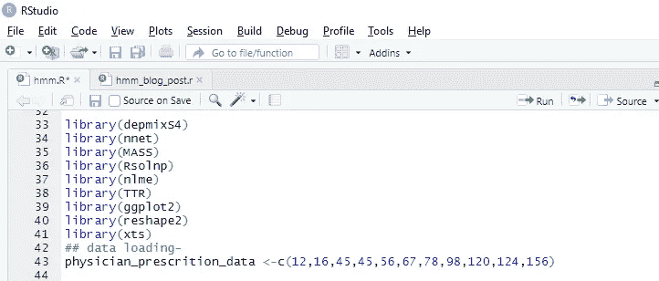

数据和重要包

在 R studio(我的 3.6 版)中可以用包 depmixS4 实现 HMM。我从一个博客中选取了一个示例，其中的数据代表了医生的处方值与时间的关系。

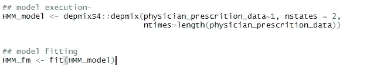

符合模型

这里我们学习隐马尔可夫模型的参数(转移概率和发射概率)。在上述模型中，将状态数初始化为 2。

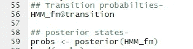

转移概率代码

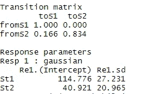

转移矩阵和响应参数

在上图中，我们可以看到转移矩阵和每个状态的值。从响应参数中，我们可以看到两个隐藏状态，高和低。高(*114.73–27.23，114.73+27.23* )低(*40.92–20.96，40.92+20.96* )。让我们看看后验概率..

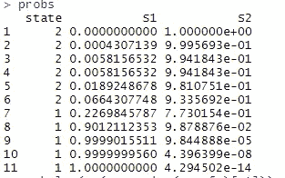

每个状态的概率。

我们可以在图中看到数据中标注的隐藏状态。这就是我们数据中隐藏的序列。

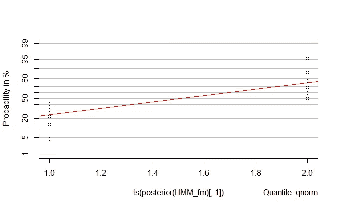

两种状态的概率图

**股市数据上的隐马尔可夫模型:**

鉴于许多大公司的明显兴趣，股票市场预测一直是过去比较活跃的研究领域之一。历史上，各种机器学习算法已经被应用，并取得了不同程度的成功。然而，由于股票预测的非平稳性、季节性和不可预测性，它仍然受到严重的限制。仅从以前的股票数据预测预测是一项更具挑战性的任务，因为它忽略了几个无关紧要的因素。

hmm 能够从连续的观察数据中模拟隐藏状态转换。股票预测的问题也可以认为是遵循同样的模式。股票的价格取决于许多因素，这些因素通常对投资者来说是不可见的(隐藏变量)。潜在因素之间的转换根据公司政策和决策、财务状况和管理决策而变化，这些因素会影响股票的价格(观察数据)。因此，hmm 是解决价格预测问题的天然选择。该数据集已经使用 R 中的 *quantmod* 库从 WWW 上删除，包含与特定股票表现相关的信息。目标是使用该数据找到 HMM 模型的隐藏状态和参数。

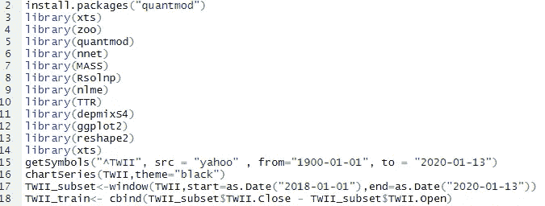

加载数据

我们提取与 TWII 相关的信息，数据集包含与给定一天的开盘价和收盘价、最高价和最低价以及股票交易量相关的信息。我们感兴趣的是用我们的 HMM 建模当天收盘价和开盘价之间的差值。我只收集了两年的数据。

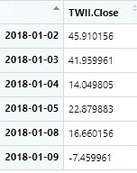

TWII_train 的前 5 行

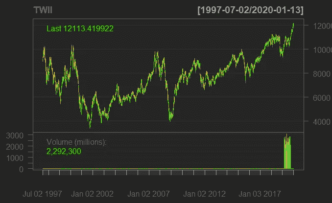

截至 2020 年 1 月 13 日的库存量图表

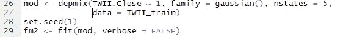

拟合 HMM 的代码

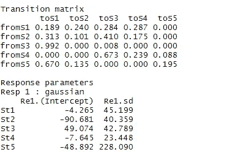

转移矩阵和响应参数

在找到 5 个隐藏状态的 HMM 模型后，我们得到上面的转移矩阵。

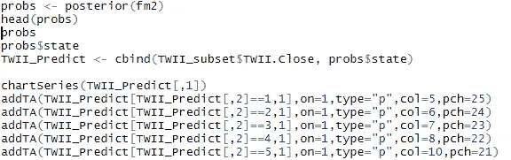

寻找后验概率的代码

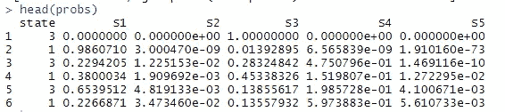

前 6 次观察的预测

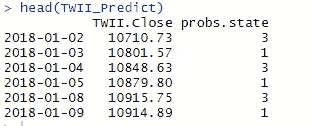

观察和相应的状态

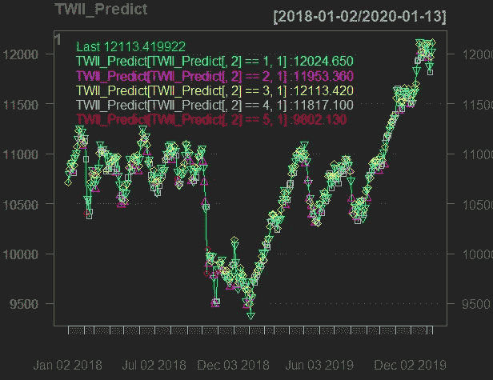

显示不同的状态

在上图中，我们可以看到我们的隐藏状态是如何映射到股票市场图的。这给了我们关于数据中隐藏状态的不同序列的想法，并且如果我们有足够的领域知识，可以从所获得的隐藏状态中推断出一些见解。

**结论:**

我们已经了解了什么是隐马尔可夫模型，并将其应用于不同的数据集，对隐马尔可夫模型有了直观的认识，并在股票市场数据上建立了 HMM。

在下一篇博客中，我将讲述连续时间隐马尔可夫模型和 HMM 中用于减少复杂计算任务的算法。将来会有更多的学习帖子，所以请关注我的媒体，保持关注！！

**其他资源和参考:**

1.  【https://www.youtube.com/watch?v=kqSzLo9fenk】→必看，非常精彩的解说博客的大部分内容都是从这里摘来的。
2.  [https://rubiks code . net/2018/10/29/stock-price-prediction-using-hidden-Markov-model/](https://rubikscode.net/2018/10/29/stock-price-prediction-using-hidden-markov-model/)→博客。
3.  [https://blog . revolution analytics . com/2014/03/r-and-hidden-Markov-models . html](https://blog.revolutionanalytics.com/2014/03/r-and-hidden-markov-models.html)
4.  http://mlg.eng.cam.ac.uk/zoubin/papers/ijprai.pdf→这是一篇非常值得一读的论文。
5.  [https://www.youtube.com/watch?v=j3r9a75zOvM](https://www.youtube.com/watch?v=j3r9a75zOvM)→我在博客中引用了这段 youtube 视频。