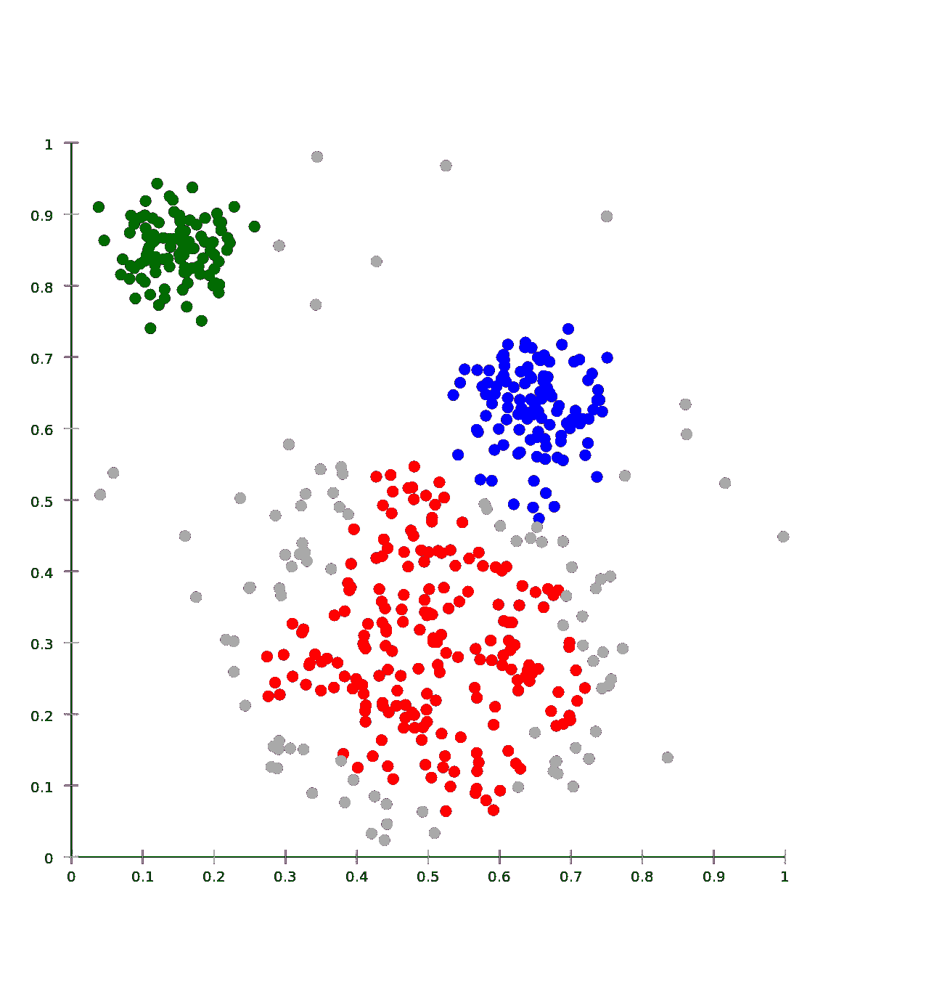
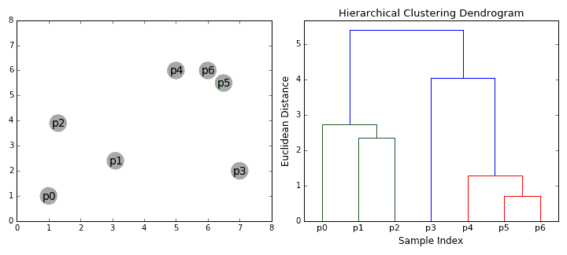
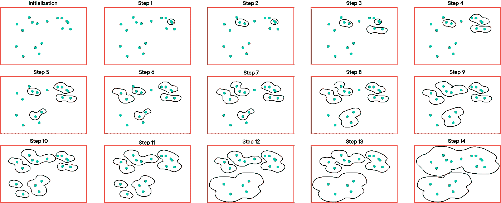

# 算法和何时使用它。

> 原文：<https://medium.com/analytics-vidhya/hierarchical-agglomerative-clustering-algorithm-and-when-to-use-it-58a3cdd6ffd2?source=collection_archive---------14----------------------->

作为一名数据科学家或营销人员，您应该已经遇到过集群。对数据进行聚类的目的是分离具有相似特征的组，并将它们分配到不同的聚类中。

图片来源—维基百科

数据科学家大多知道 Kmeans 聚类是一种无监督的机器学习形式，当我们知道数据中的底层类时，它确实非常有用。但是当我们不知道数据中存在的聚类数时，事情就变得有点复杂了。

K-means 的工作方式是获取一组参数，告诉它我们认为数据中存在多少个聚类，然后使用期望最大化(EM)算法，通过不断计算和重新计算质心的位置，将每个点分配给每个新步长最接近的聚类质心，然后将质心移动到当前分配给该质心的所有点的中心，来迭代地将每个聚类质心移动到最佳可能位置。对于非分层算法，不能有子组，也就是说，不能有簇中的簇。

凝聚聚类是一种自下而上的聚类技术，在聚类数目未知时非常有用。该算法从𝑛聚类(其中𝑛是数据点的数量)开始，并通过合并最相似的聚类来进行，直到某个停止标准。

# 算法

1.  从所有观察值和测量标准(通常是欧几里德距离)开始，计算成对的欧几里德距离
2.  考虑具有最低欧几里德距离的对作为我们的第一个聚类。
3.  现在再次计算成对的距离，但这次将前一对视为一个点。我们可以选择计算聚类的三个不同的距离(最近点、最远点或聚类的中间点，我们将在后面讨论它们)。
4.  前一步会给我们另一个集群，我们将重复步骤 3，直到我们得到一个巨大的集群。

# 联系

正如算法中提到的，我们有三种不同的方法来测量从一个点到集群的距离。它们被称为链接，Scikit-learn 提供了三个链接标准:

*   **Ward** (默认):选择两个聚类进行合并，合并的方式是所有聚类内的方差增加最小。一般来说，这导致集群的大小相当一致。
*   **平均**:合并所有点之间 ***平均*** 距离最小的两个簇。
*   **完全**(或最大链接):合并两个点之间具有最小 ***最大*** 距离的簇。

这些关联标准肯定会对聚类算法的执行产生影响。但是没有一个是“最好的”——您应该使用哪一个通常取决于您的数据结构和/或您自己的目标。

因此，当您不知道数据中聚类的数量时，以及当您在数据中寻找潜在的或感兴趣的聚类时，层次凝聚聚类非常有用。