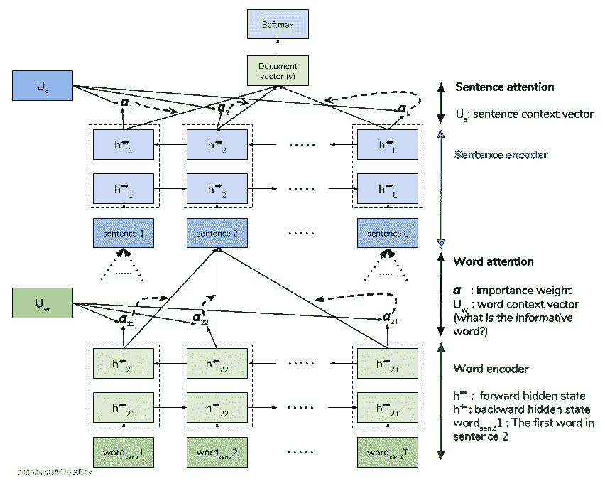
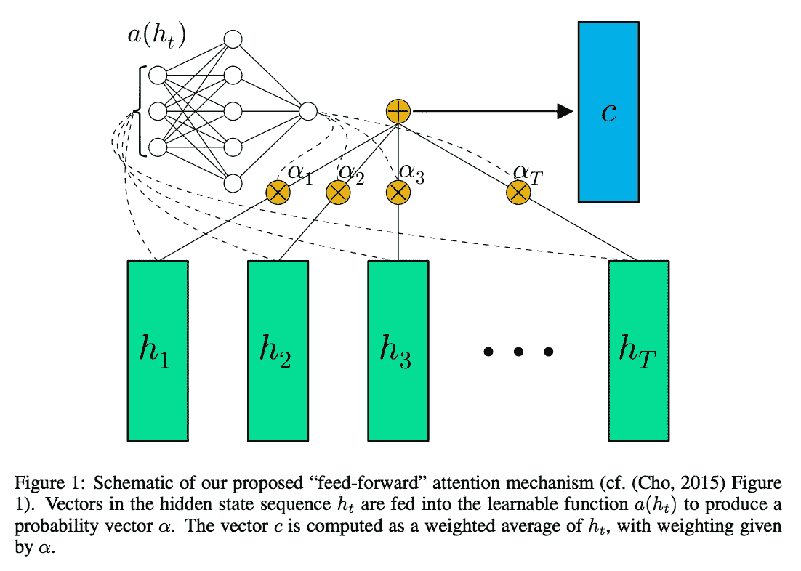

# 分层注意网络

> 原文：<https://medium.com/analytics-vidhya/hierarchical-attention-networks-d220318cf87e?source=collection_archive---------0----------------------->

## 最人性化的文本分类方式

## 这些关于文本分类的宣传是怎么回事？

自从人工智能兴起以来，文本分类已经成为最令人震惊的任务之一。通俗地说，我们可以说人工智能是试图实现类似人类的智能模型来减轻我们所有人的工作的领域。我们在文本分类方面有着惊人的熟练程度，但即使是许多复杂的 NLP 模型也无法达到甚至接近它的熟练程度。所以问题来了，我们人类做的有什么不同？我们如何对文本进行分类？

首先，我们理解单词不是每个单词，而是许多单词，我们甚至可以通过句子的结构来猜测未知的单词。然后我们就理解了那一系列单词(句子)所传达的信息。然后从那一系列的句子中，我们理解一段话或者一篇文章的意思。类似的方法也用于分层注意力模型。

## 那么这个分等级的东西有什么特别的呢？

用一种“太复杂以至于技术人员都无法理解”的方式来说，它在单词级别上使用堆叠的递归神经网络，然后使用注意力模型来提取对句子意义重要的单词，并聚集这些信息性单词的表示来形成句子向量。然后将相同的过程应用于导出的句子向量，然后生成一个向量，该向量理解给定文档的含义，并且该向量可以被进一步传递用于文本分类。

## 等等…什么？



汉族结构

论文背后的思想是“词造句，句造文”。目的是从单词中推导出句子的意思，然后从这些句子中推导出文档的意思。但并不是所有的单词都同样重要。它们中的一些比其他的更能描述一个句子。因此，我们使用注意模型，以便句子向量能够更多地注意“重要”的单词。注意模型由两部分组成:双向 RNN 和注意网络。双向 RNN 学习这些单词序列背后的含义，并返回对应于每个单词的向量，而注意力网络使用其自己的浅层神经网络来获得对应于每个单词向量的权重。然后，它聚集这些单词的表示来形成句子向量，即它计算每个向量的加权和。这个加权和体现了整个句子。同样的过程也适用于句子向量，因此最终的向量体现了整个文档的主旨。由于它有两个层次的注意模型，因此，它被称为分层注意网络。

## 说够了…给我看看代码

我们使用[新闻类别数据集](https://www.kaggle.com/rmisra/news-category-dataset)对新闻类别进行分类。你可以在这里看到整个实现[。现在第一个出现在脑海中的问题是注意力到底是什么？](https://www.kaggle.com/hsankesara/news-classification-using-han/notebook)

## 注意力模型



来自双向 RNN 的向量通过浅层神经网络来确定每个向量对应的权重。每个向量的加权和体现了这些向量组合的含义。要更简单地理解它，只需进入[代码](https://github.com/Hsankesara/DeepResearch/blob/master/Hierarchical_Attention_Network/attention_with_context.py)。

**数据预处理**

为了处理数据，我们需要把它转换成合适的形式。

```
tokenizer = Tokenizer(num_words=max_features, oov_token=True)
tokenizer.fit_on_texts(texts)
data = np.zeros((len(texts), max_senten_num, max_senten_len), dtype='int32')
for i, sentences in enumerate(paras):
    for j, sent in enumerate(sentences):
        if j< max_senten_num:
            wordTokens = text_to_word_sequence(sent)
            k=0
            for _, word in enumerate(wordTokens):
                try:
                    if k<max_senten_len and tokenizer.word_index[word]<max_features:
                        data[i,j,k] = tokenizer.word_index[word]
                        k=k+1
                except:
                    print(word)
                    pass
```

我们使用上面的代码将训练数据集转换为三维数组:第一维表示文档总数，第二维表示文档中的每个句子，最后一维表示句子中的每个单词。然而，我们必须设置一些上限，以便创建一个静态图，在这种情况下是`max_senten_len`(一个段落中句子的最大数量)`max_senten_num`(一个句子中的最大字数)和`max_features`(分词器可以拥有的最大字数)。

如果我们随机初始化所有的单词，是不是对模型不公平？因此，我们使用[训练过的嵌入向量](https://nlp.stanford.edu/projects/glove/)，这在性能方面给予模型额外的优势，并产生更好的结果。

```
GLOVE_DIR = "../input/glove6b/glove.6B.100d.txt"
embeddings_index = {}
f = open(GLOVE_DIR)
for line in f:
    try:
        values = line.split()
        word = values[0]
        coefs = np.asarray(values[1:], dtype='float32')
        embeddings_index[word] = coefs
    except:
        print(word)
        pass
f.close()
embedding_matrix = np.zeros((len(word_index) + 1, embed_size))
absent_words = 0
for word, i in word_index.items():
    embedding_vector = embeddings_index.get(word)
    if embedding_vector is not None:
        # words not found in embedding index will be all-zeros.
        embedding_matrix[i] = embedding_vector
    else:
        absent_words += 1
print('Total absent words are', absent_words, 'which is', "%0.2f" % (absent_words * 100 / len(word_index)), '% of total words')
```

我们在`embedding_matrix`中将已知单词替换为其对应的向量。的确，有些词会被遗漏，但我们的模型必须学会应对这种情况。

## 现在是韩模型的时候了

```
embedding_layer = Embedding(len(word_index) + 1,embed_size,weights=[embedding_matrix], input_length=max_senten_len, trainable=False)# Words level attention model
word_input = Input(shape=(max_senten_len,), dtype='float32')
word_sequences = embedding_layer(word_input)
word_lstm = Bidirectional(LSTM(150, return_sequences=True, kernel_regularizer=l2_reg))(word_sequences)
word_dense = TimeDistributed(Dense(200, kernel_regularizer=l2_reg))(word_lstm)
word_att = AttentionWithContext()(word_dense)
wordEncoder = Model(word_input, word_att)# Sentence level attention model
sent_input = Input(shape=(max_senten_num, max_senten_len), dtype='float32')
sent_encoder = TimeDistributed(wordEncoder)(sent_input)
sent_lstm = Bidirectional(LSTM(150, return_sequences=True, kernel_regularizer=l2_reg))(sent_encoder)
sent_dense = TimeDistributed(Dense(200, kernel_regularizer=l2_reg))(sent_lstm)
sent_att = Dropout(0.5)(AttentionWithContext()(sent_dense))
preds = Dense(30, activation='softmax')(sent_att)
model = Model(sent_input, preds)
model.compile(loss='categorical_crossentropy',optimizer='adam',metrics=['acc'])
```

对于 word2vec，我们使用了 Keras [嵌入](https://keras.io/layers/embeddings/)层。[时间分布](https://keras.io/layers/wrappers/)方法用于将`Dense`层独立应用于每个时间步。我们使用`Dropout`和`l2_reg`正则化来减少过度拟合。

## 结论

你现在一定很惊讶或者很困惑。有时这些事情可能会过头，但文本分类是一个趋势领域，尽管有许多新的和多产的研究，改进的范围是如此之大。所以不要只在现在绝望，因为你以后会有更多的失望😅。开玩笑，如果你有任何疑问，请在下面评论或参考资源页面。

## 资源

1.  前往[此处](https://github.com/Hsankesara/DeepResearch/tree/master/Hierarchical_Attention_Network)查看代码。
2.  去[这里](https://www.kaggle.com/hsankesara/news-classification-using-han/notebook)结账实现。
3.  [用于从癌症病理学报告中提取信息的分级注意网络。](https://www.ncbi.nlm.nih.gov/pubmed/29155996)
4.  [用于文档分类的分层注意力网络](http://www.cs.cmu.edu/~./hovy/papers/16HLT-hierarchical-attention-networks.pdf)

# 作者说明

本教程是我的系列文章 [DeepResearch](https://github.com/Hsankesara/DeepResearch) 的第一篇。如果你喜欢这个教程，请在评论中告诉我，如果你不喜欢，请在评论中简单告诉我。如果你有任何疑问或批评，请在评论中大量发表。我会尽快回复你的。如果你喜欢这个教程，请与你的同伴分享。