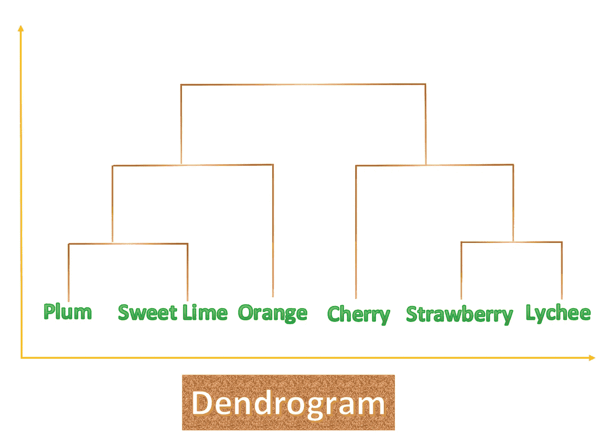

# 分层聚类

> 原文：<https://medium.com/analytics-vidhya/hierarchical-clustering-4a9ed95b56d5?source=collection_archive---------33----------------------->

## 简介:它是一种特定类型的聚类，或者可以说它是一种执行聚类的特定方式。这种类型的聚类适用于小型数据集，并且非常直观。

来源:[皮埃特罗·詹](https://unsplash.com/@pietrozj)通过 [Unsplash](https://www.unsplash.com)

*我建议在阅读这篇文章之前，请先阅读我的另一篇详细解释聚类的文章，因为这样你就会对聚类有一个坚实的基础。*

 [## 什么是集群？

### 简介:有没有想过在没有实际标签/类/目标的情况下，根据相似的特性来排列数据…

medium.com](/@harshitdawar/what-is-clustering-a23b3b432bc2) 

一旦读完了上面的文章，现在是开始读这篇文章的好时机。

## 分层聚类的解释

这种类型的聚类开始以**树格式**生成数据聚类。

> 内部分层集群试图构建一个树，其中每个节点都可以被视为其子节点的集群。

***层次聚类可以进一步分为两类，分别是:***

1.  结块的
2.  分裂的

## **凝聚层次聚类**

它基于自下而上的树形结构。

这种方法从树的底部开始&继续向上构建聚类树。它首先找到两个或更多最相似的特征，并通过创建聚类树的一个节点将它们组合成一个，可以通过它们之间的距离找到它们，假设有多个点，那么具有最小距离的两个特征将被认为是树的最下面的节点。

通过递归地继续上面解释的方法，可以形成一个容易解释的完整的树&可以容易地从该树中提取多种见解。

## 分裂层次聚类

它与凝聚法相反&与凝聚法相比，它的工作原理相反。

它基于聚类树形成的自顶向下的方法。首先，它创建一个相距较远的项目的聚类，然后在聚类树中向下移动，继续上述步骤，直到形成完整的树。

> 一般来说，这两种方法中最流行的方法是凝聚法，因为首先形成彼此相似的项目群更相关。

## 凝聚方法的例子

在这个例子中，我展示了水果层次聚类的实际例子。一般来说，层次聚类的输出被表示为一个**“树状图”**，这是一种表示树的方式，或者我们可以说是树的图形表示。

**作者图片**

在上图中，“**y”**轴代表聚类之间的相似度，随着 y 值的增加，相异度也增加。**【x】**轴代表星团。

## 上述树状图的解释

成对的(“李子”和“酸橙”)&“草莓”和“荔枝”)的群集首先形成(使用凝聚方法)，因为它们最相似。

现在，上面的两对都可以被视为一个单独的实体，其他水果的相似性将与它们进行比较&进一步的聚类树增长。在本示例中，根据两者之间的相似性，一对(“李子”和“酸橙”)与“橙子”聚类在一起，另一对(“草莓”和“荔枝”)与“樱桃”聚类在一起。

以这种方式，分层聚类执行并形成数据的聚类。

***我希望我的文章在解释树状图的同时解释了与层次聚类相关的每一件事情。非常感谢你花时间阅读我的文章，增长你的知识！***