# 分层聚类(凝聚)

> 原文：<https://medium.com/analytics-vidhya/hierarchical-clustering-agglomerative-f6906d440981?source=collection_archive---------5----------------------->

在本文中，我们将了解层次聚类的凝聚方法、算法步骤及其数学方法。

在深入研究分层集群之前，让我们先了解一下集群。

> ***什么是聚类？*** 聚类是将对象(或数据点)划分为彼此相似而与属于另一个簇的对象(或数据点)不相似的簇的方法。

聚类可以分为两种:
1。层次聚类
2。部分聚类

> ***层次聚类*** 层次聚类是根据某种相似性度量将数据从聚类的层次结构中分离到不同的组中。

层次聚类有两种类型:
1。凝聚的
2。分裂的

> ***凝聚式聚类*** 凝聚式聚类又称为自下而上的方法。
> 在这种方法中，我们将所有数据点视为聚类，并根据聚类之间的距离开始合并。这将一直持续到我们形成一个大集群。
> 
> ***分裂聚类*** 分裂聚类被称为自上而下的方法。
> 在这种方法中，我们采用巨大的集群，并开始将其分解成更小的集群，直到它到达单个数据点(或单点集群)。

到目前为止，我们已经看到了聚类，层次聚类，凝聚聚类和分裂聚类。现在让我们详细了解其中一种技术，凝聚聚类。

**凝聚聚类
算法** 1。将每个数据点作为单点聚类。
2。用单链法取两个距离最近的聚类，使它们成为一个聚类。
3。重复步骤 2，直到只有一个集群。
4。创建一个树状图来可视化分组的历史。
5。从树状图中找出最佳聚类数。

**聚集聚类的数学方法** 让我们获取包含客户身高和体重的数据集。为了简单起见，我只取了 6 行。

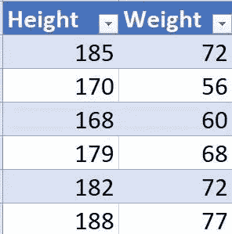

资料组

让我们把它画在图上，更好地形象化。

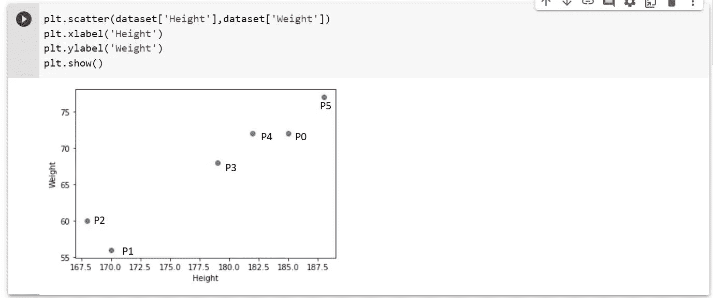

身高体重图

步骤 1:将每个数据点作为单点聚类。

第二步:用单链法取两个距离最近的聚类，使它们成为一个聚类。

在对每个聚类使用单一链接方法之前，我们必须知道聚类之间的距离。
让我们借助距离矩阵来可视化每个集群之间的距离。这里，我取两点之间的欧几里德距离。

P00 = 0，P11 = 0，P22 = 0，P33 = 0，P44 = 0
(这是因为自身距离为 0)

两点间的距离 P12
= sqrt( (P1。X — P2。X) + (P1。P2。y))
= sqrt((170–168)+(56–60))
= sqrt(4+16)= sqrt(20)= 4.47

同样，我们必须计算所有集群之间的距离，并制作一个距离矩阵。

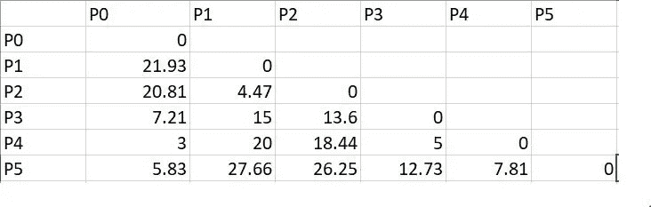

所有点的距离矩阵

现在，我们要看看哪两个集群的距离最小。是的，你是对的！P0 和 P4 之间的距离是 3。因此，我们必须将这两个集群组合在一起。现在，在单连接方法的帮助下，我们将合并两个集群。

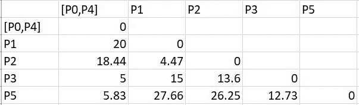

合并 P0 和 P4 后

我知道你在想，等一下，我们是如何得到 P1-[P0，P4]，P2-[P0，P4]，P3-[P0，P4]，P5-[P0，P4]的值的。我们借助于单连锁法得到了这些值。

上面说，P1 的距离-[P0，P4] = d(P1，[P0-P4])
= min(d(P1，P0)，d(P1，P4)) = min( 21.93，20 ) = 20

距离 P2-[P0，P4] = d(P2，[P0，P4])
= min(d(P2，P0)，d(P2，P4)) = min( 20.81，18.44 ) = 18.44

同样，我们计算了所有的距离。

第三步:再次重复第二步
，最短距离为 P1-P2。因此，下一个距离矩阵将是:

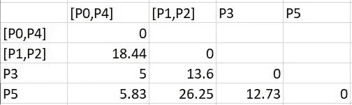

合并 P1 和 P2

步骤 3:重复步骤 2
现在最小距离是 P3-[P0，P4]也就是 5。因此，下一个距离矩阵将是:

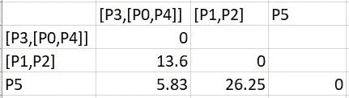

P3 和[P0，P4]的合并

第三步:重复第二步
，现在最小距离是 P5-[P3，[P0，P4]]，也就是 5.83。因此，下一个距离矩阵将是:

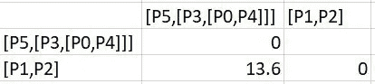

合并 P5 和[P3，[P0，P4]]

步骤 3:重复步骤 2
现在只有两个距离为 13.6 的聚类。因此，最终的距离矩阵将是:

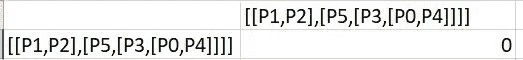

[P1、P2]和[P5、[P3、[P0、P4]]]合并

步骤 4:创建一个树状图来可视化分组的历史。

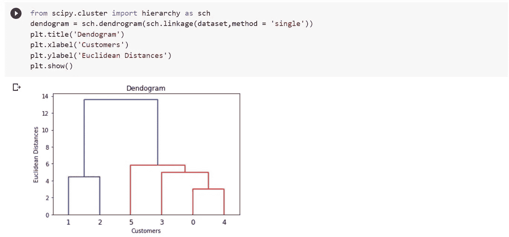

系统树图

正如我们在树状图中看到的，首先 P0 和 P4 合并，然后 P1 和 P2 合并，然后 P3 和[P0，P4]合并，然后 P5 和[P3，[P0，P4]]，最后[P1，P2]和[P5，[P3，[P0，P4]]]。

步骤 5:从树状图中找到最佳的聚类数。

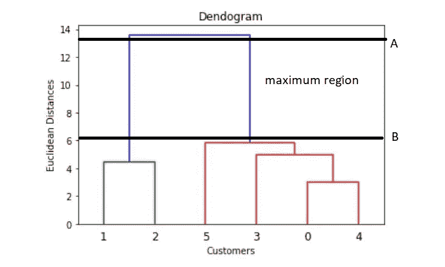

系统树图

为了找到最佳的集群数量，我们需要:
1。确定不与任何其他聚类相交的最大垂直距离。
2。在上图的 A 和 B 的两端画两条水平线。
3。最佳聚类数=穿过水平线的垂直线数。

在这里，从上面的树状图我们可以清楚地看到，有 2 条垂直线穿过水平线。

因此，最佳聚类数= 2。

**可视化最终聚类**

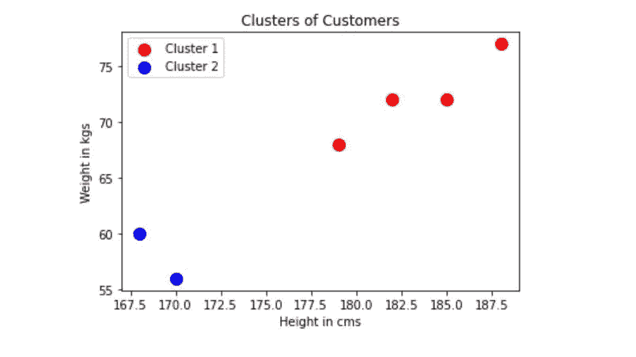

最终聚类

这就是凝聚集群的工作原理。我希望这有助于您理解使用层次聚类的一种方法。

**注意:**我们已经使用了单一链接方法来确定两个聚类之间的距离，但是您可以使用其他链接方法来计算距离。

参考文献:
1。[https://www.youtube.com/watch?v=EFhcDnw7RGY](https://www.youtube.com/watch?v=EFhcDnw7RGY)2
。[https://towards data science . com/machine-learning-algorithms-part-12-hierarchical-agglomerate-clustering-example-in-python-1e 18 e 0075019](https://towardsdatascience.com/machine-learning-algorithms-part-12-hierarchical-agglomerative-clustering-example-in-python-1e18e0075019)
3 .[https://www.youtube.com/watch?v=9U4h6pZw6f8&t = 908s](https://www.youtube.com/watch?v=9U4h6pZw6f8&t=908s)