# 分层聚类

> 原文：<https://medium.com/analytics-vidhya/hierarchical-clustering-d2d92835280c?source=collection_archive---------8----------------------->

照片由[🇸🇮·扬科·菲利](https://unsplash.com/@itfeelslikefilm?utm_source=medium&utm_medium=referral)在 [Unsplash](https://unsplash.com?utm_source=medium&utm_medium=referral) 上拍摄

聚类是一种无监督的机器学习技术。在这篇博客文章中，我们将涉及以下主题

1.  什么是集群？
2.  分层聚类。
3.  分层聚类的实现。

**1。** **什么是聚类？**

聚类是基于相似性对数据点进行分组的过程，使得一个聚类中的数据点彼此相似，而与其他聚类中的数据点不相似。例如，图 1.1 中所示的数据点被分成三组。

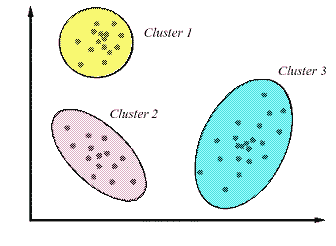

**图 1.1:聚类**

来源:-[https://i.ytimg.com/vi/2QTeuO0C-fY/hqdefault.jpg](https://i.ytimg.com/vi/2QTeuO0C-fY/hqdefault.jpg)

有各种距离度量来计算数据点或聚类之间的相似性。其中一些列举如下

欧几里得距离

最大距离

曼哈顿距离

堪培拉距离

二元距离

闵可夫斯基距离

**2。** **层次聚类**

**层次聚类**是聚类的类型之一。它将数据点划分为一个聚类层次。它可以分为两种类型——凝聚聚类和分裂聚类。

i) **凝聚聚类**

聚集聚类遵循自下而上的方法。在聚集聚类中，每个数据点被分配给一个单独的聚类。在每次迭代中，基于聚类的相似性将聚类合并在一起，并且重复该过程，直到形成一个聚类或 K 个聚类。

**算法:-**

1.将每个数据点分配给单个聚类。

2.基于相似性合并聚类。

3.重复步骤 2，直到我们剩下 k 个集群或单个集群。

为了理解聚集聚类的概念，让我们考虑五个数据点{a，b，c，d，e}。

**步骤 0:-** 在步骤 0 中，所有的数据点都被分配到单个聚类中。因此有五个群集{a}、{b}、{c}、{d}、{e}最初对应于五个数据点。

**步骤 1:-** 在步骤 1 中，聚类{a}和{b}被合并成单个聚类{a，b}，因为它们彼此相似，并且我们留下了 4 个聚类。

**步骤 2:-** 在步骤 2 中，聚类{d}和{e}基于相似性被合并，并且我们有 3 个聚类。

**步骤 3:-** 在步骤 3 中，聚类{c}和{d，e}被合并成单个聚类{c，d，e}，因为它们彼此相似，并且我们留下了两个聚类。

**步骤 4:-** 在步骤 4 中，聚类{a，b}和{c，d，e}被合并成单个聚类{a，b，c，d，e}，因为它们彼此相似，现在最后，我们只剩下单个聚类，如图 1.2 所示。

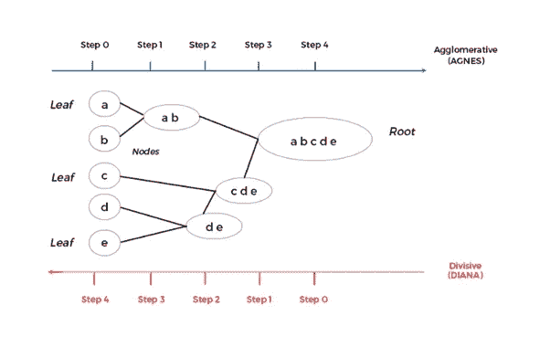

**图 1.2:聚集和分裂聚类**

来源:[https://i1 . WP . com/rposts . com/WP content/uploads/2017/12/Agnes . png](https://i1.wp.com/r-posts.com/wp-content/uploads/2017/12/Agnes.png)

**ii)分裂聚类**

分裂聚类遵循自上而下的方法。它与凝聚集群相反。在分裂聚类中，所有数据点都被分配到一个聚类中。在每一次迭代中，基于不相似性将聚类分成其他聚类，并且重复该过程，直到我们剩下 n 个聚类。

**算法:-**

1.将所有数据点分配给单个聚类。

2.根据相异度将数据点划分为单独的聚类。

3.重复步骤 2，直到我们剩下 n 个集群。

为了理解分裂聚类的概念，让我们考虑五个数据点{a，b，c，d，e}。

**步骤 0:-** 在步骤 0 中，所有点{a，b，c，d，e}被分配到单个聚类。所以最初只存在一个集群。

**步骤 1:-** 在步骤 1 中，聚类{a，b，c，d，e}根据相异度被分成两个聚类{a，b}和{c，d，e}。

**步骤 2:-** 在步骤 2 中，聚类{c，d，e}被分成两个聚类{c}和{d，e}，因为它们不相似。

**步骤 3:-** 在步骤 3 中，聚类{d，e}基于相异度被分成两个聚类{d}和{e}。

**步骤 4:-** 在步骤 4 中，聚类{a，b}根据相异度被分成两个聚类{a}和{b}，现在，最终我们剩下五个聚类，即{a}、{b}、{c}、{d}、{e}，如图 1.2 所示。

**如何计算一个数据点或一个聚类到另一个聚类的距离**

**一、单联动**

在单链聚类中，从一个数据点或一个聚类到另一个聚类的距离是通过取一个聚类的任何成员到另一个聚类的任何成员的最小距离来计算的，如图 1.3 所示。

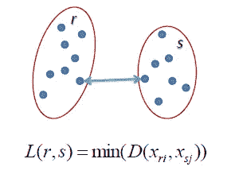

图 1.3:单一连杆

来源:[https://www.saedsayad.com/images/Clustering_single.png](https://www.saedsayad.com/images/Clustering_single.png)

**二。完成联动**

在完全关联聚类中，从一个数据点或一个聚类到另一个聚类的距离是通过取一个聚类的任何成员到另一个聚类的任何成员的最大距离来计算的，如图 1.4 所示。

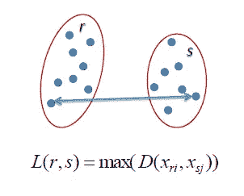

图 1.4:-完整的连接

来源:-[https://www.saedsayad.com/images/Clustering_complete.png](https://www.saedsayad.com/images/Clustering_complete.png)

**三世。平均联动**

在平均关联聚类中，一个数据点或一个聚类到另一个聚类的距离是通过计算一个聚类的任何成员到另一个聚类的任何成员的平均距离来计算的，如图 1.5 所示。

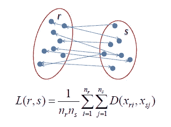

图 1.5:-平均链接

来源:【https://www.saedsayad.com/images/Clustering_average.png】T4

**3。实现层次聚类**

为了进行实验，我从 Kaggle 下载了一个数据集(https://www.kaggle.com/deepakg/usarrests)。该数据集包含 1973 年美国 50 个州每 100，000 名居民中因攻击、谋杀和强奸而被捕的统计数据。它也给出了居住在城市地区的人口百分比。

1.  **加载数据集**

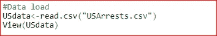

执行上述代码后，我们得到以下输出-

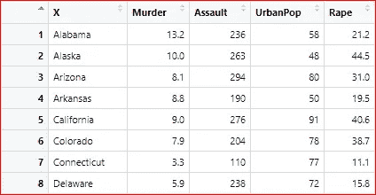

在这里，我们已经加载了数据集，我们可以看到数据集的行。

**2。缩放比例**

在应用层次聚类之前，需要对数据进行归一化，以便每个变量的尺度都相同。如果变量的比例不同，模型可能会偏向比例较高的变量。

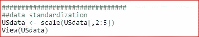

执行上述代码后，我们得到以下输出-

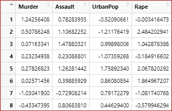

在这里，我们可以看到所有变量的规模几乎是相似的。

3.下一步是计算不同数据点之间的欧几里德距离，并将结果存储在变量 d 中。

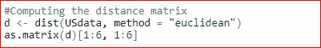

执行上述代码后，我们得到以下输出-

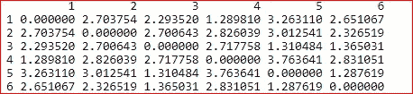

在这里，我们可以看到不同数据点的距离的 6*6 矩阵。

4.使用分层平均链接方法进行聚类。

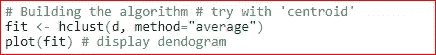

为了绘制树枝状图，我们在这里使用了 plot 命令，得到了下图。

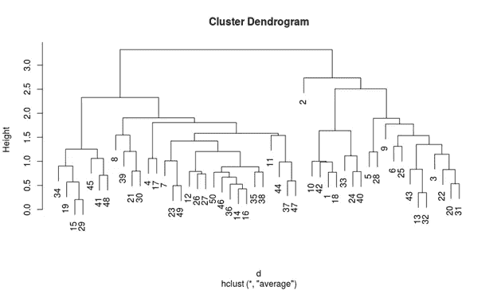

5.将树突分割成簇。

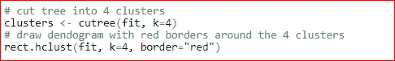

执行上述代码后，我们得到以下输出-

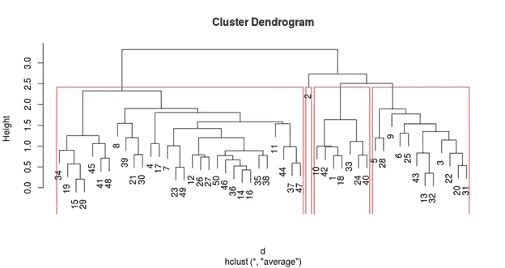

6.将聚类数与数据集关联

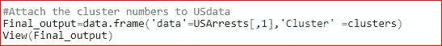

执行上述代码后，我们得到以下输出-

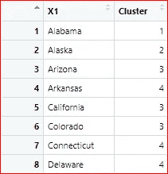

在这里，我们可以看到数据被分成了几个簇。