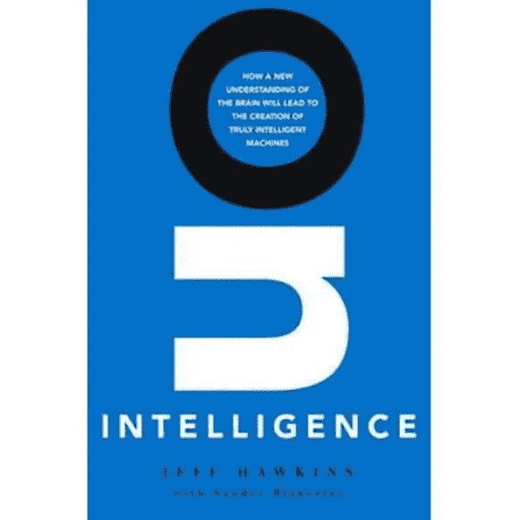
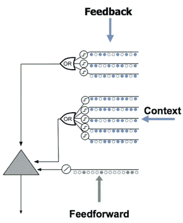
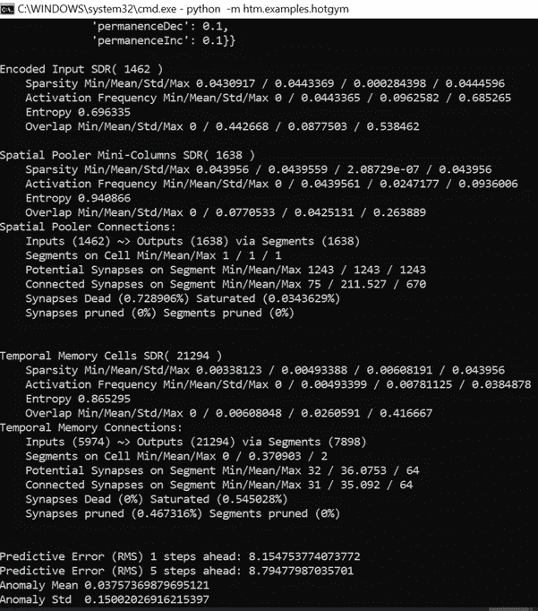
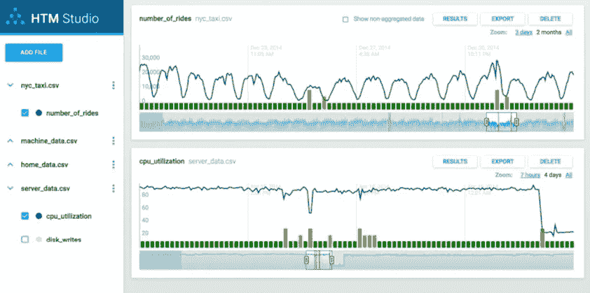

# 分级时间记忆:比深度学习更符合生物学原理

> 原文：<https://medium.com/analytics-vidhya/hierarchical-temporal-memory-more-biologically-plausible-than-deep-learning-6ef3698d1503?source=collection_archive---------10----------------------->

在这篇文章中，我们概述了 htm 及其应用，以及为什么它可能是深度学习之后的下一个重大突破

**深度学习和其他现有 ML 模型的问题**

人工智能的研究，尤其是深度学习，已经在计算机视觉、语音、自然语言处理等领域取得了令人瞩目的成果。但是他们还不能复制**人类的学习和智力。**现有的 ML 和 DL 模型不能通用化，它们需要许多训练步骤等。问题是，这种模型抽象出了一些重要的生物成分:例如，它们将神经元视为一个点，将输入和输出视为数字，没有像大脑皮层中的神经元那样对横向和抑制性连接进行建模，它们没有对来自感官的流数据的时间方面进行建模，每个感官都有空间和时间成分。如果我们接受生物学的**指导，我们可以做得更好。**

如果我们考虑人类或哺乳动物的婴儿，它可以在无人监管的情况下学习移动、说话、阅读、写作、识别概念和学习其他技能。我们的大脑是低功率的，能够在没有特定训练的情况下在熟悉的场景中检测新的物体，其时间是计算机 ML 模型处理相同场景的一小部分。即使是鼻涕虫大脑或苍蝇大脑也能比最新的 ML 模型做得更好(就功耗而言)。此外，开发这种模型的人之间存在脱节。计算机科学家和 ML 工程师和研究人员建立更高级别的 ML/DL 模型，更专注于解决现实世界的问题，仅从生物学中获取灵感。另一方面，神经科学家为大脑的每个小部分建立了详细的模型，但可能无法模拟大脑如何计算和智力如何真正工作的更大图景。

**《智力论》一书与 HTM 的发展**

Palm pilot 的发明者杰夫·霍金斯(Jeff Hawkins)试图修复神经科学和机器学习模型之间的脱节，并在此过程中开发了一种更好的理论和神经元及其连接的更好模型。他在 2004 年写了一本开创性的书《关于智力的 T8》，该书提出了一个关于智力如何在新皮层中工作的统一理论，这在生物学上也是合理的。这本书的主要贡献在于提出了一个**记忆预测框架**，该框架将智力定义为通过新大脑皮层的不同层次对世界做出预测的能力。

新大脑皮层是我们大脑的前额部分，是负责高级功能的部分，我们通常称之为智力。Hawkins 基于 Vernon Mountcastle 在 1978 年的工作建立了这个框架，他的想法是在新皮层中存在功能的多样性，但是对于新皮层中负责听觉、触觉、视觉、运动指令等的部分，神经元结构和电路架构是相似的(以多层层级的形式)。此外，它们的交流机制也是相同的，即电脉冲或脉冲。只是和不同地区的连接不一样。因此，它们必须都以不变的方式执行相同的计算。

因此，霍金斯在他的书中假设，新皮层的每一层都产生对世界的预测，来自较高层的预测通过反馈连接，以及从较低层(与感官相连)到皮层较高层的前馈连接，被发送回较低层。此外，还有来自作为上下文的其他层的横向连接。此外，这些神经元有办法处理输入的空间和时间方面。

HTM 神经元的结构(类似于大脑皮层的锥体神经元)

为了进一步发展他的理论，Hawkins 在 2005 年成立了一家名为 Numenta 的公司，并提出了**分层时间记忆(HTM)** 模型，该模型与新大脑皮层的神经元共享这些属性:它们可以学习和预测模式序列，使用一次性 **Hebbian 学习规则**进行学习(而不是像 DL 中通常使用的反向投影梯度下降这样的纠错规则)，它可以即时学习，以不变的形式存储模式，具有分层结构等。

HTM 网络的结构

**工作原理:HTM 的组件**

numenta.com 网站上的许多优秀视频、论文和文章描述了 HTM 网络的几个重要组成部分。如上所述，HTM 网络反映了新皮层的组织(细胞、柱状和区域)。概括地说，主要组成部分是:

7 的 SDR 编码

**通过稀疏分布式表示(SDRs)编码** : SDRs 将信息编码为一个稀疏的二进制向量，其中大部分比特为 0，少数比特(比如约 2%)为 1。每个比特都有语义，每个比特激活多个相邻的 HTM 单元，两个 SDR 之间的重叠是相似性的度量。HTM 的输出也是 SDR 的形式，并且应该与所有输入具有相同的大小和相同的稀疏性。

日期的 SDR 编码

SDRs 被称为大脑的数据结构，因为大脑各层使用具有相似属性(稀疏性和分布式表示)的电尖峰来传输信息。

**空间池激活 HTM 细胞列:**从输入开始，以 SDRs 形式激活输入比特对应的 HTM 神经元被激活。空间池层使用 Hebbian 学习(Hebb 规则:—当细胞 *A* 的轴突足够靠近以激发细胞 *B* 并重复或持续参与激发它时，在一个或两个细胞中发生一些生长过程或代谢变化，使得 *A* 的效率，作为激发 *B* 的细胞之一，增加)以加强或削弱 HTM 细胞的连接(突触的永久值)。这与增强和抑制相结合，以确保只有有限数量的邻近细胞着火。

**学习输入 SDR 的时间模式的时间记忆**:由于输入是 SDR 数据流(反映真实世界，我们所有的大脑都获得视觉、感觉、运动数据流)，我们还必须处理它的时间方面，即输入与先前输入的时间关系。因此，需要对状态或上下文进行某种表示。这在时间记忆算法中处理。每列中只有单元的子集被激活，并且为从其他单元接收横向输入的一些单元定义了称为“预测”状态的状态。预测单元对下一个输入进行预测。

**使用方法:玩 HTM**

对于那些想尝试和玩 HTM 模型的人，这里有一些可用的资源:

1.  Nupic 是一个来自 Numenta(Hawkis 创建的开发 HTMs 的公司)的开源库，用 python 和 C++编写。可以通过 [Github 链接](https://github.com/numenta/nupic)访问。python 笔记本中还有一个[样本代码](https://github.com/numenta/nupic/blob/master/examples/NuPIC%20Walkthrough.ipynb)演练。然而，它只适用于 Python 2.7，不适用于 python 3.x。

HTM 核心示例代码的输出

2.HTM 核心是一个社区项目，将与 python 3.x 一起工作。可以从他们的 [Github 链接](https://github.com/htm-community/htm.core)访问它。可以通过运行*python-m htm . examples . hot gym*来尝试一个示例应用程序

3.使用 HTMs 的简单序列学习应用程序的一些示例代码可在[这里](https://3rdman.de/2020/02/hierarchical-temporal-memory-part-1-getting-started/)和[这里](https://3rdman.de/2020/04/hierarchical-temporal-memory-part-2/)获得。

4.其他一些与 HTM 相关的项目也可以在 github 上找到[https://github.com/topics/hierarchical-temporal-memory](https://github.com/topics/hierarchical-temporal-memory)

**高温超导能做什么:应用**

已经开发了一些使用 HTMs 的应用程序。htm 擅长异常检测，就像应用程序一样，其中有一个数据流(可以是任何类型的数据，如财务数据或与系统状态相关的数据)进来，需要进行预测并检测异常。理论上，人们可以使用 HTMs 对机器人进行编程，使其处理来自摄像头、声音传感器等的数据流。

对于异常检测，使用 HTM 的主要步骤是:

1.  对于每一种被分析的输入数据流，我们需要一个单独的 HTM 模型
2.  将数据与时间戳相结合
3.  将输入数据输入编码器以转换为 SDR
4.  编码值被馈送到 HTM 算法组件(空间池和时间存储器)。人们可以看到上面的示例代码来了解如何做到这一点。
5.  HTM 算法根据它看到的过去的数据，预测新的模式应该是什么样子。如果新数据与过去的数据不匹配，它将标记异常

与现有的异常检测方法相比，使用 HTM 的优势在于它们无法捕捉到模式中细微或缓慢的变化，而 HTM 却可以。

HTM 工作室的用户界面

**HTM 工作室**是一个由 Numenta 开发的应用程序，人们可以把他们的流媒体数据和检测异常，只要它在定义的格式。这里的链接是[这里是](https://numenta.com/machine-intelligence-technology/htm-studio/)。人们可以在 windows 或 linux 中安装 exe。它非常容易使用，几乎不需要时间来训练和标记异常。

HTMs 已经商业化的其他应用包括:流氓行为检测(如果计算机网络的用户正在显示文件的异常行为，则进行监视和标记)、地理空间跟踪(监视人或物体(如送货车)移动的异常)、检测公开交易股票中的异常(基于股票价格和交易量)以及监视服务器负载。

**结论**

总之，HTMs 是一个生物学上似乎合理的模型，已被证明适用于流数据的异常检测，但在 NLP 等领域还有许多其他潜在的机器学习应用。它们是基于杰夫·霍金斯在书中提出的普遍统一的智力理论，如果被证明是正确的，这本身就是一个巨大的突破。包括网格细胞在内的一些有希望的发现似乎支持了 HTM 理论，现在被称为智力的千脑理论。因为它们在生物学上更合理，所以其优点如处理未标记的数据、没有训练周期、低功率、更快的输出等。可通过 HTMs 获得。随着时间的推移，也许 htm 有潜力在各个领域超越深度学习和其他先进模型。

**参考文献**

1.  [https://numenta . com/blog/2019/10/24/machine-learning-guide-to-htm](https://numenta.com/blog/2019/10/24/machine-learning-guide-to-htm)

2.Jeff Hawkins 等人，基于新皮层网格细胞的智力和皮层功能框架，神经回路 2019[https://www . frontiersin . org/articles/10.3389/fn cir . 2018.00121/full](https://www.frontiersin.org/articles/10.3389/fncir.2018.00121/full)

3.HTM 白皮书[https://numenta . com/neuroscience-research/research-publications/papers/hierarchical-temporal-memory-white-paper/](https://numenta.com/neuroscience-research/research-publications/papers/hierarchical-temporal-memory-white-paper/)

4.[https://github.com/numenta/nupic](https://github.com/numenta/nupic)

5.[https://github.com/topics/hierarchical-temporal-memory](https://github.com/topics/hierarchical-temporal-memory)