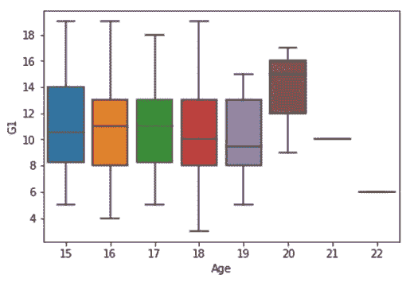
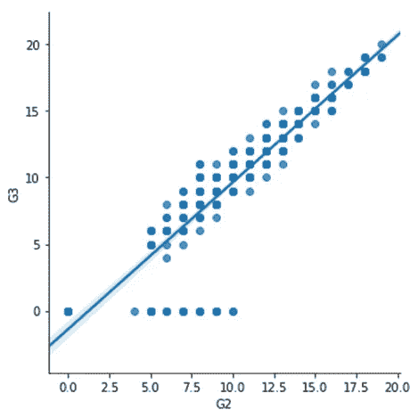

# 高中数学成绩

> 原文：<https://medium.com/analytics-vidhya/high-school-math-performance-523d5839d7d7?source=collection_archive---------5----------------------->


斯文·米克在 [Unsplash](https://unsplash.com?utm_source=medium&utm_medium=referral) 上的照片

**简介**

在数学教育领域，大学和教育工作者面临的一个主要问题是，学生在数学方面没有达到令人满意的水平，也没有以令人满意的速度取得成功。大学和教育工作者抱怨学生的高失败率、退学率和退学率。这对学生来说是一个问题，因为数学成绩差阻碍了他们追求学位和职业。这对大学和教育工作者来说是一个问题，因为这意味着大学或教育工作者没有成功地教授学生，没有留住学生，没有满足学生的需求——这些问题损害了大学和教育工作者的盈利能力和吸引力。

如果我们能够获得一些关于哪些因素最有助于或损害学生数学成绩的见解，我们就有可能解决上述问题。如果我们能够产生预测模型，预测学生是否会通过或失败，预测学生在数学评估中的数字分数，预测学生的整体实力和前途，那么大学和教育工作者将能够使用这些模型更好地将学生置于适当的能力水平，更好地选择录取学生，并更好地了解可以改善的因素，以帮助学生取得成功。

在本文中，我们将对代表两所葡萄牙高中学生数学成绩的数据集进行数据科学和机器学习。数据集可以在本文末尾提供的链接中找到。

数据文件用分号而不是逗号分隔。我用逗号代替了分号。然后，将所有内容复制并粘贴到记事本中。然后，使用以下链接中的步骤转换为 csv 文件:

[https://knowledge base . constant contact . com/articles/knowledge base/6269-convert-a-text-file-to-a-excel-file？lang=en_US](https://knowledgebase.constantcontact.com/articles/KnowledgeBase/6269-convert-a-text-file-to-an-excel-file?lang=en_US)

现在，我有一个很好的 csv 文件。

共有 30 个属性，包括学生年龄、父母的教育程度、父母的工作、每周学习时间、缺席次数、以往课程失败次数等。有一年级、二年级和三年级；这些由 G1、G2 和 G3 表示。分数从 0 到 20 不等。G1 和 G2 可以用作输入特征，而 G3 将是主要的目标输出。

一些属性是顺序的，一些是二进制的是-否，一些是数字的，一些是名义的。我们确实需要做一些数据预处理。对于二进制的是-否属性，我将使用 0 和 1 对它们进行编码。属性 famrel、freetime、goout、Dalc、Walc 和 health 是有序的；这些值的范围从 1 到 5。属性 Medu、Fedu、traveltime、studytime、failures 也是有序的；值的范围从 0 到 4 或 1 到 4。属性“缺席”是一个计数属性；值的范围从 0 到 93。属性 sex、school、address、Pstatus、Mjob、Fjob、guardian、famsize、reason 是名义上的。对于名义属性，我们可以使用一键编码。年龄、G1、G2 和 G3 属性可视为区间属性。

我一次性编码了每个名义属性，一次一个。我每次都将数据帧导出为 csv 文件，并在导出过程中重新标记列。最后，我对列进行了重新排序。

以下是 python 代码:

```
import numpy as npimport pandas as pddataset = pd.read_csv(‘C:\\Users\\ricky\\Downloads\\studentmath.csv’)X = dataset.iloc[:,:-1].valuesY = dataset.iloc[:,32].valuesfrom sklearn.preprocessing import LabelEncoder, OneHotEncoderlabelencoder_X = LabelEncoder()# Encoding binary yes-no attributesX[:,15] = labelencoder_X.fit_transform(X[:,15])X[:,16] = labelencoder_X.fit_transform(X[:,16])X[:,17] = labelencoder_X.fit_transform(X[:,17])X[:,18] = labelencoder_X.fit_transform(X[:,18])X[:,19] = labelencoder_X.fit_transform(X[:,19])X[:,20] = labelencoder_X.fit_transform(X[:,20])X[:,21] = labelencoder_X.fit_transform(X[:,21])X[:,22] = labelencoder_X.fit_transform(X[:,22])# Encoding nominal attributesX[:,0] = labelencoder_X.fit_transform(X[:,0])X[:,1] = labelencoder_X.fit_transform(X[:,1])X[:,3] = labelencoder_X.fit_transform(X[:,3])X[:,4] = labelencoder_X.fit_transform(X[:,4])X[:,5] = labelencoder_X.fit_transform(X[:,5])X[:,8] = labelencoder_X.fit_transform(X[:,8])X[:,9] = labelencoder_X.fit_transform(X[:,9])X[:,10] = labelencoder_X.fit_transform(X[:,10])X[:,11] = labelencoder_X.fit_transform(X[:,11])onehotencoder = OneHotEncoder(categorical_features = [0])X = onehotencoder.fit_transform(X).toarray()from pandas import DataFramedf = DataFrame(X)export_csv = df.to_csv (r’C:\Users\Ricky\Downloads\highschoolmath.csv’, index = None, header=True)
```

使用 seaborn，我们可以看到一些可视化效果。这是“缺席”的柱状图。


请注意，大多数学生的缺课次数很少，随着缺课次数的增加，缺课次数越来越少。

让我们看看 G1、G2 和 G3 等级的分布:


对于一年级的 G1 来说，分数看起来呈正态分布。对于 G2 和 G3，如果看曲线，有两个极大值；有一定数量的学生似乎分数很低，接近 0。

有人可能想知道年龄如何影响 G1、G2 和 G3 的分数。以下是《时代》杂志对 G1 的一些预测:



中位数得分在 16 岁时出现局部最大值，一直下降到 19 岁，然后在 20 岁时急剧上升。同样的事情也可以在 age 与 G2 的对比中看到:


在第三年，16 岁时的本地最大值消失，但 20 岁时的急剧增加仍然存在:


还要注意的是，在 19 岁和 20 岁时，分数范围变得更窄。

我们也可能想知道是男性还是女性表现更好。在所有三年中，男性的平均分数高于女性。例如，这是男性和 G3 的箱线图:


如果我们将线性回归作为 G1 的函数应用于模型 G3，我们得到以下结果:


随着 G1 分数的增加，G3 分数也增加。类似地，我们可以看到 G3 和 G2 之间的线性关系:



以下是 python 代码:

```
import numpy as npimport pandas as pddataset = pd.read_csv(‘C:\\Users\\ricky\\Downloads\\studentmathdummified.csv’)X = dataset.iloc[:,:-1].valuesY = dataset.iloc[:,50].valuesimport matplotlib.pyplot as pltimport seaborn as sns%matplotlib inlineplt.rcParams[‘figure.figsize’]=8,4import warningswarnings.filterwarnings(‘ignore’)#Distributionvis1 = sns.distplot(dataset[“Fedu”])#Boxplotsvis2 = sns.boxplot(data=dataset, x=”Male”,y=”G3")#Linear regression modelvis3 = sns.lmplot(x=”G2", y=”G3", data=dataset)
```

**简单线性回归**

现在，让我们对数据集应用一些机器学习。很有可能 G3 以线性方式依赖于 G1。我们可以更清楚地看到这一点，应用简单的线性回归，以 G3 为因变量，G1 为自变量。

首先，我们让 X 是由数据集 studentmathdummified.csv 的前 50 列组成的矩阵，然后，让 Y 是数据集的最后一列—即 G3。

然后，我们将数据集分成训练集和测试集。我们对我们的训练集应用线性回归来训练我们的简单线性回归模型；然后，我们将该模型应用于我们的测试集，我们可以将预测的 Y 值与测试集的实际 Y 值进行比较。

```
Here is the python code:#Simple Linear Regression#Importing the librariesimport numpy as npimport pandas as pdimport matplotlib.pyplot as plt#Importing the datasetdataset = pd.read_csv(“studentmathdummified.csv”)X = dataset.iloc[:,:-1].valuesY = dataset.iloc[:,-1].values#Splitting the dataset into the Training set and Test setfrom sklearn.model_selection import train_test_splitX_train, X_test, Y_train, Y_test = train_test_split(X,Y,test_size = 0.2, random_state = 0)#Fitting Simple Linear Regression to the Training setfrom sklearn.linear_model import LinearRegressionregressor = LinearRegression()regressor.fit(X_train[:,48:49],Y_train)#Predicting the Test set resultsY_pred = regressor.predict(X_test[:,48:49])X_train[:,48:49]
```

让我们看看在我们的训练集上训练它所得到的线性模型。它看起来是这样的:


红色是我们的训练集 G3 值与训练集 G1 值的散点图。蓝线是我们的线性回归模型。

以下是用于生成图表的 python 代码:

```
#Visualizing the Training set resultsplt.scatter(X_train[:,48:49], Y_train, color = ‘red’)plt.plot(X_train[:,48:49],regressor.predict(X_train[:,48:49]), color = ‘blue’)plt.title(‘G3 vs G1 (Training set)’)plt.xlabel(‘G1’)plt.ylabel(‘G3’)plt.show()
```

现在，让我们看看线性回归模型在测试集上的表现。这是测试集 G3 值与测试集 G1 值的散点图，红色表示线性模型，蓝色表示线性模型。


正如您所看到的，线性回归模型在测试集上表现得非常好。

下面是生成图表的 python 代码:

```
#Visualizing the Test set resultsplt.scatter(X_test[:,48:49], Y_test, color = ‘red’)plt.plot(X_train[:,48:49],regressor.predict(X_train[:,48:49]), color = ‘blue’)plt.title(‘G3 vs G1 (Test set)’)plt.xlabel(‘G1’)plt.ylabel(‘G3’)plt.show()
```

我们可以看到 G3 和 G2 之间非常相似的关系。我们可以应用简单的线性回归，以 G3 为因变量，G2 为自变量。结果如下:


**多元线性回归**

到目前为止，我们已经应用了使用单个变量(G1 或 G2)的线性回归。也许其他独立变量对 G3 有影响。为了说明这一点，我们可以应用多元线性回归，将所有的独立变量都考虑在内。

首先，为了避免哑变量陷阱，我删除了 GP、男、urban、LE3、Apart、mother_at_home、father_at_home、reason_course、guardian_other 这几列。我将新数据集命名为“dataset_trap”。然后，我用 dataset_trap 定义了 X 和 Y。我将数据集分为训练集和测试集，在训练集上训练多元线性回归模型，并将模型应用于 X_test。

```
Here is the python code:#Multiple Linear Regression#Importing the librariesimport numpy as npimport pandas as pdimport matplotlib.pyplot as plt#Importing the datasetdataset = pd.read_csv(“studentmathdummified.csv”)#Avoiding the dummy variable trap#Dropping GP, Male, urban,LE3, Apart,mother_at_home, father_at_home, reason_course, guardian_otherdataset_trap = dataset.drop(dataset.columns[[0,2,4,6,8,10,15,20,26]],axis=1)#Define X and Y using dataset_trapX = dataset_trap.iloc[:,:-1].valuesY = dataset_trap.iloc[:,-1].values#Splitting the dataset into the Training set and Test setfrom sklearn.model_selection import train_test_splitX_train, X_test, Y_train, Y_test = train_test_split(X,Y,test_size = 0.2, random_state = 0)#Fitting Multiple Linear Regression to the Training setfrom sklearn.linear_model import LinearRegressionregressor = LinearRegression()regressor.fit(X_train,Y_train)#Predicting the Test set resultsY_pred = regressor.predict(X_test)
```

将预测的 Y 值与测试集 Y 值进行比较，该模型做得相当好，但不是非常好。也许我们可以通过只包含对 G3 有显著影响的属性来获得更好的性能。我们可以通过执行反向消除来实现这一点。如果我们这样做，对 p 值使用 0.05 的阈值，我们最终得到属性年龄、famrel、缺勤、G1 和 G2 作为我们的最优属性集。学生的年龄、家庭关系的质量、缺课的次数以及第一年和第二年的成绩被认为是最重要的因素。

下面是执行反向消除的 python 代码。

```
#Performing backward eliminationimport statsmodels.formula.api as smX = np.append(arr = np.ones((395,1)).astype(int), values = X, axis = 1)X_opt = X[:, [0,1,2,3,4,5,6,7,8,9,10,11,12,13,14,15,16,18,19,20,21,22,23,24,25,26,27,28,29,30,31,32,33,34,35,36,37,38,39,40,41]]regressor_OLS = sm.OLS(endog = Y, exog = X_opt).fit()regressor_OLS.summary()
```

我们删除了 X_opt 中对应于 p 值大于 0.05 的自变量的列。然后，我们使用新的 X_opt 再次执行以下代码:

```
X_opt = X[:, [0,1,2,3,4,5,6,7,8,9,10,11,12,13,14,15,16,18,19,20,21,22,23,24,25,26,27,28,29,30,31,32,33,34,35,36,37,38,39,40,41]]regressor_OLS = sm.OLS(endog = Y, exog = X_opt).fit()regressor_OLS.summary()
```

我们重复这个过程，直到所有自变量的 p 值都低于 0.05。我们最终会得到:

```
X_opt = X[:, [19,33,39,40,41]]regressor_OLS = sm.OLS(endog = Y, exog = X_opt).fit()regressor_OLS.summary()
```

列 19、33、39、40、41 对应于属性年龄、famrel、缺勤、G1 和 G2。

我们也可以使用以下代码来自动执行反向消除，而不是手动执行反向消除:

```
import statsmodels.formula.api as smdef backwardElimination(x, sl):numVars = len(x[0])for i in range(0, numVars):regressor_OLS = sm.OLS(Y, x).fit()maxVar = max(regressor_OLS.pvalues).astype(float)if maxVar > sl:for j in range(0, numVars — i):if (regressor_OLS.pvalues[j].astype(float) == maxVar):x = np.delete(x, j, 1)regressor_OLS.summary()return xSL = 0.05X_opt = X[:, [0,1,2,3,4,5,6,7,8,9,10,11,12,13,14,15,16,18,19,20,21,22,23,24,25,26,27,28,29,30,31,32,33,34,35,36,37,38,39,40,41]]X_Modeled = backwardElimination(X_opt, SL)regressor_OLS = sm.OLS(endog = Y, exog = X_Modeled).fit()regressor_OLS.summary()
```

**SVR 回归**

在本节中，我们将使用高斯核执行支持向量回归。鉴于我们之前的见解，即最重要的属性是年龄、家庭成员、缺勤、G1 和 G2，我在训练集上使用这些属性训练了一个 SVR 模型。我对 X_train、X_test 和 Y_train 进行了特征缩放。然后我比较了 Y_test 和 Y_pred。这场表演令人印象深刻。

以下是 python 代码:

```
#SVR Regression#Importing the librariesimport numpy as npimport pandas as pdimport matplotlib.pyplot as plt#Importing the datasetdataset = pd.read_csv(“studentmathdummified.csv”)#Avoiding the dummy variable trap#Dropping GP, Male, urban,LE3, Apart,mother_at_home, father_at_home, reason_course, guardian_otherdataset_trap = dataset.drop(dataset.columns[[0,2,4,6,8,10,15,20,26]],axis=1)#Define X and Y using dataset_trapX = dataset_trap.iloc[:,:-1].valuesY = dataset_trap.iloc[:,-1].values#Splitting the dataset into the Training set and Test setfrom sklearn.model_selection import train_test_splitX_train, X_test, Y_train, Y_test = train_test_split(X,Y,test_size = 0.2, random_state = 0)#Feature Scalingfrom sklearn.preprocessing import StandardScalersc_X = StandardScaler()X_train = sc_X.fit_transform(X_train[:, [18,32,38,39,40]])X_test = sc_X.fit_transform(X_test[:, [18,32,38,39,40]])sc_Y = StandardScaler()Y_train = sc_Y.fit_transform(Y_train.reshape(-1,1))#Fitting SVR Regression to the Training setfrom sklearn.svm import SVRregressor = SVR(kernel = ‘rbf’)regressor.fit(X_train,Y_train)#Predicting the Test set resultsY_pred = sc_Y.inverse_transform(regressor.predict(X_test))
```

**决策树回归**

我对训练集执行了决策树回归，没有删除任何属性。性能非常好，尽管我们没有只使用年龄、famrel、缺席、G1 和 G2 属性。以下是 python 代码:

```
#Decision Tree Regression#Importing the librariesimport numpy as npimport pandas as pdimport matplotlib.pyplot as plt#Importing the datasetdataset = pd.read_csv(“studentmathdummified.csv”)#Avoiding the dummy variable trap#Dropping GP, Male, urban,LE3, Apart,mother_at_home, father_at_home, reason_course, guardian_otherdataset_trap = dataset.drop(dataset.columns[[0,2,4,6,8,10,15,20,26]],axis=1)#Define X and Y using dataset_trapX = dataset_trap.iloc[:,:-1].valuesY = dataset_trap.iloc[:,-1].values#Splitting the dataset into the Training set and Test setfrom sklearn.model_selection import train_test_splitX_train, X_test, Y_train, Y_test = train_test_split(X,Y,test_size = 0.2, random_state = 0)#Feature Scaling“””from sklearn.preprocessing import StandardScalersc_X = StandardScaler()X_train = sc_X.fit_transform(X_train[:, [18,32,38,39,40]])X_test = sc_X.fit_transform(X_test[:, [18,32,38,39,40]])sc_Y = StandardScaler()Y_train = sc_Y.fit_transform(Y_train.reshape(-1,1))”””#Fitting Decision Tree Regression to the Training setfrom sklearn.tree import DecisionTreeRegressorregressor = DecisionTreeRegressor(random_state = 0)regressor.fit(X_train,Y_train)#Predicting the Test set resultsY_pred = regressor.predict(X_test)
```

**随机森林回归**

我还使用 10、100 和 500 棵树应用了随机森林回归。在随机森林中，生长一堆树，然后将预测值的平均值作为预测值。在 python 代码中，它类似于决策树回归代码，只是我们用下面的代码替换了关于使决策树回归适应训练集的部分:

```
#Fitting Random Forest Regression to the Training setfrom sklearn.ensemble import RandomForestRegressorregressor = RandomForestRegressor(n_estimators = 10, random_state = 0)regressor.fit(X_train,Y_train)
```

**评估模型性能**

为了确定哪个模型是最好的，我们将对每个模型执行 k 重交叉验证(k=10 ),并选择具有最佳准确性的模型。

对于使用所有属性的多元线性回归，我得到了 80%的准确率。对于只使用年龄、famrel、缺勤、G1 和 G2 这五个属性的多元线性回归，我得到了 83%的准确率。

对于使用所有属性的 SVR 回归，我得到了 73%的准确率。对于只使用年龄、famrel、缺勤、G1 和 G2 这五个属性的 SVR 回归，我得到了 83%的准确率。

对于决策树回归，我得到了 77%的准确率。对于只使用年龄、famrel、缺勤、G1 和 G2 这五个属性的决策树回归，准确率为 83%。

对于随机森林回归，使用 10 棵树，我得到了 85%的准确率。对于 100 棵树，我得到了 86%的准确率。使用 500 棵树，我得到了 87%的准确率。我试过增加树的数量，但是准确率没有超过 87%。

对于只使用年龄、famrel、缺席、G1 和 G2 这五个属性的随机森林回归，我得到如下结果:10 棵树 86%，100 棵树 88%，500 棵树 88%。我尝试增加树的数量，但准确率不超过 88%。

上述结果有趣的地方在于，通过将属性限制为年龄、法姆雷尔、缺勤、G1 和 G2 这五个属性，每个模型的准确性都得到了提高。

表现最好的模型似乎是使用 500 棵树的随机森林回归。如果我们将属性限制为年龄、法姆雷尔、缺席、G1 和 G2 这五个属性，性能会更好。

以下是 python 代码:

```
#Applying k-fold cross validationfrom sklearn.model_selection import cross_val_scoreaccuracies = cross_val_score(estimator=regressor,X=X_train, y=Y_train, cv=10)accuracies.mean()accuracies.std()
```

**结论**

在我们对数据集的回归分析中，我们发现一些最重要的属性是第一年和第二年的成绩、家庭关系的质量、年龄和缺勤次数。对 500 棵树的随机森林回归被证明是表现最好的模型之一，准确率为 87–88%。我们还发现，第三年的成绩与第一年和第二年的成绩之间有很强的线性关系。

该数据集可在以下位置找到:

[https://archive.ics.uci.edu/ml/datasets/student+performance](https://archive.ics.uci.edu/ml/datasets/student+performance)

页（page 的缩写）科尔特斯和 a .席尔瓦。使用数据挖掘预测中学生成绩。在 a .布里托和 j .特谢拉编辑的。，第五届未来商业技术会议论文集(FUBUTEC 2008)第 5–12 页，葡萄牙波尔图，2008 年 4 月，EUROSIS，ISBN 978–9077381–39–7。
[【网页链接】](http://www3.dsi.uminho.pt/pcortez/student.pdf)